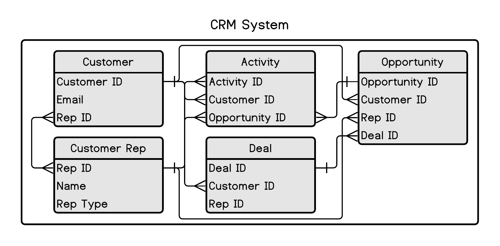

# Analytics and sports business strategy {#chapter1}


This chapter will give you some background on my ideologies around analytics and sports business at the club level. I also want to separate the disciplines of strategy and analytics a little. Analytics serves strategy, but strategy is derived from analytics. This chapter will outline some of our biases and explain our approach. There are often many ways to approach a problem and some problems may not be worth solving for any number of reasons. Despite some inherent difficulties with sports, an analytic approach to problem solving should always be at the core of your business strategy. 

Analytics is about reconciling opportunities and it is inextricably bound to business strategy. Many of the problems that we face are very old and have not yet been solved. This is especially true for Operations. I am convinced that there are unlimited applications for analytics within any industry or business. We should all demand objective justification for any value-statements not bound to empirical evidence. Our assertions must be tempered by the rigor of sound judgment and thoughtful analysis. Demand nothing less when outlining a strategy with colleagues.  

Additionally, analytics can take many forms and could improve decision making in many functions that we have already mentioned:

- Marketing: marketing mix, brand strategy, content, CRM, and pricing
- Business Intelligence: descriptive and prescriptive reporting
- Finance: capital expenditure, and forecasting, corporate finance
- Sales: lead scoring, sales strategy, customer journey mapping
- Sponsorship: asset valuation, asset creation 
- Operations: ingress and egress, staffing, concessions
- Technology: supporting these systems

Analytics can even assist in tasks outside of core business functions such as human resources. For instance, you can optimize staffing or compensation packages. It can also mean so many different things. Ad hoc analytic tasks typically involve nothing more than a simple spreadsheet that organizes the data. Techniques and application are varied and may include a number of disciplines:

- Segmentation
- Simulation
- Statistics
- Optimization
- Cognitive Science and behavioral economics
- Programming
- Designing experiments (DOE)

These lists could be endlessly long. _Versatility_ is the hallmark of the analyst and strategist. You aren't going to find many books on general strategy. Strategy is an amalgam of knowledge focused on specific problems. People who are good at it understand the business at a fundamental level and understand how to structure problems so that they may be solved in intelligent ways. The strategist is never quixotic. The strategist looks to the future, but understands the past. The strategist provides a concise reasoning for a course of action. You are forging an alloy that will increase profitability while making your business more efficient and resilient. You may be hated for it. Ignore the criticism.  

## Understanding the meaning of strategy

Strategy is a complex term, but it can really be boiled down to having a plan. A strategy has a goal and that goal can vary. For instance, like most companies (especially public companies) driving firm valuations may be a goal. You typically drive valuation higher by increasing revenue or by reinforcing a strategic moat. For example, in the streaming wars Netflix, Disney, and others are in a race to produce content. Content is their strategic moat because the technology has essentially been commoditized while consumer behavior has shifted. They play in a highly competitive space and are in a dog fight with every other competitor.

I have often heard people describe strategy as turning everyone's head in the right direction. I suppose that is a component of strategy. Strategy is about achieving your goals with a plan. Sometimes efficiency comes into play. Strategy can also be offensive or defensive and involve public relations or lobbying efforts. It can include manipulating market forces of supply and demand or structuring media rights deals. You can divest from under-performing assets or create entirely new asset classes. You can hedge against risks by diversifying your approach or through partnerships. This is a broad term that gets overused, is often confused for something else, and is simply an abstraction if it isn't framed around specific goals. 

Strategy is also about communication. This can't be stressed enough. If you want to learn about strategy I suggest that you take a negotiations course. You can also read a couple of key books. "How to win friends and influence people" [@Carnegie1981] is a good place to start. This classic was written in the nineteen-thirties and is as relevant today as it was then. Another great book you should consider is "Getting To Yes, Negotiating Agreement Without Giving In" [@Fisher2011]. This book is all about positioning arguments. This is a critical skill set. If you can't do this, you might as well not understand how addition works. Working with and understanding people, presentation skills, and understanding how to frame arguments without being condescending is critical to strategy. I can't stress the importance of soft skills enough. This is the most important paragraph in this book. 

From an academic standpoint, there are lot's of strategic frameworks. Harvard's Michael Porter descried firms as "a collection of activities that are performed to design, produce, market, deliver, and support products." [@Keller2003] His most famous contribution to business strategy is likely "Porter's five forces." ^[https://en.wikipedia.org/wiki/Porter%27s_five_forces_analysis] What is interesting about this framework is that on the surface it doesn't appear imminently useful to a sports team. Where it does come in useful is when thinking about strategic problems such as _What Point-Of-Sale system should we use throughout our venue?_. In that case, this model can be used to consider who you might select based on those market forces. Will there be consolidation, what does that mean, what is our most powerful position in terms of negotiating. If the product is a commodity, the vendor will have to compete on price. Perhaps they are interested in marketing and are candidates for a sponsorship. Maybe you could purchase the company. You can get creative. 

This chapter will put additional context around analytics and strategy. We'll look at some of the major functions of analytics and talk about how data is used to underpin these functions. I have a tendency to be cynical here. If you have ever messed around in the stock market you'll here a lot of talk about _fundamentals_. The type of analysis you might find in a trading platform is the illusion of analysis. Applying techniques like _triple exponential smoothing_^[https://en.wikipedia.org/wiki/Exponential_smoothing] or _moving averages_ to stocks is great. Does it make a novice a better trader? It might make them worse. Analysis is great if you understand it. It is contextual. If you don't understand the context it can be misleading or damaging. Data is not the solution. Or maybe it is. It depends. Keep that in mind and think critically about the problems we are going to cover. The mechanical part of analysis isn't the important part of it. It should be a commodity. Focus on the application and communication.

## Technologies place in strategy and analytics

I consider the application of technology in analytics along five ordered dimensions. While you can jump around to a degree, each step is generally built on the step below it. As you ascend the steps, execution tends to become more difficult and complex. Execution is where your strategy will fall apart. Read that last sentence again. Additionally, your strategy should to flow from the top down. This means you keep your destination in mind as you move up each of your steps. 

As ridiculous as it may sound, you have to begin with data structure. You are building an engine and you have to have all of the correct parts. Data is invariably messy. So much effort goes into cleaning, structuring, and storing data for use that it represents the bulk of time spent across the spectrum of analytics. You must begin there. Additionally, there are probably multiple levels of maturity on this front. For instance, ticketing data may be very well structured while CRM data may be lacking. I view analytics within the structure proposed in figure \@ref(fig:choneheirarh). 

<div class="figure" style="text-align: center">

<p class="caption">(\#fig:choneheirarh)Data strategy heirarchy of needs</p>
</div>

Furthermore, I consider technology to be "a means to an end," and not "an end unto itself." This tends to be a common confusion. Your technology strategy should flow from a well-articulated business strategy. For instance, you could spend capital to allow fans to enter a park leveraging facial recognition, but what problem does that solve? Is scanning a ticket the bottleneck in that system that slows down the process? Do fans want it? Does the regulatory environment permit it? This sounds like a complex system more than a camera and a database. While innovation is sometimes bred by throwing something at the wall to see if it sticks, I haven't found that to be the primary vehicle for technology adoption. When an organization takes a misguided technology-first approach, I have found the results to be painfully unremarkable. Determine what you want to accomplish and why you want to accomplish it before deploying a technology solution.

Perhaps you want to _revolutionize_ your business. Very few problems are solved in revolutionary ways. The internet feels much the same as it did twenty years ago. We are now talking about web 3.0 and the metaverse. We already have a _metaverse_. It is called the internet. It isn't revolutionary. What it really represents is a platform that big tech wants you to use to transact. Maybe it will be a better way of doing things or maybe it is simply a worse way of doing everything. The jury will be out for the next decade. In that sense perhaps it is 3D television. Remember those? Of course you don't. Look for the business model that underlies these marketing schemes. If you understand the mechanism, you'll be able to plan for what comes next.

We don't want to be disparaging toward Information Technology. Strong I.T. skill sets are incredibly useful. As your skills progress you'll be exposed to a myriad of technologies:

- if you work on Windows or Apple, you'll still need some understanding of Linux^[https://www.linux.org/]
- Shell scripting is a critical skill for any dev-ops task^[https://en.wikipedia.org/wiki/Bash_(Unix_shell)]
- Start using git as a repository for your code&^[https://github.com/]
- Tools such as _docker_ allow you to package programs if you are doing web development^[https://www.docker.com/]
- You don't need your own server. Google, Amazon, and Microsoft each have massive deployment platforms.

 Don't shy away from spending the time to get familiar with these technology components. You'll be rewarded for it. 

The main difference between the internet today and twenty years ago is that people mostly use a phone to access and browse it. Incremental improvements over time tends to be the way changes take place. Core business procedures can always be improved. Most people that are rich didn't get there through some brilliant product or idea. They just did the same things other rich people did and they executed properly. Think of analytics and business strategy in the same way. We'll walk through each component in figure \@ref(fig:choneheirarh) and discuss it in more detail.

### Data

Getting the foundational elements of data in place is critical to all other components of the hierarchy. There is a lot to consider here. While we won't discus _Master Data Management_ or specific technologies such as _Customer Data Platforms_, we will talk about the foundations of data and what we mean when we use the word. Most organizations have solved portions of their data management, but it's a never-ending problem. There will always be newer and better systems and there will always be a need to incorporate new data into your sales and marketing infrastructure. This process is accelerating as Google, Amazon, and others vie to own the cloud. Amazon Web Services and the Google Cloud Platform are disruptive in the sense that they can deliver capabilities that would be financially unfeasible for many firms trying to build them in house. The on-prem DBMS will slowly go extinct^[This isn't quite true. There are certain instances where having a captive instance is useful or necessary]. This is also an old battle. If this was twenty five years ago our discussion may have been on Thin-client vs. Fat-Client computing. 

Let's go ahead an make the assumption that your sports team doesn't have their data in a perfect spot. Getting your data in a useful position may take a number of varied techniques and has its own considerations:

- What systems are the most important to incorporate?
- Is the data "Big," meaning is it an engineering challenge to hold the data or does its velocity necessitate a special approach?
- How and where will it be housed?
- Who manages this process (internal, partner, etc)?
- How much will this cost?
- Do we have the necessary skill sets to accomplish our goals?
- Who understands and manages the data structure?

Another important consideration is what you plan on doing with your data. How can it be used? This could dictate your approach to making it available and how your ETL (Extract, Transform, and Load) procedures work. For instance, do you need your data to be available at all times and does it need to be current? What does _current_ mean? Latency may not be that important. Indeed, it isn't in most situations in sports. twenty four hours is probably enough. Many data points may only be considered on certain intervals. This gives you some indication of how to prioritize your tasks. Let's illustrate the problem.

#### Understanding data structures

You'll encounter numerous data structures working in sports, but none are more important than the ticketing system. Regardless of the vendor (TicketMaster is probably the most common), you'll encounter some form the following ERD \@ref(fig:chonedataticketing).

<div class="figure" style="text-align: center">

<p class="caption">(\#fig:chonedataticketing)Ticketing system data structure</p>
</div>


What are we looking at? While there are many different database systems ^[https://en.wikipedia.org/wiki/Database] available, the venerable relational database is the one you will encounter the most. AWS and Google have improved and optimized some of these models, but the basic concept is going to look familiar across most platforms. We'll ignore even high-level discourse of the technical parts of database construction such as _cardinality_ and _normal forms_ and discuss this stuff through examples.

Think of a database as a collection of excel workbooks that are formally linked with an ID column. We'll call these workbooks tables. These tables will allow you to get information on transactions, historical purchase data, customer service rep data, ticketing information, and more. You can read the "crow's-foot" as "Many", the cross as "one." For example, one customer can have many plans.These relationships can be much more complicated, but at a basic level data that you encounter will look something like this. if the database is relational (More than likely), basic SQL statements can be used to retrieve your information: 


```sql
------------------------------------------------------------------
-- SQL example
------------------------------------------------------------------
SELECT  A.customer_id
       ,A.email_addr
       ,B.plan_id
       ,B.price
FROM Customer A LEFT JOIN Plans B ON A.customer_id = B.customer_id
WHERE A.email_addr = "Ted.Williams@someserver.com"

```

The output from this query might look something like this: 

|customer_id|email_addr|plan_id|price|
|:-:|:-:|:-:|:-:|
|1940-2349-1243|Ted.Williams\@someserver.com|23454 |1094.00| 
|1940-2349-1243|Ted.Williams\@someserver.com|23455 |3200.00|  
|1959-9909-4567|Ted.Williams\@someserver.com|61545 |2500.00|   

For some reason I am afraid to type SQL that isn't in all caps. I don't know why, but it isn't case sensitive and it doesn't matter. While the data will be more complex, this example is here to demonstrate the problems you will face (if they haven't been solved) and how these problems force you to think strategically. As you can see, it appears that Ted has multiple accounts. 

Let's take a quick aside to discuss _Structured Query Language_, or SQL. SQL is the _lingua-Franca_ of the database world. Although there are many technologies that use "Not Only" SQL, you'll get the most mileage from SQL and it is a prerequisite if you want to work with data in almost any capacity. The good news is that it is relatively simple to learn at a basic level and functional fluency can be achieved relatively easily. There are also plenty of free resources available to learn an practice it. W3 schools is an excellent one. ^[https://www.w3schools.com/]

The integration between the CRM and ticketing systems is incredibly important. There are many considerations:

- How will the ETL be constructed? API, direct database connection, etc.
- How are parity checks considered?

These are all heavy I.T. tasks. Although the end-product will be the most important component to an analyst, understanding how some of this stuff works is important. It will make you better. 

<div class="figure" style="text-align: center">

<p class="caption">(\#fig:chonedatacrm)CRM system data structure</p>
</div>

The data in figure \@ref(fig:chonedatacrm) look a little different. Different CRM systems may also have different ways of querying the data. Salesforce uses SOQL which looks similar sql, but it forces you to traverse relationships a little differently. Let's take a look at the data.


```sql
------------------------------------------------------------------
-- SQL example example
------------------------------------------------------------------
SELECT  A.customer_id
       ,A.ticketing_system_id
       ,B.deal_id
       ,C.opportunity_id
FROM Customer A LEFT JOIN deal B ON A.customer_id = B.customer_id
                LEFT JOIN opportunity C ON B.deal_id = C.deal_id
WHERE A.email_addr = "Ted.Williams@someserver.com"

```

This data might begin to look confusing because the relationships are a little more complex. 

|customer_id|ticketing_system_id|deal_id|opportunity_id |
|:-:|:-:|:-:|:-:|
|l993w-233e-653r-88jg |1940-2349-1243|1234 |q23w-234e-654r-678g| 
|l993w-233e-653r-88jg |1940-2349-1243|1234 |t567-3f45-6h78-234u|  
|pp3w-232e-k54r-ww3b  |1959-9909-4567|3245 |y567-3f25-6h78-234p|  


What do we have here? It appears that Mr. Williams has created (or had created) more than one account and the accounts are not merged into one. This is a simple example, but it demonstrates a duplication problem that is constantly faced. I am going to guess that we have one Ted Williams, but the system is regarding him as two people. Business rules can mitigate some of these issues. For instance, the ticketing system could forbid users from using an email that is already in the system. While sing email_address as a primary key does have some advantages,  there are always downstream issues that you have to consider. Nothing is perfect. Someone may simply use a different email. Then you have one person, but it may be impossible to tell them apart. 

Garbage-in, garbage-out. Without getting this data clean, you won't be able to effectively move to the next level of our hierarchy. 

### Business Intelligence

Business Intelligence is a loaded phrase and can mean many different things. Enabling a B.I. capability is possible once you've established some good data structure. This portion of the chapter will discuss B.I. at a high level and discuss some of the differences in data structure that enables more sophisticated reporting. 

I usually place it under two categories: 

- Reporting
- Research

A component of Customer Relationship Management (CRM) also falls under this umbrella in practice at clubs. There are many reasons for this, the biggest is simply legacy. Another reason is that the CRM system typically houses much of the data that may be used for reporting. It's a natural match. Reporting systems such as Tableau, Qlik, Looker, Business Objects, etc. depend on having well structured data. Be cautions on tools as well. You can easily abuse them and not get the results you are looking for. Once you have your data in a good spot you are ready to tell people about it. Gathering insight from your data can take many forms, but it is often placed in one of four categories seen in figure \@ref(fig:chonedatabi).  

<div class="figure" style="text-align: center">

<p class="caption">(\#fig:chonedatabi)Four categories of reporting</p>
</div>

The first stop is reactive reporting  _Description_ and _Diagnosis_. Once you have your data structured appropriately, you'll be able to produce backwards looking reports. These reports are likely the bread-and-butter of a Business Intelligence department. You are answering questions about how much a rep sold, or how many tickets were sold during a specific time frame. 

_Prediction_ and _Perscription_ are forward looking. For instance, you might integrate predictive models into your reporting that indicate whether or not sales goals are likely to be met. We'll talk about how that might be accomplished in the next section. _Prescriptive_ reports might tell you what you should do about a problem once it has been diagnosed. In our context, a prescriptive report might enable a manager to reroute marketing dollars to more efficient channels. For instance, the report could identify diminishing returns on marketing spend through a particular social channel and suggest one with demonstrably greater success. 

#### Business Intelligence data structure

Data structure for a BI system doesn't necessarily have to be any different than what you may find in a typical relational database. You can plug a system such as Tableau ^[https://www.tableau.com/] into your database and likely get some good capability. However, in practice the data is usually restructured into facts and dimensions. Additionally, data structures can also take more complex forms such as data cubes ^[https://en.wikipedia.org/wiki/Data_cube], JSON-like hierarchical data, or other more exotic forms that can handle array-like data within specific database fields. We'll focus on the simple fact and dimension. 

You can think of a _fact_ as something that will be aggregated. It is a number. _Dimensions_ are the features that you use to understand your numbers. Consider the diagram in figure \@ref(fig:chonedatafanddim). 

<div class="figure" style="text-align: center">

<p class="caption">(\#fig:chonedatafanddim)CRM system data structure</p>
</div>

These tables don't look much different than what you saw in figure \@ref(fig:chonedatacrm). The main difference is conceptual. In the earlier diagram no tables were necessarily prioritized over others. You might look at the tables and consider the customer as the central table with features radiating out from that specific customer. The customer has a rep, purchases tickets, may have a plan, etc. In this diagram the _Ticket_ is central. Since B.I. tools are at heart aggregation machines, this structure is extremely important. If you want to perform some math on a feature such as ticket price, you put it in the fact table. This allows you to perfromantly answer all kinds of questions such as:

- How much did customer A spend on tickets in 2018?
- How much was spend on tickets in 2021?
- How many customers does rep A have and how much did they spend in 2019?

As a rule, I tend to like to structure the data the way I would want it within the database. While this isn't always feasible or efficient, it does have some advantages. It can be efficient because flattening the relationships into fewer tables can make your software run more quickly. You have removed the need to traverse a relationship. It also means that you are less dependent on learning all the capabilities of the B.I. platform. It makes things simpler from that perspective. This tends to work well when the person doing the B.I. work is also the data engineer. The problem is that it isn't as scaleable and can get confusing. It might even lead you to build custom systems where you aren't constrained in the same ways.

There are also some pitfalls that you should be aware of. You can sometimes work around these issues. However, you can also run into problems with Cartesian joins ^[https://en.wikipedia.org/wiki/Cartesian_product]. This means that you can double-count a value if you aren't careful. This is common if you have constructed a snowflake schema for your facts and dimensions tables. 


### Analytics

The term analytics is at least as broad as business intelligence. In our context, I distinguish it from business intelligence because it is less concerned with displaying information and more concerned with interpretation. Additionally, it is usually easier to get your base B.I. functionality running than to begin applying analytic techniques to your data. Ultimately, business intelligence and analytics are going to work together and form the backbone of your (antiquated but valid term) decision support systems. 

Analytics refers to applying some operation to your data and gaining some additional insight from that modification. Obviously, getting data structured appropriately is critical. I typically put analytics tools into one of two categories:

- Regression
- Machine learning 

Let's take a minute to explain these terms. There is definitely some overlap. Analytics is a muddy term. You may or may not be familiar with regression. Regression can get very technical and performing regression analysis tends to be dogmatic and rigorous. We'll make heavy use of it and you will need to understand how it works. I recommend getting a reference book on the subject. There are many. My favorite is "An R Companion to Applied Regression." [@Fox2019] Let's try to do a quick explanation of _ordinary least squares_ regression to demonstrate its power. We are going to build this explanation in R, but will resist showing you actual code until the next chapter.

I am going to explain regression here in the simplest way possible. I am not a mathematician and you don't have to be one to leverage regression. Also, we aren't working with clinical trials of a drug. We are working with fuzzy business problems. Exacting rigor simply isn't as necessary. The following section will take you through a simple explanation of one form of regression and explain the way I like to think about it. 

#### Regression

Consider the following meme I created on an online meme generator:

<div class="figure" style="text-align: center">

<p class="caption">(\#fig:stupidmeme)Your future thoughts on regression</p>
</div>
This is an incredibly reductive statement. Obviously you can't use linear regression for generative art or computer vision. However, you are going to use it a lot and it has lots of advantages. Make sure you understand it. Eventually, you will agree with the meme. The following section explains how I like to think about it. 

The familiar linear equation takes the form:

\begin{equation}
\ {y} = {m}{x} + {b}
\end{equation}

In this equation the Y is explained by x where m is equal to the slope of the line and b is equal to the y intercept. If we apply a list of x values (-5,-4,-3,-2,-1,0,1,2,3,4,5) to a linear equation with slope 2 and y-intercept of 5 we will get the graph in figure \@ref(fig:regressbb).

\begin{equation}
\ {y} = {2}{x} + {5}
\end{equation}


<div class="figure" style="text-align: center">

<p class="caption">(\#fig:regressbb)Output of our linear equation</p>
</div>


In practice, your data points will most likely not fit a perfect linear equation. Regression is looking for the line through these points that minimizes the _sum of squared errors_ (see figure \@ref(fig:regresscc). The sum of squared errors represents ( _SSE_ ) the distance between each point and the line. Look up the word _orthogonal_ to see how this can vary. You square the errors so that negative numbers don't impact the results. 


<div class="figure" style="text-align: center">

<p class="caption">(\#fig:regresscc)Output of our linear equation</p>
</div>


In multiple linear regression we are simply switching the linear equation around and add terms:

\begin{equation}
\ {y} = {b} + {m_1}{x_1} + {m_2}{x_2}
\end{equation}

The actual form is typically denoted similarly to the following equation:

\begin{equation}
\ \hat{y} = \alpha + \beta_1 x_1 + \beta_2 x_2 + \epsilon
\end{equation}

"The idea is to express the class as a linear combination of the attributes with predetermined weights." [@Witten2011] I just think about it as finding the best _average_ line through your data where x explains y. The standard error represents a normal distribution that is split by the line. Once again, I don't want to push reading too much, but I would highly recommend picking up any book on statistics or Googling multiple-linear-regression if you aren't familiar with it. You'll use it a lot as an analyst. Additionally, familiarize yourself with the different forms of regression. Orthoganal, Poissan, Ridge, etc. There are lots of problems that can be solved if you apply the correct technique. 

That is as deep as I want to go here. We are going to use this tool a lot in subsequent chapters. I'd like to take the same simple approach to explaining Machine Learning. 

#### Machine Learning

Machine learning is a little different as a concept, but under the hood it is just statistics. This has been explained in many ways. At it's heart, we are looking for patterns in data to make predictions.

There are three main types of machine learning:

- Unsupervised Learning
- Supervised Learning
- Reinforcement Learning

Each of these variations are useful for solving different types of problems. We'll cover them in more detail in subsequent chapters. Additionally, there to any of a number of techniques that fall under the machine learning umbrella including:

- Decision Trees
- Random forests
- Gradient boosting
- Support vector machines
- Neural networks

You can also ensemble techniques. I typically explain machine learning through a basic explanation of a completed decision tree. An in-depth explanation of decision trees get's mathy. This basic explanation comes from the book "Data Mining" [@Witten2011]. This book utilizes a program called WEKA, but most or all of the concepts have implementations in R or Python.

We are going to begin looking at some of our data. You can install the FOSBASS library using the following command:


```r
#-----------------------------------------------------------------
# Install FOSBAAS Library
#-----------------------------------------------------------------
library(devtools)
devtools::install_github("Justin-Watkins/FOSBAAS"
                         ,ref="master"
                         ,auth_token = NULL
)
```


A decision tree is simply an organized set of cascading questions and answers and are simple to understand at a high level. Let's consider a simple data set:


```r
#-----------------------------------------------------------------
# Customer renewal data
#-----------------------------------------------------------------
renewal_data <- FOSBAAS::customer_renewals
```


Table: (\#tab:chonereneweddata)Renewal data set

|variable   |class    |first_values                        |
|:----------|:--------|:-----------------------------------|
|accountID  |character|WD6TDY7C151R, X3SB8ADEML22          |
|corporate  |character|i, c                                |
|season     |double   |2021, 2021                          |
|planType   |character|p, f                                |
|ticketUsage|double   |0.728026975947432, 0.992104738159105|
|tenure     |double   |2, 19                               |
|spend      |double   |4908, 16410                         |
|tickets    |double   |6, 2                                |
|distance   |double   |61.6614648674555, 19.5341155295423  |
|renewed    |character|nr, nr                              |


We'll see this data several times through the book. Basically, it is just a number of factors and a column that states whether the fan renewed season tickets of not. Let's apply a decision tree to the data. We'll only look at one factor, distance. For this example we used two libraries: rpart [@R-rpart] and rpart.plot [@R-rpart.plot].


```r
#-----------------------------------------------------------------
# Customer renewal data
#-----------------------------------------------------------------
d_tree <- 
rpart::rpart(formula = renewed ~ distance, 
             method  = "class",
             data    = renewal_data)
rpart.plot::rpart.plot(d_tree,
                       type  = 4,
                       extra = 101)
```

<div class="figure">

<p class="caption">(\#fig:chonedecisiontree)Decision tree example</p>
</div>


This tree (figure \@ref(fig:chonedecisiontree)) is simple to read. In the top node, there are 2,564 people that did not renew (nr) and over 11,300 that did renew. The first split separates people that live more than 49 miles from the park. Of those people, 906 did not renew and 663 did renew. The third split separates people who live more than 67 miles from the park. Of those that live more than 67 miles from the park, 515 did not renew.  

A decision tree performs splits in one of multiple ways and there are lots of resources that can illustrate the methods. At this stage, the main thing to understand is that the nodes are more similar to each other than to other nodes. Each node is more homogeneous.

This is machine learning at its most simple form. A set of cascading questions split in formulaic ways classifies a response variable. While methods differ, at their heart many machine learning processes are very similar. 

### Automation and Integration

After you have developed some basic B.I. and analytics capabilities you'll quickly want to find ways to put them to work. Ad hoc analytics has it's place, but to truly reap the rewards of your work you are going to need build a machine that allows you to automate some of the story telling. This is where analytics intersects I.T. work. operationalizing your analytics procedures requires a little different knowledge set. There are also different approaches.

I fully expect a large component of analytics work (especially the automaton and integration work) to be heavily commoditized in the future. AWS and Google have taken huge strides in building frameworks that natively integrate analytics into your DBMS. Gone are the days of writing SQL wrappers for some R or python script sitting on some server in the basement. Let's take the same simple approach to explaining what I mean here. 

These two functions (Automation and Integration) are mostly self-explanatory. Automation refers to removing human interaction. Integration refers to operationalizing your outputs by extending your data into commerce engines. 

Automating procedures provides several benefits:

- It is a labor multiplier
- It enables more strategic thought to go into staffing decisions
- It keeps reports up-to-date

Automation relies on a number of interlocked technologies and is more related to data engineering and an information technology group. 

Integration refers to two elements:

- Integrating solutions across your organization
- Integrating with third parties to extend capabilities

Interestingly, integrating with third parties is the easy part. Integrating solutions internally is much more difficult. This typically requires change management and a sponsor in the upper levels of management. 


Figure \@ref(fig:dataautomation) demonstrates a simplified version of the entire process from data sources all the way to the feedback loop you are creating with your marketing channel partners. When we refer to marketing channel partners, we could be referring to Google's add network, Facebook, or many others. 


<div class="figure" style="text-align: center">

<p class="caption">(\#fig:dataautomation)Operationalizing analytical procedures</p>
</div>

While these features used to be fairly distinct, new technologies are making it much easier to link all of these activities together in one system. As someone leading these efforts, your job will be to think of how your are applying these measures instead of how to accomplish them. Additionally, we are focused on the tech here. Content creation, collateral, timing, verbiage, budgets, and many other considerations all impact automation and integration. For instance, before you distribute to a channel you'll need to have artwork created, have a clear message and call to action, a website may need to be updated, and other communication may have to be considered. Nothing is ever easy.

## Key Performance Indicators

This section will explain an application of a KPI. This piece of feedback is critical for understanding how well you are performing (typically against some arbitrary or historic benchmark). I'll also refer back to an earlier paragraph when we talked about the stock market. Analytics is contextual. What is a KPI? A KPI is a figure that links business performance to some desired outcome. For instance, in Baseball the number of walks a player takes is a KPI that will likely help predict on-base-percentage. Analytics groups might be able to link On-base-percentage to wins. If you are in the market for a player, you might weight walks more heavily than other metrics. on-base-percentage might be a KPI and walks might be the key to increasing on-base-percentage leading to more wins. The following paragraphs will discuss and criticize the most commonly used KPI at clubs: Percap, or average price paid per ticket.  

Analytics work must be tempered with industry knowledge; it must be put into the correct context. It is easy to make incorrect judgments when armed with the blunt instrument of data. __Per-Cap__ (or average ticket price) is likely the worst. Per-Cap is a commonly used KPI that is used for comparing the effectiveness of sales and pricing strategy and is simply the average price of a sold ticket: 

\begin{equation} TotalTicketRevenue / NumberOfSeatsSold \end{equation}

On the surface, this metric seems interesting. However, there are a number of issues with it:

1. The denominator changes for every game that is not sold out. In this case, you are comparing fractions with different denominators. The mix of tickets could vary wildly from game-to-game. This alters interpretation and leads to issue number two. 
2. The number becomes diluted and tends to decrease when more tickets are sold. As more tickets are sold, more less-expensive tickets are sold and this tends to drive down the per-cap. Is a high per-cap good? The answer is that it depends. Let's illustrate what I mean:

\begin{equation} \$1,400,000 Ticket Revenue / 34,000 Tickets sold = \$41.80 \end{equation}
\begin{equation} \$1,600,000 Ticket Revenue / 40,000 Tickets sold = \$40.00 \end{equation}

How do you reconcile the \$1.80 difference in per-cap? Does the higher number indicate that you priced more efficiently under the lower revenue scenario? The answer depends on many factors. Taken alone, this number doesn't have much meaning. A better metric is _Yield_. Yield is just as simple: 

\begin{equation} TotalTicketRevenue / AvailableTickets \end{equation}

Yield is more intuitive and increases with every sale since it isn't penalized by unsold inventory. What does the previous example look like from a yield perspective?

\begin{equation} \$1,400,000 Ticket Revenue / 40,000 Available Tickets = \$35.00 \end{equation}
\begin{equation} \$1,600,000 Ticket Revenue / 40,000 Available Tickets = \$40.00 \end{equation}

Yield is higher when revenue is higher now that we hold the denominator constant. Hopefully, this indicates that we were more efficient at selling our seats or perhaps demand at higher prices buoyed up revenue. This number is much easier to interpret and to leverage for hypothesis testing. The easiest way to consider this metric is to visualize it. A simple scatter plot (figure \@ref(fig:chonepercapgraph)) does the trick. In a real life scenario average ticket price isn't highly correlated to overall revenue until games begin to approach a sellout and percap approximates yield.    


```r
#-----------------------------------------------------------------
# percap scatter plot
#-----------------------------------------------------------------
set.seed(714)
percap_data <- tibble::tibble(
  percap = rnorm(81,40,10),
  revenue = rnorm(81,1000000,200000)
)
x_label  <- ('\n Percap')
y_label  <- ('Revenue \n')
title    <- ('Revenue vs. Percap')
scatter_percap <- 
  ggplot2::ggplot(data  = percap_data, 
                  aes(x = percap, 
                      y = revenue))                   +
  geom_point(alpha = .9, color = 'dodgerblue')        +
  geom_rug(color = 'coral')                           +
  scale_y_continuous(label = scales::dollar)          +
  scale_x_continuous(label = scales::dollar)          +
  xlab(x_label)                                       + 
  ylab(y_label)                                       + 
  ggtitle(title)                                      +
  graphics_theme_1
```

<div class="figure" style="text-align: center">

<p class="caption">(\#fig:chonepercapgraph)Scatterplot of revenue and percap</p>
</div>

Another poor metric that is often used is __Sales on or by date__. This metric asks how many sales I had on a particular date in a previous year. This metric may be the biggest liar out of any commonly used KPI. This metric can be fraught with distortion in baseball because of the schedule. It likely has more validity when a sport has fewer games or has a higher FSE base. FSE stands for _Full Season Equivalent_ and represents the number of tickets that are sold to individuals on a season (or modified season) basis. 

_Sales by date_ is problematic for a few different reasons:

1. If you are comparing yourself to a different team it doesn't consider the admixture of tickets. A team with 20,000 FSEs will look dramatically different than a team with 6,000 FSEs. 
2. Once your schedule has begun, the admixture of games will have significant influence on the outcomes. What does this mean?

We'll see in chapter \@ref(chapter6) which elements will have the biggest influence on ticket sales. Sales-by-date doesn't really consider game dates, opponents, on-field-success, seasonality, game times, etc. Additionally, people choose to purchase tickets at different times and for different reasons. Because of these differences, sales of a specific ticket class may look great after the first twenty games, but terrible after the first forty games. Take a look at the line graph in chapter \@ref(chapter3) \@ref(fig:chthreeticketsline). If you built a cumulative line for each of these lines the results would look very different. Don't benchmark off of sales-by-date. Instead, leverage forecasts that consider the underlying elements of the schedule. Let's consider a simple example (figure: \@ref(fig:salary)). This illustration was created with publicly available data and we'll demonstrate how to create it a little later. 

<div class="figure" style="text-align: center">

<p class="caption">(\#fig:salary)Relationship to avg salary and ticket sales</p>
</div>

There certainly appears to be some relationship between the average salary of a player and the total number of tickets sold. The relationship might even be stronger for teams in larger markets. Why is this the case? This top-down approach to forecasting demonstrates that the amount that players are paid (or if a few players are paid a lot of money) that ticket sales tend to be higher. We aren't seeing tight clusters based on market size. Higher pay may demonstrate better performance. Better performance might translate into more wins. More wins attracts more earned media and more fans. Ticket sales increase.

This is an obtuse example, but it demonstrates the point. There are underlying mechanisms that likely do a reasonable job of explaining ticket sales. We didn't even cover bottom-up forecasting elements such as marketing efforts! 

The point of this section should now be clear. Performance is dictated by any number of factors. Some are within your control, some are not. Running a team is similar to running a hedge fund. Sometimes it's up, sometimes it's down. However, you need to understand why it's up or down so that you can make smarter decisions. Bad KPIs don't help you make smarter decisions. Leveraging appropriate KPIs has many salutary impacts and good analytics always looks for the underlying mechanism at work.  

## Why do people buy tickets to sporting events?

Sports fandom is irrational. This irrationality can make sports challenging and infuriating to work with from an analytics perspective. How can we determine if our marketing efforts are making a difference? Are we simply slaves to the whims and fancy of the mob? The answer is complex and we will explore it in our chapter on forecasting and pricing, chapter \@ref(chapter6). Additionally, the answer may (to a degree) exist in our genes. 

> "We have the ability (Under special conditions) to trancend self-interest and lose ourselves (temporarily and ecstatically) in something larger than ourselves."
>
>--- Johnathan Haidt, "The Riteous Mind"

This is an interesting quote from "The Righteous Mind" [@Haidt2012]. Humans are programmed to participate in groups. Maybe some people buy tickets because they are lonely, or bored. If these mechanisms such as the "need to belong" are driving some sports fandom, perhaps they can be manipulated. Perhaps they are being manipulated. Ultimately, there are lot's of reasons why someone might buy tickets to a sporting event:

- They buy them for their business
- They just want something to do
- They have brand loyalty driven by upbringing
- They are motivated to associate themselves with a winning group
- They genuinely like and appreciate the sport
- They feel good when they come to a game
- They want something to do with their family

There are also brand components associated with history and logos. This one is interesting. We've recently seen some teams abandon logos and nicknames in response to societal or corporate pressure. ^[https://www.espn.com/mlb/story/_/id/31868331/cleveland-changing-name-indians-guardians] What does this mean in an analytics context? How much is a brand worth? Obviously, brand equity must be considered. This is at least partially what drives corporate sponsorship. Borrowed equity by associating your brand with another brand with a positive image is fundamental to a major revenue driver for clubs. Brand value might be calculated using one of several techniques such as the _Royalty Relief Method_. ^[https://en.wikipedia.org/wiki/Brand_valuation] branding is a big deal and brands have value. 

There could be any number of answers to the question of why someone might purchase tickets to a baseball, football, basketball, hockey, or soccer game. People in the United States and across the world have complex emotional relationships with sports and brands. These emotions may do a better job of explaining their behavior than a model predicting likelihood to purchase. 

This side of sports marketing is often overlooked and under-served. Behavioral economics is a huge field and there is a lot of literature on these subjects. "The Power of Moments" [@Heath2017] is an outstanding book that is imminently useful if one was to consider how specific mechanisms engender loyalty. Major themes such as _pride_ and _connection_ are almost instantly accessible to marketers at the club level. How can an analyst help drive the desired outcomes? The answer may depend on solutions that may not be in the wheelhouse of a data scientist or business analyst. 

## Key concepts and chapter summary

This chapter explains some rationale for how to approach analytics and strategy at an organizational level. However, strategy is a broad term and could include many elements such as business development and hedging strategies that may include financial strategy. We focused on analytics strategy and covered a few main points related to our analytics hierarchy:

1. Technologies tangential relationship to analytics
2. Basic SQL data structures and the importance of data integrity
3. Business Intelligence 
4. Analytics 
5. Automation and Integration
6. Key performance indicators
7. Behavioral economics

Ultimately, this chapter only serves to give a very high-level overview of considerations around _analytics_ and business strategy:

- Technology isn't analytics. It is a tool that serves it and other business functions. Don't consider technology in a vacuum. 
- You now understand some basics about data structure and databases. You have to start here. Without good data, your project is going nowhere. You'll want to acquire some knowledge of SQL or you are going to be limited in your capability.
- Business Intelligence tends to focus on reporting and research. You'll likely begin with descriptive reports and as your organization matures become more forward looking by incorporating analytics functions.
- Analytics mostly focuses on trying to guess future outcomes. There are a variety of regression and machine learning tools at your disposal. These tools have been commoditized over the past couple of decades. This world is much easier to navigate than it was even ten years ago.
- Automating tasks is a force-multiplier. There is currently an arms race going on between big-tech companies as they continue to bolster their analytics and database systems. The Google Cloud Platform and Amazon Web Services are two key examples. They have hundreds of tools between them for consuming, manipulating, and deploying data.
- The most difficult part of determining KPIs is probably agreeing on what they are. Some KPI are easy. For instance, NOI or revenue-per-square-foot might be great KPIs if you are dealing with real-estate. However, they may not be. KPIs are contextual. 
- People do things for different reasons. Modeling consumer behavior is difficult, but plays a major role in sports. We only touched on Behavioral Economics, but rounding out your analytics toolbox with some reading in this field is highly recommended.  


