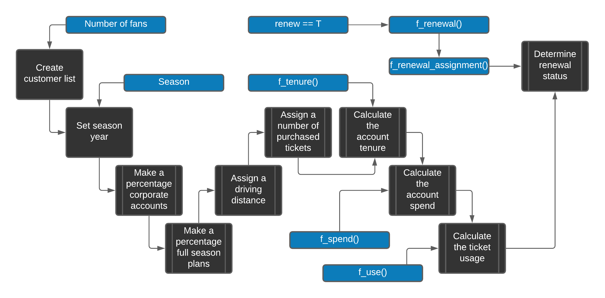

# Building Data Sets {#chapter2}


Most analytics assignments begin before the analysis itself. You must identify the records you need, organize them into a usable data set, and check that each row and column has a clear meaning. This chapter demonstrates that work with simulated data from a fictional professional baseball club, the _Nashville Game Hens_.

By the end of the chapter, you will be able to:

- recognize the main data sets used by a sports business analyst;
- read the R code used throughout this book;
- create repeatable simulated data for renewals, ticket scans, sales, customers, demographics, and surveys; and
- store reusable data and functions in an R package.

The examples use simulated data because actual customer and ticketing records are private and vary by vendor. The same working rule applies to any source system: convert the source records into a documented table that fits the business question.

The examples are available in the `FOSBAAS` package. You may run the code to see how each data set is constructed, or use the packaged data and continue to Chapter \@ref(chapter3). The code is also available at https://github.com/Justin-Watkins/FOSBAAS/blob/master/FOSBAAS_code.R.

## Prepare your R environment

This book uses R [@R-base] and RStudio. Install both before running the examples.^[Download RStudio Desktop and R from https://posit.co/download/rstudio-desktop/.] RStudio is the application in which you will write and run the code; R performs the calculations.

You do not need to master R before continuing. For now, recognize four patterns:

1. `<-` assigns a value to an object.
2. `function(...)` defines a reusable procedure.
3. `data[row, column]` selects part of a data frame.
4. `package::function()` identifies the package that supplies a function.

Code makes the work reproducible: another analyst can review the steps, rerun them, and modify them without rebuilding the process by hand.

Install a package once with `install.packages("package_name")`. Load it in a new R session with `library(package_name)`, or call one function directly with `package_name::function_name()`. Install packages as they are introduced instead of installing a large collection you may not use.

As your projects become more important, use `renv` [@R-renv] to record package versions. This reduces the risk that an update changes a previously working analysis.

## Build customer renewal data {#renewaldata}

A renewal model needs historical account records and a known outcome: whether each account renewed. Because those records are not available for the fictional club, we will simulate them. The result will contain one row per account and the customer characteristics used later in the book.

The examples use two naming conventions. Function names begin with `f_` and use underscores, such as `f_calculate_spend`. Column names use camel case, such as `ticketUsage`. A consistent convention makes code easier to scan and maintain.

An R function accepts inputs, performs a procedure, and returns an output. The following equation provides a small example, where `x`, `slope`, and `yIntercept` are inputs and `y` is the output:

\begin{equation}
\ {y} = {m}{x} + {b}
\end{equation}

The equivalent R function is:


```r
#-----------------------------------------------------------------
# Linear equation function
#-----------------------------------------------------------------
f_linear_equation <- function(x,slope,yIntercept){
  y <- slope*x + yIntercept
  return(y)
}
```

Call the function by supplying each input:


```r
#-----------------------------------------------------------------
# Linear equation function inputs
#-----------------------------------------------------------------
f_linear_equation( x          = 2,
                   slope      = 10,
                   yIntercept = 7) 
#> [1] 27
```
  
The function returns `27`. The same input-process-output pattern applies to the larger functions used below.


The `FOSBAAS` package includes the completed renewal-data function and its helper functions. Run it with the following inputs:


```r
#-----------------------------------------------------------------
# Create lead scoring data
#-----------------------------------------------------------------
library(FOSBAAS)

renewal_data <- f_create_lead_scoring_data(
  714,
  5000,
  "2021",
  f_calculate_tenure,
  f_calculate_spend,
  f_calculate_ticket_use,
  f_renewal_assignment,
  f_assign_renewal,
  renew = TRUE
)
```


The inputs set the random-number seed, number of accounts, season, helper functions, and whether to create a renewal outcome. A fixed seed makes the simulation reproducible: the same inputs produce the same records.

The function produces the following structure:


Table: (\#tab:leadscorecreation2) Customer renewal data

|variable   |class    |first_values                        |
|:----------|:--------|:-----------------------------------|
|accountID  |character|WD6TDY7C151R, X3SB8ADEML22          |
|corporate  |character|i, c                                |
|season     |double   |2021, 2021                          |
|planType   |character|p, f                                |
|ticketUsage|double   |0.728026975947432, 0.992104738159105|
|tenure     |double   |2, 19                               |
|spend      |double   |4908, 16410                         |
|tickets    |double   |6, 2                                |
|distance   |double   |61.6614648674555, 19.5341155295423  |
|renewed    |character|nr, nr                              |

Each row represents one account. The columns identify the account and season, distinguish corporate from individual buyers, describe plan type, usage, tenure, spend, ticket quantity, and distance from the ballpark, and record the renewal outcome. Before modeling, verify that the row definition and each field have this same level of clarity.

Figure \@ref(fig:datacreationprocess) shows how the fields are created. The following sections walk through the process.

<div class="figure">

<p class="caption">(\#fig:datacreationprocess)Data creation process</p>
</div>

### Build the renewal function

First, create an empty data frame, name its columns, generate a 12-character account ID for each row, and assign the season. In `data[row, column]`, leaving the row position blank selects every row. The `sapply()` call repeats the ID procedure once per row.


```r
#-----------------------------------------------------------------
# 1. Create a data frame to hold our data
#-----------------------------------------------------------------
  sth_data <- data.frame(matrix(nrow=num_purchasers,ncol=9))
  names(sth_data) <- c("accountID","corporate","season", 
                       "planType","ticketUsage","tenure",
                       "spend","tickets","distance")
# 2. Build ids and append to customer data frame
  set.seed(seed)
  sth_data[,1] <- sapply(seq(nrow(sth_data)), function(x)
    paste(sample(c(0:9, LETTERS), 12, replace=TRUE),
          collapse = ""))
# 3. Assign a season year to the data 
  sth_data$season <- season
```

Next, classify 20% of accounts as corporate (`c`) and 80% as individual (`i`). `set.seed()` makes the assignment reproducible, and the `prob` argument sets the proportions.


```r
#-----------------------------------------------------------------
# 4. Assign corporate or individual to each account
#-----------------------------------------------------------------
  set.seed(seed)
  corporate <- c("c", "i")
  sth_data$corporate <-  
  sapply(seq(nrow(sth_data)), 
         function(x) sample(corporate, 
                            1, 
                            replace = TRUE, 
                            prob = c(.20, .80)))
```

Assign a full (`f`) or partial (`p`) plan next. Corporate and individual accounts receive different probabilities so that the simulated groups behave differently.


```r
#-----------------------------------------------------------------
# 5. Assign a plan type to each account
#-----------------------------------------------------------------
# Corporations
set.seed(seed)
  planType <- c("f","p")
  sth_data[which(sth_data$corporate == "c"),]$planType <- 
    sapply(seq(nrow(sth_data[which(sth_data$corporate == "c"),])), 
           function(x) sample(planType, 
                              1, 
                              replace = TRUE, 
                              prob = c(.95, .05)))
# Individuals
  planType <- c("f","p")
  sth_data[which(sth_data$corporate == "i"),]$planType <- 
    sapply(seq(nrow(sth_data[which(sth_data$corporate == "i"),])), 
           function(x) sample(planType, 
                              1, 
                              replace = TRUE, 
                              prob = c(.60, .40)))
```

Use `rexp()` to simulate distance from the stadium. The separate corporate and individual distributions make individual accounts more likely to be farther away.


```r
#-----------------------------------------------------------------
# 6. Calculate the distance from the stadium
#-----------------------------------------------------------------
  set.seed(seed)
  distances_corp <- rexp(num_purchasers) * 12
  distances_indv <- rexp(num_purchasers) * 30
# Corporate
  set.seed(seed)
  sth_data[which(sth_data$corporate == "c"),]$distance <- 
    sapply(seq(nrow(sth_data[which(sth_data$corporate == "c"),])), 
           function(x) sample(distances_corp, 
                              1, 
                              replace = TRUE))
# Individuals
  sth_data[which(sth_data$corporate == "i"),]$distance <- 
    sapply(seq(nrow(sth_data[which(sth_data$corporate == "i"),])), 
           function(x) sample(distances_indv, 
                              1, 
                              replace = TRUE))
```

Assign the number of tickets with another weighted sample. The weights make larger quantities more common for corporate accounts.


```r
#-----------------------------------------------------------------
# 7. Determine the number of tickets each account has purchased
#-----------------------------------------------------------------
  tickets <- c(10,8,6,5,4,3,2,1)
  set.seed(seed)
# Corporations
  sth_data[which(sth_data$corporate == "c"),]$tickets <- 
    sapply(seq(nrow(sth_data[which(sth_data$corporate == "c"),])), 
           function(x) sample(tickets, 1, replace = TRUE, 
             prob = c(.02,.08,.10,.05,.50,.05,.20,0)))
# Individuals
  sth_data[which(sth_data$corporate == "i"),]$tickets <- 
    sapply(seq(nrow(sth_data[which(sth_data$corporate == "i"),])), 
           function(x) sample(tickets, 1, replace = TRUE, 
             prob = c(0,0,.10,.05,.40,.05,.30,.10))) 
```
  
When `renew = TRUE`, calculate account tenure from account type, plan type, and distance. `mapply()` passes several columns to the helper function one row at a time. The `if` statement controls whether tenure is calculated; `==` compares values, while `<-` assigns them.
  

```r
#-----------------------------------------------------------------
# 8a. Assign years the account holder has had tickets
#-----------------------------------------------------------------
  if (renew) {
  avgDist <- mean(sth_data$distance)
  set.seed(seed)
  tenures <- with(sth_data,mapply(f_calculate_tenure,
                                  corporate,
                                  planType,
                                  distance,
                                  avgDist))
  sth_data$tenure <- as.vector(tenures)
  }else{sth_data$tenure = 0}

```

The helper function uses `if` and `else if` conditions to create the intended tenure patterns. For example, nearby corporate full-plan accounts receive a higher average tenure than distant individual partial-plan accounts.


```r
#----------------------------------------------------------------- 
# 8b. Function to calculate tenure
#-----------------------------------------------------------------
f_calculate_tenure<-function(corporate,planType,distance,avgDist){
if(corporate == "c" & planType == "f" & distance <= avgDist){
    ten <-round(abs(rnorm(1,mean = 14,sd = 6)),0)}
else if(corporate == "i" & planType == "f" & distance <= avgDist){
    ten <-round(abs(rnorm(1,mean = 10,sd = 6)),0)}
else if(corporate == "c" & planType == "p" & distance <= avgDist){
    ten <-round(abs(rnorm(1,mean = 3,sd = 2)),0)}
else if(corporate == "i" & planType == "p" & distance <= avgDist){
    ten <-round(abs(rnorm(1,mean = 3,sd = 2)),0)}
else if(corporate == "c" & planType == "f" & distance >= avgDist){
    ten <-round(abs(rnorm(1,mean = 9,sd = 3)),0)}
else if(corporate == "i" & planType == "f" & distance >= avgDist){
    ten <-round(abs(rnorm(1,mean = 7,sd = 3)),0)}  
else if(corporate == "c" & planType == "p" & distance >= avgDist){
    ten <-round(abs(rnorm(1,mean = 2,sd = 1)),0)}
else if(corporate == "i" & planType == "p" & distance >= avgDist){
    ten <-round(abs(rnorm(1,mean = 2,sd = 1)),0)}
else{ten <-round(abs(rnorm(1,mean = 8,sd = 3)),0)}
  return(ten) 
}
```

Calculate spend from account type, plan type, tenure, and ticket quantity.


```r
#----------------------------------------------------------------- 
# 9a. SPEND
#-----------------------------------------------------------------  
  avgTenure <- mean(sth_data$tenure)
  set.seed(seed)
  spend <- with(sth_data,mapply(f_calculate_spend,
                                corporate,
                                planType,
                                tenure,
                                avgTenure))
  sth_data$spend <- as.vector(spend) * sth_data$tickets
```

`f_calculate_spend()` uses `rnorm()` to draw values from distributions with specified means and standard deviations. The assumptions are hard-coded because this helper has one purpose: creating the book's example data.


```r
#-----------------------------------------------------------------
# 9b. Function to calculate spend
#-----------------------------------------------------------------
f_calculate_spend<- function(corporate,planType,tenure,avgTenure){
if(corporate == "c" & planType == "f" & tenure >= avgTenure){
    spend <-round(abs(rnorm(1,mean = 7500,sd = 800)),0)}
else if(corporate == "i" & planType == "f" & tenure >= avgTenure){
    spend <-round(abs(rnorm(1,mean = 2100,sd = 500)),0)}
else if(corporate == "c" & planType == "p" & tenure >= avgTenure){
    spend <-round(abs(rnorm(1,mean = 2000,sd = 300)),0)}
else if(corporate == "i" & planType == "p" & tenure >= avgTenure){
    spend <-round(abs(rnorm(1,mean = 1200,sd = 200)),0)}
else if(corporate == "c" & planType == "f" & tenure <= avgTenure){
    spend <-round(abs(rnorm(1,mean = 5000,sd = 500)),0)}
else if(corporate == "i" & planType == "f" & tenure <= avgTenure){
    spend <-round(abs(rnorm(1,mean = 2000,sd = 300)),0)}  
else if(corporate == "c" & planType == "p" & tenure <= avgTenure){
    spend <-round(abs(rnorm(1,mean = 2000,sd = 400)),0)}
else if(corporate == "i" & planType == "p" & tenure <= avgTenure){
    spend <-round(abs(rnorm(1,mean = 800,sd = 75)),0)}
else{spend <-round(abs(rnorm(1,mean = 2500,sd = 300)),0)}
  return(spend) 
}
```

_Ticket usage_ represents the percentage of tickets used: 

\begin{equation}
\ {ticketUsage} =  {totalTicketsUsed} / {totalTickets}
\end{equation}

Similarly to the previous examples, we are building ticket usage in a particular way.


```r
#-----------------------------------------------------------------
# 10a. Calculate the percentage of tickets used
#-----------------------------------------------------------------
  avgDist <- mean(sth_data$distance)
  set.seed(seed)
  ticket_use <- with(sth_data,mapply(f_calculate_ticket_use,
                                     corporate,
                                     distance,
                                     avgDist))
  sth_data$ticketUsage <- as.vector(ticket_use)
```

`f_calculate_ticket_use()` uses `runif()` to draw a value between a minimum and maximum. The ranges make nearby accounts more likely to use a greater share of their tickets.


```r
#-----------------------------------------------------------------
# 10b. Function to return ticket usage
#-----------------------------------------------------------------
f_calculate_ticket_use <- function(corporate,distance,avgDist){
if(corporate == "c" & distance <= avgDist){
  tu <- runif(1,min = .89, max = 1)}
    else if(corporate == "i" & distance <= avgDist){
      tu <- runif(1,min = .82, max = .94)}
        else if(corporate == "c" & distance >= avgDist){
          tu <- runif(1,min = .65, max = .9)}
            else if(corporate == "i" & distance >= avgDist){
              tu <- runif(1,min = .55, max = .85)}
                else{tu <- runif(1,min = .65, max = .95)}
  return(tu) 
}
```

Finally, when `renew = TRUE`, assign a renewal outcome and return it with the account data. When it is `FALSE`, return the data without a `renewed` column.


```r
#-----------------------------------------------------------------
# 11a. Return the requested data frame
#-----------------------------------------------------------------
  if (renew) {
   sth_data_renew <-  f_renewal_assignment(seed,sth_data,
                                           f_assign_renewal)
   return(sth_data_renew)
  }else{ return(sth_data)}
```

Renewal requires two functions. `f_renewal_assignment()` groups accounts by usage and distance; `f_assign_renewal()` converts each group into a renewal probability.


```r
#-----------------------------------------------------------------
# 11b. Assign a renewal probability
#----------------------------------------------------------------- 
f_assign_renewal <- function(x,renew){
  
 if(x == 10){sample(renew,1,prob = c(.99,.01))}
  else if(x == 9){sample(renew,1,prob = c(.98,.02))}
   else if(x == 8){sample(renew,1,prob = c(.95,.05))}
    else if(x == 7){sample(renew,1,prob = c(.95,.05))}
     else if(x == 6){sample(renew,1,prob = c(.92,.08))}
      else if(x == 5){sample(renew,1,prob = c(.90,.10))}
       else if(x == 4){sample(renew,1,prob = c(.85,.15))}
        else if(x == 3){sample(renew,1,prob = c(.80,.20))}
         else if(x == 2){sample(renew,1,prob = c(.30,.70))}
          else if(x == 1){sample(renew,1,prob = c(.25,.75))}
           else{sample(renew,1,prob = c(.5,.5))}
}
```

`f_renewal_assignment()` uses `kmeans()` to group ticket usage and distance, combines the group values, and assigns higher renewal probabilities to stronger combinations. Chapter \@ref(chapter4) explains clustering. This function also uses `dplyr` to join and select columns.


```r
#-----------------------------------------------------------------
# 11c. Add the renewal outcome
#-----------------------------------------------------------------
f_renewal_assignment <- function(seed,sth_data,f_assign_renewal){

  require(dplyr)

  ids <- as.data.frame(sth_data$accountID)
  names(ids) <- "accountID"
  
  set.seed(seed)
  centers1 <- kmeans(sth_data$ticketUsage, centers = 5)$centers
  centers1 <- sort(centers1)
  ids$clusterTU <- 
    kmeans(sth_data$ticketUsage, centers = centers1)$cluster
  
  set.seed(seed)
  centers2 <- kmeans(sth_data$distance, centers = 5)$centers
  centers2 <- rev(sort(centers2))
  ids$clusterDI <- 
    kmeans(sth_data$distance, centers = centers2)$cluster
  
  ids$clustSum   <- ids$clusterTU + ids$clusterDI
  sth_data_renew <- dplyr::left_join(ids,sth_data, 
                                     by = "accountID")
  
  x <- 1
  renew <- c("r","nr")
  a_renew <- list()
  while(x <= nrow(sth_data_renew)){
    clust <- sth_data_renew[x,3]
    a_renew[x] <- f_assign_renewal(clust,renew)
    x <- x + 1
  }
  
  sth_data_renew$renewed <- unlist(a_renew)
  sth_data_renew <- dplyr::select(sth_data_renew,accountID,
                                  corporate,season,planType,
                                  ticketUsage,tenure,
                                  spend,tickets,distance,
                                  renewed)
  return(sth_data_renew)

} # End
```

The completed workflow uses several R features:

- Building your own functions
- The apply family of functions
- If statements
- While/for loops
- `k`-means clustering
- rnorm and rexp functions for distributions
- runif for creating random numbers
- subsetting with dplyr

Change the inputs to create another data set. Here, `renew = FALSE` omits the outcome column:


```r
#-----------------------------------------------------------------
# Create renewal data without an outcome
#-----------------------------------------------------------------
library(FOSBAAS)
new_data <- f_create_lead_scoring_data(434, 
                                       100,
                                       "2023",
                                       f_calculate_tenure,
                                       f_calculate_spend,
                                       f_calculate_ticket_use,
                                       f_renewal_assignment,
                                       f_assign_renewal,
                                       renew = FALSE)
```

The resulting data has the same predictors but no renewal outcome:


Table: (\#tab:leadscorecreation4) Customer account data without an outcome

|variable   |class    |first_values                        |
|:----------|:--------|:-----------------------------------|
|accountID  |character|IQ7G9BPWYJSD, L3TA5OEHCAAF          |
|corporate  |character|i, i                                |
|season     |character|2023, 2023                          |
|planType   |character|f, f                                |
|ticketUsage|double   |0.726619377103634, 0.880502448994666|
|tenure     |double   |0, 0                                |
|spend      |double   |8848, 4892                          |
|tickets    |double   |4, 2                                |
|distance   |double   |25.237493169165, 4.39980797935277   |

This simulated table is intentionally complete. Operational data is rarely this clean: expect missing values, duplicate records, and inconsistent definitions. Chapter \@ref(chapter3) covers the checks and preparation required before analysis.

## Build operations data

Operations data records how guests and products move through the venue. Common examples include ticket scans, concession transactions, line lengths, and staffing levels. This example creates ticket scans for one event.

### Ticket scans

An ingress curve usually rises as gates become busy and falls after the crowd enters. We represent that pattern with a quadratic function across 300 one-minute observations. Chapter \@ref(chapter10) uses these records to evaluate ingress.

\begin{equation}
\ {f(x)} = {ax^2} + {bx} + c
\end{equation}


```r
#--------------------------------------------------------------------
# Function to build a parabola
#--------------------------------------------------------------------
f_calc_scans <- function(x,y,j){
  a <- y/(x^2 - 300*x + 300)
  z <- a*(j^2 - 301*j + 300)
  return(z)
}
```


The next function calculates the expected scan count for each minute and adds random variation.


```r
#-----------------------------------------------------------------
# Function to return a scans data frame
#-----------------------------------------------------------------
f_get_scan_data <- function(x_value,y_value,seed,sd_mod){
  require(FOSBAAS)
  x_val <- x_value
  y_val <- y_value
  obs   <- seq(1,300, by = 1)
  set.seed(seed)
  scans           <- mapply(f_calc_scans,x_val,y_val,obs)
  scan_data       <- data.frame(observations = obs,
                                scans        = scans)
  scan_data$scans <- round(sapply(scan_data$scans,
                          function(x) abs(rnorm(1,x,x/sd_mod))),0)
  return(scan_data)
}
```


Load the packaged result to inspect its structure:

```r
scan_data <- FOSBAAS::scan_data
```


| observations| scans|action_time |date     |
|------------:|-----:|:-----------|:--------|
|            1|     0|61200 secs  |4/1/2024 |
|            2|     2|61260 secs  |4/1/2024 |
|            3|     4|61320 secs  |4/1/2024 |
|            4|     7|61380 secs  |4/1/2024 |
|            5|    10|61440 secs  |4/1/2024 |
|            6|    11|61500 secs  |4/1/2024 |


Each row records the number of scans during one minute of the event.

## Build ticketing data
 
Ticketing data connects events, inventory, purchases, plans, and customers. Source systems often store these subjects in separate tables, so an analyst must join and reshape them before use. The examples use three seasons of already transformed data and focus on four subjects:

- Customer details and demographics
- Ticket purchases (including secondary market purchases)
- Plan purchases
- Qualitative data obtained through surveys

Together, these tables support both account-level analysis and top-down sales and revenue forecasts.

## Build season data

Each simulated season contains 81 home games. The schedule provides the event key and context for the customer and purchase records created later. It supports a top-down forecast at the game level rather than a bottom-up forecast from individual transactions.

### Add realistic sales patterns

`f_simulate_sales()` creates deliberate relationships between game characteristics and ticket sales:

1. Opponents such as Boston, Chicago, New York, Los Angeles, and St. Louis receive a higher sales baseline.
2. Weekends, summer dates, and days when school is out increase sales.
3. Opening Day and the final home game increase sales.
4. A bobblehead promotion increases sales.

`f_build_season()` accepts three seeds, the season, the sales function, and modifiers for the overall level, day of week, and month. The modifiers control the strength of the simulated effects.


```r
#-----------------------------------------------------------------
# Function to build season data
#-----------------------------------------------------------------
seed1      <- 309
seed2      <- 755
seed3      <- 512
modifier   <- 1.00
dayMod     <- 1.10
monthMod   <- 1.15
seasonYear <- '2023'

season23   <- f_build_season(seed1, 
                             seed2, 
                             seed3, 
                             seasonYear,
                             f_simulate_sales, 
                             modifier, 
                             dayMod, 
                             monthMod)

```

Load the packaged three-season data to inspect its structure:


```r
season_data <- FOSBAAS::season_data
```


Table: (\#tab:seasondataframe4) Sample season purchase data

|variable         |class    |first_values          |
|:----------------|:--------|:---------------------|
|gameNumber       |double   |1, 2                  |
|team             |character|SF, SF                |
|date             |double   |2022-03-27, 2022-03-28|
|dayOfWeek        |character|Sun, Mon              |
|month            |character|Mar, Mar              |
|weekEnd          |logical  |FALSE, FALSE          |
|schoolInOut      |logical  |FALSE, FALSE          |
|daysSinceLastGame|double   |50, 1                 |
|openingDay       |logical  |TRUE, FALSE           |
|promotion        |character|none, none            |
|ticketSales      |double   |42928, 25759          |
|season           |double   |2022, 2022            |

Each row represents one home game. The columns describe the opponent, date, calendar conditions, time since the previous home game, Opening Day status, promotion, ticket sales, and season.

A production forecast may add team performance, playoff odds, weather, detailed promotions, or other known sales drivers. This simulation excludes schedule constraints such as:

- Travel time
- Restrictions based on the collective bargaining agreement
- Team level requests

Chapter \@ref(chapter6) uses the schedule to forecast ticket sales. The next required table is the manifest: the seat-level inventory available for sale. It establishes the maximum capacity and the available price types.


```r
manifest_data <- FOSBAAS::manifest_data
```


Table: (\#tab:seasondataframe5) Sample manifest data

|variable     |class |first_values|
|:------------|:-----|:-----------|
|seatID       |double|1, 2        |
|section      |double|1, 1        |
|sectionNumber|double|1, 1        |
|rowNumber    |double|1, 1        |
|seatNumber   |double|1, 2        |
|seasonPrice  |double|190, 190    |
|groupPrice   |double|199.5, 199.5|
|singlePrice  |double|218.5, 218.5|


### Build customer and transaction data

The customer table assigns a unique ID and simulated name to each customer. The names are based on public data from the Social Security Administration and U.S. Census Bureau [@SSA2020; @Census2020].


```r
customer_data <- FOSBAAS::customer_data
```


Use the customer IDs to connect people to their secondary-market purchases:


```r
secondary_data <- head(FOSBAAS::secondary_data)
```


Table: (\#tab:customerdataframeid) Secondary market purchases

|variable      |class    |first_values              |
|:-------------|:--------|:-------------------------|
|seatID        |double   |9010, 20950               |
|custID        |character|N22J8UPWACNO, II3IGIN0PY15|
|ticketType    |character|se, se                    |
|gameID        |double   |130, 111                  |
|tickets       |double   |1, 1                      |
|priceKey      |character|9010_se, 20950_se         |
|price         |double   |54, 30                    |
|orderedCluster|double   |8, 7                      |
|secondayrPrice|double   |60.51, 37.11              |


Each row represents a secondary-market purchase and connects:

- A seat id corresponding to the manifest
- A customer id corresponding to our customer list
- The ticket type (single game si, season se)
- The game id from the schedule
- The number of tickets sold
- A key field
- The original price of the ticket
- A modeled cluster field
- The price sold on the secondary market


A source system will rarely provide this analysis-ready table. In practice, you will join customer, event, seat, and transaction tables and resolve duplicate or missing customer IDs.


## Build demographic data

Demographic data supplements customer records for segmentation and targeted marketing. Join it to customer data with the customer ID.


```r
demo_data <- head(FOSBAAS::demographic_data)
```


Purchased demographic files may contain hundreds of columns. This example retains the following fields:

- A customer ID
- The first name of the customer
- The last name of the customer
- The full name of the customer
- Gender
- Age
- Latitude
- Longitude
- Distance from the ballpark
- marital status
- ethnicity
- children living in the household
- The county where the customer lives


## Build survey data

The book uses survey data for perceptual mapping, segmentation, and pricing analysis. The examples draw on Chapman and Feit [@Chapman-Feit2015]. Chapter \@ref(chapter9) covers survey design and administration.

### Perceptual data

The perceptual survey asks respondents to associate attributes with each team. A response form might look like this:

|Team|Friendly|Exciting|Winners|Losers|
|:-:|:-:|:-:|:-:|:-:|
|Game Hens|   |   | |  |
|Predators|  |  |  |  |
|Grizzlies  |   |   |   |  |


After collection, count the number of respondents who selected each attribute for each team.

> How do you feel about the following sports properties? Please check all that apply for each of the teams listed. 

The simulated results represent responses from 5,000 customers and will support a perceptual map.


```r
#-----------------------------------------------------------------
#-----------------------------------------------------------------
perceptual_data             <- as.data.frame(matrix(nrow=3,ncol=10))
names(perceptual_data)      <- c('Friendly','Exciting','Fresh',
                                 'Innovative','Fun','Old','Historic',
                                 'Winners','Great','Expensive')
row.names(perceptual_data)  <- c('Game Hens','Grizzlies',
                                 'Predators')

set.seed(2632)
perceptual_data <- apply(perceptual_data,1:2,
                         function(x) round(rnorm(1,3000,1000),0))
```

The aggregated data has one row per team and one column per attribute:


Table: (\#tab:customerdataframesurveydata2) Perceptual data

|Friendly|Exciting|Fresh|Innovative|Fun |
|:------:|:------:|:---:|:-------:|:--:|
|  1930  |  3080  |1955 |  2128   |2861|
|  2646  |  4732  |1444 |  2569   |3508|
|  2928  |  3783  |2959 |  3831   |3417|


### Pricing survey data

The pricing survey supports the Van Westendorp price-sensitivity analysis used later in the book. Each row represents one respondent and contains four price thresholds.


```r
#-----------------------------------------------------------------
#-----------------------------------------------------------------
vw_data <- data.frame(matrix(nrow = 1000, ncol = 6))
names(vw_data) <- c('DugoutSeats', 'PriceExpectation', 
                    'TooExpensive', 'TooCheap', 
                    'WayTooCheap', 'WayTooExpensive')
set.seed(715)
vw_data[,1] <- 'DugoutSeats'
vw_data[,2] <- round(rnorm(1000,100,10),0)
vw_data[,3] <- round(rnorm(1000,130,20),0)
vw_data[,4] <- round(rnorm(1000,60,15),0)
vw_data[,5] <- round(rnorm(1000,50,10),0)
vw_data[,6] <- round(rnorm(1000,160,20),0)
```


A Van Westendorp analysis asks four questions about the acceptable price range:^[https://en.wikipedia.org/wiki/Van_Westendorp%27s_Price_Sensitivity_Meter]

1. At what price is the product too expensive to consider?
2. At what price does the product seem too cheap to be credible?
3. At what price does the product begin to feel expensive?
4. At what price does the product seem like a good value?

The response data has the following structure:


Table: (\#tab:vwchtwoa) Van Westendorp survey data

|DugoutSeats|PriceExpectation|TooExpensive|TooCheap|WayTooCheap|WayTooExpensive|
|:---------:|:--------------:|:----------:|:------:|:---------:|:-------------:|
|DugoutSeats|      100       |    115     |   57   |    39     |      170      |
|DugoutSeats|      113       |    147     |   69   |    52     |      129      |
|DugoutSeats|      102       |    169     |   67   |    51     |      163      |
|DugoutSeats|      103       |    134     |   72   |    54     |      148      |
|DugoutSeats|       99       |     88     |   46   |    37     |      163      |
|DugoutSeats|       83       |    123     |   77   |    59     |      145      |

These examples cover the core data types used in the remaining chapters. Your organization may add other sources, but each should have a defined row, documented fields, and a reliable key for joining tables.


## Store reusable work in an R package

An internal R package gives your team one documented location for reusable functions and reference data. It reduces copy-and-paste work and makes updates easier to distribute. The following exercise creates a minimal package with one data set.

### Build a simple package

Open RStudio and install the package-development tools. You only need to install them once:


```r
#-----------------------------------------------------------------
# Step 1: Install package-development tools
#-----------------------------------------------------------------
install.packages(c("devtools", "usethis"))
```

Create the package project in a location you can find. RStudio will open the new project when the command finishes:


```r
#-----------------------------------------------------------------
# Step 2: Create and open the package project
#-----------------------------------------------------------------
usethis::create_package("ReusableData")
```

In the new `ReusableData` project, create the object you want to store:


```r
#-----------------------------------------------------------------
# Step 3: Create a data set
#-----------------------------------------------------------------
example_data <- data.frame(id = 1:755)
```

Add the object to the package's `data` directory:


```r
#-----------------------------------------------------------------
# Step 4: Add the data set to the package
#-----------------------------------------------------------------
usethis::use_data(example_data, overwrite = TRUE)

```

Document and install the package:


```r
#-----------------------------------------------------------------
# Step 5: Document and install the package
#-----------------------------------------------------------------
devtools::document()
devtools::install()
```

Access the data with the package namespace:


```r
#-----------------------------------------------------------------
# Step 6: Access the packaged data
#-----------------------------------------------------------------
ReusableData::example_data
```


Production packages also need complete documentation, tests, version control, and an agreed release process. This example establishes the basic workflow: create the project, add an object, document the package, install it, and access the object through the package namespace.


## Key concepts and chapter summary

- Define what one row represents before analyzing a data set.
- Document every field and the keys used to join tables.
- Use fixed random-number seeds when simulated results must be reproducible.
- Build deliberate relationships into simulated data so it can test a specific method.
- Expect operational data to contain missing values, duplicates, and inconsistent definitions.
- Store shared functions and reference data in a version-controlled package when reuse justifies the maintenance.

Chapter \@ref(chapter3) uses these data sets to demonstrate data checks, summaries, and visual exploration.


