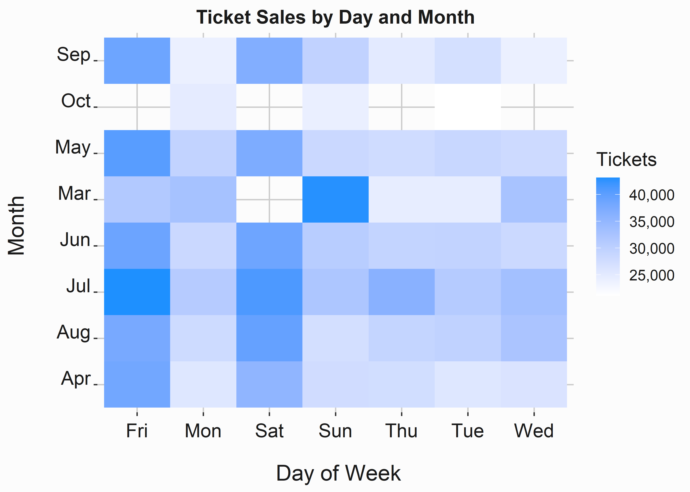
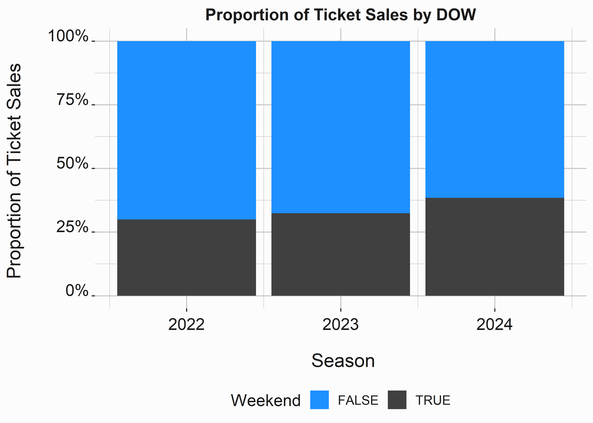
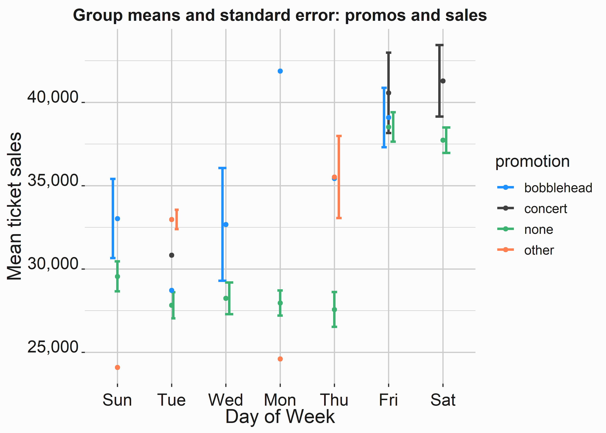
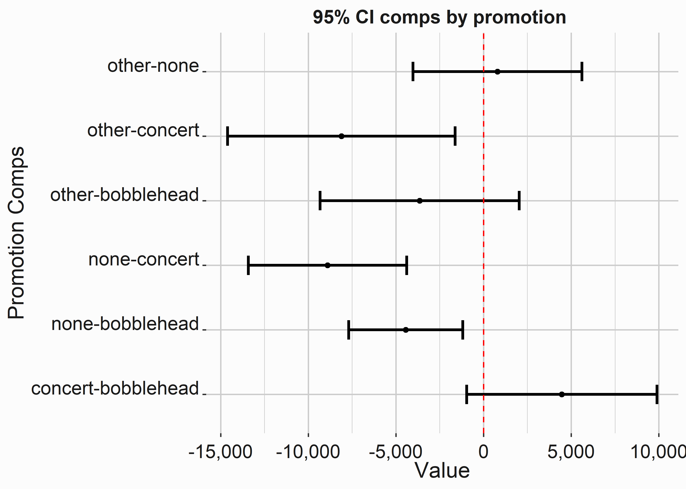
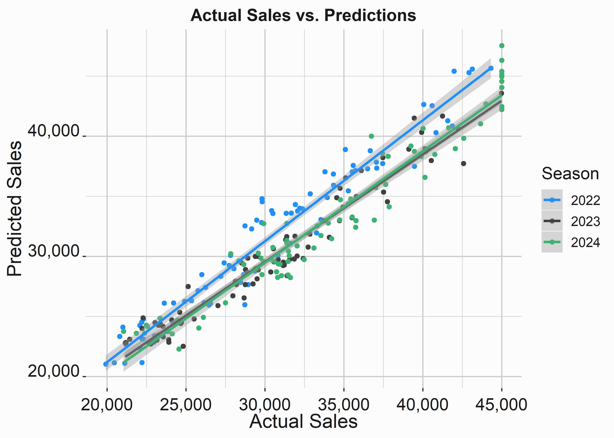

# Exploring your data {#chapter3}


R makes it easy to do exploratory work on your data. There are numerous packages and functions that make it easy visualize and tabulate your data. We'll leverage many packages outlined in the book "R For Data Science" [@Wickham2017]. Our graphics will be created with an excellent graphics package called ggplot2 [@R-ggplot2]. ggplot2 makes it easy to look at data in many different ways.

We'll also recommend several methods of analyzing your data. "R in Action" by Robert Kabacoff [@Kabacoff2011] does an outstanding job of demonstrating cursory data analysis with a variety of data sets. We'll reference this book several times in this chapter. While there are innumerable statistical methods and rubrics for analyzing your data, graphs do the best job of conveying most of the information that you will encounter in this book. 

## Building a consistent design language 

There are several graphics paradigms available in R and elsewhere. D3 [@d32020] is an outstanding javascript library for building dynamic graphics. Python also contains several libraries such as seaborn [@Waskom2021] that will help you construct statistical graphics. We'll use the ggplot2 [@R-ggplot2] paradigm for the graphics in this book. ggplot2 will make it easy to build consistent and visually appealing graphics in R. 

Let's start by constructing a graphics theme that we will use throughout our examples. We begin this example by creating a color palette that we can use or modify. Afterward, we simply set a variable equal to a set of parameters corresponding to components of the images that we will be creating. Almost all of the graphics in this book were created with a combination of ggplot and dplyr. They are always installed and are used frequently throughout the book. 


```r
library(ggplot2)
library(dplyr)
#-----------------------------------------------------------------
# creating a color palette
#-----------------------------------------------------------------
palette <- c('dodgerblue','grey25','coral','mediumseagreen',
             'orchid','firebrick','goldenrod','cyan',
             'brown','steelblue','magenta')
#-----------------------------------------------------------------
# Creating a custom theme
#-----------------------------------------------------------------
graphics_theme_1 <- ggplot2::theme() + 
  theme(axis.text.x  = element_text(angle  = 0, size  = 14, 
                                    vjust  = 0, color = "grey10"),  
        axis.text.y  = element_text(angle  = 0, size  = 14, 
                                    vjust  = 0, color = "grey10"),  
        axis.title.x = element_text(size   = 16, face = "plain", 
                                    colour = "grey10"), 
        axis.title.y = element_text(size   = 16, face = "plain", 
                                    color  = "grey10"), 
        legend.title = element_text(size   = 14, face = "plain", 
                                    color  = "grey10"), 
        legend.text  = element_text(size   = 11, 
                                    color  = "grey10"), 
        plot.title   = element_text(colour = "grey10", 
                                    size   = 14, angle = 0, 
                                    hjust  = .5, vjust = .5, 
                                    face   = "bold"), 
        legend.position   = "right", 
        legend.background = element_rect(fill     = "grey99", 
                                         size     = 3,  
                                         linetype = "solid", 
                                         colour   = "grey99"), 
        legend.key        = element_rect(fill     = "grey99", 
                                         color    = "grey99"), 
        strip.background  = element_rect(fill     =  "grey99", 
                                         colour   = "grey99"), 
        strip.text        = element_text(size     = 14, 
                                         face     = "plain", 
                                         color    = "grey10"), 
        panel.grid.major  = element_line(colour   = "grey80"),  
        panel.grid.minor  = element_line(colour   = "grey80"), 
        panel.background  = element_rect(fill     = "grey99", 
                                         colour   = "grey99"), 
        plot.background   = element_rect(fill     = "grey99", 
                                         colour   = "grey99"))
```

The object __graphics_theme_1__ will be used on all of our subsequent graphs. It will keep them looking consistent. You can easily adjust any element by simply adding it to your plot after the theme. 


```r
#-----------------------------------------------------------------
# High level schedule data
#-----------------------------------------------------------------
library(FOSBAAS)
season_data <- FOSBAAS::season_data
```


Table: (\#tab:fosbaasdataknitr)Example of schedule data

|gameNumber|team|   date   |dayOfWeek|month|weekEnd|
|:--------:|:--:|:--------:|:-------:|:---:|:-----:|
|    1     | SF |2022-03-27|   Sun   | Mar | FALSE |
|    2     | SF |2022-03-28|   Mon   | Mar | FALSE |
|    3     | SF |2022-03-29|   Tue   | Mar | FALSE |
|    4     |BAL |2022-04-05|   Tue   | Apr | FALSE |
|    5     |BAL |2022-04-06|   Wed   | Apr | FALSE |
|    6     |BAL |2022-04-07|   Thu   | Apr | FALSE |

We've already talked about this data, so the next few sections will demonstrate the sorts of plots and exploratory analysis that you would typically perform to help you understand patterns in the data. This part of analysis is critical. It helps you understand the data so that you can perform more sophisticated modeling on it in later steps. It is also the best way to communicate patterns in the data to those with less experience with data. However, I also offer a word of warning. Most people do not think in distributions. Simple bar and line plots will get the most traction with folks. Don't attempt to explain a box plot to someone in a meeting. You will lose the room. 

## Histograms and density plots

Histograms and density plots are critical to understanding the underlying structure of data. Using a point estimate such as an average is a good way to misinterpret data. Learn to think in distributions. The following two graphs are called with simple commands: _geom_histogram_ and _geom_density_.


```r
#-----------------------------------------------------------------
# Histograms
#-----------------------------------------------------------------
season_data <- FOSBAAS::season_data
x_label  <- ('\n Ticket Sales')
y_label  <- ('Count \n')
title    <- ('Distribution of Seasonal Ticket Sales')
legend   <- ('Season')
hist_sales <- 
  ggplot2::ggplot(data  = season_data,
                  aes(x = ticketSales,
                      fill  = factor(season)))         +
  geom_histogram(binwidth = 1000)                      +
  scale_fill_manual(legend, values = palette)          +
  geom_rug(color = 'coral')                            +
  scale_x_continuous(label = scales::comma)            +
  scale_y_continuous(label = scales::comma)            +
  xlab(x_label)                                        + 
  ylab(y_label)                                        + 
  ggtitle(title)                                       +
  graphics_theme_1
```


This code creates the graph in figure \@ref(fig:distributionticketsa). Histograms are incredibly useful for understanding a data set's structure. If you are unfamiliar with them, they demonstrate the count of a specific instance of something (in this case, ticket sales). We also included a _rug_ at the bottom of the graph. This rug demonstrates where the data points actually on the graph. It may be unnecessary, but I find that it helps me interpret the graph a little easier. This is especially true for density plots.

The following diagram also layers different seasons on the diagram using colors. The colors that you use are important. While we aren't going to cover design here, you should have a basic understanding of the "color wheel." Google it. There are also several R packages that deal with color such as RColorBrewer [@R-RColorBrewer]. This package was designed for maps, but demonstrates the point. Put some thought into the colors that you use and why you use them.  


<div class="figure" style="text-align: center">

<p class="caption">(\#fig:distributionticketsa)Histogram of Ticket Sales</p>
</div>
How can we interpret this plot? Honestly, it is difficult to see much of a difference. However, it looks like 2024 had a higher percentage of sellouts. It also looks like there is a huge spike at around 31,000 tickets. Perhaps there are better ways to help us understand this data.

With a small change, you can create a density plot. Density plots convey similar information as histograms, but they can be confusing for some individuals. Know your audience before choosing to use one over a more interpretable histogram. You can see this plot in figure \@ref(fig:distributionticketsdensity).


```r
#-----------------------------------------------------------------
# Kernel density plot
#-----------------------------------------------------------------
x_label  <- ('\n Ticket Sales')
y_label  <- ('Density \n')
title    <- ('Distribution of Seasonal Ticket Sales')
legend   <- ('Season')
density_sales <- 
  ggplot2::ggplot(data = season_data, 
                  aes(x    = ticketSales, 
                      fill = factor(season)))                +
  geom_density(alpha = .5)                                   +
  scale_fill_manual(legend,values = palette)                 +
  geom_rug(color = 'coral')                                  +
  scale_x_continuous(label = scales::comma)                  +
  scale_y_continuous(label = scales::percent)                +
  xlab(x_label)                                              + 
  ylab(y_label)                                              + 
  ggtitle(title)                                             +
  graphics_theme_1
```


A kernal density plot represents the density at a particular point. Think of it as how much area lives under the curve. The plot looks like this.

<div class="figure" style="text-align: center">

<p class="caption">(\#fig:distributionticketsdensity)Density Plot of Ticket Sales</p>
</div>

This graph helps us visualize skew a little better than the histogram. We used an _alpha_ argument to make the graphs transparent. It is much easier to see that 2024 skews to the right more than 2022 or 2023. 

How can we interpret the data under curve at a certain point? You can approximate it fairly easily. There are multiple methods to do this and you don't necessarily have to integrate. However, if you did have to use an integral R can help there too. Keep in mind that if you are actually doing calculus working for a club on the business side you are probably doing something wrong.

You can use the density function to help you understand what is going on with these curves. 


```r
#-----------------------------------------------------------------
# Demonstrate AUC
#-----------------------------------------------------------------
den      <- density(season_data$ticketSales)
bin_size <- (den$x[2] - den$x[1])

round(sum(den$y) * bin_size,2) # Approximates to 1
#> [1] 1
```


This part should be intuitive. We can now use this data to make observations at specific points on the x axis.


```r
#-----------------------------------------------------------------
# Demonstrate AUC at 40,000 Tickets
#-----------------------------------------------------------------
sum(den$y[den$x >= 40000]) * bin_size
#> [1] 0.1337782
```
About thirteen percent of the area under the curve is at points above 40,000 tickets. We included these calculations for demonstrative purposes. It should make density plots easier to understand. We could perform these calculations for each density curve to help us understand the data in a little more granular fashion.  

Histograms and density plots are of particular use when you performing certain statistical analyses of data. We'll use them frequently. Familiarize yourself with them. 

## Box, faceted, and scatter plots

You can also easily split your data by season to analyze the distributions slightly differently. In this case, we've used the __facet_grid(season ~ .)__ argument to split the graph on season. There really isn't anything different here. The function __facet_wrap()__ does something similar. Try it out to see the difference. The faceted histogram can be seen in figure \@ref(fig:distributionticketseightfacet).


```r
#-----------------------------------------------------------------
# Faceting a plot
#-----------------------------------------------------------------
x_label  <- ('\n Ticket Sales')
y_label  <- ('Count \n')
title    <- ('Distribution of Seasonal Ticket Sales')
histogram_sales_facet <- 
  ggplot2::ggplot(data = season_data, 
                  aes(x = ticketSales))                        +
  facet_grid(season ~ .)                                       +
  geom_histogram(binwidth = 1000, fill = palette[1])           +
  geom_rug(color = 'coral')                                    +
  scale_x_continuous(label = scales::comma)                    +
  scale_y_continuous(label = scales::comma)                    +
  xlab(x_label)                                                + 
  ylab(y_label)                                                + 
  ggtitle(title)                                               +
  graphics_theme_1 
```


<div class="figure" style="text-align: center">

<p class="caption">(\#fig:distributionticketseightfacet)Faceted histogram</p>
</div>
Notice how we restricted the graph to one color. Avoid multiple colors on graphs that split the data. You don't need to have multiple ways to distinguish individual subsets of the data. One way will suffice.

How can we interpret this graph? We get the same interpretation. 2024 is skewed to the right likely indicating higher average ticket sales.2023 appears to have a few clusters of attendance while 2022 is fairly evenly distributed. Perhaps this is because differences in the schedule.

Splitting graphs on various features is very useful and you'll see it frequently. We can create box-plots by changing one argument. The following code produces the boxplot in figure \@ref(fig:chthreeboxplotexample).


```r
#-----------------------------------------------------------------
# Box plots
#-----------------------------------------------------------------
x_label  <- ('\n Season')
y_label  <- ('Ticket Sales \n')
title    <- ('Distribution of Seasonal Ticket Sales')
box_sales <- 
  ggplot2::ggplot(data  = season_data, 
                  aes(x = factor(season), 
                      y = ticketSales))               +
  geom_boxplot(fill = 'dodgerblue')                   +
  geom_jitter(alpha = .2,  height = 0, 
              width = .25, color  = 'coral')          +
  geom_rug(color = 'coral')                           +
  scale_y_continuous(label = scales::comma)           +
  xlab(x_label)                                       + 
  ylab(y_label)                                       + 
  ggtitle(title)                                      +
  graphics_theme_1
```


Boxplots are my preferred method of looking at distributions. In this case, we blended a boxplot with a scatter plot. How do you interpret a boxplot? The black line in the middle of the colored section represents the median. The box represents the 50th percentile of values. This is the interquartile (IQR) range representing the values between 25% and 50%. The whiskers represent a calculation based on that range and dots represent outliers.   


<div class="figure" style="text-align: center">

<p class="caption">(\#fig:chthreeboxplotexample)Segmented histogram and box-whisker plots</p>
</div>

In this case, it is much easier to interpret the data. The IQR is skewed much higher and we clearly have a larger median value. Why use median instead of the mean? The median is a safer interpretation when you are looking at non-normal distributions (distributions with skew). It is actually best to look at both of them, but we will get to that.

We'll explore one more type of basic plot. A violin plot will blend a density plot and boxplot. The following code produces the plot in figure \@ref(fig:chthreeticketsviolin).


```r
#-----------------------------------------------------------------
# violin plot
#-----------------------------------------------------------------
x_label  <- ('\n Season')
y_label  <- ('Ticket Sales \n')
title    <- ('Distribution of Seasonal Ticket Sales')
violin_sales <-
  ggplot2::ggplot(data = season_data, 
                  aes(x = factor(season), 
                      y = ticketSales))             +
  geom_violin(fill = 'dodgerblue')                  +
  geom_jitter(alpha = .35, height = 0, 
              width = .25, color = 'coral')         +
  geom_rug(color = 'coral')                         +
  scale_y_continuous(label = scales::comma)         +
  xlab(x_label)                                     + 
  ylab(y_label)                                     + 
  ggtitle(title)                                    +
  graphics_theme_1
```


<div class="figure" style="text-align: center">

<p class="caption">(\#fig:chthreeticketsviolin)Segmented violin plot</p>
</div>
I think violin plots are interesting, but I typically don't use them. I prefer to split my density plots and boxplots into separate graphs. You may feel differently. I would not recommend showing one of these plots to someone with limited statistical experience. Perhaps you shouldn't use them at all. 

## Line and tile plots

Line plots and tile plots can be used in various ways. Line plots tend to be used to demonstrate some sort of longitudinal trend. Tile plots can help to visualize that that is multidimensional and correlates with other features being displayed. Line plots will need some sort of grouping variable and can occasionally be frustrating to work with. In general, you put them together in the same way as the other plots you have seen. The following code produces the plot in figure \@ref(fig:chthreeticketsline).


```r
#-----------------------------------------------------------------
# Line plot
#-----------------------------------------------------------------
x_label <- ('\n Game Number')
y_label <- ('Ticket Sales \n')
title   <- ('Ticket Sales by Game Number')
legend  <- 'Season'
line_sales <- 
  ggplot2::ggplot(data      = season_data, 
                  aes(x     = gameNumber,
                      y     = ticketSales,
                      color = factor(season)))             +
  geom_line(size = .9)                                     +
  scale_color_manual(legend, values = palette)             +
  scale_y_continuous(label = scales::comma)                +
  xlab(x_label)                                            + 
  ylab(y_label)                                            + 
  ggtitle(title)                                           +
  graphics_theme_1 + theme(legend.position   = "bottom")
```

Line plots are a mainstay of analysis. They are typically leveraged to demonstrate change over time or some other series of data points. You should be pretty familiar with them.


<div class="figure">

<p class="caption">(\#fig:chthreeticketsline)Line and Tile Plots</p>
</div>

What are we seeing here? It appears that there is some degree of seasonality in the data. We can see that there are very few games with relatively low attendance during the middle of the season? Perhaps this is because school is out in the summer months and it helps bolster attendance. Additionally, are there other sports competing with baseball during these months? 

If you look past the sixtieth game you will notice that 2024 has a surge in attendance. Maybe this because they were in a playoff race. Line graphs are also interesting because if you notice trend and seasonality you might be able to decompose these components using exponential smoothing or even a moving average. In practice, I have found limited use for these techniques in sports. However, it is something to think about.

Tile plots (or heatmaps) add a level of dimensionality to data and can be extremely useful. This one is a little different. We need to do some aggregation on the data before visualizing it. We'll use the _dplyr_ for most transformations. It just makes life easier. This is very different than what you will tend to see in languages such as python. it uses the pipe _%>%_ to say the words _then do_. You'll be seeing a lot more of it. Try it out on some data. In this case we are just picking some columns, grouping them, and then creating an aggregation. It feels similar to SQL. I wonder why. This plot can be seen in figure \@ref(fig:chthreetileplotex).


```r
#-----------------------------------------------------------------
# Tile plot or heat map
#-----------------------------------------------------------------
x_label <- ('\n Day of Week')
y_label <- ('Month \n')
title   <- ('Ticket Sales by Day and Month')
# compress data into an easier format
sd_comp <- season_data                    %>% 
  select(dayOfWeek,month,ticketSales)     %>%
  group_by(dayOfWeek,month)               %>%
  summarise(avgSales = mean(ticketSales))

tile_sales <- 
  ggplot2::ggplot(data     = sd_comp, 
                  aes(x    = dayOfWeek,
                      y    = month,
                      fill = avgSales))                       +
  geom_tile()                                                 +
  scale_fill_gradient(low = "white", high = "dodgerblue",
                      name = 'Tickets',label = scales::comma) +
  xlab(x_label)                                               + 
  ylab(y_label)                                               + 
  ggtitle(title)                                              +
  graphics_theme_1
```


<div class="figure">

<p class="caption">(\#fig:chthreetileplotex)Tile Plots</p>
</div>
How do we interpret this data? We can clearly see that Friday and Saturday tend to have higher average ticket sales. This shouldn't be a surprise. It also looks like Sundays in March did well. Beware! That is likely an artifact from a reduced sample size. Overall, Heatmaps do a good job of visualizing correlations, but they can be misleading. Be careful with them and always consider sampling issues. 


We can also look at a variation of a heatmap called a hex plot. It can be used in slightly different ways. You can see the hex plot in figure \@ref(fig:chthreehex).  


```r
#-----------------------------------------------------------------
# Hexplots
#-----------------------------------------------------------------
x_label  <- ('\n Game Number')
y_label  <- ('Ticket Sales \n')
title   <- ('Ticket Sales by game')

hex_sales <- 
  ggplot2::ggplot(data     = season_data, 
                  aes(x    = gameNumber,
                      y    = ticketSales))                    +
  geom_hex()                                                  +
  scale_fill_gradient(low = "dodgerblue", high = "coral",
                      name = 'Count',label = scales::comma)   +
    scale_y_continuous(label = scales::comma)                 +
  xlab(x_label)                                               + 
  ylab(y_label)                                               + 
  ggtitle(title)                                              

```


<div class="figure">

<p class="caption">(\#fig:chthreehex)Hex Plots</p>
</div>


This heatmap is a little different. It demonstrates the number of games that fall into each bin. I tend to use these plots when I have continuous variables on the x and y axis and I am interested in the density at each point. Additionally, you can perceive some of the seasonality that is evident around game forty. 

## Bar plots

If you want to use a pie chart, don't. Bar plots are almost always a better choice. Visualizing the relationships between area is simply easier. These are probably the most popular way to display data, but I find them lacking. You really need to train yourself to think in distributions. When you are standing in line at the grocery store don't mindlessly look at the magazine covers. Look at the people and think of their height as a distribution. Don't simply count them. Bar Plots are for counts. The basic bar plot produced by the following code can be seen in figure \@ref(fig:chthreebarexample). 


```r
#-----------------------------------------------------------------
# Bar plot version one
#-----------------------------------------------------------------
x_label  <- ('\n Season')
y_label  <- ('Proportion of Ticket Sales \n')
title    <- ('Proportion of Ticket Sales by DOW')
bar_sales_pro <- 
  ggplot2::ggplot(data     = season_data, 
                  aes(y    = ticketSales,
                      x    = season,
                      fill = weekEnd))                   +
  geom_bar(stat = 'identity',position = 'fill')          +
  scale_fill_manual(values = palette, name = 'Weekend')  +
  scale_y_continuous(label = scales::percent)            +
  xlab(x_label)                                          + 
  ylab(y_label)                                          + 
  ggtitle(title)                                         +
  graphics_theme_1 + theme(legend.position   = "bottom")
```


<div class="figure" style="text-align: center">

<p class="caption">(\#fig:chthreebarexample)Proportional of sales by day of week</p>
</div>

In this example we are looking at the percentages of tickets sold on the weekend vs. weekdays by season. This graph does a great job of it. We can clearly see that weekends make up a higher proportion of sales in 2024. We also know that weekdays make up the majority of sales. 

We can build a variation on this plot with the _position_ argument. Now we can take a look at the overall numbers. This second bar plot can be viewed in figure \@ref(fig:chthreebarplottwo).


```r
#-----------------------------------------------------------------
# Bar plot version two
#-----------------------------------------------------------------
x_label  <- ('\n Season')
y_label  <- ('Ticket Sales \n')
title    <- ('Ticket Sales by DOW')
bar_sales <- 
  ggplot2::ggplot(data     = season_data, 
                  aes(y    = ticketSales,
                      x    = season,
                      fill = weekEnd))                  +
  geom_bar(stat = 'identity', position = 'stack')       +
  scale_fill_manual(values = palette, name = 'Weekend') +
  scale_y_continuous(label = scales::comma)             +
  xlab(x_label)                                         + 
  ylab(y_label)                                         + 
  ggtitle(title)                                        +
  graphics_theme_1 + theme(legend.position   = "bottom")
```


<div class="figure" style="text-align: center">

<p class="caption">(\#fig:chthreebarplottwo)Barplot of sales</p>
</div>
We can see that 2022 and 2023 are almost identical and 2024 had significantly more ticket sales. This is the type of plot you might use for descriptive reporting. It is something accounting would want to see. They don't need to know why? They typically just need the what.  

## A final word on graphics

Be cautious about how you represent data. We just covered the absolute rudiments or creating graphs and demonstrated some of the most commonly used instruments. Always think about the simplest way to illustrate the point that you are trying to make. Bar plots are usually fine. I like to follow a few rules when building graphs.

1. Never use a pie chart. They are more difficult to interpret than a bar plot
2. Don't use two Y axes. It is almost always better to use two graphs because the differences in scale or units can be confusing. 
3. stick with a consistent color scheme.
4. Stick with a consistent font scheme
5. Don't put too much on one graph. Too many colors or shapes make graphs confusing. Always simplify.  

Additionally, we didn't cover dynamic plots. R provides some interesting capabilities on this front. Shiny [@R-shiny] allows you to build some cool interactive web apps. Furthermore, there are innumerable tools such as Tableau ^[These technologies are dynamic and constantly changing. At the time of writing, Tableau was the dominant tool in this space.] and Looker that provide good business intelligence capability. Often, these tools are easier to use for quick ad hoc data exploration. However, there is a lot of utility in putting everything into code. It automatically documents your work for those that can read it. It also gives you a readily available reference. You will find that this work can tend to be repetitive. You will use a lot of variations on the same theme. Most code is already written. You just need to adapt it.


## Summarizing the data

We'll make heavy use of a an R package named dplyr [@R-dplyr]. We'll use dplyr because it is easy to read. We'll also reference a couple of other packages that are useful for summarizing data such as [@R-psych]. Overall, summarizing data is an accoutrement to graphs. You don't always have to do it, but you will find yourself doing often. 

Let's create simple summary of ticket sales using _dplyr_.


```r
#-----------------------------------------------------------------
# Creating a summary statistics table
#-----------------------------------------------------------------
library(dplyr)
average_by_dow <- 
FOSBAAS::season_data                          %>% 
  group_by(dayOfWeek)                         %>% 
  summarise(AverageSales = mean(ticketSales))
```


Table: (\#tab:summarystats2)Mean ticket sales by day of week

|dayOfWeek|AverageSales|
|:-------:|:----------:|
|   Fri   |  38794.03  |
|   Mon   |  28243.46  |
|   Sat   |  38146.29  |
|   Sun   |  29690.38  |
|   Thu   |  28560.53  |
|   Tue   |  28217.72  |
|   Wed   |  28893.47  |


_dplyr_ has a wide assortment of useful tools for manipulating data. I highly recommend leveraging it whenever possible. For edification, an identical table can be produced in base R using the _by_ function:


```r
#-----------------------------------------------------------------
# Creating a summary statistics table using 'by'
#-----------------------------------------------------------------
by(FOSBAAS::season_data$ticketSales,
   FOSBAAS::season_data$dayOfWeek,function(x) mean(x))
#> FOSBAAS::season_data$dayOfWeek: Fri
#> [1] 38794.03
#> --------------------------------------------- 
#> FOSBAAS::season_data$dayOfWeek: Mon
#> [1] 28243.46
#> --------------------------------------------- 
#> FOSBAAS::season_data$dayOfWeek: Sat
#> [1] 38146.29
#> --------------------------------------------- 
#> FOSBAAS::season_data$dayOfWeek: Sun
#> [1] 29690.38
#> --------------------------------------------- 
#> FOSBAAS::season_data$dayOfWeek: Thu
#> [1] 28560.53
#> --------------------------------------------- 
#> FOSBAAS::season_data$dayOfWeek: Tue
#> [1] 28217.72
#> --------------------------------------------- 
#> FOSBAAS::season_data$dayOfWeek: Wed
#> [1] 28893.47
```

There are many other data manipulation packages such as _data.table_ [@R-datatable] and _plyr_ [@R-plyr]. Let's take a look at a few more examples. You will frequently find yourself looking at quantiles. You can use this data to set simple fences for segmentation. 


```r
#-----------------------------------------------------------------
# Getting quantiles
#-----------------------------------------------------------------
quants <- quantile(FOSBAAS::season_data$ticketSales, 
                   probs = c(0,.10,.25,.5,.75,.9,1))
quants
#>      0%     10%     25%     50%     75%     90%    100% 
#> 19920.0 22797.6 26126.5 30956.0 35664.0 40816.6 45000.0
```
In this case we know that 25% of the observations are below 26,126.5 tickets sold. You can access the components of this object with brackets and an index. Many object in R can be accessed with indexes. This comes in handy when you are scripting. 


```r
#-----------------------------------------------------------------
# Getting quantiles
#-----------------------------------------------------------------
quants[3]
#>     25% 
#> 26126.5
```

Turning data from long to wide format and vise-versa is something that is also a common task. There are several ways to accomplish this. Let's look at one example. Perhaps you would like to see the Giants and Baltimore. This will be a little more complex, but it demonstrates how logically this system operates. We'll use the _dplyr_ [@R-dplyr] and _tidyr_ [@R-tidyr] libraries to achieve this result.   


```r
#-----------------------------------------------------------------
# Converting to wide format
#-----------------------------------------------------------------
library(dplyr)
library(tidyr)
team_dow <- 
  FOSBAAS::season_data                                   %>%
  select(team,dayOfWeek,ticketSales)                     %>%
  filter(team %in% c('SF','BAL'))                        %>%
  group_by(team,dayOfWeek)                               %>%
  summarise(medianSales = median(ticketSales),
            games       = n())                           %>%
  tidyr::pivot_wider(names_from  = team,
                     values_from = c(medianSales,games)) %>%
  mutate(difference = medianSales_BAL - medianSales_SF)  %>%
  arrange(difference)                          
```


Table: (\#tab:widelonga )Median ticket sales by day of week

|dayOfWeek|medianSales_BAL|medianSales_SF|games_BAL|games_SF|difference|
|:-------:|:-------------:|:------------:|:-------:|:------:|:--------:|
|   Sun   |    28209.0    |   42928.0    |    2    |   1    | -14719.0 |
|   Sat   |    29787.0    |   43999.0    |    1    |   1    | -14212.0 |
|   Thu   |    22561.0    |   35357.5    |    3    |   2    | -12796.5 |
|   Fri   |    33734.0    |   43608.5    |    3    |   2    | -9874.5  |
|   Wed   |    26301.5    |   28773.0    |    4    |   1    | -2471.5  |
|   Mon   |    25658.5    |   25759.0    |    2    |   1    |  -100.5  |
|   Tue   |    26464.0    |   26233.0    |    3    |   1    |  231.0   |


Now we have a table that tells us exactly what we want to know. In practice you will probably need this data in long format more often. Let's pretend we want to graph this data. Because of the way ggplot works you will probably want to convert this data. It is simple to go back.


```r
#-----------------------------------------------------------------
# Converting to long format
#-----------------------------------------------------------------
library(dplyr)
library(tidyr)
team_dow_long <- 
  team_dow                                          %>%
  select(dayOfWeek, medianSales_BAL,medianSales_SF) %>%
  tidyr::pivot_longer(!dayOfWeek, 
                      names_to  = "club", 
                      values_to = "medianSales")
                         
```


Table: (\#tab:widelongd )Median ticket sales by day of week

|dayOfWeek|     club      |medianSales|
|:-------:|:-------------:|:---------:|
|   Sun   |medianSales_BAL|  28209.0  |
|   Sun   |medianSales_SF |  42928.0  |
|   Sat   |medianSales_BAL|  29787.0  |
|   Sat   |medianSales_SF |  43999.0  |
|   Thu   |medianSales_BAL|  22561.0  |
|   Thu   |medianSales_SF |  35357.5  |


This data will be much easier to use in ggplot. For the most part, these are the main operations you will be performing. They can be much more complex, but you just went through the main building blocks. If you understand what we just covered, you will be surprised at how far you can take it. 

### Getting statistical information

We also thought it might be useful to mention a few ways to get statistical data without having to calculate it yourself. R excels here and several people have extended it's capabilities. I'll show you a couple of the ones I have used the most. The _psych_ [@R-psych] library contains lots of useful functions for manipulating data.  


```r
#-----------------------------------------------------------------
# Summary stats psych
#-----------------------------------------------------------------
library(psych)
psy_desc <- 
  t(data.frame(psych::describe(FOSBAAS::season_data$ticketSales)))
```


Table: (\#tab:psychshow )Summary Statistics

|        |           X1|
|:-------|------------:|
|vars    |    1.0000000|
|n       |  243.0000000|
|mean    |31411.0370370|
|sd      | 6578.2640431|
|median  |30956.0000000|
|trimmed |31107.2256410|
|mad     | 7103.1366000|
|min     |19920.0000000|
|max     |45000.0000000|
|range   |25080.0000000|
|skew    |    0.3095442|
|kurtosis|   -0.7500429|
|se      |  421.9958351|


This gives you a good overview of what the structure of the ticket sales data looks like. This gives me a good opportunity to point out one of R's quirks. The _psych_ package and the _Hmisc_ [@R-Hmisc] package both have a function with the same name. They even do similar things. Be cautious with dependencies because they can cause problems.

The following example uses the Hmisc package to display some summary statistics. 


```r
#-----------------------------------------------------------------
# Summary stats Hmisc
#-----------------------------------------------------------------
hmisc_desc <- (Hmisc::describe(FOSBAAS::season_data$ticketSales))
hmisc_desc <- unlist(hmisc_desc$counts)
hmisc_desc <- as.data.frame(hmisc_desc)

# Unload a package
# unloadNamespace("Hmisc")
# detach("package:Hmisc")
```

You can remove libraries from your environment in a couple of different ways seen in the previous code chuck. 


Table: (\#tab:hmiscshow )Summary Statistics using Hmisc

|        |     |
|:-------|----:|
|n       |  243|
|missing |    0|
|distinct|  234|
|Info    |    1|
|Mean    |31411|
|Gmd     | 7517|
|.05     |22115|
|.10     |22798|
|.25     |26127|
|.50     |30956|
|.75     |35664|
|.90     |40817|
|.95     |43602|


As you can see, somebody else has done the hard work for you. You just need to know where to look. Keep in mind, not all R packages are good. This software is user generated and provided for free. While there are lots of reputable packages, there are also lots that are poorly written. It is sometimes useful to look for provenance. 


### Building models and basic statistics

We'll apply more rigor to our models as we progress through the ensuing chapters. However, I want to introduce a couple of concepts in this here. We will add to the complexity as we move into actual projects.


#### ANOVA

An _analysis of variance_ is a commonly used tool to gauge differences between groups. We are only going to take a cursory look at one version of ANOVA. There are lots of different types of ANOVA and you'll want to put some time into understanding when and how to use them. Additionally, ANOVA output is equivalent to regression output. However, we are going to use it when we want to understand differences between groups. There are other ways to analyze the differences between groups such as a students T test. The following sections will walk you through a simple ANOVA example.

This example is a _one-way_ ANOVA with a covariate, but there are several research designs that you will want to be familiar with. We want to look at the differences in ticket sales by promotion by the day of the week. We can begin by looking at our samples 


```r
#-----------------------------------------------------------------
# Build a frequency table
#-----------------------------------------------------------------
table(FOSBAAS::season_data$promotion)
#> 
#> bobblehead    concert       none      other 
#>         16          8        212          7
```

Each group has completely different representation. This is not a balanced design. Does that matter? It certainly could. We will test for group differences using the _aov_ function.


```r
#-----------------------------------------------------------------
# One Way ANOVA
#-----------------------------------------------------------------
mod <- aov(ticketSales ~ promotion + dayOfWeek,
           data = FOSBAAS::season_data)
#summary(mod)
```


Table: (\#tab:anova2 )ANOVA results

|     term| df|     sumsq|   meansq|statistic|p.value|
|--------:|--:|---------:|--------:|--------:|------:|
|promotion|  3| 865001255|288333752| 12.26602|  2e-07|
|dayOfWeek|  6|4130134954|688355826| 29.28337|  0e+00|
|Residuals|233|5477064783| 23506716|       NA|     NA|


We'll discuss designing experiments (DOE) in a later chapter. For now, we'll simply walk through some of the output. We aren't being rigorous here. Basically, our P Value looks good and we have an F statistic that isn't super small. We can move forward. Let's take a look at some statistics in a graph.


```r
#-----------------------------------------------------------------
# Viewing group means
#-----------------------------------------------------------------
library(dplyr)
graph_table <- FOSBAAS::season_data %>%
               
    select(promotion,ticketSales,dayOfWeek,daysSinceLastGame)  %>%
    group_by(promotion,dayOfWeek)                              %>%
    summarise(sales = mean(ticketSales),
              daysSinceLastGame = mean(daysSinceLastGame),
              N = n(),
              sd = sd(ticketSales),
              se = sd/sqrt(N))         

x_label <- 'Day of Week'                                             
y_label <- 'Mean ticket sales'                                            
title   <- 'Group means and standard error: promos and sales'
se <- 
ggplot(graph_table, aes(y=sales, 
                        x=reorder(dayOfWeek,sales,mean), 
                        color=promotion))                     + 
    geom_errorbar(aes(ymin = sales-se, ymax = sales+se), 
                  width =.3,size = 1,
                  position = position_dodge(0.25))            +
    geom_point()                                              +
    scale_color_manual(values = palette)                      +
    scale_y_continuous(label = scales::comma)                 +
    xlab(x_label)                                             + 
    ylab(y_label)                                             + 
    ggtitle(title)                                            +
    graphics_theme_1 
```


<div class="figure" style="text-align: center">

<p class="caption">(\#fig:chthreese)Group means and standard error by promotion and dow</p>
</div>

This model output isn't incredibly informative, but the graph gives you a lot of information. Once you have your model constructed you can access all the parts with a dollar sign: _mod$terms_. There is a lot to consider in these models when you begin making them more complex. In this case, we can see that we have some sample issues.


We can see that certain promotions may be more effective than others and that the day of the week may have an impact on how effective the promotion might be in absolute terms. 


```r
#-----------------------------------------------------------------
# Summary stats psych
#-----------------------------------------------------------------
tu_test <- TukeyHSD(mod)
```


Table: (\#tab:anova4 )Tukey Comparisons

|                  |      diff|        lwr|      upr|    p adj|
|:-----------------|---------:|----------:|--------:|--------:|
|concert-bobblehead| 4465.5000|  -967.0665| 9898.067|0.1475821|
|none-bobblehead   |-4442.5448| -7695.2441|-1189.845|0.0027589|
|other-bobblehead  |-3646.7321| -9332.1099| 2038.646|0.3474454|
|none-concert      |-8908.0448|-13426.6337|-4389.456|0.0000042|
|other-concert     |-8112.2321|-14605.3911|-1619.073|0.0076108|
|other-none        |  795.8127| -4023.7710| 5615.396|0.9737610|


In this case, the mean ticket sales for bobbleheads and concerts aren't significantly different from each other. What does this mean? If your KPI is ticket sales and there are different marginal costs associated with concerts and bobbleheads then the less expensive option might be better. Let's visualize these results,


```r
#-----------------------------------------------------------------
# Viewing group means
#-----------------------------------------------------------------
x_label <- 'Value'                                             
y_label <- 'Promotion Comps'                                            
title   <- '95% CI comps by promotion '
tu_comp_graph <- 
ggplot(tu_comp, aes(x=diff, 
                    y=promotion))                             + 
    geom_errorbar(aes(xmin = lwr, xmax = upr), 
                  width =.3,size = 1)                         +
    geom_point()                                              +
    scale_x_continuous(label = scales::comma)                 +
    xlab(x_label)                                             + 
    ylab(y_label)                                             + 
    ggtitle(title)                                            +
    geom_vline(xintercept = 0,color = 'red',lty = 2)          +
    graphics_theme_1 
```


<div class="figure" style="text-align: center">

<p class="caption">(\#fig:chthreesetukey)Group means and standard error by promotion and dow</p>
</div>


If an interval crosses zero, it isn't significant. We can get a significant amount of information from this plot. 

#### Linear Regression

We'll go into regression in more detail in a later chapter. Functionally, the output is the same as an ANOVA. 


```r
#-----------------------------------------------------------------
# Creating a simple linear model
#-----------------------------------------------------------------
ln_mod <- lm(ticketSales ~ team+dayOfWeek+month+
                           daysSinceLastGame+openingDay+promotion,
                           data = FOSBAAS::season_data)
stats_ticket_sales <- 
tibble::tibble(st_error     = unlist(summary(ln_mod)[6]),
               r_square     = unlist(summary(ln_mod)[8]),
               adj_r_square = unlist(summary(ln_mod)[9]),
               f_stat       = summary(ln_mod)$fstatistic[1])
```


Table: (\#tab:salesmodeltwo)Summary statistics

|st_error|r_square|adj_r_square|  f_stat|
|-------:|-------:|-----------:|-------:|
|1980.077|0.925496|   0.9093972|57.48835|


You can use these coefficients to explain the impact of specific variables. For instance, how many tickets is the month of July worth? The coefficient (5264.39) represents this impact. July gives you a five-thousand ticket bump. You can also use the model to make predictions. This model is completly _overfit_, but that doesn't matter at this point. Let's try it. 


```r
#-----------------------------------------------------------------
# Using the regression output
#-----------------------------------------------------------------
seasons <- FOSBAAS::season_data
seasons$pred <- predict(ln_mod)

x_label <- 'Actual Sales'                                             
y_label <- 'Predicted Sales'                                            
title   <- 'Actual Sales vs. Predictions'
legend   <- ('Season')
sales_mod <- 
ggplot(seasons, aes(x = ticketSales, 
                    y = pred,
                    color = factor(season)))                  + 
    geom_point()                                              +
   stat_smooth(method = 'lm', se = T)                      +
    scale_color_manual(legend,values = palette)               +
    scale_x_continuous(label = scales::comma)                 +
    scale_y_continuous(label = scales::comma)                 +
    xlab(x_label)                                             + 
    ylab(y_label)                                             + 
    ggtitle(title)                                            +
    graphics_theme_1 

```

<div class="figure" style="text-align: center">

<p class="caption">(\#fig:chthreepreds)Prediction vs. acutal values</p>
</div>


We can see that the model does a pretty good job of approximating sales. We'll go through a more formal example of regression to demonstrate more of the dogma associated with it. 


## Key concepts and chapter summary

Exploring your data is a fundamental component of analysis. You are looking for useful patterns that might make more sophisticated analysis possible. You are also looking for things like missing data and sparsity. Graphs are typically the easiest way to accomplish this goal. They are also the best method for communicating results. 
We covered several key concepts in this chapter:

- It is important to create a consistent design language for your graphs. Pay attention to colors.
- Certain graphs are better at representing specific data. You often don't need exotic plots to convey information. You'll use variations on a few different forms.
- Summarizing data can be done in multiple ways. There are multiple tools that you can use to reshape and summarize data. You can even implement your own methods relatively easily. 
- R makes it easy to explore and deploy a wide variety of statistical methods.
- When interpreting or communicating findings the simplest explanation is always the best. Most people will not care how you did something. 

Think of this chapter as a reference. You just went through the basic Business Intelligence and analytics tools that you will use for basic data exploration. There are also different ways to accomplish everything that you just saw. In fact, there are multiple ways to accomplish each of these tasks in R. I just showed you one method.  

Additionally you can use Business Intelligence tools like Tableau to add additional dimensions to your illustrations. If you want to build custom websites R provides tools to accomplish this as well. You could even use javascript or python to accomplish the same thing. 


