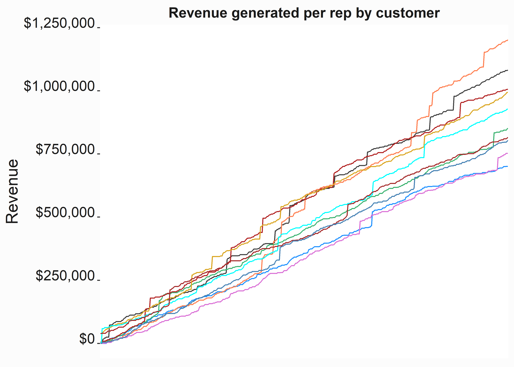
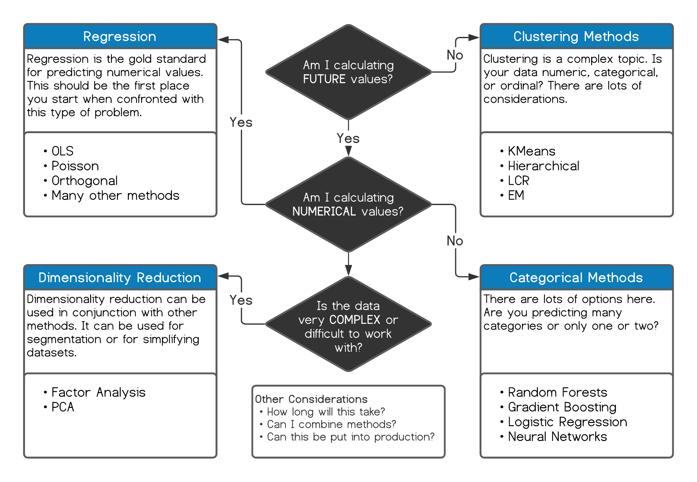

# Structuring analytics projects {#chapter4}


Framing projects tends to be an overlooked component of analytics exercises. These projects often begin _in medias res_. In an effort to get a result you simply cobble some of the data together and begin throwing models at it. I recommend creating a basic wireframe of your project before you begin. It'll help keep your scope in check and force you to project-manage your work. You can loosley break these analytics projects into six parts each of which each may have sub-components: 

1. Defining a measurable goal or hypothesis
2. Data collection and management
3. Modeling the data
4. Evaluating your results
5. Communicating the results
6. Deploying the results

This can often be an iterative process. There could be numerous questions that you have to answer about what tools you will need, whether you have the internal resources, what is the return-on-investment, how long will this take, will anybody use it, have we done this before and if so, what were the results, etc. This process may also be more useful when you are just beginning to do this work. The seasoned analyst will have a good idea of where to begin on a project through experience.   

The basic premise is always the same when working through one of these projects. You create some objectives based on environmental considerations, build some programs to implement those objectives, and you monitor performance. Honestly, it isn't difficult but the process tends to be overlooked. Larger projects can smother and die under their own weight if all of the considerations (including political considerations) aren't considered. A good plan can help keep them breathing. 

## Defining goals

Defining your goals can be easy or difficult. You'll likely need to be able to translate your product into an operational tactic that can be understood and leveraged by a functional unit of the business. A Sales team may say that they want to _sell more tickets and they need more leads_. A marketing team may say that they want to understand _return on marketing investment_. How do you translate these statements into a practical solution? Each request contains a number of questions. 

There are several management techniques that look for root causes. One being the aptly named "5 Whys" [@Serrat2017]. These subjects are outside the scope of this book. The point here is that we should seek to understand why you are doing something in order to devise a plan. It sounds obvious and you should consider this a critical component of defining a goal as a part of the _discovery process_. Let's explore an example: 

Your ticket sales manager says "that they need more leads so that they can sell more season tickets." What is this person asking? It could be one of several things and some of these _things_ may have evolved from how that person is incentivized. In fact, it is always interesting to think about how incentives guide behavior (see _Freakonomics: A rogue economist explores the hidden side of everything_ [@Levitt2005]. What could our sales manager really be saying? 

- I want to make more phone calls. The numbers of calls _causes_ us to sell more tickets.
- Our current leads are not closing at the rate I need in order to hit _my_ goals.
- I don't have enough leads to keep my guys working.

When you put these thoughts into the context of what motivates your sales manager, this simple statement could actually be insidious:  

- I am out of ideas and I am going to make my guys work harder.
- I just want to execute my job. Just give me what I want.

This shouldn't be viewed through a negative lens. Some jobs are about executing and it can get tedious. Look at your task as a way to escape the tedium and to help the sales team think more strategically. Help them escape the mire. 

Let's assume that the sales manager believes that the number of calls directly correlates to the number of tickets that are sold. Why do they believe this and is this something that we can investigate? A simplistic method to investigate this conclusion might be to look to see if the number of phone calls is correlated with sales in any particular way. There are formal and informal methods that we could use, but the easiest thing to do is to simply put this data into a couple of tables and graphs.

### Identifying goals

The data set `FOSBAAS::aggregated_crm_data` has three fields and each row represents interactions with one customer. See `?FOSBAAS::aggregated_crm_data`:

- A repID corresponding to a specific rep
- calls represents the number of calls the rep made to a specific person
- revenue represents the amount of revenue generated from the specific customer. 


```r
#-----------------------------------------------------------------
# Aggregated CRM data
#-----------------------------------------------------------------
ag_sales_data <- FOSBAAS::aggregated_crm_data

library(dplyr)
agg_calls <- 
  ag_sales_data                     %>% 
  group_by(repID)                   %>%
  summarise(calls   = sum(call),
            revenue = sum(revenue)) %>%
  mutate(revByCall = revenue/calls) %>%
  arrange(desc(revByCall))
```


Table: (\#tab:closesb)Calls and revenue by rep

|       repID|calls|  revenue|revByCall|
|-----------:|----:|--------:|--------:|
|AFA0Z9M2M4LQ| 1388|1202116.0| 866.0778|
|9GZT5Z5AOMKV| 1340|1082318.7| 807.7005|
|QO0YHBN8KRMK| 1320|1006951.6| 762.8421|
|QTR3JJJ5J6GJ| 1358| 993549.1| 731.6267|
|RJ7CCATUH4Q1| 1312| 927215.9| 706.7194|
|HOMV3XQW32LW| 1372| 851999.3| 620.9908|
|S0Y0Y2454IU2| 1344| 815876.8| 607.0512|
|YOZ51B6A2QMB| 1384| 804274.7| 581.1233|
|MBT9G0X70NTI| 1334| 752486.0| 564.0825|
|0LK62LATB8E3| 1326| 700451.1| 528.2437|


Why are some salespeople more effective? Perhaps someone called in and bought six of the most expensive seats and it skews the results. Are the call numbers correlated to revenue? The `cor` function will give us the correlation coefficient. 


```r
#-----------------------------------------------------------------
# Correlation coefficient
#-----------------------------------------------------------------
cor(agg_calls$calls,agg_calls$revenue)
#> [1] 0.2589937
```

Overall, calls are only weakly correlated with revenue (A higher number is better). why?


```r
#-----------------------------------------------------------------
# Box plots of revenue by sales rep
#-----------------------------------------------------------------
x_label <- 'Rep ID'                                             
y_label <- 'Revenue by sale'                                            
title   <- 'Revenue by sale by rep'
sales_box <- 
ggplot(ag_sales_data, aes(y=revenue, 
                          x=factor(repID)))                   +
    geom_boxplot(fill = palette[1])                           +
    scale_color_manual(values = palette)                      +
    scale_y_continuous(label = scales::dollar)                +
    xlab(x_label)                                             + 
    ylab(y_label)                                             + 
    ggtitle(title)                                            +
    graphics_theme_1                                          +
    theme(axis.text.x  = element_text(angle = 90, size = 8, 
                                      vjust = 0, 
                                      color = "grey10"))

```


<div class="figure">

<p class="caption">(\#fig:chfourboxplotone)Boxplot of revenue by rep</p>
</div>


We can see from the boxplots in figure \@ref(fig:chfourboxplotone) that average sales by customer is fairly equivalent. However, some reps have far fewer outliers. My supposition would be that the differences we are seeing between reps are being driven by a relatively small number of sales. You can get summary stats by rep by using `psych::describe.by(ag_sales_data\$revenue,ag_sales_data\$repID)`. 


```r
#-----------------------------------------------------------------
# Cumulative revenue by rep by customer
#-----------------------------------------------------------------
ag_sales_line <- 
ag_sales_data %>% group_by(repID) %>%
                  mutate(cumSum = cumsum(revenue),
                         observation = seq(1:500))

x_label <- 'Customer'                                             
y_label <- 'Revenue'                                            
title   <- 'Revenue generated per rep by customer'

sales_line <- 
ggplot(ag_sales_line, aes(y     = cumSum, 
                          x     = factor(observation),
                          group = repID,
                          color = repID))                     +
    geom_line()                                               +
    scale_color_manual(values = palette,guide = FALSE)        +
    scale_y_continuous(label = scales::dollar)                +
    xlab(x_label)                                             + 
    ylab(y_label)                                             + 
    ggtitle(title)                                            +
    graphics_theme_1                                          +
    theme(axis.title.x=element_blank(),
        axis.text.x=element_blank(),
        axis.ticks.x=element_blank(),
        panel.grid.major  = element_line(colour = "white"),  
        panel.grid.minor  = element_line(colour = "grey80"))
```


<div class="figure">

<p class="caption">(\#fig:chfourlineplotone)Cumulative revenue by rep</p>
</div>


We can verify this without looking at the actual stats by looking at the jumps in these line graphs. We  will also want to take a look at some statistics to see if there is anything else we can understand. Let's answer a couple of questions:

1. Are certain reps more efficient with phone calls?
2. Are certain reps more efficient with customers?


```r
#-----------------------------------------------------------------
# Failed calls and customers by rep
#-----------------------------------------------------------------
failures <- 
  ag_sales_data                      %>% 
  group_by(repID)                    %>%
  filter(revenue == 0)               %>%
  summarise(failedCalls = sum(call),
            failedCusts = n())       %>%
  tidyr::pivot_longer(!repID, 
                      names_to  = "failure", 
                      values_to = "value")
x_label  <- ('\n Rep')
y_label  <- ('Count \n')
title    <- ('Failures by rep')
bar_sales <- 
  ggplot2::ggplot(data     = failures, 
                  aes(y    = value, 
                      x    = reorder(repID,value,sum),
                      fill = failure))                  +
  geom_bar(stat = 'identity', position = 'dodge')       +
  scale_fill_manual(values = palette, name = 'failure') +
  scale_y_continuous(label = scales::comma)             +
  xlab(x_label)                                         + 
  ylab(y_label)                                         + 
  ggtitle(title)                                        +
  coord_flip()                                          +
  graphics_theme_1                                      + 
  theme(legend.position   = "bottom")
```


<div class="figure">

<p class="caption">(\#fig:chfourbarplotone)Call failures</p>
</div>


Overall, no rep stands out as being more or less efficient, although there are some differences at the top and bottom. Let's take a closer look at the distribution of sales revenue. Instead of a density plot we'll use some summary statistics and make a couple of comparisons between the highest and lowest performers.


```r
#-----------------------------------------------------------------
# quantiles of sales
#-----------------------------------------------------------------
quants <- quantile(ag_sales_data$revenue,
                   probs = c(.5,.75,.9,.95,.975,.99,1))
```


Table: (\#tab:closesquantstable)Aggregated sales data quantiles

|      |         x|
|:-----|---------:|
|50%   |     0.000|
|75%   |  2924.658|
|90%   |  3694.630|
|95%   |  4136.399|
|97.5% |  4631.669|
|99%   | 10886.958|
|100%  | 65789.102|

At least 50% of customers that we interacted with resulted in no revenue. The top 1% of sales resulted in over \$10,000.00 in revenue and 25% of customers spend less than \$2,924.00. Let's use the `describe.by` function to isolate our top performer and bottom performer.


```r
#-----------------------------------------------------------------
# description of sales
#-----------------------------------------------------------------
ids <- c("0LK62LATB8E3","AFA0Z9M2M4LQ")
descriptives <- 
psych::describe.by(
  ag_sales_data[which(ag_sales_data$repID %in% ids),]$revenue,
  ag_sales_data[which(ag_sales_data$repID %in% ids),]$repID)
```


```r
#-----------------------------------------------------------------
# description of sales
#-----------------------------------------------------------------
descriptives$`0LK62LATB8E3`[c(3,4,5,6,9)]
#>      mean      sd median trimmed      max
#> X1 1400.9 2966.49      0 1036.41 54039.92
```

```r
#-----------------------------------------------------------------
# description of sales
#-----------------------------------------------------------------
descriptives$AFA0Z9M2M4LQ[c(3,4,5,6,9)]
#>       mean     sd median trimmed      max
#> X1 2404.23 6747.1 963.96 1417.14 58428.16
```

The average sale for our top rep was over 50% higher than for our lowest performer. Additionally, the median sale was greater than zero, which means they had success more often. Let's take a look at how much was generated by both reps at the upper end of the spectrum.


```r
#-----------------------------------------------------------------
# quantiles of sales
#-----------------------------------------------------------------

ag_sales_data                                          %>% 
  filter(repID %in% c('0LK62LATB8E3','AFA0Z9M2M4LQ'),
         revenue >= quants[6])                         %>%
  group_by(repID)                                      %>%
  summarise(highRevenue  = sum(revenue),
            countRevenue = n())
#> # A tibble: 2 × 3
#>   repID        highRevenue countRevenue
#>   <chr>              <dbl>        <int>
#> 1 0LK62LATB8E3      54040.            1
#> 2 AFA0Z9M2M4LQ     453204.            9
```


Our top performer generated nine times as much revenue from the top 1% of spenders. When you couple this with a tendency to be more successful, you have your answer as to the reason some reps do better. You have now answered one _why_. What have we established?

1. The number of phone calls per rep is only weakly correlated with revenue. 
2. Some reps are marginally more effective than others in terms of efficiency.
3. Some reps sell many more high-end deals than others.

What else should we look for?

- Are more experienced reps better at closing sales? 
- What is the origin of sales? Were these sales called-in? 
- Perhaps females tend to have better luck given the demographic distribution of purchasers.
- How does seasonality impact these figures? Perhaps reps began working at different times?
- Are there professional resellers hidden in these sales?

If the number of calls that a rep makes is only weakly correlated to sales, your goal shouldn't be to have the reps make more phone calls. It also shouldn't be to add more sales reps unless perhaps the sales rep's experience or another factor is impacting sales. These two tactics tend to be the most common solutions that you would hear, however technology is rapidly changing this mindset. Artificial Intelligence is automating lead-warming where sales might be more about up-sells than gauging or establishing interest.

The point of this section is that to establish goals, you need some sort of objective justification of what those goals should be. Determine what is driving the desired outcomes before settling on a tactic. That sounds obvious, but it isn't. The reasons could be political. Look at what might be incentivizing the behavior.

## Collecting data

There is a lot to understand about data collection and you will always be forced to confront the question of what data you need and how to acquire it. Some data is much easier to acquire. For instance, transactional data will likely abound. You hopefully have access to several years of ticketing and CRM data. However, there may be problems with formatting and consistency. I would place data collection under a few headings:

- Transaction data from ticketing, CRM, or other internal systems
- Transaction data from external systems (perhaps you have an agency agreement for something like concessions)
- Third party data. This might include data from vendors such as Acxiom.
- Public data. This includes sources such as Census data or information from legal records.
- Internal research data. This category includes surveys and other initiatives such as competitive intelligence. 

This is also a good time to talk about how much data you may actually be lacking. A professional sports team isn't Google, Facebook, or Amazon. These companies are able to build analytics capabilities around data in a far more sophisticated way than is possible along our vertical. You will have to partner with these companies or another third party if you would like to take advantage of those capabilities. 

Furthermore, each of these tech companies are walled-gardens. They don't like to share. You'll have to contend with this fact. You also need to think critically about how you are using these capabilities. If you spend money on SEM^[search engine marketing] you'll want to ask yourself why. How does your market work? Are there multiple channels consumers can exploit to purchase tickets? It is easy to skew attribution. If I knew you were going to type "Game Hens tickets" into your search bar it makes it easy to attribute a sale to that activity. The question you have to ask yourself is if you should attribute that sale to your search-engine spend.  

Internal sources such as survey results, transaction data, interaction data through phone-calls, or loyalty programs offer some degree of reliability. However, depending on your geography the legal environment may not allow you to leverage this data. In fact, there are numerous restrictions on leveraging, storing, and sharing data such as:

- The California Consumer Privacy Act ^[https://oag.ca.gov/privacy/ccpa]
- The Illinois biometric information privacy Act ^[https://www.ilga.gov/legislation/ilcs/ilcs3.asp?ActID=3004&ChapterID=57]
- The Can-Spam Act ^[https://www.ftc.gov/tips-advice/business-center/guidance/can-spam-act-compliance-guide-business]
- The No-Call list ^[https://www.donotcall.gov/]

As long as you live in the United States, some or all of these laws might impact how you are able to leverage your first or third party data. This list is not even comprehensive. GDRP^[https://en.wikipedia.org/wiki/General_Data_Protection_Regulation] (a European privacy law) is far reaching and does have some influence on what we are able to do in the United States. The future of commerce will undoubtedly make this arena more challenging to navigate as the use of biometrics becomes more prolific.  

Additionally, data is often not accurate. Where do third party data-brokers get their data? Sometimes they simply use a bank of names to determine if a person is male or female, or African American vs. Asian: Washington = African American, Wang = Asian, Lopez = LatinX. LatinX represents a special problem with culture and the notion of race. Third party brokers (such as Axiom) source their data from multiple sources and model components of it. Unless you are dealing with massive datasets (not common in sports), working with third party data can be difficult and frustrating. 

Internal research data may have required specific research instruments such as:

- IDI (in-depth interviews)
- Satisfaction surveys
- Conjoint studies
- Focus groups
- Brand-tracking studies
- Social listening

These sources can become stale rather quickly. They can also be expensive to conduct and often require specialized software and skill sets. 

Operational data may not have a ready-made method for data collection. Let's say that an Executive wants to understand the relationship to line-length at concession stands relative to attendance. How will you get it? Do you have cameras installed with A.I. that tracks line length? No? You'll have to collect in manually leveraging some rubric that can be easily explained and executed by front-line staff. What might a data collection plan look like? When determining how to collect data it is useful to think about the problem from inside-out. We'll discuss this concept in more depth in chapter \@ref(chapter9).

The main gist is that you need to focus on a couple of things:

- What questions are you really trying to answer?
- What data do you need to answer those questions?

This process can sprawl because you have to be concerned with consistency.  Public sources of data also abound, but don't typically offer the granularity needed to be useful for anything besides supplementary reporting. An example is census data. There are extensive APIs to access this data, but the results may not be practically useful outside of long-term planning exercises.

Data collection might also involve _competitive intelligence_. An example here would be going to other venues and monitoring prices or operational tactics. Competitive intelligence may also take the form of monitoring other industries that operate in similar spaces. For instance, what can we learn about loyalty programs from a company like Starbucks? You might learn that they aren't appropriate for you.

We only touched some high-level concepts here. Just understand that data collection will require a combination of I.T. skill sets, research knowledge, and critical thinking exercises. Getting your data in the right spot will take the majority of your time. You won't be able to overlook it. 


## Modeling the data

Modeling the data is the fun part of working in analytics. We aren't talking about _modeling_ data in the database sense, although structuring the data is a component of the process. We also aren't going into actually modeling the data here. Instead we are going to speak about some of the tools that you will need. At the lower levels you will be leveraging at least two languages (SQL and some other programming language). Increasingly the modeling component of the data is becoming the easiest part as the tech giants seek to own this space. I don't know if there are large advantages to using one tool over the other. For instance, is there an advantage to using Google's tools over Microsoft? Is there an advantage to using python over R? The answers probably vary. In some cases yes and in some cases no. Over time I believe you'll see the reliance on code wane. 

Differences between R and Python may make a distinction between which tool that you plan on using. This is especially true when we look to deploy results. R and Python are both highly extensible. There are libraries for almost everything and the need to write your own implementations is likely minimal. If you do have the need, it would probably be better to use another language such as C++. However, C++ is significantly more difficult than many other languages you might encounter. (Practically speaking, R is C++ since it is written in it) 

Many analytics projects in Python will use the same relatively small sets of libraries. This is a nice feature because the code for one model will look almost exactly like the code for another. This won't always be true in R and I consider this an advantage for Python users. Let's look at an example.

The code to hierarchically cluster a data set in python might look something like the following:


```python
#-----------------------------------------------------------------
# Clustering algorithm applied in python
#-----------------------------------------------------------------
from sklearn.cluster import AgglomerativeClustering
data = data.sample(n=1500)
cluster = AgglomerativeClustering(n_clusters=6, 
affinity='euclidean', linkage='ward')  
cl = py.DataFrame(cluster.fit_predict(data))
```

Every other method available in the module `sklearn` [@scikit-learn] will look like this example. This makes it easy and intuitive to run through several algorithms. As a demonstration, if you wanted to cluster with the `Kmeans` algorithm in python, the code might look like this. 


```python
#-----------------------------------------------------------------
# kmeans algorithm applied in python
#-----------------------------------------------------------------
from sklearn.cluster import KMeans
data = data.sample(n=1500)
cluster = KMeans(n_clusters=6, random_state=0)
cl = py.DataFrame(cluster.fit_predict(data))
```

It is almost identical. Let's compare this code to some R code that work with the same tool. The code to hierarchically cluster some data in R follows.


```r
#-----------------------------------------------------------------
# Hierarchical clustering algorithm applied in R
#-----------------------------------------------------------------
library(stats)
library(cluster)
data         <- sample(data, 1500)
mod_data     <- cluster::daisy(data)
cl           <- stats::hclust(mod_data, method = "ward.D")
cuts         <- cutree(cl, k = 6)
data$cluster <- cuts
```

Both languages begin by importing capabilities from libraries. The next code chunk uses the `kmeans` algorithm. It is housed in the `stats` library and works slightly differently than a hierarchical algorithm. I find that R tends to feel more _procedural_ than python. 


```r
#-----------------------------------------------------------------
# kmeans algorithm applied in R
#-----------------------------------------------------------------
library(stats)
data         <- sample(data, 1500)
cl           <- stats::kmeans(data, centers = 6)
data$cluster <- cl$cluster
```

This code chunk looks similar, but that isn't ussually the case. R, like Python, has thousands of packages. However, in python there tends to be one _correct_ way to do everything. It's the _Pythonic_ way. R is the wild west. Different algorithms often have different authors who approach writing the code and dealing with objects differently. Luckily, several developers in R have attempted to solve this problem through wrapper packages that work as an API to the other libraries and add additional functionality. 

You can even run python from R using the `reticulate` [@R-reticulate] package. Packages such as `caret` [@R-caret], `mlr3` [@R-mlr3], and `tidymodels` [@R-tidymodels] have attempted to create a standard API to many R functions. It means that a similar approach can be taken in terms of writing and understanding the code for many functions. The trade-off is often speed. Despite this tradeoff, I think it is incredibly useful to take advantage of one of these frameworks. They make it much easier to cover all steps of the modeling process. R and Python have learned from one another. At the end of the day, pick a tool and get good at it. I prefer R, but admire python. They both have their place and it really isn't that difficult to switch between the two for data analysis. 

TO end this section, the modeling process follows four discrete (often iterative) steps. We'll refer to parts of this process in the chapter \@ref(chapter5). 

1. Evaluating your data
2. Preparing your data
3. Processing your data
4. Validating your output

You'll get better at this process as you gain experience and it will become more intuitive. In reality, these projects tend to be repetitive and you can encounter several problems with modeling your data. Every problem doesn't always manifest, but some problems always arise. We'll see how to solve some of those problems in the forthcoming chapters. 

### Evaluating your data {#evaldata}

This refers to understanding what you are looking at. How is the data structured and what am I trying to do with it? You can occasionally do this with one of several built-in features in R. Other times, you'll have to put on your thinking cap. Typical questions might include:

- What questions am I trying to answer with this data?
- Have we attempted to solve this problem before? What were the results?
- Are there deeply held beliefs as to what the solution might be?
- How is the data formatted?
- How sparse is this data?
- How current is the data? Does it matter if it is stale?
- What is this data's provenance? Can I trust it?
- How much of it is missing and _why_ is it missing? The why here can be important.
- Can I use this data?
- Do I need more data?
- Is the data categorical, ordinal, numerical, or mixed?
- Are we dealing with differences in units or scale?
- What do I plan to do if I don't find anything and how likely is this possibility?

Taking some time to get familiar with your data and its structure is critical to getting accurate results. Focus on the question at hand. An example might be _will current sales do the best job of predicting future sales at all times during the year?_ What might work better? Frame your problem statement carefully. 

Furthermore, if there are deeply held beliefs as to what the answer might be you may have issues if your answer is antithetical to that belief. There are probably reasons why that belief is held. Honestly, most of the time the people have formed that belief are correct. Just use some extra discretion here if you determine another solution has merit.

### Preparing your data 

Preparing your data will generally take the most time. We'll go into this process in some detail in chapter \@ref(chapter5). If you have missing data you might have to consider imputation. If you are dealing with mixed data sets you'll have to consider how to process it. Ordinal data might require you to approach the problem in a specific way. An example here might be the _Holt-Winters_ ^[Triple exponential smoothing is a powerful tool for forecasting time-series data with trend and seasonality] method for estimating time-series data. A particular method may also not be applicable because of underling structure within the data. When preparing your data it is also critical to think of the two most common questions that you will face.

- How will I deal with missing data?
- What methods do I plan on applying to this data?

_Missingness_ is a huge problem. What do you do with `NAs`, `NANs`, `inf`? How sparse is OK? The answers here may vary. Additionally, if there is a systematic reason that the data is missing your results may be invalid. Take warning, dealing with missing data is frustrating work. 

When you prepare your data always ask if this is this something that will have to be repeated? I recommend prepping your data with code. For some reason, you always need to repeat projects. Documenting your ETL work is crucial. I tend to start with SQL and push it to the point where it doesn't make sense. I don't duplicate information in SQL. For instance, I won't dummy-code the data set in SQL. I will leave that for the analysis phase. This is more of a judgement call. You have to think about where you can do this the most efficiently. Certain methods such as _Latent Class Regression_ only accept discrete data and how you transform numerical data into discrete data can impact your results. 


#### Selecting the appropriate technique for analyzing your data {#modelingdata}

Gone are the days of an expert having to use sound judgment to select the appropriate method for processing data. Hardware and software advances have removed a resource constraint that has delayed the analytics revolution that began in the early 2000s. The future is now. In the past a researcher may have had to purchase time on a main-frame^[https://en.wikipedia.org/wiki/Mainframe_computer] (you may not even know what that term means) and therefore needed to have a good idea of what technique they would want to leverage to solve the problem. Analysts in these modern times can afford to be lazy. The modern analyst really only has a few considerations in terms of how they need to approach a problem. See figure \@ref(fig:modelingdatachfour). 

<div class="figure">

<p class="caption">(\#fig:modelingdatachfour)Choosing the right technique</p>
</div>

I am exaggerating a little here. Many of these techniques require a high degree of rigor to validate the results. However, you have it much easier than analysts from twenty years ago. The surplus of methods has become a problem in and of itself. Additionally, it is easy to get in a rut. For instance, I like _deep learning_ so I am going to use it for every problem I face. If all I like to use is a hammer I will use it to fix everything. It's a variation on something we have already discussed and I thought it might warrant being repeated. Sometimes a wrench will make your life easier even if the hammer will work.
 
### Processing your data

Begin by looking for the simplest solution first. Stingy, parsimonious models tend to be the most forgiving and friendly. Always look for the simplest solution. This is especially important for interpretability, but also for durability. Simpler solutions tend to be more elegant and are easier to deal with. Always approach processing in an intelligent, procedural way. Let's illustrate this with a brief example:

> "The ticket sales manager wants to understand who are the most likely candidates in our system to purchase season tickets. They also want to understand who is most likely to spend more or to upgrade their seats."

How could you approach this problem once you have gathered and the cleaned data? This sounds like a classification problem related to lead scoring. While OLS regression tends to be the best place to start and the gold standard for estimating numerical values, Logistic regression tends to be the best place to begin when trying to estimate classes. There are even special forms such as "multinominal logistic regression" [@R-nnet] that can estimate several classes, not just binary classes. 

Over time you'll learn that specific techniques tend to work better for specific problems. Techniques may also provide almost identical results. I've found that _random forests_ and _gradient boosting_ both tend to provide similar results. While they are less interpretable, they also don't require as much rigor as regression. Regression forces you to think about all kinds of things like Heteroskedacity, Multicolinearity, Autocorrelation, etc. I always like to use multiple techniques and then compare the results. Getting more support for a conclusion is always a good thing. Unless you are dealing with huge amounts of data, there likely won't be much of a penalty for taking this route. These tools make it easy. 

One more thing to keep in mind is how results are deployed. Regression is represented by a mathmatical formula. That means that results can be computed almost instantly and the model won't change. Deep learning algorithms can be adaptive and can produce unexpected results if they aren't monitored. There are lots of examples of chat-bots developing racist ^[https://en.wikipedia.org/wiki/Tay_(bot)] behaviors. Stick to the simplest solution unless you need higher degrees of precision or deployment requires a specific approach. Don't fall into the rut of "I have a problem, let's bludgeon it with Deep Learning."

## Evaluating your results

Evaluating results can be the best or the worst part of a project. Did you discover a solution? Regardless of whether you _solved_ your problem, this stage of the process will give you some great information. Not finding a solution may tell you that there isn't a solution in the data. It may also indicate that the problem is more nuanced and needs more sophisticated thought. Let's examine an example. 

> A marketing manager wants to understand if outreach efforts are having an impact on season ticket holder retention. 

You collect data from the CRM system such as the number of calls and emails, attendance regarding non-sport events, etc. You use this data to attempt to estimate a probability that season ticket holders will or will not renew tickets. Unfortunately, you find that outreach appears irrelevant (results are insignificant to the model). You also discover that ticket usage and tenure are the only variables that appear significant (ignoring macro factors such as the economy and team performance). Does this mean that we shouldn't call or email or clients? Of course not, but it does mean that we may need to more closely examine how we incentive our client representatives. We also need to be careful about how we communicate this type of result. We'll discuss this a little in the next section.

There is also a technical component to evaluation. Different models can be compared against one another with an `ANOVA` ^[Analysis of Varience] or the `BIC` ^[Baysien Information Criterion], or the `AIC` ^[Akaike Information Criterion]. You could estimate the efficacy of a call campaign with a lift chart represented by a `ROC` ^[receiver operating characteristic curve] curve. OLS regression makes use of an `F statistic`, `P-values`, and `R-squared` values. Results can be cross-validated and compared to a control group or holdout sample. Logistic regression models will be concerned with Accuracy, precision, sensitivity, specificity, and overdispersion. There are many other diagnostic features that need to be evaluated to ensure that your model is doing what you want it to do. Ultimately, you'll always want to compare results to a control group and make iterative improvements. A/B testing is often the best way to accomplish this goal once something is put into production. 

Evaluating your results is an exercise that requires some technical rigor and some domain knowledge. You don't have to find a solution, but you should always learn something. Think carefully about how you approach this component of modeling your data. This is the second most time-consuming component of the project and it has the biggest influence on whether the project will be a success or a failure. 


## Communicating the results

Getting your research into the hands of Executives or Managers that need to understand the problem and potential solution is more difficult than it sounds. Communicating the results of a project that may require more esoteric techniques is an art. Every large management consulting firm has frameworks around problem solving and by extension framing the results. You can often borrow from these folks. Keep in mind that results can be complex or involve difficult concepts and it isn't always easy to ELI5 ^[Explain it like I'm five]. As your credibility grows or as an organization matures, this process becomes easier. If your colleagues suffer from confirmation bias, exorcising that bias may be impossible. This is incredibly important to understand. 

> "We often use reasoning not to find truth but to invent arguments to support our deep and intuitive beliefs."
>
>--- Johnathan Haidt, "The Happiness Hypothesis"

This quote from Haidt [@Haidt2006] hammers home the concept of confirmation bias. The results in this case may or may not be about winning an argument. This can be a frustrating phenomenon. It also has some merit. How much experience do you have with this problem? Are there strong beliefs as to the solution? Understanding how and why someone might interpret a solution (especially if that solution challenges preconceived notions) must be given some thought. If someone could be threatened by a solution, put some thought into how you present it. Even think about the words you use and how they are perceived by the recipients of your message. Could someone perceive your results as threatening or insulting? What happens if I am gas-lighted? Always take a step back and examine if your analysis is fair. Would it have really made a difference to do this another way? If something doesn't really matter, don't worry about communicating it.  

Additionally, there are best practices that you can follow. For me, the higher someones title is, the more words and bullet points to include, the lower the title or the more technical in nature the audience is, the more graphs and explanations I include:

- Executives: Bullet points that refer to the solution. Keep it terse. Get to the point.
- Managers: Include more specific explanations pertaining to their domain knowledge. 

Resist the urge to demonstrate your own domain knowledge. Typically, nobody cares how you did something. They don't care about _Support Vectors_, _Eigenvalues_, or _Deep Learning_. They care about the results and in some cases, how you got there (especially if it contradicts their beliefs). Take a collaborative approach to demonstrating findings and ask questions. You'll gain more credibility over the long term and have better success at having your solutions implemented. 

R also provides some great features for helping you communicate results and findings. `R Markdown` [@Markdown12020] makes it very easy to create publishable documents that include code, graphics, and mathematical formulas. This book was written using it. We discussed `Shiny` [@R-shiny] earlier. These tools make R a great choice for building documents and dynamic web pages. 

## Deploying the results

Deployment could mean different things. One refers to people and one refers to systems. 

1. Communicating the results (The subject of the last section)
2. Operationalizing the output (The automation component discussed in figure \@ref(fig:choneheirarh).

The second part of deploying results refers to automating a process and putting those solutions into production. There are multiple tools that make this possible. Although this tends to be where other languages have an advantage over R. Compiled languages such as C++ can be much faster than R and are more full-featured in some sense. Although there are some exceptions. SQL Server has supported an integration with R ^[https://docs.microsoft.com/en-us/sql/machine-learning/tutorials/r-tutorials?view=sql-server-ver15] and Python since 2016, although it isn't clear how widespread its use has become. Google, Amazon, and Microsoft are all building analytics frameworks into their cloud-based DBMSs. They allow you to turn-up the computing power to make your models run much more quickly assuming you can take advantage of a technique such as multi-threading (Which R does not natively support). Thinking about how to make something more efficient has probably already been done for you. At this stage, R may be used for protoyping and something else for the actual deployment.

Where is this valuable?

1. Forecasts on ticket sales could be made daily or by the minute that update a report.
2. Customer's lead scores could be dynamically updated throughout the year based on certain conditions.
3. The predicted vs. actual vs. expected results of a marketing campaign could be constantly evaluated for ROI.
4. Ticket Prices could be automatically updated on a tight interval for optimizing sales or revenue. 

There are many applications. Additionally, you could always write a wrapper (in windows) within your system that runs a script using a simple batch script (A notepad file saved as .bat). The following example runs and R script called _YourRScript.R_.


```r
#-----------------------------------------------------------------
# Batch script for automation
#-----------------------------------------------------------------
# REM This command will call an R Script from a program or 
# scheduling tool

# "C:\Program Files\R\R-Version\bin\x64\R.exe" CMD BATCH 
#  --vanilla --slave ""C:\locationOfScript\YourRScript.R"
```

You can write a similar _bash_ script on a linux box. If you are dealing with more complicated systems, you may need to rely on developers to automate your process. Your context and available skill sets will tell you what direction to take. 

## Key concepts and chapter summary

Putting some thought into how you structure a problem is a key component of the process of project management. This becomes more important as projects grow in complexity and require larger numbers of people to be managed. Any project can benefit from a systematic process consisting of a few steps. I typically break these steps into six components:

1. Defining a measurable goal or hypothesis
2. Data collection and management
3. Modeling the data
4. Evaluating your results
5. Communicating the results
6. Deploying the results

You'll work through these steps whether you mean to or not. They are simply the natural order that these projects tend to take.

- Defining a goal tends to be the hardest part of an analytics project. It is also the most important. Even if you aren't putting together a formal hypothesis test, you still have to be concerned with scope creep. Spend some time on this step and get it right.
- Data collection and management is typically the most time-consuming component of one of these projects. Getting quality data can be difficult or even impossible. If you have to collect the data yourself, be systematic about it. Document what you are doing for reproducibility. 
- Modeling the data is the fun part of an analytics project. You have lots of options, but start with the simplest method first. While deep-learning has been more prominent in recent years, it isn't always the best tool to use. Interpretibility can be important here. Put some thought into why you are using one technique over another. 
- Evaluating the results is a quantitative and qualitative exercise. It is never just about the data. Think about your output in the context of the exercise and give it a good smell-test. Are the results logical? Can you take action on them? Are they relevant to your goal?
- "Simplicity is the ultimate sophistication." This quote is attributed to Leonardo Da Vinci. Only God knows where it actually came from. Keep it in mind. Use bullet points. Keep your results simple to understand. 
- Deploying results can mean multiple things. There are lots of tools available to put your results in action. 


