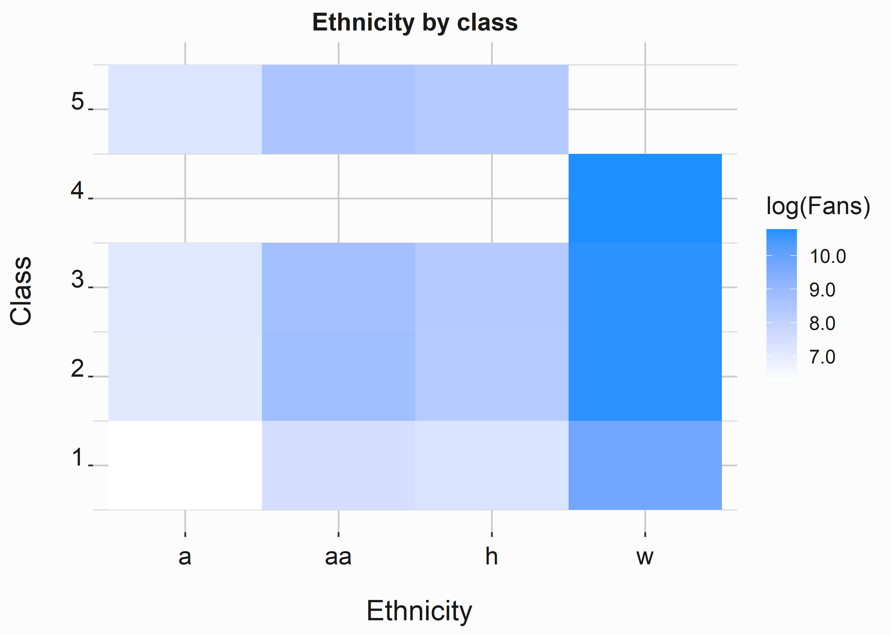
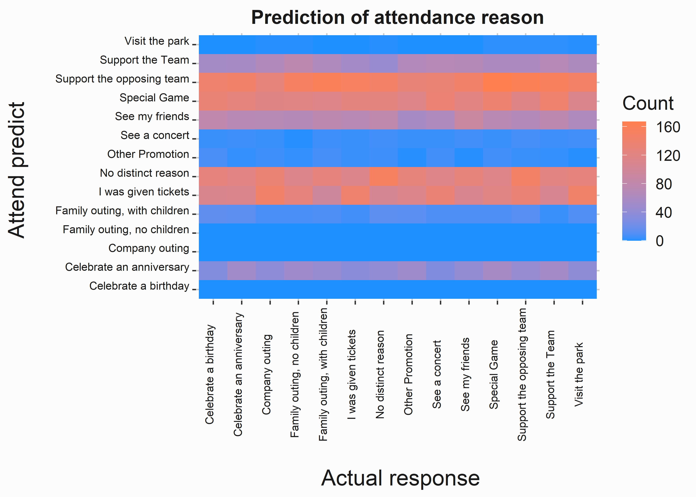
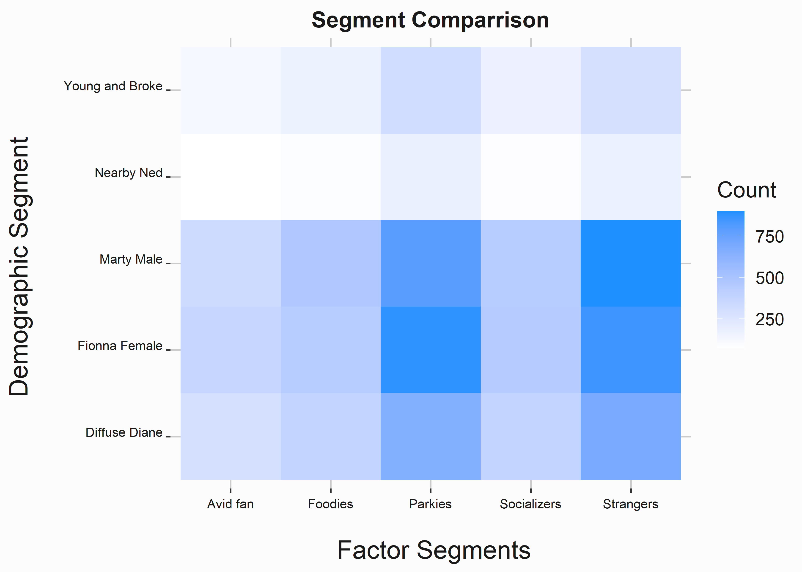
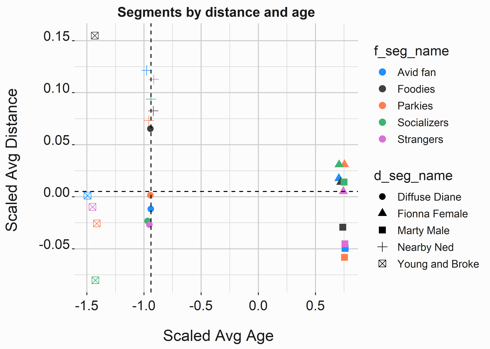

# Segmentation {#chapter5}


Appropriately segmenting your data takes a lot of work. It is challenging and complicated. While finding patterns in business data is usually trivial, these patterns may not be helpful. Often your patterns may only represent market structure rather than an exploitable feature. Additionally, it is improbable that you will have access to the rich data that massive data platforms such as Facebook, Google, or even your league will have. This means that you will be limited in some respects. Without partnerships, you can't even approach the concept of developing insight from data in the same way as many other companies. We'll cover a few ideas in this chapter, and it has two parts:

1. Preparing the data for analysis
2. Analyzing and interpreting the data

This is the spot where the book shifts to tacit examples. We will walk through fairly complete examples that include all the code necessary, explanations for output, and interpretation for deployment. We'll cover a few techniques in this chapter based on our simulated data from chapter \@ref(chapter2). There are several things to consider when starting a segmentation project. First, you'll want to ask yourself a few questions:

1. What am I trying to accomplish?
2. How will the output be consumed? 
3. Who will consume it?
4. What is the incremental value of this project? 

Number four is vital because you have limited time. Is there another area where you should be focusing? Segmentation may leverage many different machine-learning techniques. This chapter will cover a few of the techniques that we have found the most useful. Keep in mind that you aren't guaranteed to find something useful. Why not? There could be any reasons:

1. Your data is bad
2. You don't have enough data
3. Your technique is inappropriate
4. You framed the problem incorrectly
5. There isn't anything there

If you are working as a consultant, you will find something. You have to find something. If you are working at the club, I would keep the following statement in mind:

> The worst thing that can happen with a data-science project is that you think you found something and deploy a solution that isn't valid. 

You may not only be actively harming your organization but also reducing the credibility of analytics. It's OK if you can't find something. Scale can also be a problem. How much do you think the incremental value of your work is worth? Are models built around some consumer behavior going to maximize your ticket revenue potential?   

This chapter will cover building a segmentation scheme from raw data. These projects can become complex. We'll also look at a few different ways of accomplishing your goal. Perhaps you need a simple way to differentiate between two groups. You may need full-scale psychographic profiles. We'll cover the basics of how some of these products are delivered. You'll understand the root of how a segmentation scheme is produced in practice. While we only cover a portion of the variety, you'll be able to identify how a consultant would put together one of these frameworks and build your own.  

## Building a segmentation scheme

Our example will be based on demographic and qualitative data from a survey. Our goal is to leverage a simple scheme that does a reasonable job of explaining who purchases tickets and why they purchase them. While our groups are based on demographics (for discoverability), we are looking for exploitable differences in behavior. For this project to be successful, we need to follow four rules:

1. Understand the difference between __segments__ and __market structure__. Groups that do not differ in behavior may not be segments.
2. We must be able to distinguish segments and appeal to them selectively through products or channels. 
3. Validating these segments will require constant experimentation. We will have to be willing and capable of experimenting with this data.
4. Sales and Marketing leadership must support and remain involved with segmentation.  

Sometimes segmentation schemes can be too diffuse. For instance, people-with-necks would not be a helpful segment. That covers a large swath of humans. Other segmentation schemes can be irrelevant to the problem. If you sell dog food, women with red hair may not be a relevant segment. They can also be too diffuse and irrelevant. An example here might be people with brown eyes.

Our basic goal is to find groups of fans and potential customers that differ in observable ways associated with how we communicate, their content preferences, and marketing response. Generally, we are looking for an answer to the question: _Who is our consumer, and what do they want?_. By understanding these differences, we hope to make better strategic marketing decisions regarding pricing, market positioning, 
sales and sponsorship opportunities, and brand development. The analysis has two components:  

* A _demographic segmentation_ derived from data from a third party.
* A set of _behavioral archetypes_ derived from survey responses.

Our demographic segments are overlaid on our customer's behavioral archetypes to paint a picture of how each demographic broadly behaves. The more segments that we have, the more specific they will be. Abstracting to fewer segments means that the edges of our segments will tend to be _fuzzy_. Additionally, the durability of our segments will have to be tested to ensure validity. 

A segmentation project is successful if you can increase the probability of making correct decisions. It isn't a magic bullet and will not answer questions with certainty. For a sports club, there are special considerations. 

- You don't have unlimited scale potential
- Your sample sizes are going to be relatively small

You can't continuously deploy tests in the way TicTok does. These projects are ad hoc in nature. They are more useful for marketers to help understand market structure within the fan base. It allows for minor tweaks that help compound the effectiveness of multiple concurrent campaigns.

Ultimately, success should be judged based on creating testable hypotheses and using this information to alter the behavior of one or more of our segments. We could also define success more narrowly:

* Did we create the capability to measure some _return on marketing spend_ accurately?
* Were we able to increase sales revenue by increasing _conversion rates_?
* Are we able to better determine _product offerings_?
* Can we get more relevant results from surveys and other research projects?
    
Regardless of how we define success, segmentation should always be considered a work in progress. Segmentation cannot remain static and be successful. Instead, we must understand how to change our behavior to best suit our customers' expectations, channel capability, and purchase behavior to maximize our opportunity.


## Demographic segmentation

Demographic segmentation is attractive for many reasons. However, discoverability is the main reason. While it can be useful in certain circumstances, its use is also perilous. Steve Koonin (CEO of the Atlanta Hawks) famously stated the Alpharetta Unicorn couldn't save the franchise (referring to the Atlanta Hawks). The "Alpharetta Unicorn" is:

> __"the 55-year-old guy who's going to drive an hour from Alpharetta into the city with three buddies to go to the Hawks game. He doesn't exist. And there is no music, no kiss cam, no cheerleaders, no shooting for a free car, no bobbleheads ... nothing is going to change that."__ 
> 
>--- Steve Koonin


Alpharetta is a suburb of Atlanta that contrasts with much of Fulton County, GA, in that its citizens (as of 2021) tend to be less ethnically diverse (primarily white), more right-leaning politically (mostly Republican) and tend to be more homogeneously affluent. Being an outlying suburb, it is also geographically isolated.^[https://www.espn.com/nba/story/_/id/12080830/reselling-hawks-atlanta] Steve's response is loaded for several reasons. He says the Hawks brand is incompatible with their marketing tactics or product. He may have also been taking a shot at another in-market team. Either way, his _segment_ may or may not exist. It may be irrelevant to his specific situation, and this statement is a political stunt to justify the direction he decided to take sales and marketing. 

Let's begin by taking a look at a relatively simple data set. You will undoubtedly be confronted with much more complex data during your career, but in the context of sports, your data will likely be relatively straightforward and simple. Our data sample is in the FOSBAAS package and is entitled _demographic_data_.


```r
#-----------------------------------------------------------------
# Read data to use for segmentation
#-----------------------------------------------------------------
library(FOSBAAS)
demo_data  <- FOSBAAS::demographic_data
```

Let's begin by taking a look at the column names.


```r
#-----------------------------------------------------------------
# Take a look at the structure of the data
#-----------------------------------------------------------------
str(demo_data)
```


Table: (\#tab:segdatasetnames2)structure of demographic data set

|variable      |classe    |first_values                         |
|:-------------|:---------|:------------------------------------|
|custID        |character |MBT9G0X70NTI, QTR3JJJ5J6GJ           |
|nameF         |character |Philip, Evelyn                       |
|nameL         |character |Riddle, Campos                       |
|nameFull      |character |Philip Riddle, Evelyn Campos         |
|gender        |character |m, f                                 |
|age           |double    |55, 30                               |
|latitude      |double    |36.0491208455478, 37.1248221175549   |
|longitude     |double    |-86.0860894506936, -86.0744325353366 |
|distance      |double    |48.34, 77.09                         |
|maritalStatus |character |m, s                                 |
|ethnicity     |character |w, w                                 |
|children      |character |y, n                                 |
|hhIncome      |double    |2866, 552                            |
|county        |character |tennessee,wilson, kentucky,edmonson  |


This table has 200,000 rows and 12 columns corresponding to standard demographic features. Latitude and longitude have already been processed into a distance metric. We'll pare this data down to the information we think might be helpful to processing. 

### Exploring the demographic data set

We can sample the variables we think might be helpful for segmentation using the `select` function from `dplyr.` 


```r
#-----------------------------------------------------------------
# subset the data
#-----------------------------------------------------------------
library(dplyr)
demo_data <- demo_data %>% select(custID,ethnicity,age,
                                  maritalStatus,children,
                                  hhIncome,distance,gender)
```

Looking at the first few lines of data, we can see that we have a mixture of discrete data, such as ethnicity, and continuous data, such as age. This is relevant to how you process the data and which algorithm you might use. 


Table: (\#tab:seg_dataset_str2)Demograhic data

|variable     |classe   |first_values              |
|:------------|:--------|:-------------------------|
|custID       |character|MBT9G0X70NTI, QTR3JJJ5J6GJ|
|ethnicity    |character|w, w                      |
|age          |double   |55, 30                    |
|maritalStatus|character|m, s                      |
|children     |character|y, n                      |
|hhIncome     |double   |2866, 552                 |
|distance     |double   |48.34, 77.09              |
|gender       |character|m, f                      |

`hhIncome` is a modeled indicator. It is common to run into this variable type with purchased data sets. It is indexed at some value and has a discrete beginning and end. You'd need a data dictionary to explain what the numbers mean. In this case, the larger the number, the higher the income. Let's start by taking a look at our numerical data sets. We'll use the same graphics paradigm illustrated in chapter \@ref(chapter3). 

#### Age of our customers

We'll begin with some exploratory data analysis. But first, let's build a histogram with the categorical variable _gender_ to differentiate between the two groups.


```r
#-----------------------------------------------------------------
# Histogram of the age of fans
#-----------------------------------------------------------------
x_label  <- ('\n Age')
y_label  <- ('Count \n')
title    <- ('Distribution of age (demographic)')
hist_age <- 
  ggplot2::ggplot(data=demo_data,aes(x=age,fill=gender))  +
  geom_histogram(binwidth = 2)                            +
  scale_fill_manual(values = palette)                     +
  geom_rug(color = 'coral')                               +
  scale_x_continuous(label = scales::comma)               +
  scale_y_continuous(label = scales::comma)               +
  xlab(x_label)                                           + 
  ylab(y_label)                                           + 
  ggtitle(title)                                          +
  graphics_theme_1

```


This distribution is bimodal^[A distribution with two or more modes: multimodal]. As we describe the data, we know an average age doesn't make much sense. We included gender to see if there were any obvious differences between men and women in the sample. Let's take a closer look using the `describe` function from the `psych` package[@R-psych].:


```r
#-----------------------------------------------------------------
# Get summary statistics
#-----------------------------------------------------------------
library(psych)
descript   <- psych::describe(demo_data$age)
descriptMF <- psych::describeBy(demo_data$age,demo_data$gender)
```


Table: (\#tab:demographicsagedescription2a)Males vs. Females

|variable|value                 |
|:-------|:---------------------|
|vars    |1, NA                 |
|n       |2e+05, NA             |
|mean    |42.80677, NA          |
|sd      |12.4664561616261, NA  |
|median  |46, NA                |
|trimmed |42.89526875, NA       |
|mad     |16.3086, NA           |
|min     |13, NA                |
|max     |79, NA                |
|range   |66, NA                |
|skew    |-0.131120256604631, NA|
|kurtosis|-1.34730877799027, NA |
|se      |0.0278758434159171, NA|
  

We can tell that the distribution skews older (mean 42.82 vs. median 46). Let's also see if there are any significant differences between the women in the sample.


Table: (\#tab:demographicsagedescription2aby)Descriptive statistics

|variable  |female            |male              |
|:---------|:-----------------|:-----------------|
|f.vars    |1                 |1                 |
|f.n       |99925             |100075            |
|f.mean    |42.7977082812109  |42.8158181363977  |
|f.sd      |12.4716960187927  |12.4612776974085  |
|f.median  |46                |46                |
|f.trimmed |42.8875170438198  |42.9029864728145  |
|f.mad     |16.3086           |16.3086           |
|f.min     |13                |13                |
|f.max     |79                |76                |
|f.range   |66                |63                |
|f.skew    |-0.129498978758542|-0.132737695388044|
|f.kurtosis|-1.35002276019439 |-1.34461956820989 |
|f.se      |0.0394537636411379|0.0393912511291551|

As we can see, the numbers are almost identical. This is because men and women tend to be about the same age. 


#### Distance from facility

Distance is another interesting numerical data set. Again, distance could be significant depending on how we think about our product. For example, who is more likely to purchase a season ticket, someone five miles from the venue or five hundred? The answer is that it depends, but as a general rule, season ticket holders live closer to venues. 


```r
#-----------------------------------------------------------------
# Distance from our facility
#-----------------------------------------------------------------
library(ggplot2)
x_label   <- ('\n Distance')
y_label   <- ('Count \n')
title     <- ('Distribution of distance (demographic)')
hist_dist <- 
  ggplot2::ggplot(data=demo_data,aes(x=distance))            +
  geom_histogram(binwidth = 2,fill='dodgerblue')             +
  geom_rug(color = 'coral')                                  +
  scale_x_continuous(label = scales::comma)                  +
  scale_y_continuous(label = scales::comma)                  +
  xlab(x_label)                                              + 
  ylab(y_label)                                              + 
  ggtitle(title)                                             +
  graphics_theme_1

```


This distribution is also bimodal. Why? The sample may have more season ticket holders as a percentage of the group. Is there another major city around two-hundred miles away? Patterns like this show up when you are looking at ticket sales. It is simply more accessible for people nearby to purchase and utilize tickets. You could never imagine a ballpark or stadium in a rural area. Distance is a significant variable in models. Be careful of how you treat it. Are you measuring the distance for purchasers? Each ticket? Are you differentiating between fans and companies? 


```r
#-----------------------------------------------------------------
# Use the psych package to generate summary statistics
#-----------------------------------------------------------------
descript <- psych::describe(demo_data$distance)
```

Looking at the data, we can see the skew in the numbers. For example, the median distance is 66.47 miles, and the mean distance is over 110 miles. These datasets can be problematic for regression but may work in our favor in terms of identifying market structure. It can also be helpful for thinking about different marketing tactics such as OOH^[Out of Home. Think signage].


Table: (\#tab:demographicsdistancedescriptiona)Descriptive statistics distance

|variable|calues             |
|:-------|:------------------|
|vars    |1                  |
|n       |2e+05              |
|mean    |110.1194244        |
|sd      |92.1463189574666   |
|median  |66.47              |
|trimmed |99.381923375       |
|mad     |67.08765           |
|min     |0.05               |
|max     |543.23             |
|range   |543.18             |
|skew    |0.895830211498572  |
|kurtosis|-0.0936393439147278|
|se      |0.206045433065273  |

The distribution of distance is much different than age. The median is significantly smaller than the mean, which indicates a left skew to the distribution.

#### Household income

Household income is another continuous data set. It is also modeled, which means it is likely scaled in some fashion. This distribution is multimodal, with several peaks. 


```r
#-----------------------------------------------------------------
# Histogram of income
#-----------------------------------------------------------------
x_label  <- ('\n Household Income')
y_label  <- ('Count \n')
title    <- ('Distribution of Income (demographic)')
hist_income <- 
  ggplot2::ggplot(data=demo_data,aes(x=hhIncome)) +
  geom_histogram(binwidth = 2,fill='dodgerblue')  +
  geom_rug(color = 'coral')                       +
  scale_x_continuous(label = scales::comma)       +
  scale_y_continuous(label = scales::comma)       +
  xlab(x_label)                                   + 
  ylab(y_label)                                   + 
  ggtitle(title)                                  +
  graphics_theme_1

```


This is where some analysis is essential. Ultimately, we seek behavioral differences to attribute to different features related to a discoverable group of individuals. We'll touch on this when we begin to process the data for quantitative analysis. We don't currently have a reason to believe there is any difference between how a person behaves based on income. However, we can probably make some guesses that may or may not have merit concerning our data.


```r
#-----------------------------------------------------------------
# summary statistics of hhincome
#-----------------------------------------------------------------
description <- psych::describe(demo_data$hhIncome)
```


Table: (\#tab:demographicsincomedescriptionA)Descriptive statistics income

|variable|calues            |
|:-------|:-----------------|
|vars    |1                 |
|n       |2e+05             |
|mean    |2020.089345       |
|sd      |925.696888455458  |
|median  |2153              |
|trimmed |2046.65716875     |
|mad     |1125.2934         |
|min     |279               |
|max     |4245              |
|range   |3966              |
|skew    |-0.217211029101283|
|kurtosis|-1.20496002863362 |
|se      |2.06992116914645  |

There are clear clusters of groups in this data. Think critically about this one. Does a higher household income mean more disposable income? In some cases, yes, but in some cases, no. Are there any implicit signs of disposable income that we could use? Perhaps luxury cars or pool ownership. Up to a point, people may tend to spend most of their income. People who make more money tend to buy nicer cars or bigger houses. While asset investments like houses may increase wealth, they may not indicate more disposable income. Have you ever visited someone's fabulous home and noticed how cheap the furniture was? 

#### Consololidating the numerical analysis

You can get all these numbers at once with some manipulation. In this case, we aren't looking for anomalous data such as NAs or missing data. 


```r
#-----------------------------------------------------------------
# Generate summary stats of multiple values
#-----------------------------------------------------------------
numerical_cols <- names(dplyr::select_if(demo_data, is.numeric))
description    <- psych::describe(demo_data[numerical_cols])
```


Table: (\#tab:demographicsconsolidatedA)Consolidated statistics

|variable|age               |income            |distance           |
|:-------|:-----------------|:-----------------|:------------------|
|vars    |1                 |2                 |3                  |
|n       |2e+05             |2e+05             |2e+05              |
|mean    |42.80677          |2020.089345       |110.1194244        |
|sd      |12.4664561616261  |925.696888455458  |92.1463189574666   |
|median  |46                |2153              |66.47              |
|trimmed |42.89526875       |2046.65716875     |99.381923375       |
|mad     |16.3086           |1125.2934         |67.08765           |
|min     |13                |279               |0.05               |
|max     |79                |4245              |543.23             |
|range   |66                |3966              |543.18             |
|skew    |-0.131120256604631|-0.217211029101283|0.895830211498572  |
|kurtosis|-1.34730877799027 |-1.20496002863362 |-0.0936393439147278|
|se      |0.0278758434159171|2.06992116914645  |0.206045433065273  |


As a best practice, don't do things multiple times. For example, if you can think of a way that you would like to view your data, somebody else has probably thought about it and solved the problem. 

#### Categorical variables

There are myriad ways to analyze categorical data. We'll go through a few methods and describe what we are seeing. First, we can create a proportion table with the `prop.table` function to determine our discrete groups' size. 


```r
#-----------------------------------------------------------------
# build a proportion table for categorical data
#-----------------------------------------------------------------
description      <- table(demo_data$ethnicity)
description_prop <- prop.table(description)
```

In this case, white fans represent about 80% of our sample, African Americans represent about 10%, with Hispanics and Asians representing another 10%. 


Table: (\#tab:demographicsethnicitya)Ethnicity proportions

|Var1|  Freq  |
|:--:|:------:|
| a  |0.023595|
| aa |0.104025|
| h  |0.071325|
| w  |0.801055|

Analyzing ethnicity is fraught with difficulty. What does it mean? How do you identify and differentiate Hispanics? It seems nonsensical. Folks can _get wrapped-around-the-axle_ here. Sponsors, the media, internal HR staff, local governments, everyone gets concerned about ethnicity and what it means or doesn't mean in terms of attendance. It is a loaded word. The analyst can make it worse. Let's consider a joke I heard. I don't know who to attribute it to:

> An algorithm walks into a bar, and the bartender says, "what will you have?" The algorithm looks around and says, "I'll have what everyone else is having."

You are likely to find exactly what you expect to see here. So, why does ethnicity matter? Perhaps it doesn't as a point estimate. Longitudinally you can think of applications. Is it meaningful that ticket buyers tend to live nearby, and most identify with a particular ethnicity? What does this mean in five or ten years as an area grows?

It is also typically useful to look at crosstabs of the data. For example, let's compare African Americans to white fans.


```r
#-----------------------------------------------------------------
# use describeBy to generate statistics tabulated by a factor
#-----------------------------------------------------------------
numerical_cols <- names(dplyr::select_if(demo_data, is.numeric))
description    <- psych::describeBy(demo_data[numerical_cols], 
                                    demo_data$ethnicity)
deth <- rbind(description$aa[,c(2,3,4,5,6)], 
              description$w[,c(2,3,4,5,6)])
```


Table: (\#tab:demographicsethnicityC)Ethnicity proportions

|         |  n   |   mean   |   sd    |median | trimmed  |
|:--------|:----:|:--------:|:-------:|:-----:|:--------:|
|age      |20805 | 44.39976 |12.12386 | 48.00 | 44.78114 |
|hhIncome |20805 |2088.84581|915.51600|2279.00|2129.14028|
|distance |20805 |118.66955 |91.97917 | 77.62 |109.10382 |
|age1     |160211| 42.60530 |12.50088 | 46.00 | 42.65204 |
|hhIncome1|160211|2011.05849|926.59481|2135.00|2035.75179|
|distance1|160211|109.14702 |92.14637 | 65.32 | 98.26498 |

When comparing these groups, most numbers are relatively close. We can also make some generalizations. 

1. Many more of our fans tend to be white. Is this congruent with population patterns?
2. Wealth factors seem to be similar
3. Whites tend to be slightly younger and live closer to the park

We can leverage this analysis to see if we are over or under-indexing within some populations (assuming that has any merit). Do these factors explain purchases? Now that we have done a cursory analysis of the data, we can begin processing it for modeling. Never overlook analyzing each factor in your data set individually. Understanding the data structure could be extremely useful as you work through the rest of your analysis.  

### Preparing the data for modeling 

Unfortunately, you'll spend a lot of time prepping data so that you can operate on it. We'll discuss some of your major problems and what you can do about them. There are several that you will be confronted with frequently:

- Missing data (NA,NAN,Inf)
- Sparse data

We'll briefly touch on imputation and give some thoughts on when it's appropriate. Imputation is an enormous subject that is far outside of the scope of this book.

### Dealing with missing data

Missing data is almost always a problem, and there are a few different ways in which it can be handled. One consideration is why the data is missing. The reasons why data is missing can bias the results of your analysis. Bias is a frequent problem with surveys. For instance, the survey is long, and people only tend to finish a portion. This data is "not missing completely at random." This is a technical term, and while there are ways to deal with it, we don't have to worry about it here. Just be aware of these issues.

Imputing data (dealing with missing data) can be incredibly complex. First, you need to understand how much of your data is missing. Several packages deal with missing data. You can also write a simple function to help you identify the common culprits. Let's take a look at our data to see if it is missing anything. 


```r
#-----------------------------------------------------------------
# Write a function to generate stats on missing data
#-----------------------------------------------------------------
f_missing_data <- function(dF){

na  <- sum(apply(dF,2,function(x) is.na(x)))
nan <- sum(apply(dF,2,function(x) is.nan(x)))
inf <- sum(apply(dF,2,function(x) is.infinite(x)))

missing        <- as.data.frame(rbind(na,nan,inf))
names(missing) <- 'Values'
return(missing)
}

missing <- f_missing_data(demo_data)
```


Table: (\#tab:missingdatab)Missing values

|   |Values|
|:--|:----:|
|na |  0   |
|nan|  0   |
|inf|  0   |

Nothing is missing! That isn't surprising since I created this data set. Let's introduce some missing data to explore this vital subject. We will randomly assign cells to NA based on a random number generated for each cell in the dataframe.


```r
#-----------------------------------------------------------------
# Randomly make some values in the dataframe NA
#-----------------------------------------------------------------
set.seed(755)
demo_data[] <- 
apply(demo_data,1:2, function(x) ifelse(runif(1,0,1) > .98,NA,x))
```

This function randomly makes 2% of fields NA.


Now we can apply our simple function to determine if there are missing values. We were successful.


Table: (\#tab:missingdatae)New missing values

|   |Values|
|:--|:----:|
|na |32211 |
|nan|  0   |
|inf|  0   |


Now we need to do something about these missing values. If only a small amount of data is missing, it may be OK to delete the rows. How much is a small amount? I don't know. Let's look at this by row to determine which values are missing. We'll use a simple `for` loop to count the missing fields in each row and column. There are a few different ways to do this. 


```r
#-----------------------------------------------------------------
# Print the number of missing values for each column
#-----------------------------------------------------------------
for(i in names(demo_data)){
  print(paste(sum(is.na(demo_data[,i])),names(demo_data[i])))
}
#> [1] "3973 custID"
#> [1] "3997 ethnicity"
#> [1] "4042 age"
#> [1] "4111 maritalStatus"
#> [1] "4021 children"
#> [1] "3993 hhIncome"
#> [1] "4044 distance"
#> [1] "4030 gender"
# You can get the same data with this statement:

# sapply(1:length(names(demo_data)), function(x)
#        paste(sum(is.na(demo_data[,x])),names(demo_data[x])))

# A best practice is to use apply functions in R when possible
```


About four-thousand entries are missing for each attribute. Since we know these could overlap, it may not be a great idea to delete all these rows. How many rows have some missing data? We can use the complete cases function to determine how many rows represent complete cases. 


```r
#-----------------------------------------------------------------
# Only keep rows with no NAs in any column
#-----------------------------------------------------------------
complete_cases <- nrow(demo_data[complete.cases(demo_data),])
```


```r
knitr::kable(nrow(demo_data[complete.cases(demo_data),]),caption = 'Complete cases',
             align = 'c',format = "markdown",padding = 0)
```


Table: (\#tab:missingdatafff)Complete cases

|  x   |
|:----:|
|169903|

About thirty thousand rows are missing some data. That is more than enough to build a suitable model. How do we know? There are no hard and fast rules. If you sampled 10,000 rows of this data, the distributions for each field would likely look the same as the complete data set. That is really what you are looking for. This will be the case until you reach some arbitrarily small number (perhaps 400-700 people). Some people call this the _law of large numbers_. This is just an expression. There is no such law. However, this is where you might think about why the data is missing. More data is typically better, but you get penalized on process time.

Let's try a couple of different techniques to impute the missing data. For _ethnicity_, we know that the vast majority (80%) of our known values were "w." Therefore, we can replace all `NAs` with a "w" and assume we will be close to 80% accurate. This is easy to accomplish with the following code.


```r
#-----------------------------------------------------------------
# Simple imputation. Make any NAs 'w'
#-----------------------------------------------------------------
demo_data$ethnicity[is.na(demo_data$ethnicity)] <- 'w'
```


Age will be a little trickier. We know that the distribution is multimodal. Taking the most common value might be reasonable. However, we could also take the mean or median. Additionally, some factors within the data set, such as _children_ and _income_, may help predict age with some degree of accuracy. Which technique is best? We don't know. However, this only represents about two percent of all entries. If we choose a suboptimal path, the damage will be minimal. In our case, we will be lazy and use the mean age.


```r
#-----------------------------------------------------------------
# Make any missing age values the mean of the overall age
#-----------------------------------------------------------------
mA <- 
  round(mean(as.numeric(as.character(na.omit(demo_data$age)))),0)
demo_data$age[is.na(demo_data$age)] <- mA
```

Using averages is interesting because if you looked at the entire data set, you would find that very few know individuals are the average age. This is a known issue when designing everything from airplane cockpits to gloves. We could also simulate the distribution and randomly assign values from that distribution. However, that technique also has issues. Once again, just be aware of what you are doing and think critically about it. If you can reasonably justify an approach, it is good enough. 

We know that about 58% of our fans are married. How should we approach this one? Is the pattern for marriage random? Assuming that the individual is married 58% of the time if we randomly pick one, will that be more accurate than simply saying everyone is married? We can't tell here. We could pull out Bayes' theorem and devise various ways to estimate the likelihood that a person is married. Since we only deal with 2% of our data, we will use simple imputation of random guesses with a discrete probability.


```r
#-----------------------------------------------------------------
# Impute values based on a proportion
#-----------------------------------------------------------------
l <- 
  length(demo_data$maritalStatus[is.na(demo_data$maritalStatus)])
demo_data$maritalStatus[is.na(demo_data$maritalStatus)] <- 
  sample(c('m','s'), size=l, prob=c(.6,.4), replace=TRUE)
```

We have imputed three variables and can see how tedious of an exercise this can be. However, several packages can help automate some of these tasks. 


Table: (\#tab:missingdatagd)Customer data set

|   custID   |ethnicity|age|maritalStatus|children|hhIncome|
|:----------:|:-------:|:-:|:-----------:|:------:|:------:|
|MBT9G0X70NTI|    w    |55 |      m      |   y    |  2866  |
|     NA     |    w    |30 |      s      |   n    |  552   |
|HOMV3XQW32LW|    w    |30 |      s      |   n    |  2274  |
|RJ7CCATUH4Q1|    w    |29 |      s      |   n    |  1773  |
|9GZT5Z5AOMKV|    w    |48 |      m      |   n    |  1951  |
|S0Y0Y2454IU2|    w    |49 |      m      |   y    |  3244  |

We can approach _children_ and _gender_ in much the same way as our other categorical data. 


```r
#-----------------------------------------------------------------
# Impute remaining values based on a proportion
#-----------------------------------------------------------------
#prop.table(table(demo_data$children))
#prop.table(table(demo_data$gender))

l <- length(demo_data$children[is.na(demo_data$children)])
demo_data$children[is.na(demo_data$children)] <- 
sample(c('n','y'), size=l, prob=c(.52,.48), replace=TRUE)

l <- length(demo_data$gender[is.na(demo_data$gender)])
demo_data$gender[is.na(demo_data$gender)] <- 
sample(c('m','f'), size=l, prob=c(.5,.5), replace=TRUE)

```


Let's take a slightly different approach to the rest of the data. For Customer Ids that are missing, we are going to delete the rows. There are few, and they need to be able to link our segment constituents to an individual to have more utility. In addition, we want to be able to compare these demographic attributes to actual behaviors.  

##### Imputating with a package

There are several packages for imputing numerical data. One of the more commonly used ones is `mice` [@R-mice]. It is easy to use and works relatively quickly on smaller datasets. Several parameters can be adjusted in the `mice` function. See the documentation to explain what they indicate. For instance, we used _predictive mean matching_ as the method. However, there are more than a dozen options here. Some may be more appropriate than others under specific conditions.  


```r
#-----------------------------------------------------------------
# Impute numerical values using the mice package
#-----------------------------------------------------------------
library(mice)
demo_data$distance <- as.numeric(demo_data$distance)
imp_frame          <- as.data.frame(cbind(demo_data$hhIncome,
                           demo_data$distance))
imp_frame[]        <- apply(imp_frame,2,function(x) as.numeric(x))

imputed_Data       <- mice(imp_frame, m=5, maxit = 10,
                           method = 'pmm', seed = 755,
                           printFlag = F)
new_Data           <- complete(imputed_Data,2)
demo_data$hhIncome <- new_Data$V1
demo_data$distance <- new_Data$V2
```

Let's go ahead and delete rows where the customerid is missing. Use `na.omit` to greedily remove all rows where any column is `NA .` You can be more subtle, but `na.omit` will get the job done in this case. 


Now we can run our function to look for missing values again. 


Table: (\#tab:missingdatalasta)New missing values

|   |Values|
|:--|:----:|
|na |  0   |
|nan|  0   |
|inf|  0   |

Perfect. While you are not an expert on imputation, you now get the gist. Correcting your data for missing values is a tedious and critical component of these exercises. There doesn't tend to be one best way, and your methods are often judgment calls. For example, if 40% of your data is missing, do you perform a similar exercise to what we just saw? It may depend on why the data is missing. The point here is to think about what you are doing in the context of your goal. 

#### Discretizing our numerical variables 

Many operations (such as _latent class regression_) require discreet data. There is some art to this part of the exercise. However, there are several ways to approach it. We'll do it in a couple of different ways. We'll start by creating a couple of other appropriate data structures for our segmentation methods. 

Let's begin by creating a new data frame to work with. We'll use data frames and tibbles interchangeably. We have yet to speak about tibbles. Tibbles are a Wickham construct for working in the tidyverse. They functionally act like data frames but have some features that generally make them a little friendlier to work with. However, specific legacy packages require data frames. This is one of the peculiarities of R that you won't find in Python. This can also be frustrating.


```r
#-----------------------------------------------------------------
# Create a new dataframe to work with
#-----------------------------------------------------------------
demo_data_discrete <- tibble(custID = demo_data$custID)
```


#### Dummy coding our categorical variables

You must treat Categorical variables in a particular way for them to be useful in many segmentation exercises. To begin, we need to discretize our numerical variables. We'll do this with a function that we apply over numerical data sets. The following function represents a choice you'll have to make. How do we determine where and how to break our continuous data into discrete groups? In this case, we use familiar generational marketing groups. The package `lubridate` [@R-lubridate] is used to make working with dates easier. Dates can be incredibly frustrating and, along with _regular expressions_^[https://en.wikipedia.org/wiki/Regular_expression], are among the most reviled parts of working with data. 


```r
#-----------------------------------------------------------------
# Calculate birth year and assign it to a generation
#-----------------------------------------------------------------
library(lubridate)
birthYear <- lubridate::year(Sys.Date()) - 
             as.numeric(demo_data$age)

f_seg_generation_def <- function(birth_year){
  
  if(birth_year >= 1910 & birth_year <= 1924){'gen_Greatest'}
   else if (birth_year >= 1925 & birth_year <= 1945){'gen_Silent'}
    else if (birth_year >= 1946 & birth_year <= 1964){'gen_Boomer'}    
     else if (birth_year >= 1965 & birth_year <= 1979){'gen_X'}     
      else if (birth_year >= 1980 & birth_year <= 1994){'gen_Mill'}       
       else if (birth_year >= 1995 & birth_year <= 2012){'gen_Y'}    
        else if (birth_year >= 2013 & birth_year <= 2020){'gen_Alpha'}      
         else{'Unknown'}
}
demo_data_discrete$generation <- 
  sapply(birthYear,f_seg_generation_def)
```

Programmers thrive on criticizing this sort of function. There are often algorithmic methods for simplifying this sort of operation. The `switch` function can sometimes be used in R and other languages. Who cares if you aren't dealing with massive data sets? This is readable and will get the job done. SQL joins are more efficient than an if-then statement, which is generally a good direction to begin with larger data sets.  

I prefer to have an individual's birth year over age. It helps keep the data evergreen. Keep this in mind when you build surveys. Now we have a discrete value representing specific generations. 

Distance represents another nuanced problem. How do we select where to create the breaks? Distance can often be approximated using zip code centroids and the Haversine ^[https://en.wikipedia.org/wiki/Haversine_formula] formula. You can also use Google's APIs to calculate the latitude and longitude based on the address and then estimate drive time. This could be important for certain urban or suburban areas. 

In our case, we have already calculated the distance. We'll use quantiles to place 60% of our customers in one of four buckets. 


```r
#-----------------------------------------------------------------
# Assign a discrete value to distance
#-----------------------------------------------------------------
quantile_list <- quantile(demo_data$distance,
                          probs = c(.1,.2,.3,.4,.5,.6,.7,.8,.9))

f_seg_dist_def <- function(dist,q){
  
  if(dist <= 30.67){'dist_Primary'}
    else if (dist > 30.67 & dist <= 51.23){'dist_Secondary'}
      else if (dist > 41.23 & dist <= 106.07){'dist_Tertiary'}    
        else{'dist_Quaternary'}        
}

demo_data_discrete$marketLoc <- 
  sapply(demo_data$distance,f_seg_dist_def)
```

We can discretize household income in the same way. In this case, we'll only use three buckets. Remember that the more categories you have, the more columns you will have in your final data set. It can be problematic if you get too many. 


```r
#-----------------------------------------------------------------
# Assign a discrete value to Household Income
#-----------------------------------------------------------------
hhIncomeQuantiles <- quantile(demo_data$hhIncome,
                              probs = c(.25,.75))

f_seg_hhInc_def <- function(hhInc, quant = hhIncomeQuantiles){
  
  if(hhInc <= hhIncomeQuantiles[[1]]){"income_low"}
    else if(hhInc >= hhIncomeQuantiles[[2]]){"income_high"}
      else{"income_med"}
}

demo_data_discrete$income <-
  sapply(demo_data$hhIncome,f_seg_hhInc_def)
```


Finally, we'll add these variables to our dataframe.


```r
#-----------------------------------------------------------------
# Add columns to demo_data
#-----------------------------------------------------------------
demo_data_discrete <- demo_data_discrete    %>% 
  mutate(ethnicity = demo_data$ethnicity,
         married   = demo_data$maritalStatus,
         gender    = demo_data$gender)
```


Table: (\#tab:discretizeaddtoframeheadzz)discretized data

|   custID   |generation|  marketLoc   |  income   |ethnicity|married|
|:----------:|:--------:|:------------:|:---------:|:-------:|:-----:|
|MBT9G0X70NTI|  gen_X   |dist_Secondary|income_high|    w    |   m   |
|HOMV3XQW32LW| gen_Mill |dist_Secondary|income_med |    w    |   s   |
|RJ7CCATUH4Q1| gen_Mill |dist_Tertiary |income_med |    w    |   s   |
|9GZT5Z5AOMKV|  gen_X   | dist_Primary |income_med |    w    |   m   |
|S0Y0Y2454IU2|  gen_X   |dist_Tertiary |income_high|    w    |   m   |
|YOZ51B6A2QMB|  gen_Y   |dist_Secondary|income_med |    h    |   s   |


Now that we have all discrete variables, we can take our preparation a step further and dummy-code our variables. Once again, there are several ways to do this. The psych package has a function that I use. This is another frustrating thing about R. In Python, you must implement your encoder to do this the same way every time. 


```r
#-----------------------------------------------------------------
# Dummy code (One Hot encoding) for model consumption
#-----------------------------------------------------------------
dummy_coded_vars <- 
  apply(demo_data_discrete[,2:7],2, 
        function(x) psych::dummy.code(factor(x)))

mod_data_discrete <- 
  cbind.data.frame(dummy_coded_vars[1:length(dummy_coded_vars)])

row.names(mod_data_discrete) <- demo_data_discrete$custID
```


Table: (\#tab:moddatahead)Dummy coded data

|            |generation.gen_X|generation.gen_Mill|generation.gen_Y|
|:-----------|:--------------:|:-----------------:|:--------------:|
|MBT9G0X70NTI|       1        |         0         |       0        |
|HOMV3XQW32LW|       0        |         1         |       0        |
|RJ7CCATUH4Q1|       0        |         1         |       0        |
|9GZT5Z5AOMKV|       1        |         0         |       0        |
|S0Y0Y2454IU2|       1        |         0         |       0        |
|YOZ51B6A2QMB|       0        |         0         |       1        |


Now we have a dataframe that consists of only categorical data; we'll create one with mixed numerical and dummy-coded categorical data.


```r
#-----------------------------------------------------------------
# Combine data frames
#-----------------------------------------------------------------
mod_data_numeric <- demo_data[,c('age','distance','hhIncome')]
mod_data_numeric <- cbind.data.frame(mod_data_numeric,
                                     mod_data_discrete[,13:20]) 
```


Table: (\#tab:moddatanumerichead)Combined data frame

|            |age|distance|hhIncome|ethnicity.w|ethnicity.aa|
|:-----------|:-:|:------:|:------:|:---------:|:----------:|
|MBT9G0X70NTI|55 | 48.34  |  2866  |     1     |     0      |
|HOMV3XQW32LW|30 | 46.72  |  2274  |     1     |     0      |
|RJ7CCATUH4Q1|29 | 65.45  |  1773  |     1     |     0      |
|9GZT5Z5AOMKV|48 | 19.28  |  1951  |     1     |     0      |
|S0Y0Y2454IU2|49 | 69.20  |  3244  |     1     |     0      |
|YOZ51B6A2QMB|28 | 31.13  |  1638  |     0     |     0      |

Our new dataframe mixes our discrete and continuous variables in a format consumable by a wide array of machine learning tools. Each column is numeric. We could take this even further, but this example will work for now.

### Hierarchical clustering

Hierarchical clustering is seductive because its results are so easily illustrated. However, the drawback here is that this technique may tell you what you already know for simple models. A more precise explanation would be, "The constraint that the structure is hierarchical corresponds to the fact that, although subsets can include one another, they cannot intersect." [@Witten2011] This technique could also be problematic for larger data sets. 

Let's take a look at an example. We'll have to start by creating a dissimilarity matrix.  


```r
#-----------------------------------------------------------------
# Prepared data for hierarchical clustering
#-----------------------------------------------------------------
library(dplyr)
library(cluster)
set.seed(755)
mod_data_samp     <- mod_data_numeric %>% dplyr::sample_n(25)
mod_data_samp$age <- as.numeric(mod_data_samp$age)
# Create a dissimilarity matrix
mod_dist <- cluster::daisy(mod_data_samp)
```


We can now use this dissimilarity matrix to cluster our data. Keep in mind that dissimilarity matrices get large fast. Take a look at it, and you will understand why. This is often why sampling data to approximate large data sets is vital. Most big data problems are simply small data problems in disguise. In this case, we only tested twenty-five individuals.


```r
#-----------------------------------------------------------------
# Apply the hierarchical clustering method
#-----------------------------------------------------------------
mod_HC <- stats::hclust(mod_dist, method = "centroid")
```


```r
#-----------------------------------------------------------------
# Apply the hierarchical clustering method
#-----------------------------------------------------------------
plot(mod_HC)
```


Several groups of fans tend to cluster together. However, the cuts can happen in predictable ways using this technique. This is a byproduct of the categorical data. 

### Latent class regression

Latent class regression is a powerful technique that produces durable clusters. However, it leverages discrete data, so continuous data must be discredited and dummy-coded before use. While we've already dummy-coded our data, we'll have to process it again so that the LCR function accepts it. This is another of the quirks of R. It allows this to happen. In this case, we'll make the zeros = 2. We can do this with an `apply` function and a simple `ifelse` function. 


```r
#-----------------------------------------------------------------
# Latent Class regression
#-----------------------------------------------------------------
mod_data_LC   <- mod_data_discrete
mod_data_LC[] <- apply(mod_data_discrete, 2, 
                       function(x) ifelse(x == 1 ,1 ,2))
```


Table: (\#tab:lcr22)Data coded for LCR function

|            |generation.gen_X|generation.gen_Mill|generation.gen_Y|
|:-----------|:--------------:|:-----------------:|:--------------:|
|MBT9G0X70NTI|       1        |         2         |       2        |
|HOMV3XQW32LW|       2        |         1         |       2        |
|RJ7CCATUH4Q1|       2        |         1         |       2        |
|9GZT5Z5AOMKV|       1        |         2         |       2        |
|S0Y0Y2454IU2|       1        |         2         |       2        |
|YOZ51B6A2QMB|       2        |         2         |       1        |


A helpful trick is to simplify the function that feeds the clustering function. It will make the function easier to read as you add parameters.


```r
#-----------------------------------------------------------------
# Latent Class regression formula
#-----------------------------------------------------------------
format  <- paste(names(mod_data_LC), collapse = ",")
formula <- 
  with(mod_data_LC,
       cbind(generation.gen_X,generation.gen_Mill,
             generation.gen_Boomer,generation.gen_Y,
             generation.gen_Silent,marketLoc.dist_Quaternary,
             marketLoc.dist_Tertiary,marketLoc.dist_Secondary,
             marketLoc.dist_Primary,income.income_med,
             income.income_low,income.income_high,
             ethnicity.w,ethnicity.aa,ethnicity.h,
             ethnicity.a,married.m,married.s,gender.f,
             gender.m)~1)
```


We are going to choose five classes to include in this data. While there are formal methods for determining the number of classes to include, remember that you will probably have to abstract them into relatively few groups for these classes to be valuable and understandable. This can also be problematic since the behaviors exhibited by the group can become diffuse.


```r
#-----------------------------------------------------------------
# Latent Class regression
#-----------------------------------------------------------------
require(poLCA)
set.seed(363)
seg_LCR_5 <- poLCA::poLCA(formula, data = mod_data_LC, 
                          nclass = 5, verbose = F)
```

You can also save your model from importing and applying back to new data in the future.


```r
save(seg_LCR_5, file="CH5_LCR_5_Model.Rdata")
```

Now we can look to see how many groups were created by our machine-learning algorithm. 


```r
#-----------------------------------------------------------------
# Evaluating the results
#-----------------------------------------------------------------
table(seg_LCR_5$predclass)
```


Table: (\#tab:lcrtablesix)Frequency table of segments

|Var1|Freq |
|:--:|:---:|
| 1  |34191|
| 2  |57541|
| 3  |56972|
| 4  |39024|
| 5  |8299 |


Our groups have a relatively large range. For example, the smallest group contains over 10,000 people, while the largest contains over 56,000 individuals. 


```r
#-----------------------------------------------------------------
# Attaching to the data frame
#-----------------------------------------------------------------
mod_results          <- 
  as.data.frame(matrix(nrow = nrow(mod_data_LC), ncol = 0))
mod_results$custID   <- row.names(mod_data_LC)
mod_results$lcrClass <- seg_LCR_5$predclass
```

We can now create a list of ids with the class to apply to our original data set.


```r
#-----------------------------------------------------------------
# View segments
#-----------------------------------------------------------------
head(mod_results)

```


Table: (\#tab:lcrmodresults)LC model results

|variable|female      |male        |
|:-------|:-----------|:-----------|
|custID  |MBT9G0X70NTI|HOMV3XQW32LW|
|lcrClass|2           |4           |


```r
#-----------------------------------------------------------------
# Attaching to the data frame
#-----------------------------------------------------------------
demo_data_segments <- 
  dplyr::left_join(demo_data,mod_results, by = "custID")
```

Once they are joined, you can create some _exciting_ crosstabs to look for group differences.


Distance is generally similar, with one group being slightly further away on average.


```r
#-----------------------------------------------------------------
# Distance cross tab
#-----------------------------------------------------------------
library(dplyr)
demo_seg_distance <- demo_data_segments %>%
  group_by(lcrClass)                    %>% 
  summarise(avgDist = mean(distance),
            medDist = median(distance))
                  
```


Table: (\#tab:lcrdistcross)Distance by segment

|lcrClass|avgDist |medDist|
|:------:|:------:|:-----:|
|   1    |109.3732| 65.93 |
|   2    |110.5445| 66.65 |
|   3    |110.1359| 66.29 |
|   4    |107.7207| 64.50 |
|   5    |118.2444| 77.75 |


Age is much more enjoyable to look at. Three distinct groups manifest when we arrange by our latent classes. 


```r
#-----------------------------------------------------------------
# Age cross tab
#-----------------------------------------------------------------
demo_data_segments$age <- as.numeric(demo_data_segments$age)

demo_seg_age <- demo_data_segments             %>%
                group_by(lcrClass)             %>% 
                summarise(avgAge = mean(age),
                          medAge = median(age))
                    
```


Table: (\#tab:lcragecross)Age by segment

|lcrClass| avgAge |medAge|
|:------:|:------:|:----:|
|   1    |25.45977|  26  |
|   2    |51.99592|  52  |
|   3    |52.04932|  52  |
|   4    |33.12341|  32  |
|   5    |32.66261|  32  |


Household income is also well differentiated with three distinct groups.


```r
#-----------------------------------------------------------------
# Household income cross tab
#-----------------------------------------------------------------
demo_seg_HHI <- demo_data_segments                        %>%
                     group_by(lcrClass)                   %>% 
                     summarise(avgHHI = mean(hhIncome),
                               medHHI = median(hhIncome))
                    
```


Table: (\#tab:lcrhhicross)HHI by segment

|lcrClass| avgHHI |medHHI|
|:------:|:------:|:----:|
|   1    |1312.091|1093.0|
|   2    |2429.860|2622.0|
|   3    |2406.015|2629.5|
|   4    |1562.102|1480.0|
|   5    |1539.743|1449.0|

Gender has two groups that are only male and female and three that are evenly split.


```r
#-----------------------------------------------------------------
# Gender cross tab
#-----------------------------------------------------------------
demo_seg_gender <- 
  demo_data_segments         %>%
  group_by(lcrClass)         %>% 
  count(gender)              %>%
  tidyr::pivot_wider(names_from = gender, 
                     values_from = n)
                     
```


Table: (\#tab:lcrgencross)Gender by segment

|lcrClass|  f  |  m  |
|:------:|:---:|:---:|
|   1    |17115|17076|
|   2    | NA  |57541|
|   3    |56972| NA  |
|   4    |19608|19416|
|   5    |4152 |4147 |


Ethnicity is reasonably well distributed across three groups. 


```r
#-----------------------------------------------------------------
# Ethnicity tab
#-----------------------------------------------------------------
demo_seg_ethnicity <- 
  demo_data_segments    %>%
  group_by(lcrClass)    %>% 
  count(ethnicity)      %>%
  tidyr::pivot_wider(names_from  = ethnicity, 
                     values_from = n)
                    
```
  

This one is a little more complex. We can use a heat map to visualize the relationships. Using the log function in the fill argument will exponentially diminish the differences between the colors. This is a valuable technique. Keep it in mind. Logarithms are great at compressing data that is challenging to visualize because of the distribution. 


```r
#-----------------------------------------------------------------
#  Visualize ethnicity
#-----------------------------------------------------------------
library(ggplot2)
demo_seg_ethnicity_l <- 
  demo_data_segments %>%
  group_by(lcrClass) %>% 
  count(ethnicity)      

demo_seg_ethnicity_l <- as.data.frame(demo_seg_ethnicity_l)

x_label  <- ('\n Ethnicity')
y_label  <- ('Class \n')
title   <- ('Ethnicity by class')
tile_segment <- ggplot2::ggplot(data   = demo_seg_ethnicity_l, 
                              aes(x    = ethnicity,
                                  y    = lcrClass,
                                  fill = log(n)))               +
  geom_tile()                                                   +
  scale_fill_gradient(low="white", high="dodgerblue",
                      name = 'log(Fans)',label = scales::comma) +
  xlab(x_label)                                                 + 
  ylab(y_label)                                                 + 
  ggtitle(title)                                                +
  graphics_theme_1
```




One segment is made up entirely of white individuals, while one segment has no white individuals. The other segments are split proportionally across each ethnic group. So what do we do now? Do we have any reason to believe that these groups represent segments of individuals? Do they even represent market structure? You still need to finish. Do some of these groups spend more money on average? Do they respond to advertising in different ways? You'll want to answer these questions. Another way to approach this problem is to segment people by their measurable behaviors and look for look-alike groups. This is the most common way to leverage this sort of analysis. 

We will demonstrate and combine one more segmentation approach with our previous analysis to create psychographic segments. 

## A benefits sought approach to segmentation

Behavioral segmentation can take many forms. We'll focus on activities that fans may consider when attending a game. Taking a benefits-sought approach to segmentation is interesting because it gives you specific insight into how you might position marketing offers to a particular group. The downside is that discoverability is reduced.

We'll link both forms to build psychographic profiles. This can go much deeper. For instance, you can ask many more questions about various activities. We'll cover some of this in our chapter on research, chapter \@ref(chapter9). 

## Using factor analysis to segment {#factoranalysis}

Factor analysis is a data reduction technique similar to a principle components analysis. However, we'll use it slightly differently to compress stated behaviors and use the patterns to create specific archetypes. 

We can load some survey data using the `fa_survey_data` data set in `FOSBAAS.` 


```r
#-----------------------------------------------------------------
# access the survey data
#-----------------------------------------------------------------
survey <- FOSBAAS::fa_survey_data
```


Table: (\#tab:fab)Survey data

|   ReasonForAttending   |Socialize|Tailgate|TakeSelfies|PostToSocialMedia|
|:----------------------:|:-------:|:------:|:---------:|:---------------:|
|      Special Game      |    2    |   3    |     4     |        2        |
|    Support the Team    |    4    |   1    |     4     |        0        |
|  Celebrate a birthday  |    9    |   1    |     4     |        2        |
|     Visit the park     |    8    |   0    |     0     |        2        |
|Celebrate an anniversary|    0    |   2    |     3     |        2        |
|     Company outing     |    4    |   2    |     6     |        0        |

This data set is based on asking individuals what they like to do at the ballpark. There is a list of predefined activities, and fans are asked to rank from 0 to 10. Fans were also asked why they attended the game. 

This data wasn't created with a person in mind. We can assign _customer_ids_ to this data set to simulate real people taking the survey. We'll also need to process the data before we perform our factor analysis. We will use the `scale` function to normalize the data. We have yet to discuss this, but it can be important for mixed data sets. Ensure the data is placed in a dataframe instead of a tibble.  


Now that our data is prepared for analysis, we need to consider how many factors to create. There is a formulaic way to determine the number of factors. We'll use the `nScree` function in the `nFactors` [@R-nFactors] package to understand how many factors are appropriate. There are ways to visualize this data. Try the `eigen(cor(survey_sc))` function to access the eigenvalues.


```r
#-----------------------------------------------------------------
# access the survey data
#-----------------------------------------------------------------
nFacts <- nFactors::nScree(survey_sc)
```


Table: (\#tab:fae)Number of Factors

|          | Factors|
|:---------|-------:|
|noc       |       3|
|naf       |       1|
|nparallel |       5|
|nkaiser   |       5|


Now that we know how many factors are appropriate, we can run our factor analysis. First, we'll use the `GPArotation` package [@R-GPArotation]  to add the rotation argument to the `factanal` function from the stats [@R-stats] package. This will help us visualize the data.


```r
#-----------------------------------------------------------------
# run a factor analysis
#-----------------------------------------------------------------
library(GPArotation)
survey_sc_ob <- factanal(survey_sc,
                         factors  = 5,
                         rotation = "oblimin",
                         scores   = "Bartlett")
```

We'll have to restructure the data to prepare it for visualization.


```r
#-----------------------------------------------------------------
# Restructure the data
#-----------------------------------------------------------------
survey_sc_ob_scores <- as.data.frame(unlist(survey_sc_ob$scores))
survey_sc_ob_scores$Reason <- survey$ReasonForAttending

fa_data <- unclass(survey_sc_ob$loadings)
fa_data  <- as.data.frame(fa_data)
fa_data$Selection <- row.names(fa_data)

library(tidyr)
fa_data_p <-  
  fa_data %>% tidyr::pivot_longer(!Selection, 
                                   names_to  = "Factor", 
                                   values_to = "Loading")

fa_data_p$Order <- 
  reorder(fa_data_p$Selection,fa_data_p$Loading,sum)
```

Now that our data is processed into a format we can graph, we can look at it. 


```r
#-----------------------------------------------------------------
# Visualize the factors
#-----------------------------------------------------------------
require(ggplot2)
factor_table <- 
ggplot(fa_data_p, aes(Factor, Order))                       +
  geom_tile(aes(fill = Loading))                            + 
  geom_text(aes(label = round(Loading, 1)),color='grey40')  +
  scale_fill_gradient(low      = "white", 
                      high     = "dodgerblue", 
                      space    = "Lab",
                      na.value = "grey50", 
                      guide    = "colourbar")               +
  xlab('\n Factor')                                         + 
  ylab('Activity\n')                                        + 
  ggtitle('What do fans do at games? \n')                   +
  graphics_theme_1                                          +
  theme(legend.position="none")                             +
  theme(axis.text.y = element_text(angle = 0, 
                                   size = 8, vjust = 0, 
                                   color = "grey10"))
```


Certain activities tend to group into the factors. What do you do with this data? First, we need to name these groups so they are approachable. This is an art. Let's give it a terrible try:

1. Factor 1: Activities tend to be oriented toward the game. Let's call them __Avid fans__. Creative.
2. Factor 2: Tailgating and posting to social media. __Socializers__. This group also tends to have an affinity for children's activities. 
3. Factor 3. Drink beer, sample food, and Eat park food. __Foodies__.
4. Factor 4: Seems more interested in being at the park. We'll need to go deeper here. __Parkies__.
5. Factor 5: Doesn't have distinct groupings. __Strangers__

Consultants with marketing backgrounds will begin crafting stories about these groups. A supplemental analysis is necessary to get more granular behavioral profiles. We won't take this fake exercise that far. You get the point.

One of the problems with using this sort of analysis is that it is impossible to cast these segments across groups that have not taken the survey. Additionally, someone could belong to different segments on different days. For example, a father could bring his children to a game one day and then go out with some friends on another. _Belonginess_ can be mutable. However, if you have richer data on the data sample, you might be able to predict their segment. You can also create richer profiles by utilizing the demographic segments created earlier in this chapter. Let's begin by building a simple model to see if our factors can be used to predict the reason someone came to the game. Then we will combine some of this data and see what we can find.

We'll use a function from the `nnet` [@R-nnet] package and over-fit the model. We aren't rigorous here because we are just curious about this. We'll use the `multinom` function to try to predict the classes.


```r
#-----------------------------------------------------------------
# predict classes
#-----------------------------------------------------------------
library(nnet)
mod_glm <-   nnet::multinom(Reason ~ .,
                            data = survey_sc_ob_scores,
                            linout = FALSE)
#> # weights:  98 (78 variable)
#> initial  value 26390.573296 
#> iter  10 value 26368.581604
#> iter  20 value 26367.453867
#> iter  30 value 26362.202858
#> iter  40 value 26361.592507
#> iter  50 value 26360.892606
#> final  value 26360.870907 
#> converged

pred_survey_sc_ob_scores <- predict(mod_glm , 
                            newdata=survey_sc_ob_scores,
                            type='class')

tile_data <- 
as.data.frame(table(survey_sc_ob_scores$Reason,
                    pred_survey_sc_ob_scores))
```


```r
#-----------------------------------------------------------------
# Visualize the factors
#-----------------------------------------------------------------
require(ggplot2)

x_label  <- ('\n Actual response')
y_label  <- ('Attend predict \n')
title   <- ('Prediction of attendance reason')

tile_class <- ggplot2::ggplot(data = hex_data, 
                              aes(x    = Var1,
                                  y    = pred_survey_sc_ob_scores,
                                  fill = Freq))        +
  geom_tile()                               +
  scale_fill_gradient(low = "dodgerblue", high = "coral",
                      name = 'Count',label = scales::comma)   +
  xlab(x_label)                                               + 
  ylab(y_label)                                               + 
  ggtitle(title)                                              +
  graphics_theme_1                                            +
  theme(axis.text.x = element_text(angle = 90, 
                                   size = 8, vjust = 0, 
                                   color = "grey10"),
        axis.text.y = element_text(angle = 0, 
                                   size = 8, vjust = 0, 
                                   color = "grey10"))
```




Not surprisingly, you can't. However, the reasons were created entirely randomly, so I wouldn't expect to see good predictions here. If you could predict the reasons, I would expect a tight 45-degree color band through the middle of the graph. What if you had a terrible result like this in real life? You would have to evaluate the data in another way. This would be a dead-end. This happens frequently.    

### Casting segments onto other groups  

Can we use our demographic factors to estimate someone's _factor_ group? If we could, it would be easy to cast these segments onto broader groups of people. Let's assign our survey respondents to individuals in our customer table.


```r
#-----------------------------------------------------------------
# Apply classes to individuals
#-----------------------------------------------------------------
ids <- sample(demo_data_segments$custID,10000)
survey_sc_ob_scores$Class <- 
  colnames(survey_sc_ob_scores)[max.col(survey_sc_ob_scores[,1:5],
                                        ties.method="first")]
survey_sc_ob_scores$custID <- ids
combined_classes <- dplyr::left_join(demo_data_segments,
                                     survey_sc_ob_scores,
                                     by="custID")         %>%
                                     na.omit()
combined_classes <- as.data.frame(combined_classes)
```


Now that we have combined these analyses, we can look for patterns within the data. First, let's recode some of the data to be more approachable. Next, let's use the `switch` function. The switch function is excellent, but only some languages have it. Thanks, R!


```r
#-----------------------------------------------------------------
# recode the factors and classes
#-----------------------------------------------------------------
combined_classes$f_seg_name <- sapply(combined_classes$Class, 
                 function(x) switch(x,"Factor1" = "Avid fan",
                                      "Factor2" = "Socializers",
                                      "Factor3" = "Foodies",
                                      "Factor4" = "Parkies",
                                      "Factor5" = "Strangers"))

combined_classes$d_seg_name <- sapply(combined_classes$lcrClass, 
                 function(x) switch(x,'1' = "Young and Broke",
                                      '2' = "Marty Male",
                                      '3' = "Fionna Female",
                                      '4' = "Diffuse Diane",
                                      '5' = "Nearby Ned"))
```
  

Now we are ready to look at our profiles slightly more sophisticatedly.


## Psychographic segmentation

Psychographic augmentations tend to be more abstract, although they simplify a combination of behavioral and demographic schemes. You see these schemes often. These segments have alliterative names such as "Jets fan Jeff" or "Torpid Tina." We can use our behavioral and demographic segmentation schemes to build psychographic schemes. 


```r
#-----------------------------------------------------------------
# Visualize the results
#-----------------------------------------------------------------
cc <- combined_classes                %>%
      group_by(f_seg_name,d_seg_name) %>% 
      count()      

x_label  <- ('\n Factor Segments')
y_label  <- ('Demographic Segment \n')
title   <- ('Segment Comparrison')
tile_segment <- 
  ggplot2::ggplot(data = cc, 
                  aes(x = f_seg_name,
                      y = d_seg_name,
                      fill = n))                              +
  geom_tile()                                                 +
  scale_fill_gradient(low="white", high="dodgerblue",
                      name = 'Count',label = scales::comma)   +
  xlab(x_label)                                               + 
  ylab(y_label)                                               + 
  ggtitle(title)                                              +
  graphics_theme_1                                            +
    theme(axis.text.x = element_text(angle = 0, 
                                   size = 8, vjust = 0, 
                                   color = "grey10"),
        axis.text.y = element_text(angle = 0, 
                                   size = 8, vjust = 0, 
                                   color = "grey10"))
```




We can see that our demographic segments and factor segments cluster into specific groups. We can now analyze these groups to create detailed psychographic profiles.


```r
#-----------------------------------------------------------------
# Scale the results and average
#-----------------------------------------------------------------
combined_classes$age_s <- 
  scale(as.numeric(combined_classes$age))
combined_classes$distance_s <- 
  scale(as.numeric(combined_classes$distance))

cc <- 
  combined_classes                %>%
  group_by(f_seg_name,d_seg_name) %>% 
  summarise(age = mean(age_s), 
  distance = mean(distance_s)) 
```

Now we can look at some of the differences between these groups. This data is contrived, but we can extract some interesting insights from it.

1. The factored segments aren't influenced by age or distance. 
2. Clusters are well differentiated by distance and age. 


```r
#-----------------------------------------------------------------
# Observe differences between the segments
#-----------------------------------------------------------------
x_label  <- ('\n Scaled Avg Age')
y_label  <- ('Scaled Avg Distance \n')
title    <- ('Segments by distance and age')

point_segment <- 
  ggplot2::ggplot(data      = cc, 
                  aes(x     = age,
                      y     = distance,
                      color = f_seg_name,
                      shape = d_seg_name))                +
  geom_point(size = 3)                                    +
  scale_color_manual(values = palette)                    +
  geom_hline(yintercept = median(cc$distance), lty = 2)   +
  geom_vline(xintercept = median(cc$age), lty = 2)        +
  xlab(x_label)                                           + 
  ylab(y_label)                                           + 
  ggtitle(title)                                          +
  graphics_theme_1
```





In this case, our all-male and female segments tend to index older than our other segments and live an average distance from the park. On the other hand, our _Young and Broke_ segment tends to live nearby. We gave _Nearby Ned_ an ironic name since he tends to live the furthest from the park. 

Once again, we are just getting started. This example was produced to demonstrate how tedious segmentation can be. A complete analysis would be much more exhausting but repetitive. We covered the basic steps. 

## Other segmentation methods

There are hundreds of methods to segment data. Generally, start with the simplest method and work from there. That means using one rule to do it. Think Males and Females. There are many other tools that you could use:

- K-means clustering
- KNN
- Expectation maximization
- simple schemes

No one approach is best. Nate Silver describes the Hedgehog and the Fox in his book "The Signal and the Noise." [@Silver2012] In the case of forecasting, you will want to be the fox. You'll need to combine practical knowledge with an analytic process. A purely numerical approach is unlikely to yield the best results.  


## Key concepts and chapter summary

Segmenting data is an art and a science. It is also frustrating, repetitive, and demanding. We didn't cover simple segmentation schemes like age ranges or generations. However, this is an excellent place to start typically. We covered a lot of material in this chapter and tried to hit many of the high marks with tangible examples. We covered:

- Data exploration for a demographic approach to segmentation
- Data preparation and imputation
- An hierarchical approach to segmentation
- Segmentation schemes using latent class regression and demographics
- A benefits sought approach utilizing a factor analysis
- Combining schemes to build psychographic profiles

There are many ways to segment customers or potential customers, and you can be creative here. The key is to uncover something beyond market structure. You are looking for exploitable differences between groups that help you spend limited marketing dollars more efficiently. 

- While demographic segmentation has its merits, it may not be helpful to you. However, it is simply the most accessible place to start. 
- Preparing your data for analysis is a tedious task better suited to someone else. This part of the project will be the most time-consuming. It bears heavily on your outcome, so get it correct.
- Hierarchical approaches to segmentation have utility in some cases but can often tell you what you already know.
- Latent class regression tends to produce durable segments and is an excellent second step after looking at simple segmentation schemes.
- Benefits-sought approaches to segmentation often have good utility but are less discoverable than other methods. Factor analysis is an excellent method to simplify complex data sets.
- You can ensemble these methods to create richer profiles. 


