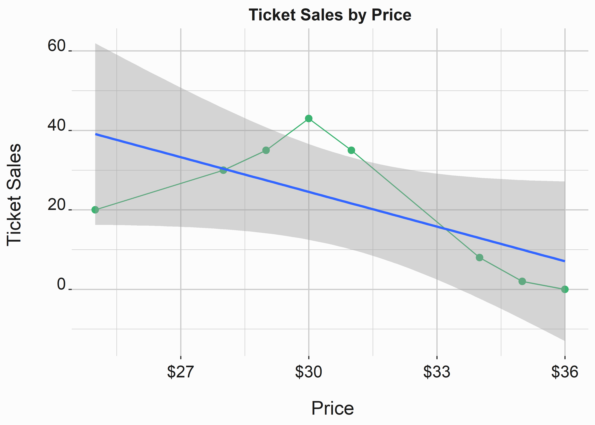
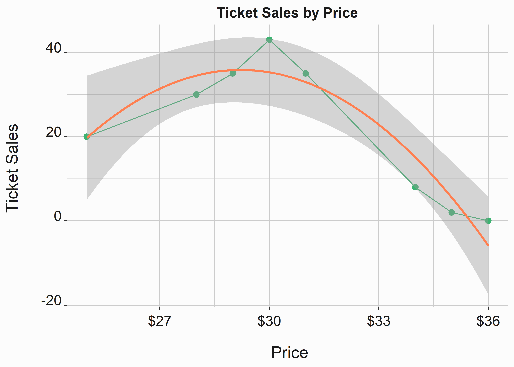
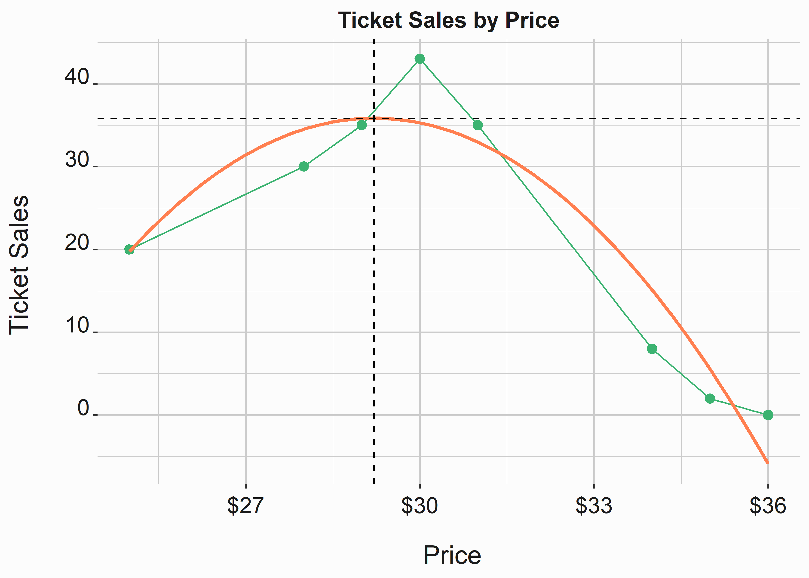
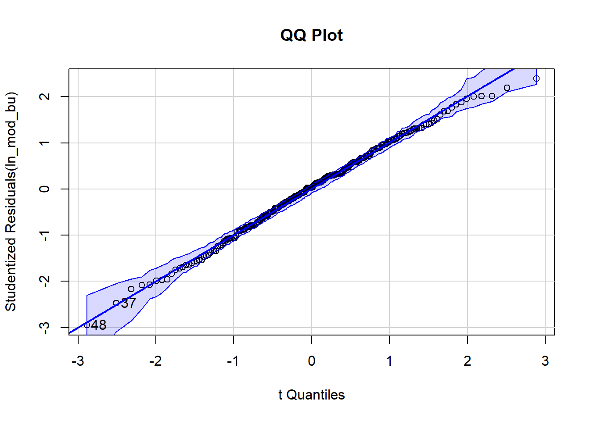
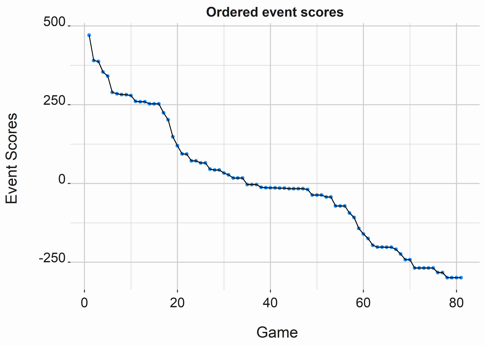
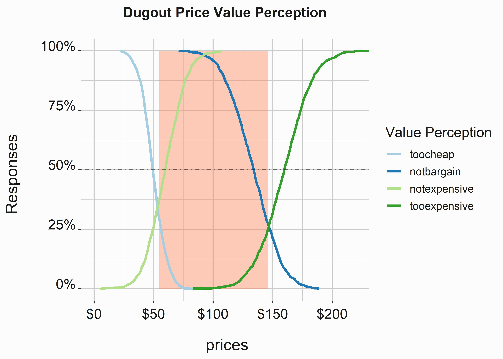

# Forcasting Sales and Setting Prices {#chapter6}

Like _segmentation_, it would be easy to write an entire book on how to forecast and price tickets. There are innumerable considerations such as determining a _willingness to pay_, taking _arbitrage_ into account, _cannibalizing your sales_, _margins_, _marketing channel_, _product suite_, _brand considerations_, and _competing internal goals_. This chapter also immediately follows some examples on how you might potentially segment a market. This is purposeful. Pricing is a dynamic exercise and in certain circumstances products may be worth more or less money. However, pricing isn't always a deliberate exercise. I love a quote that is found in Robert Phillips' book "Revenue and Pricing Optimization" [@Phillips2005]

> "In many cases, the prices charged to customers are the result of a large number of uncoordinate and arbitrary decisions." 
>
>--- Robert L. Phillips

This is absolutely true. While pricing is a fundamental component of your marketing mix, it isn't always well understood how it interacts with promotions and other marketing efforts (we'll explore this a little in chapter \@ref(chapter9)). Additionally, we always have brand considerations to consider. Marketers often regress to the blunt instrument of lower prices in an effort to move more tickets. This can be counterproductive in the long term. When a team isn't good, lower prices will have less impact than when a team is performing well. However, there is less impetus to lower prices when a team is performing well. There has been tremendous research in this area [@Keller2003].

> Wharton's Peter Fader pooints out a number of limitations of valuation approaches: They require much judgmental data and thus contain much subjectivity; Intangible assets are not always synoymous with brand equity."

Your brand is impacted by price. Since season ticket holders are a critical part of risk mitigation, anything that erodes their value should be viewed with scrutiny. This chapter will take you through a simplified example of how you can set prices and discuss the rationale behind our thinking. We will walk through some real examples to demonstrate a way this could be done in practice. However, keep in mind we are only going knee deep in the ocean. Pricing can be a challenging exercise. 

## Understanding your inventory

How do you value tickets? Let's think about how your inventory might look. There are multiple ticket classes and individuals may cross multiple classes. Additionally, there are certain conditions that make your sales inventory fluid. For instance, if your goal is to maximize revenue selling as many season tickets as possible may actually reduce revenue potential because they are sold at a discount. There is a tipping point. Other pieces of inventory may be inefficient to use during certain games. For instance, you may not want to use group discounts on an opening day. Major ticketing inventory includes:

  - Season tickets
  - Group tickets
  - Small plans
  - Single game tickets
  - subscription tickets
  
Additionally, there are several channels where tickets might be obtained. Understanding channels is critical for pricing. Think of airlines. They exert significant control over their channels and it enables extremely fine-grain control pricing tactics. Typical ticketing channels include:

- Primary channels
  - Directly through a team or league
  - Through some consignment mechanism
  - Through a ticketing system such as Ticketmaster
- Secondary channels
  - SeatGeek
  - Stubhub
  
Secondary channels are even more nuanced because a large number of tickets may be owned by professional ticket brokers. These tickets may or may not exist in a liquid market that allows prices to float to any levels. Ticket brokers represent a special problem. Let's discus exactly what ticket brokers are and do.

Ticket brokers buy and sell tickets to events. In a sports environment, there are two primary strategies. However, you can hedge your bets by purchasing multiple events and teams in the same sport or different sports. Other arbitrage opportunities might also exist such as parking passes. The two main strategies are:

1. Scale through the purchase of cheap inventory
2. Purchase good inventory and maintain strong margins

Option number one can be a little risky. However, this varies by market. You purchase lots of inexpensive inventory and make money on marquee events where margins are high because demand significantly outstrips supply (Think about big games on the weekend against prime opponents or playoff games). Option two is a little more difficult. It likely takes time and makes you more visible to the team. Many clubs now employ revenue sharing opportunities with brokers and are simply using them as a way to sell single game tickets on the secondary market. Clubs may also leverage these secondary channels to flatten the markets. 

Selling to brokers mitigates risk because you get money that can be used for operations early. The amount of money that we are dealing with could be large ^[This will not be public information]. However, there is a tradeoff. You no longer control your sales channels. Imagine if you could purchase airline tickets through secondary channels. Would airlines be able to dynamically price as effectively? Additionally, customer service could be an issue. It no longer resides with the club. What happens if you ticket doesn't work? How do you fix it? This becomes a brand problem. Recently, the quick proliferation of digital tickets has made this problem less relevant, but it does persist. There is also a technology component. What does the ticketing platform allow or disallow. While many of these technology problems will likely be solved in the future, they haven't currently been eliminated. 

Adding to the complexity of sales channels and inventory classes is price levels associated with specific locations:

- Premium areas might have amenities such as free F&B, better seats, club access, in-seat service etc.
- Some seats may be in shaded areas
- Distance from the field or court may matter from an experiential and perceptual perspective
- The home field side of the park may be more attractive to some buyers
- The setting sun may make some seats less appealing
- Some people may want to sit in an area that is near certain food offerings, or near an ingress point close to their preferred parking location.
- Scoreboard sightlines may be an issue

All of these factors may not be considered, but some of them certainly should be. Product stratification is key to maximizing revenue opportunity across the spectrum of customer expectations. 

How do you determine _willingness-to-pay_? You have should have some historical data based on what people have paid for tickets for past events. You should also have sales levels associated with these prices for each ticket-class and specific location. Other data might be much harder to capture.A stadium or arena might have dozens or even hundreds of different price levels. This is where _cannibalization_ must be considered. You may not know what a price increase or decrease in one section might do to demand in another. The cross-price elasticity of demand between seating locations isn't a trivial question to answer. You can also deploy some interesting techniques to help mitigate cannibalization such as liner optimization^[https://en.wikipedia.org/wiki/Linear_programming].  

Another confounding factor is inventory levels. How do you know how much inventory is available? You might know that you sold seven seats in the dugout section and they were sold against the Brewers on a Saturday night in July. However, you might not know that inventory was on hold and not available for sale. Additionally, you might not have visibility into how many of those tickets were for sale on the secondary market. We aren't even considering marketing efforts to promote the game.

Inventory control is a critical part of a pricing exercise. It shouldn't be overlooked. Incentives to sell specific asset classes by the sales team can lead to sub-optimal inventory control protocols. For instance, the sales team may be inclined to hold inventory for specific games to help hit group goals. When conducting a pricing exercise, make sure you understand how inventory may be alloted. 


## Understanding pricing mechanisms

When pricing ticket you may be faced with an unresolvable goal. 

> We want to sell all of our available tickets at the highest price possible to optimize revenue

Is selling 10 tickets at \$100 for \$1,000 in revenue equivalent to selling 100 tickets at $10 for \$1,000 in revenue? The answer may be different depending on who you ask. We are going to look at price-response functions to get a quantitative perspective. Price response functions are fun to work with and from an analytics perspective, you should get a lot of enjoyment out of deploying this type of analysis. Price response functions are incredibly useful as is pointed out in "Pricing Segmentation and Analytics." [@Ferguson2012]  

> The most useful feature of price-response functions is that, once estimated, they can be used to determine the price sensitivity of a product or how demand will change in resposne to a change in price.  - Furguson and Bodea

What does a price-response function look like in practice.? Let's say that you sell some tickets and build a chart of the results:


|Sales|Price|
|:-:|:-:|
| 20 | 25 |   
| 30 | 28 |   
| 35 | 29 |  
|...| ... |  

This table tells you how many tickets were sold at each price level. figure \@ref(fig:prfa) represents this data:


```r
#-----------------------------------------------------------------
# The Price response function
#-----------------------------------------------------------------
library(tidyverse)
# Build a simple data set
sales <- tibble::tibble(
  sales = c(20,30,35,43,35,8,2,0),
  price = c(25,28,29,30,31,34,35,36)
)

x_label  <- ('\n Price')
y_label  <- ('Ticket Sales \n')
title    <- ('Ticket Sales by Price')
line_sales <- 
  ggplot2::ggplot(data  = sales, 
                  aes(x = price,
                      y = sales))                 +
  geom_point(size = 2.5,color = 'mediumseagreen') +
  scale_x_continuous(label = scales::dollar)      +
  xlab(x_label)                                   + 
  ylab(y_label)                                   + 
  ggtitle(title)                                  +
  graphics_theme_1                                +
  geom_line(color = "mediumseagreen")             +
  geom_smooth(method = 'lm') 
```


<div class="figure">

<p class="caption">(\#fig:prfa)Linear price response function</p>
</div>


We can clearly see that a linear model probably won't do a great job of forecasting sales at different price levels. We might also deduce that we will encounter diminishing returns at some point as we continue to raise prices. This graph is also missing some critical information. For now, let's assume that these prices represent one section of a stadium and only refer to single game tickets. We'll ignore the fact that we don't know when these tickets were sold, what channel they were sold through, or available inventory. Let's also briefly talk about fitting distributions and price response functions. There are a lot of different ways you could do this and we are going to look at a relatively simple example. the following examples are taken from "Pricing Segmentation and Analytics." [@Ferguson2012]


Typical examples of price response functions include:

Linear models:

\begin{equation}
\ {d(p)} = {D} + {m}*{b}
\end{equation}

Exponential models:

\begin{equation}
\ d(p) = C*p^\epsilon
\end{equation}

Logit models:

\begin{equation}
\ {d(p)} = \frac{C*e^{a+b*p}}{1 + e^{a+b*p}}
\end{equation}

Let's try to build a simple model that approximates our data a little better than a straight line. We can see that a linear model won't fit this data as well as a curved one. It also doesn't look constant or like a logit curve (two models that you are likely to encounter). Let's try a simple polynomial.


```r
#-----------------------------------------------------------------
# The Price response function
#-----------------------------------------------------------------
x_label  <- ('\n Price')
y_label  <- ('Ticket Sales \n')
title    <- ('Ticket Sales by Price')
line_sales_poly <- 
  ggplot2::ggplot(data = sales, 
                  aes(x = price,
                      y = sales))                 +
  geom_point(size = 2.5,color = 'mediumseagreen') +
  scale_x_continuous(label = scales::dollar)      +
  xlab(x_label)                                   + 
  ylab(y_label)                                   + 
  ggtitle(title)                                  +
  graphics_theme_1                                +
  geom_line(color = "mediumseagreen")             +          
  stat_smooth(method = "lm",color = 'coral', 
              formula = y ~ x + poly(x, 2)-1) 
```

<div class="figure">

<p class="caption">(\#fig:prfb)Polynomial price response function</p>
</div>


This curve approximates our line relatively well. We could go through the exercise of finding the line that produces the best fit, but it isn't necessary at this stage. Now that we are happy that a simple polynomial does a reasonable job of approximating our curve, what do we do? R provides several ways to evaluate fits. In the following example we feed a polynomial function to the `lm` (linear model) function in R. We can then write a function `f_get_Sales` that we can use to return values from the line in figure \@ref(fig:prfb). We'll use the coefficients to complete our function. 


```r
#-----------------------------------------------------------------
# Function to return sales based on price
#-----------------------------------------------------------------
fit <- lm(sales$sales~poly(sales$price,2,raw=TRUE))

 f_get_sales <- function(new_price){
 sales <- coef(fit)[1] + 
         (coef(fit)[2]*new_price + (coef(fit)[3] * new_price^2))
 return(sales)
 }
 
```

We now have an _overfit_ price response function that we can use to forecast sales at different price levels. Since this concept may be unfamiliar to you we'll take a minute to explain what is going on here. `fit <- lm(sales$sales~poly(sales$price,2,raw=TRUE))` is using the `lm` function (linear model) to fit a line to our data points. We aren't necessarily looking for the best fit in this example. The function `f_get_sales()` simply takes the coefficients generated by the model stored in  `fit` and builds an equation that we can use to plug price values into the equation to give us sales values (y) in terms of price (x). This might look a little scary, but it is really just middle-school algebra at this stage.

The equation in our function `sales <- coef(fit)[1] + (coef(fit)[2]*new_price + (coef(fit)[3] * new_price^2))` is nothing more than a rearranged linear equation with a second degree exponent. A linear equation such as the equation that would fit the line in figure \@ref(fig:prfa) would take this familiar form:

\begin{equation}
\ {y} = {m}{x} + {b}
\end{equation}

All that we have done is rearranged this linear equation and added a second degree exponent. The math now looks like this:

\begin{equation}
\ {f(x)} = b + {m_1}{x} + {m_2}{x^2}
\end{equation}

I conceptualize linear regression as a simple linear equation where each additional feature manipulates the slope of the line. I think this is the simplest way to think about it. 

\begin{equation}
\ ({m_1}{x} + {m_2}{x^2}) = {m}{x}
\end{equation}

Now we can take a look at our estimates by _applying_ ^[See ?apply in R] our function to our original values. Again, the apply functions are one of the areas where R diverges from other languages. If you are familiar with Map functions, they do basically the same thing. In our case, we are replacing a for or while loop with sapply.


```r
#-----------------------------------------------------------------
# Use f_get_sales to get modeled demand at each price level
#-----------------------------------------------------------------
old_prices      <- c(25,28,29,30,31,34,35,36)
estimated_sales <- sapply(old_prices, function(x) f_get_sales(x))
```


Table: (\#tab:estsales1)Estimates applied to old sales

|original_sales|estimated_sales|difference|
|:------------:|:-------------:|:--------:|
|      20      |   19.751628   |0.2483715 |
|      30      |   34.504337   |-4.5043365|
|      35      |   35.798031   |-0.7980312|
|      43      |   35.279789   |7.7202115 |
|      35      |   32.949608   |2.0503916 |
|      8       |   15.087444   |-7.0874442|
|      2       |   5.509515    |-3.5095147|
|      0       |   -5.880352   |5.8803520 |


Additionally, we can feed other numbers directly to the function. How many sales would we expect at a \$26 price level?


```r
#-----------------------------------------------------------------
# Use f_get_sales to get modeled demand at each price level
#-----------------------------------------------------------------
estimated_sales_new <- f_get_sales(26)
```


Table: (\#tab:estsales2)Estimates applied to new sales

|           |   x    |
|:----------|:------:|
|(Intercept)|26.48114|

There are other tricks we can use on this equation.  The highest point on the curve represents the maximum number of tickets sold at a particular price level. How do we find the price and the number of sales at this point? This is our raw equation:

\begin{equation}
\ {f(x)} = -737.366 + {52.934}{x} + {-0.906}{x^2}
\end{equation}

This is about as deep as we get into math in this book. We'll see some tricky stuff in the chapter on operations, but this is as difficult as we get here. Calculate the derivative of this function. If it has been a while since you've taken calculus, simply use a math engine such as Wolframalpha ^[https://www.wolframalpha.com/examples/mathematics/calculus-and-analysis/]. 

\begin{equation}
\ \frac{dy}{dx} ({-737.366} + {52.934}{x} - {0.906}{x^2}) = {52.934} - {1.812}{x}
\end{equation}

Setting the derivative = 0 and solving the equation will give you the price level at the highest point on the curve:

\begin{equation}
\ f'(0) = {52.934} - {1.812}{x}; 
\end{equation}

Now we simply solve the equation:

\begin{equation}
{26467}/{906} = {29.21}
\end{equation}

The highest number of sales happen at a price of \$29.21. We can plug this number back into our original equation to get the y value.  

\begin{equation}
\ f(29.21) = -737.366 + {52.934}{29.21} + {-0.906}{29.21^2} = 35.8151054
\end{equation}

At \$29.21 our model predicts 35.8151054 tickets to be sold. Let's take a look at it on figure \@ref(fig:prfsix) and try to do some interpretation. As a side note, if you want to be a jerk and refuse to use some basic calculus you could write a binary search function that traverses the function along your range of values and outputs minimums and maximums. Since we are typically dealing with whole numbers on a limited range, there is really nothing wrong with taking that approach.


```r
#-----------------------------------------------------------------
# Demonstrate the highest point on the curve
#-----------------------------------------------------------------
x_label  <- ('\n Price')
y_label  <- ('Ticket Sales \n')
title   <- ('Ticket Sales by Price')
line_sales_polyb <- 
  ggplot2::ggplot(data  = sales, 
                  aes(x = price,
                      y = sales))                     +
  geom_point(size = 2.5,color = 'mediumseagreen')     +
  scale_x_continuous(label = scales::dollar)          +
  xlab(x_label)                                       + 
  ylab(y_label)                                       + 
  ggtitle(title)                                      +
  graphics_theme_1                                    +
  geom_line(color = "mediumseagreen")                 +                                         
  stat_smooth(method = "lm", color = 'coral',
              formula = y ~ x + poly(x, 2)-1, se = F) +
  geom_hline(yintercept = 35.8151054, lty = 2)        +
  geom_vline(xintercept = 29.21, lty = 2)
```


<div class="figure">

<p class="caption">(\#fig:prfsix)Finding a local maximum</p>
</div>

This is great. We have identified the maximum number of tickets sold at any price level in our range. What does our revenue look like at specific prices according to this model? 


```r
#-----------------------------------------------------------------
# Look for optimum price levels
#-----------------------------------------------------------------
estimated_prices <- seq(from = 25, to = 35, by = 1)
estimated_sales <- sapply(estimated_prices,
                          function(x) f_get_sales(x))

estimated_revenue <- tibble::tibble(
  
  sales      = estimated_sales,
  price      = estimated_prices,
  revenue    = estimated_sales * estimated_prices,
  totalSales = rev(cumsum(rev(sales)))
)
```


Table: (\#tab:comps2)Forecasted revenue at different price levels

|  sales  |price| revenue |totalSales|
|:-------:|:---:|:-------:|:--------:|
|19.751628| 25  |493.7907 |288.421119|
|26.481135| 26  |688.5095 |268.669491|
|31.398705| 27  |847.7650 |242.188355|
|34.504337| 28  |966.1214 |210.789651|
|35.798031| 29  |1038.1429|176.285314|
|35.279789| 30  |1058.3937|140.487283|
|32.949608| 31  |1021.4379|105.207495|
|28.807491| 32  |921.8397 |72.257886 |
|22.853436| 33  |754.1634 |43.450395 |
|15.087444| 34  |512.9731 |20.596959 |
|5.509515 | 35  |192.8330 | 5.509515 |


Now imagine that we have to set prices for the product that we have just modeled. How do you do it. We know where the revenue maximizing number lives. Does it tell the entire story? Let's assume that for every price level you sell all of the tickets that cost more. What does cumulative revenue look like in that case?

Let's use a loop this time instead of an apply function and a defined function. 


```r
#-----------------------------------------------------------------
# Look for optimum price levels
#-----------------------------------------------------------------
x <- 1
revenue <- list()
while(x <= nrow(estimated_revenue)){
  
 revenue[x] <- estimated_revenue[x,2] * estimated_revenue[x,4]
 x <- x + 1
}
estimated_revenue$totalRevenue <- unlist(revenue)
```


Table: (\#tab:comps4)Revenue maximizing prices

|  sales  |price| revenue |totalSales|totalRevenue|
|:-------:|:---:|:-------:|:--------:|:----------:|
|19.751628| 25  |493.7907 |288.421119| 7210.5280  |
|26.481135| 26  |688.5095 |268.669491| 6985.4068  |
|31.398705| 27  |847.7650 |242.188355| 6539.0856  |
|34.504337| 28  |966.1214 |210.789651| 5902.1102  |
|35.798031| 29  |1038.1429|176.285314| 5112.2741  |
|35.279789| 30  |1058.3937|140.487283| 4214.6185  |
|32.949608| 31  |1021.4379|105.207495| 3261.4323  |
|28.807491| 32  |921.8397 |72.257886 | 2312.2524  |
|22.853436| 33  |754.1634 |43.450395 | 1433.8630  |
|15.087444| 34  |512.9731 |20.596959 |  700.2966  |
|5.509515 | 35  |192.8330 | 5.509515 |  192.8330  |

This is an interesting way to look at this problem. If you make the assumption that you will sell every ticket that costs more than the price that you set, it appears that setting your prices at \$25 would make you the most revenue. However, if you sold every ticket at the forecasted amounts then you actually earn more revenue: 8495.9703213. This simplistic example demonstrates the power of variable and dynamic pricing. There are also other considerations. If you could only set prices once in this case it might appear that the \$25 price level would be the best. You earn the most ticket revenue and sell the most tickets. However, that is simply due to price elasticity and some assumptions that we have made. What would you do if the season-ticket-holder price was \$29? you now have brand considerations. When inventory is limited it makes these decisions slightly more discrete.


## Basics of forecasting

forecasting is fundamental to setting prices and there are lots of different ways to do it. This subject can also get very sophisticated. We'll focus on a couple of basic approaches to forecasting that you would be confronted with if you were working for a club. Once again, while we will demonstrate how to approach these problems our focus is on how to think about them. Let's create some sample data. You can also find this data in the FOSBAAS package. by using FOSBAAS::past_season_data. You can use the functions to build different conditions into the data set if you would like to simulated different situations.


```r
#-----------------------------------------------------------------
# Generate past seasons data
#-----------------------------------------------------------------
season_2022 <- 
  FOSBAAS::f_build_season(seed1 = 3000, season_year = 2022,
  seed2 = 714, num_games = 81, seed3 = 366, num_bbh = 5,
  num_con = 3, num_oth = 5, seed4 = 309, seed5  = 25,
  mean_sales = 29000, sd_sales = 3500
 )

season_2023 <- 
  FOSBAAS::f_build_season(seed1 = 755, season_year = 2023,
  seed2 = 4256, num_games = 81, seed3 = 54, num_bbh = 6,
  num_con = 4, num_oth = 7, seed4 = 309, seed5  = 25,
  mean_sales = 30500, sd_sales = 3000
 )

season_2024 <- 
  FOSBAAS::f_build_season(seed1 = 2892, season_year = 2024,
  seed2 = 714, num_games = 81, seed3 = 366, num_bbh = 9,
  num_con = 2, num_oth = 6, seed4 = 6856, seed5  = 2892,
  mean_sales = 32300, sd_sales = 2900
 )

past_season <- rbind(season_2022,season_2023,season_2024)
```

Now let's take a look at the data set that we have created. 


Table: (\#tab:forecast2)past seasons data

|   |gameNumber|team|   date   |dayOfWeek|month|weekEnd|
|:--|:--------:|:--:|:--------:|:-------:|:---:|:-----:|
|238|    76    |FLA |2024-09-22|   Sun   | Sep | FALSE |
|239|    77    |FLA |2024-09-23|   Mon   | Sep | FALSE |
|240|    78    |FLA |2024-09-24|   Tue   | Sep | FALSE |
|241|    79    |LAA |2024-10-04|   Fri   | Oct | TRUE  |
|242|    80    |LAA |2024-10-05|   Sat   | Oct | TRUE  |
|243|    81    |LAA |2024-10-06|   Sun   | Oct | FALSE |


In this section, we are going to dive into regression in a little more rigorous fashion.Again, I highly recommend purchasing a book on regression and my current favorite is "An R Companion to Applied Regression." [@Fox2019] by John Fox and Sanford Weisberg. It is very practical and doesn't dwell on theory. There are lots of statistical terms you will need to be familiar with to really dig into it. These include:

- Hypothesis testing
- Normality
- Independence
- linearity
- Validation
- Homoskedacity vs Heteroskedacity
- Autocorrelation
- Multicolinearity
- Interaction terms
- Transformations

An unfortunate fact about working with sports data is that you will be living in a non-parametric world where rank order might be what is important. Additionally, some of the critical underlying assumptions about your data may not be met. There are specific ways to deal with some of these problems. However, we are not doing a clinical study, so there is no need in going into going through every test in the world to make sure our model is durable. We will hit the high points and move on. You just need to make sure that you are aware of how deep the ocean goes. We won't get in over our heads. 

As we said, we can approach forecasting in several ways, but there are two main types of forecasting approaches that we typically deploy:

- Top-down forecasts
- Bottom-up forecasts

What we call a _top-down forecast_ typically consists of macro-level factors such as _team payroll_ and projected wins. These forecasts can be useful for comparing potential across the entire league since we can understand the main components in advance. _Bottom-up forecasts_ can vary in granularity, but consist of more specific information such as the marketing schedule and specifics around scheduling and game attractiveness specific to your market. This might mean rivalry games will be more attractive and you can build that into your model. Let's start by building a simple bottom-up forecast. 

First, let's create a treatment and control group so that we can evaluate the efficacy of our model. We'll perform these tasks with a couple of different packages in future chapters and go into more depth about how to more rigorously apply modeling techniques to our data. The following lines of code will create a training and test data set. This example uses standard R functions.


```r
#-----------------------------------------------------------------
# Build test and training set
#-----------------------------------------------------------------
samp <- round(0.05 * nrow(past_season),0)

set.seed(715)
rows  <- sample(seq_len(nrow(past_season)), 
                        size = samp)
train <- past_season[-rows, ]
test  <- past_season[rows, ]
```

In some of our earlier examples we overfit the models. We didn't split the data into testing and training data. You could even partition the data further with a calibration set, but we'll stick with a simpler training and test set for now.

Now we can build a simple linear model on the training data set. Why did we select the following values? Selecting values for your model can be involved. For the time being, let's just select a few values that we think look reasonable. Variable selection can be involved and creating parsimonious models (the simplest model that captures the most variance) is a best practice. Also keep in mind that you are dealing with mixed data sets. Most of the regression examples you find deal with clean numerical data that is normally distributed. That is rarely the case in the wild. 

The following sections won't be exhaustive, but will give you a crash course on some of the things you need to look for. They also use a realistic example that you would find working for a club. 


```r
#-----------------------------------------------------------------
# Linear model for ticket sales
#-----------------------------------------------------------------
ln_mod_bu <- lm(ticketSales ~ promotion + daysSinceLastGame + 
                  schoolInOut + weekEnd + team , data = train)
ln_mod_bu_sum <- 
tibble::tibble(
  st_error     = unlist(summary(ln_mod_bu)[6]),
  r_square     = unlist(summary(ln_mod_bu)[8]),
  adj_r_square = unlist(summary(ln_mod_bu)[9]),
  f_stat       = unlist(summary(ln_mod_bu)$fstatistic[1]))
```


the standard summary for a model looks like this:


```
#> 
#> Call:
#> lm(formula = ticketSales ~ promotion + daysSinceLastGame + schoolInOut + 
#>     weekEnd + team, data = train)
#> 
#> Residuals:
#>      Min       1Q   Median       3Q      Max 
#> -10994.7  -2468.7    126.9   2504.1   8969.3 
#> 
#> Coefficients:
#>                   Estimate Std. Error t value Pr(>|t|)    
#> (Intercept)       33357.39    2929.22  11.388  < 2e-16 ***
#> promotionconcert    127.09    1657.31   0.077 0.938953    
#> promotionnone     -5358.02     988.93  -5.418 1.71e-07 ***
#> promotionother    -3721.18    1375.10  -2.706 0.007390 ** 
#> daysSinceLastGame   288.13      42.69   6.750 1.53e-10 ***
#> schoolInOutTRUE    4608.16    1037.41   4.442 1.47e-05 ***
#> weekEndTRUE        6397.82     610.61  10.478  < 2e-16 ***
#> teamATL            3135.03    3000.93   1.045 0.297417    
#> teamBAL            4382.63    2925.33   1.498 0.135651    
#> teamBOS           12751.52    3594.69   3.547 0.000484 ***
#> teamCHC           13193.89    3565.58   3.700 0.000278 ***
#> teamCIN            3659.22    3226.57   1.134 0.258101    
#> teamCLE            2201.94    2906.84   0.758 0.449632    
#> teamCOL            3057.71    3285.54   0.931 0.353142    
#> teamCWS            3906.19    2985.27   1.308 0.192195    
#> teamDET            3202.46    3267.54   0.980 0.328217    
#> teamFLA            2833.12    2924.04   0.969 0.333750    
#> teamHOU           10209.56    2947.13   3.464 0.000649 ***
#> teamKAN            5246.46    3732.75   1.406 0.161403    
#> teamLAA            9102.40    2888.86   3.151 0.001875 ** 
#> teamLAD           12150.54    3198.52   3.799 0.000192 ***
#> teamMIN            1625.41    3708.86   0.438 0.661672    
#> teamNYM            9879.64    3030.31   3.260 0.001306 ** 
#> teamOAK            1877.06    3741.10   0.502 0.616397    
#> teamPHI            9450.28    3949.78   2.393 0.017645 *  
#> teamSF             8185.73    3741.10   2.188 0.029813 *  
#> teamTB             3212.49    3191.25   1.007 0.315305    
#> teamTEX            4595.50    3069.58   1.497 0.135925    
#> teamWAS            1036.66    3036.91   0.341 0.733192    
#> ---
#> Signif. codes:  
#> 0 '***' 0.001 '**' 0.01 '*' 0.05 '.' 0.1 ' ' 1
#> 
#> Residual standard error: 3900 on 202 degrees of freedom
#> Multiple R-squared:  0.6632,	Adjusted R-squared:  0.6166 
#> F-statistic: 14.21 on 28 and 202 DF,  p-value: < 2.2e-16
```

What are we looking for with this output. You'll need to hit the books here. If you aren't familiar with confusing statistics speak, you'll need to be. 

* Estimate: These are the coefficients for the equation produced by this regression
* Std. Error: The standard error represents the average distance the estimates fall from the regression line.
* t value: This is the coefficient divided by the standard error
* Pr(>|t|): The p value. It will tell you if the variable is significant. How sure are we that the estimate falls within the confidence interval.
* Residual standard error: The larger this number, the less likely your model will be useful.
* Multiple R-squared: How much variation is being explained by this model
* F-statistic: Is the model valid? Lower numbers here are bad


About 60% of the variance in ticket sales is explained by this simple model. Is that good? Probably not especially when we consider the standard error. Is there anything we can do to improve it? Let's take a look at some regression diagnostics to help us evaluate our results. Additionally, you can run `plot(ln_mod_bu)` to get a few standard diagnostic plots.

we have cut the statistics down for brevity. That is why our summaries tend to look like this:


Table: (\#tab:chsixsumstatsa)Summary stats for model

|st_error|r_square |adj_r_square| f_stat |
|:------:|:-------:|:----------:|:------:|
|3899.53 |0.6632383| 0.6165585  |14.20824|


This is OLS regression and there are certain assumptions that need to be made about the underlying data. If they aren't satisfied, your model may have some problems. The car package [@R-car] has some great tools to help you evaluate your models. We'll use it to further evaluate the model. 

### Outliers and unusual data points

Linear regression is sensitive to outliers. It is always best to look for data points that fall well outside the average range. For instance, perhaps some games were rained out. Maybe a new promotion worked really well. Something will create an unusual data point or two. Sometimes it is appropriate to remove them. 


```r
#-----------------------------------------------------------------
# Outliers test
#-----------------------------------------------------------------
library(car)
outliers <- car::outlierTest(ln_mod_bu)
```

There only appears to be one outlier:


<table class="kable_wrapper">
<caption>(\#tab:forecast6)Outliers</caption>
<tbody>
  <tr>
   <td> 

|   |         x|
|:--|---------:|
|48 | 0.0035699|

 </td>
  </tr>
</tbody>
</table>


A QQ plot will help check that our underlying assumptions around _normality_ are satisfied. It demonstrates the "95% confidence envelope." 


```r
#-----------------------------------------------------------------
# QQPlot
#-----------------------------------------------------------------
qq <- car::qqPlot(ln_mod_bu, main="QQ Plot")
```



For the most part, our points tend to fall on the line. A few points stray from it and we can see our outlier (48) at the bottom. Linear regression models can be highly influenced by extreme points. We'll end up removing this point and rerunning the model. 

We can run an influence plot to combine several of the graphs we would see in You can see with `plot(ln_mod_bu)`. The bigger the circle, the larger _Cooks Distance_. Cooks distance has a mathematical definition, but just think of it as a way to identify influential points in the data. 


```r
#-----------------------------------------------------------------
# Influence plot
#-----------------------------------------------------------------
ip <- car::influencePlot(ln_mod_bu, id.method="identify", 
              main="Influence plot for our linear model ")
```


It appears that several points are having an out-sized influence on our model. We should evaluate them individually. It may be OK to remove them from our model if their values appear to be influenced by some exogenous factor that we are not accounting for. Why might some of the points be influential? Perhaps it rained on a few of these dates and it depressed ticket sales. It might be reasonable to exclude these dates from the analysis.  


Table: (\#tab:forecast9)Influential Observations

|   | StudRes |   Hat   |  CookD  |
|:--|:-------:|:-------:|:-------:|
|37 |-2.474975|0.0625549|0.0137460|
|48 |-2.948634|0.0508503|0.0154727|
|53 |-2.087044|0.2021280|0.0374285|
|129|-1.983284|0.3338126|0.0669910|
|142|-0.313120|0.5010784|0.0034107|
|143|0.313120 |0.5010784|0.0034107|


Let's remove some of the observations. 


```r
#-----------------------------------------------------------------
#  Remove outliers and view summary
#-----------------------------------------------------------------
past_season_clean <- past_season[-c(37,48,53,129,142,143),]

ln_mod_clean <- lm(ticketSales ~ promotion + daysSinceLastGame + 
                  schoolInOut + weekEnd + team , 
                  data = past_season_clean)
#-----------------------------------------------------------------
# Save our model
# save(ln_mod_clean, file="ch6_ln_mod_clean.rda")
#-----------------------------------------------------------------
ln_mod_clean_sum <- 
tibble::tibble(
  st_error     = unlist(summary(ln_mod_clean)[6]),
  r_square     = unlist(summary(ln_mod_clean)[8]),
  adj_r_square = unlist(summary(ln_mod_clean)[9]),
  f_stat       = unlist(summary(ln_mod_clean)$fstatistic[1]))
```


Table: (\#tab:sumstatsa)Summary stats for clean model

|st_error|r_square |adj_r_square| f_stat |
|:------:|:-------:|:----------:|:------:|
|3820.177|0.6688948|  0.624323  |15.00711|


We only get a modest improvement by removing some of the influential values. What else can we do? We can also look for interaction terms or transform our response. There are multiple ways to handle this. Additionally you may not need to transform the data. In this case, we don't see obvious curvature in the data. 


```r
#-----------------------------------------------------------------
# Transforming the data
#-----------------------------------------------------------------
summary(pw_mod <- car::powerTransform(ln_mod_clean))
#> bcPower Transformation to Normality 
#>    Est Power Rounded Pwr Wald Lwr Bnd Wald Upr Bnd
#> Y1    3.0383        3.04       2.2665       3.8101
#> 
#> Likelihood ratio test that transformation parameter is equal to 0
#>  (log transformation)
#>                            LRT df       pval
#> LR test, lambda = (0) 71.19639  1 < 2.22e-16
#> 
#> Likelihood ratio test that no transformation is needed
#>                            LRT df       pval
#> LR test, lambda = (1) 30.40168  1 3.5122e-08
```

You can also transform variables in your regression directly 


```r
#-----------------------------------------------------------------
# Directly transforming the data
#-----------------------------------------------------------------
ln_mod_log <- 
  lm(log(ticketSales) ~ promotion + daysSinceLastGame + 
                        schoolInOut + weekEnd + team , 
                        data = past_season_clean)
ln_mod_log_sum <- 
tibble::tibble(
  st_error     = unlist(summary(ln_mod_log)[6]),
  r_square     = unlist(summary(ln_mod_log)[8]),
  adj_r_square = unlist(summary(ln_mod_log)[9]),
  f_stat       = unlist(summary(ln_mod_log)$fstatistic[1])
)
```


Table: (\#tab:sumstatsb)Summary stats for log model

|st_error |r_square |adj_r_square| f_stat |
|:-------:|:-------:|:----------:|:------:|
|0.1106438|0.6462896| 0.5986747  |13.57327|


This makes the model worse. It also makes it more difficult to interpret. This isn't uncommon with the data that you will find working in sports. We aren't dealing with new medicines. We are dealing with dollars and cents. You don't have to be as precise. However, precision helps! Often in business, you simply do the best you can. If you understand the limitations of what you have done, you'll still be in good shape when it comes time to make a decision.

Let's go ahead and apply our model to our testing data set. How well does it appear to approximate ticket sales in practice? We'll use the predict function to apply our predictions to our test data to observe how close the estimates fall to reality.


```r
#-----------------------------------------------------------------
# Apply predictions to our test data set. 
#-----------------------------------------------------------------
test$pred_tickets <- predict(ln_mod_clean,
                             newdata = test)
test$percDiff <- 
  (test$ticketSales - test$pred_tickets)/test$ticketSales
```


```r
mean_test <- mean(test$percDiff)
```


Table: (\#tab:chtenmeantest)Mean error percentage

|    x     |
|:--------:|
|-0.0239013|


On average, we are about 2% off of the mark. Is that good? Maybe. It depends on what you are trying to accomplish. Let's take a look at this error on a graph. 


```r
#-----------------------------------------------------------------
# Apply predictions to our test data set. 
#-----------------------------------------------------------------
test_line <- test
test_line$order <- seq(1:nrow(test))
test_line <-   tidyr::pivot_longer(test_line,
                      cols = c('ticketSales','pred_tickets'),
                      values_transform = list(val = as.character))
x_label  <- ('\n Selected Game')
y_label  <- ('Ticket Sales \n')
title   <- ('Ticket forecasts vs. Actuals')
line_est <- 
  ggplot2::ggplot(data      = test_line, 
                  aes(x     = order,
                      y     = value,
                      color = name))             +
  geom_point(size = 2.5)                         +
  geom_line()                                    +
  scale_color_manual(values = palette)           +
  scale_y_continuous(label = scales::comma)      +
  xlab(x_label)                                  + 
  ylab(y_label)                                  + 
  ggtitle(title)                                 +
  graphics_theme_1
```


Overall, our error is relatively low. However, we can see that while the average error is low, the point estimates can vary considerably. Would I feel comfortable applying this model to new data. I believe so. However, I would probably look for other predictors that might improve my model. Perhaps removing season tickets would help. Unfortunately, the further away from the season, the more blunt your estimates will tend to be. You won't have gambling odds, you may not have a promotional schedule. If you pull insignificant teams from the model you won't be able to use them to make a forecast, you'll have to guess. You'll often have to settle for "good enough."

This top-down approach to forecasting sales and analyzing prices is useful in certain circumstances and has many applications. Our next example will cover a bottom-up approach.


### Analyzing a schedule and ranking games

How much of an impact does a schedule have on the financial success of a team? What other factors should be considered? For a sport like professional baseball, ticket sales are the most important component of revenue generation. Almost every other revenue stream is derived from sales. Let's take a look at some schedule data to begin to frame this problem. I like to take an ensemble approach to these problems. In this case, we are going to do the same thing in two different ways. First, we are going to evaluate games based on how attractive they seem to fans. This is a bottom-up approach will use secondary market purchases to estimate how attractive each game might be.

#### Utilizing transaction data


```r
#-----------------------------------------------------------------
# Secondary market data, manifest, and sales data
#-----------------------------------------------------------------
sm  <- FOSBAAS::secondary_data
man <- FOSBAAS::manifest_data
sea <- FOSBAAS::season_data
sea$gameID <- seq(1:nrow(sea))
```

As always, let's begin by getting an understanding of the underlying data structure.


```r
#-----------------------------------------------------------------
# Secondary market data, manifest, and sales data
#-----------------------------------------------------------------
head(sm)[c(1,2,7,9)]

```


Table: (\#tab:sma)Secondary market data structure

|seatID|custID      |price|secondayrPrice|
|:-----|:-----------|:----|:-------------|
|9010  |N22J8UPWACNO|54.0 |60.51         |
|20950 |II3IGIN0PY15|30.0 |37.11         |
|16    |HL1LS8PNUJXU|190.0|174.34        |
|30607 |XA8PY4QVWBMF|20.7 |24.30         |
|2399  |RTC7OFV5BUBL|103.5|143.24        |
|10250 |EP37BTOALOCY|54.0 |77.03         |


```r
#-----------------------------------------------------------------
# Secondary sales by section
#-----------------------------------------------------------------
sm_man <- left_join(sm,man, by = 'seatID')

avg_price_comps <- 
  sm_man %>% dplyr::select(gameID,price,singlePrice,tickets) %>%
             na.omit()                                       %>%
             dplyr::group_by(gameID)                         %>%
             dplyr::summarise(meanSec   = mean(price),
                       meanPri   = mean(singlePrice),
                       tickets   = sum(tickets))
```


Table: (\#tab:smb)Secondary market data structure

|gameID|meanSec |meanPri |tickets|
|:----:|:------:|:------:|:-----:|
|  1   |40.35872|44.19619| 3101  |
|  2   |40.72825|44.16555| 3520  |
|  3   |39.96533|43.85449| 3186  |
|  4   |40.02371|43.43759| 3484  |
|  5   |39.83003|43.48523| 3293  |
|  6   |41.42634|45.21318| 3347  |


Now we can look by game to see how many transactions happened and what was spent. We can join this table to our original season data table and then see if we we can use a regression to accurately predict which games commanded higher prices on the secondary market. This data wasn't created to be linked, so we are going to alter it a little bit. We're going to do this so the results actually look realistic.

We'll simply create a coefficient representing scaled ticket sales and add it to the mean secondary price.


```r
#-----------------------------------------------------------------
# Adjust secondary to reflect primary
#-----------------------------------------------------------------
sea_adj  <- left_join(sea,avg_price_comps, by = "gameID") 
adj_coef <- scale(sea_adj$ticketSales)
sea_adj$meanSecAdj <- sea_adj$meanSec + (adj_coef * 10)
```


Now let's build a model on this data. 


```r
#-----------------------------------------------------------------
# Adjust secondary to reflect primary
#-----------------------------------------------------------------
ln_mod_sec <- 
  lm(meanSecAdj ~ promotion + daysSinceLastGame + 
                        schoolInOut + weekEnd + team , 
                        data = sea_adj)
ln_mod_sec_sum <- 
tibble::tibble(
  st_error     = unlist(summary(ln_mod_sec)[6]),
  r_square     = unlist(summary(ln_mod_sec)[8]),
  adj_r_square = unlist(summary(ln_mod_sec)[9]),
  f_stat       = unlist(summary(ln_mod_sec)$fstatistic[1])
)
```


Table: (\#tab:chsixsmb)Linear model summary statistics

|st_error|r_square |adj_r_square|f_stat |
|:------:|:-------:|:----------:|:-----:|
|3.071083|0.9193594| 0.9075117  |77.5983|


This model appears to work well. It appears to explain about 90% of the variance in secondary market prices. This model is overfit, but you get the point. Let's assume that we put more rigor into this example and get to application.


### Applying our models to a new data set

Now that we have a model constructed, how do we apply it to new data? What are we doing with it? Let's evaluate the results of the model against themselves to create an _event score_ that can be used to think about our promotion schedule. Here is how we can do it.


```r
#-----------------------------------------------------------------
# Create data for a new season
#-----------------------------------------------------------------
season_2025 <- 
  FOSBAAS::f_build_season(seed1 = 755, season_year = 2025,
  seed2 = 714, num_games = 81, seed3 = 366, num_bbh = 5,
  num_con = 3, num_oth = 7, seed4 = 366, seed5  = 1,
  mean_sales = 0, sd_sales = 0
 )
```

Our new data uses seed2 = 714. If I type `View(f_build_season)` I can see that seed2 controls the teams that are selected for the schedule. What happens if use a different seed2? You might get factor levels that you didn't anticipate. The model is unable to make a prediction on these values. What do you do here. The easiest thing to do is to remove the offending factor levels. You could also make them analogs and substitute in a like-factor. 


```r
#-----------------------------------------------------------------
# Apply model output to new data set
#-----------------------------------------------------------------
season_2025$predTickets <- predict(ln_mod_clean,
                             newdata = season_2025)
season_2025$predPrices  <- predict(ln_mod_sec,
                             newdata = season_2025)
```


Table: (\#tab:seastf)2025 season data

|variable         |classe   |first_values                      |
|:----------------|:--------|:---------------------------------|
|gameNumber       |integer  |1, 2                              |
|team             |character|FLA, FLA                          |
|date             |character|2025-03-27, 2025-03-28            |
|dayOfWeek        |integer  |Thu, Fri                          |
|month            |integer  |Mar, Mar                          |
|weekEnd          |logical  |FALSE, TRUE                       |
|schoolInOut      |logical  |FALSE, FALSE                      |
|daysSinceLastGame|double   |50, 1                             |
|openingDay       |logical  |TRUE, FALSE                       |
|promotion        |character|none, none                        |
|ticketSales      |double   |0, 0                              |
|season           |double   |2025, 2025                        |
|predTickets      |double   |44958.4169736301, 37738.5433636259|
|predPrices       |double   |48.6265858538348, 36.6916490543523|


Now that we have some predictions around ticket sales, we can build some event scores off of them. This is the simple part.  


```r
#-----------------------------------------------------------------
# Build event scores
#-----------------------------------------------------------------
season_2025$eventScoreA <- 
  as.vector(scale(season_2025$predTickets) * 100)
season_2025$eventScoreB <- 
  as.vector(scale(season_2025$predPrices) * 100)
season_2025$eventScore  <- 
   season_2025$eventScoreA + season_2025$eventScoreB

season_2025 <- season_2025[order(-season_2025$eventScore),]
```


Table: (\#tab:seastfpreds)2025 season event scores

|variable         |classe   |first_values                      |
|:----------------|:--------|:---------------------------------|
|gameNumber       |integer  |79, 52                            |
|team             |character|LAA, DET                          |
|date             |character|2025-09-13, 2025-07-25            |
|dayOfWeek        |integer  |Sat, Fri                          |
|month            |integer  |Sep, Jul                          |
|weekEnd          |logical  |TRUE, TRUE                        |
|schoolInOut      |logical  |FALSE, TRUE                       |
|daysSinceLastGame|double   |1, 10                             |
|openingDay       |logical  |FALSE, FALSE                      |
|promotion        |character|bobblehead, none                  |
|ticketSales      |double   |0, 0                              |
|season           |double   |2025, 2025                        |
|predTickets      |double   |49358.3881551301, 46644.2609827693|
|predPrices       |double   |56.1825828148457, 54.144879836537 |
|eventScoreA      |double   |239.600940080784, 184.096168478207|
|eventScoreB      |double   |230.93966856631, 206.238484837644 |
|eventScore       |double   |470.540608647093, 390.334653315851|


```r
#-----------------------------------------------------------------
# Observe differences in event scores
#-----------------------------------------------------------------
library(ggplot2)
season_2025$order <- seq(1:nrow(season_2025))

x_label  <- ('\n Game')
y_label  <- ('Event Scores \n')
title   <- ('Ordered event scores')
line_est_es <- 
  ggplot2::ggplot(data  = season_2025, 
                  aes(x = order,
                      y = eventScore))             +
  geom_point(size = 1.3,color = 'dodgerblue')      +
  geom_line()                                      +
  scale_color_manual(values = palette)             +
  scale_y_continuous(label = scales::comma)        +
  xlab(x_label)                                    + 
  ylab(y_label)                                    + 
  ggtitle(title)                                   +
  graphics_theme_1
```




We can see that there are groupings of games that have similar levels of _attractiveness_. Although many games appear much more attractive than others, they may have also been priced higher. Based on this demand attractiveness, we can progressively price our games with the ones with the highest anticipated demand receiving higher prices.  


Let's cluster like games together based on their event scores. We'll use the `kmeans` function to group our games together. You'll see kmeans getting used quite a bit. It is relatively simple to understand and does a good job of discriminating numerical data sets. 


```r
#-----------------------------------------------------------------
# Kmeans clustering on event scores
#-----------------------------------------------------------------
set.seed(715)
clusters <- kmeans(season_2025$eventScore,6)
season_2025$cluster <- clusters$cluster
#write.csv(season_2025,'season_2025.csv',row.names = F)
```

Now let's look at some summary stats for the groups


```r
#-----------------------------------------------------------------
# Summary statistics
#-----------------------------------------------------------------
library(dplyr)
season_summary <- season_2025                            %>% 
                  group_by(cluster)                      %>%
                  summarise(mean   = mean(eventScore),
                            median = median(eventScore),
                            sd     = sd(eventScore),
                            n      = n())                %>%
                  arrange(desc(mean))
```


```r
knitr::kable(season_summary,caption = "Summary stats by cluster",
             align = 'c',format = "markdown",padding = 0)
```


Table: (\#tab:forecast18)Summary stats by cluster

|cluster|   mean   |  median  |   sd   | n |
|:-----:|:--------:|:--------:|:------:|:-:|
|   1   |388.62293 |387.30144 |50.45311| 5 |
|   3   |260.07078 |259.18470 |25.11326|13 |
|   5   | 60.71921 | 55.16080 |38.29457|16 |
|   4   |-32.95683 |-16.52499 |29.59564|24 |
|   2   |-191.62441|-202.08667|24.68114|10 |
|   6   |-276.02569|-268.42818|20.09275|13 |

  
We now have several groups of games that we can evaluate. We can use these groups in various ways. One way might be to look for games that might need help. Perhaps we can see if a promotion impacted sales. We'll do this in chapter \@ref(chapter8). You now have a data set that gives you a good idea of how attractive each game is against every other game. However, pricing is much more complex in practice. Reference pricing plays a part in how you might price. The main idea here is that we are going to price our games based on how attractive they are. We are using attractiveness as a proxy for demand.  

How can we improve this bottom-up forecast? We can begin to layer other data onto it. What data are we looking for? There are several pieces of data that we can use:

- The number of season tickets that we have sold and anticipate selling
- Available inventory by game and how it is allocated
- prices paid and volume for each ticket class


You are unlikely to have perfect conditions for setting prices. Additionally, our model isn't especially powerful. How could we improve our model? In practice, we prefer an ensemble approach. If you have access to a liquid market, like the secondary market with a high number of transactions at different prices, you can use that data. 

## Leveraging qualitative data

Leveraging surveys for pricing support may or may not have utility. There are two main methodologies that we have deployed in practice:

- Van Westendorp analysis
- Conjoint

Both of these techniques are supported by survey tools such as Qualtrics. Conjoint analysis can be complex and understanding it is well outside the scope of this book. Let's take a look at a Van Westendorp survey and talk about how it can be useful. 

First, we need to create some survey data.


```r
#-----------------------------------------------------------------
# Create Van Westendorp survey data
#-----------------------------------------------------------------
vw_data <- data.frame(matrix(nrow = 1000, ncol = 6))
names(vw_data) <- c('DugoutSeats', 'PriceExpectation', 
                    'TooExpensive', 'TooCheap', 
                    'WayTooCheap', 'WayTooExpensive')
set.seed(715)
vw_data[,1] <- 'DugoutSeats'
vw_data[,2] <- round(rnorm(1000,100,10),0)
vw_data[,3] <- round(rnorm(1000,130,20),0)
vw_data[,4] <- round(rnorm(1000,60,15),0)
vw_data[,5] <- round(rnorm(1000,50,10),0)
vw_data[,6] <- round(rnorm(1000,160,20),0)
```


Table: (\#tab:vwaa)Survey results

|DugoutSeats|PriceExpectation|TooExpensive|TooCheap|WayTooCheap|WayTooExpensive|
|:---------:|:--------------:|:----------:|:------:|:---------:|:-------------:|
|DugoutSeats|      100       |    115     |   57   |    39     |      170      |
|DugoutSeats|      113       |    147     |   69   |    52     |      129      |
|DugoutSeats|      102       |    169     |   67   |    51     |      163      |
|DugoutSeats|      103       |    134     |   72   |    54     |      148      |
|DugoutSeats|       99       |     88     |   46   |    37     |      163      |
|DugoutSeats|       83       |    123     |   77   |    59     |      145      |


Like many statistical tools that you will find, there is a package for analyzing Van Westendorp data. Let's start by doing it a little more manually. We'll have to do a little prep work. Let's build a new dataframe with some slightly different terminology. 


```r
#-----------------------------------------------------------------
# Empirical cumulative distribution function
#-----------------------------------------------------------------
library(Hmisc)
dat <- data.frame(
    "toocheap"     = vw_data$WayTooCheap,
    "notbargain"   = vw_data$TooExpensive,
    "notexpensive" = vw_data$TooCheap,
    "tooexpensive" = vw_data$WayTooExpensive
)
a <- Ecdf(dat$toocheap,what="1-F",pl=F)$y[-1]
b <- Ecdf(dat$notbargain, pl=F)$y[-1]
c <- Ecdf(dat$notexpensive,what = "1-F", pl=F)$y[-1]
d <- Ecdf(dat$tooexpensive,pl=F)$y[-1]
```

The `Ecdf` function from the `Hmisc` package will give you coordinates for the cumulative distribution. We'll use the `reshape2` [@R-reshape2] package to `melt` the data frame. This package helps pivot data and the results will be identical to using tools in the `tidyr` package that we have already seen.


```r
#-----------------------------------------------------------------
# Build data set for creating graphic
#-----------------------------------------------------------------
library(reshape2)
ecdf1 <- data.frame(
  "variable"  = rep("toocheap",length(a)),
  "ecdf"      = a,
   "value"    = sort(unique(dat$toocheap)))
ecdf2 <- data.frame(
  "variable"  = rep("notbargain",length(b)),
  "ecdf"      = b,
  "value"     = sort(unique(dat$notbargain),decreasing = T))
ecdf3 <- data.frame(
  "variable"  = rep("notexpensive",length(c)),
   "ecdf"     = c,
   "value"    = sort(unique(dat$notexpensive),decreasing = T))
ecdf4 <- data.frame(
  "variable"  = rep("tooexpensive",length(d)),
  "ecdf"      = d,
  "value"     = sort(unique(dat$tooexpensive)))
dat2 <- rbind(ecdf1,ecdf2,ecdf3,ecdf4)
dat  <- melt(dat)
dat  <- merge(dat,dat2,by=c("variable","value"))
```


Now we are ready to view our graph.


```r
#-----------------------------------------------------------------
# Graph the results
#-----------------------------------------------------------------
require(ggplot2)
require(scales)
require(RColorBrewer)

Paired     <- RColorBrewer::brewer.pal(4,"Paired")

g_xlab     <- '\n prices'
g_ylab     <- 'Responses  \n'
g_title    <- 'Dugout Price Value Perception\n'

vw_gaphic <- 
ggplot(dat, aes(value, ecdf, color=variable))     + 
      annotate("rect", xmin = 55, xmax = 146, 
                     ymin = 0,  ymax = 1,
             alpha = .4, fill = 'coral')          +
    geom_line(size = 1.2) +
    scale_color_manual(values = Paired,
                       name = 'Value Perception') + 
    xlab(g_xlab)                                  + 
    ylab(g_ylab)                                  + 
    ggtitle(g_title)                              + 
    scale_y_continuous(labels = percent)          +
    scale_x_continuous(labels = dollar)           +
    coord_cartesian(xlim = c(0,220),ylim= c(0,1)) +
    geom_hline(yintercept = .5,
               lty=4,
               alpha = .5)                        +
    graphics_theme_1
```



We can also use the `pricesensitivitymeter` package to produce our analysis a little more quickly. 


```r
#-----------------------------------------------------------------
# Duplicate work with a library
#-----------------------------------------------------------------
library(pricesensitivitymeter)
price_sensitivity <- psm_analysis(
                           toocheap        = "WayTooCheap",
                           cheap           = "TooCheap",
                           expensive       = "TooExpensive",
                           tooexpensive    = "WayTooExpensive",
                           data            = vw_data,
                           validate        = TRUE)
```


The price_sensitivity object makes it easy to explore the data.


```r
#-----------------------------------------------------------------
# Explore price sensitivity data
#-----------------------------------------------------------------
ps <- 
  tibble::tibble(lower_price = price_sensitivity$pricerange_lower,
                 upper_price = price_sensitivity$pricerange_upper)
```


Table: (\#tab:psmetrics)Price sensitivity metrics

|lower_price|upper_price|
|:---------:|:---------:|
|    55     |    146    |


You can also produce the same plot that we have already produced. The plotting mechanism leverages ggplot2, so you can override the look. We now have some qualitative data on price sensitivity. This doesn't represent willingness to pay, but it does help us conceptualize a range of prices that might be appropriate. 

## Implementing revenue management strategies in sports

These techniques are becoming increasingly commoditized. The mechanisms for forecasting and pricing are well understood and widely deployed. Additionally, ticketing platforms and markets are already working together to make deploying changes possible across multiple markets instantaneously. We have already covered the main considerations, but we didn't talk about all of them:

- Brand and consumer equity
- Setting initial prices
- Automatically adjusting prices
- Controlling cannibalization
- Public relations and perception
- The perceived fairness of raising prices

Lowering prices can negatively impact perception and brand equity in the long term. Concepts such as _prospect theory_ explain how changes in utility are asymmetric between gains and losses. [@Ferguson2012] If someone feels that they missed out because of your pricing policy it will have negative impacts. Additionally, not all price changes may be perceived as fair. keep behavioral economics in mind as you deploy your pricing strategy.

Initial prices are difficult to set and reference prices are powerful mechanisms. If you develop a new product (such as a premium seating area), you'll have to think carefully about the value proposition. Some in-market competitive intelligence may be useful here. Don't rely on a pro forma.

How do you evaluate prices and deploy them. It is best to set an internal mechanism with sales, marketing, and operations. Pricing is one of the single-most important sales and revenue influencers. You'll want the right people at the table. You'll also want to make sure the right technology is deployed. How does the price get to the market? How is it updated on the website? Do you have policies about how much or little specific tickets may cost?

Additionally, your inventory control protocols may influence your decisions. If I raise prices in one section, how does it impact demand in another? This is a fundamental component of pricing. Your price levels are linked. You might be able to explain these links through systems of equations. There are multiple ways to approach these problems. 

Finally, how will people respond to prices? It will depend on a number of factors such as demand, success, and markets. Exploiting opportunities isn't always appropriate. Qualitative research may help. You can deploy conjoint surveys and other research tools to help gauge how fans will respond to products or changes in price. Taking an ensemble approach to pricing is a recommended approach.  


## Key concepts and chapter summary

Getting pricing right is a key component of an integrated marketing mix strategy. Pricing has a number of quantitative and qualitative components. We covered several concepts:

- Inventory control
- Mechanical price controls
- More in-depth regression
- Forecasting and schedule analysis
- Event scoring
- Qualitative research

We only skimmed this broad subject, but you know understand some of the basics of this very complex subject.

- Inventory can be complex and people may perceive inventory in different ways. Understanding the differences between inventory is important if you are building a discreet-choice model. 
- The mechanics for determining prices tend to rely on mathematical models. These models can be adjusted to promote more sales or to maximize revenue generation. These goals may be inclusive or exclusive.
- Regression can be rigorous. If you want to be confident in the results, you'll need to spend some time evaluating the model in a methodical way. Get a book on regression and make sure that you understand it enough to use it correctly.
- Schedules can play an out-sized role in revenue generation. We walked through how to evaluate a schedule. This will be useful when marketing wants to build promotions for games with less demand.
- We covered how to use a Van Westendorp analysis to help us understand how people perceive inventory and prices. 
 


