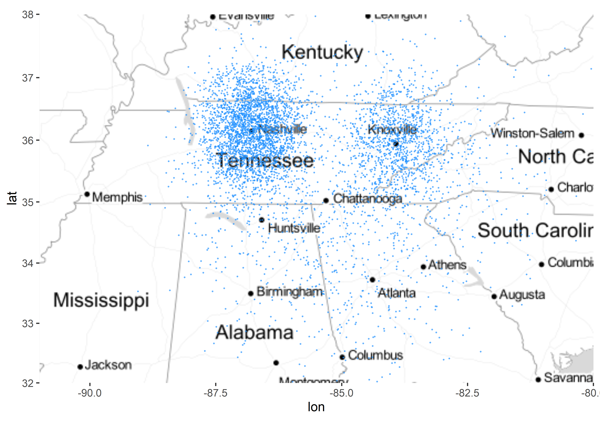
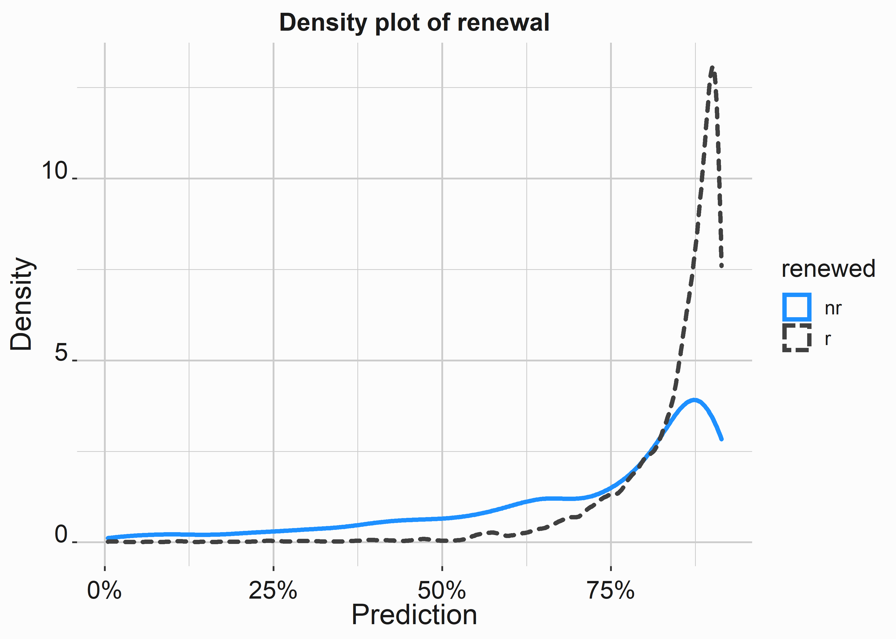
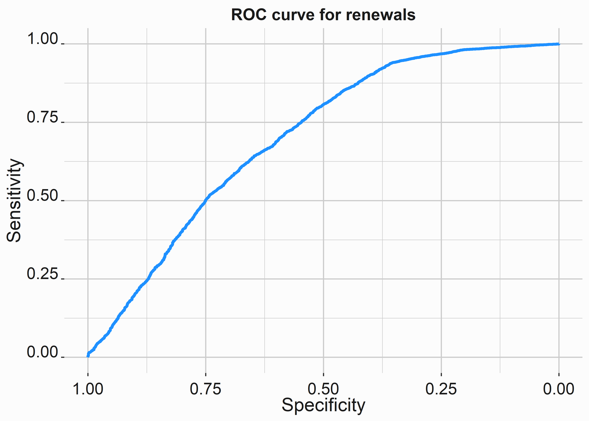

# Lead Scoring  {#chapter7}


What if I told you that I would pay you \$50,000 if you sold four season tickets to someone in the next twenty-four hours? What would you do? The first thing I would do is ask how much the tickets cost. If it is less than \$50,000 I know that I could always just buy the tickets myself and collect the surplus. What are some ways that I could increase the likelihood that I sold those four season tickets?

- I could call a ticket broker and ask them to buy tickets.
- I could look for lapsed purchasers
- I could look for abandoned carts on our website
- I could call individuals who have yet to renew season tickets
- I could beg family and friends to purchase

There are lots of tactics you could deploy to make sure that you are picking all the low-hanging fruit. It is unlikely that you ever get to the point where you simply pick up a telephone and begin calling phone numbers. Is there a way for us to approach this problem more analytically?

Lead scoring is fundamental to sales campaigns. Qualifying leads can be done in many ways, but the goal is always the same. You are ordering your leads in a more efficient way so that your sales efforts can maintain some greater level of efficiency. Warm leads are critical and if someone hasn't interacted with your brand, they are likely a less efficient use of your time. Working in marketing always reminds me of this one-hundred and thirty year old quote:  

> “Half the money I spend on advertising is wasted; the trouble is I don't know which half.”
> 
> --- John Wannamker

Lead scoring should assist you in evaluating your direct sales efforts and help to maximize ROI in that context. However, there are several considerations. How do we evaluate a lead?

- Customer lifetime Value?
- The likelihood to purchase during this sales cycle
- Recent, frequency, monetary value

This might also be a judgment call that is predicated on how sales and marketing teams are incentivized. Always consider compensation packages. Compensation is designed to incentivize behavior. However, it may not be optimized in terms of achieving organizational goals.  

## Recency, frequency, and monetary value

RFM scores have been described as a _poor-man's_ analytic technique. The basic premise is to score sales candidates along three dimensions and to build lists comprising cohorts with the highest aggregate scores. How might this work in practice? 

Let's put together and ad hoc data set to demonstrate how RFM scores might work.


```r
#-----------------------------------------------------------------
# RFM data
#-----------------------------------------------------------------
library(dplyr)
demo_data <- FOSBAAS::demographic_data[,c(1,4)]
set.seed(44)
demo_data <- demo_data %>%
mutate(
lastInteraction = abs(round(rnorm(nrow(demo_data),50,30),0)),
interactionsYTD = abs(round(rnorm(nrow(demo_data),10,5),0)),
lifetimeSpend   = abs(round(rnorm(nrow(demo_data),10000,7000),0))
)
```

We have added three columns to the customer file:

- How long the last interaction happened in days
- How many interaction have happened
- How much has been spent by the customer


Table: (\#tab:lsrfmb)Prepped RFM data

|   custID   |  nameFull   |lastInteraction|interactionsYTD|lifetimeSpend|
|:----------:|:-----------:|:-------------:|:-------------:|:-----------:|
|MBT9G0X70NTI|Philip Riddle|      70       |       7       |    11554    |
|QTR3JJJ5J6GJ|Evelyn Campos|      51       |      14       |    4480     |
|HOMV3XQW32LW|Sarah Valdez |       5       |      13       |    3986     |
|RJ7CCATUH4Q1|Pamela Munoz |      46       |      11       |    9454     |
|9GZT5Z5AOMKV|Ronald Ortiz |      14       |      11       |    11336    |
|S0Y0Y2454IU2|Nicole Barry |      10       |       8       |    9259     |


There are many ways to apply scores here. We will take a similar approach to scoring events, but add one extra step. RFM scores are traditionally built from one to five with five being the highest score.


```r
#-----------------------------------------------------------------
# Function to calculate FRM scores
#-----------------------------------------------------------------
demo_data$Recency       <- -scale(demo_data$lastInteraction)
demo_data$Frequency     <- scale(demo_data$interactionsYTD)
demo_data$MonetaryValue <- scale(demo_data$lifetimeSpend)
# Produce quantiles for each scaled value
r_quant <- unname(quantile(demo_data$Recency,
                           probs = c(.2,.4,.6,.8)))
f_quant <- unname(quantile(demo_data$Recency,
                           probs = c(.2,.4,.6,.8)))
m_quant <- unname(quantile(demo_data$Recency,
                           probs = c(.2,.4,.6,.8)))
# Function to evaluate RFM score
f_create_rfm <- function(quantList,number){
  
  if(number <= quantList[[1]]){'1'}
    else if(number <= quantList[[2]]){'2'}
      else if(number <= quantList[[3]]){'3'}
        else if(number <= quantList[[4]]){'4'}
          else{'5'}
}
```

Now we can apply the function to our data set. We could generalize this more if we wanted. We could also use an apply function. For this sort of exercise, we aren't concerned with extreme efficiency. We just want to demonstrate the mechanics. We'll use lists and for loops to accomplish our task. If we had to repeat this exercise often, daisy chaining for loops is not a best practice. Try not to copy and paste more than three times. You'll make errors. 


```r
#-----------------------------------------------------------------
# Create final RFM values
#-----------------------------------------------------------------
value <- list()
j     <- 1
for(i in demo_data$Recency){
  value[j] <- f_create_rfm(r_quant,i)
  j <- j + 1
}
demo_data$r_val <- unlist(value)
#-----------------------------------------------------------------
value <- list()
j     <- 1
for(i in demo_data$Frequency){
  value[j] <- f_create_rfm(f_quant,i)
  j <- j + 1
}
demo_data$f_val <- unlist(value)
#-----------------------------------------------------------------
value <- list()
j     <- 1
for(i in demo_data$MonetaryValue){
  value[j] <- f_create_rfm(m_quant,i)
  j <- j + 1
}
demo_data$m_val <- unlist(value)
#-----------------------------------------------------------------

demo_data$RFM <- paste(demo_data$r_val,
                       demo_data$f_val,
                       demo_data$m_val, sep = '')
```

Now each customer has an RFM score that can be used to build campaigns. Let's subset a group for a campaign. We'll select customers that have interacted the most recently, the most frequently, and have tended to spend the most.


```r
#-----------------------------------------------------------------
# Create final RFM values
#-----------------------------------------------------------------
top_prospects <- subset(demo_data,demo_data$RFM == '555')
```


Table: (\#tab:rfmc)Top prospects for campaign

|nameFull          |r_val|f_val|m_val|RFM|
|:-----------------|:----|:----|:----|:--|
|Ryan Livingston   |5    |5    |5    |555|
|Russell Church    |5    |5    |5    |555|
|Stephen Lawrence  |5    |5    |5    |555|
|Karen Waller      |5    |5    |5    |555|
|Elizabeth Clements|5    |5    |5    |555|
|Teresa Compton    |5    |5    |5    |555|


RFM scores can be useful for some segmentation schemes and for lead scoring. However, there are better ways to accomplish the same goal. Lead scoring is as close as we get in this book to discussing _Customer Relationship Management_ (CRM). It is also a fundamental component of CRM. The following examples will take you through a more sophisticated example and will take advantage of an analytics framework that will make regression and machine learning easier. 

## Scoring season ticket holders on their liklihood to renew

With advancements in hardware and software, the art of lead scoring has become a bit of a commodity. You can leverage several techniques including: _random forests_, _gradient boosting_, _logistic regression_, or even _deep learning_ with a tool such as Tensorflow without getting penalized because of time and costs. Take a minute to appreciate this fact. It is amazing. Amazon, Google, and others are making this process even better through AWS and GCP. This example will demonstrate how machine-learning is applied to a real world problem. We'll frame this problem around a common question that is asked every year and every club in sports. 

> The ticket sales service manager would like a way to understand which accounts are less likely to renew their season tickets. 

We'll use the mlr3 library [@R-mlr] to demonstrate a couple of different machine learning algorithms.  The package mlr3 is similar to caret [@R-caret] which has been refactored into tidymodels [@R-tidymodels]. Caret was a great library that sought to create a unifying API for scores of other R libraries. We'll look tidymodels in the next chapter. To me, mlr3 is very reminiscent of scikit-learn in Python. If you like using python for analysis, mlr3 will feel familiar.  

While we can call our functions directly, this library makes the process much easier. The lack of consistent frameworks in R is one of the languages biggest drawbacks. Additionally, mlr3 has excellent documentation ^[https://mlr3book.mlr-org.com/train-predict.html]. 

Using a framework also comes with some issues. 

1. You'll have to learn it, which adds some complexity to the task.
2. Errors (especially in beta versions) can be frustrating to trouble-shoot
3. They can work more slowly than the libraries that are used for the task

However, I believe that you'll be better off in the long run to leverage a framework. They tend to make the basic tasks of machine-learning much more systematic and repeatable, especially when it comes to benchmarking. 

Let's also discuss the package data.table [@R-data.table] here. data.table is a powerful tool that underlies many popular packages. While it has many uses, it can be more confusing to work with as opposed to dplyr [@R-dplyr]. It can softly be considered one of the pillars that holds up much of the R universe. If you have been using python, datatable will remind you of pandas [@reback2020pandas]. If you are working with really large data sets, datatable will be useful to learn.

### Implementing a lead scoring project

A random forest is an excellent tool for classification and can forecast more than two classes. Logistic regression is typically used for binary classes (renewed, did not renew) and should probably be your first step. There are forms of logistic regression that will handle multi-class problems. We'll take a look at both tools. In practice, a random forest tends to handle a wide variety of problems you will be faced with at a club very well. 

Missing data or orphan cases can make these tasks extremely frustrating. There is no guarantee that your model will converge. We stated earlier that most of your time will be spent putting your data in order. You'll be much happier if you put the hours into getting your data in the proper spot. The fun part of these exercises is the modeling. However, it ends up being the part you spend the smallest amount of time working on. I hope the high is worth the lows to you.  

Additionally, we should follow the process that we outlined in chapter \@ref(chapter4). We'll do this to demonstrate that it isn't managerial B.S. Structuring projects is critical when you are working in teams or working in a distributed fashion. Let's remind ourselves of the basic steps we want to follow:

1. Define a measurable goal or hypothesis
2. Data collection 
3. Model the data
4. Evaluate your results
5. Communicate the results
6. Deploying the results

#### Defining our goal

We are going to use multiple years of season ticket holder renewal data. We also have a problem statement:

> We don't understand how to identify season ticket accounts that are less likely to renew.

Our output will be a score that can be used to compare customers against one another. We'll need to look for features that might predict whether or not someone is likely to renew their tickets. This might be ticket usage or tenure. We don't know. 

The rub here is that we don't know if we can help improve the prospects that someone might renew. What levers can we pull? It is one thing to build a useful model that predicts renewals for finance, but we are trying to impact renewals for sales. We'll need to think carefully about the insight that we gather. Perhaps we will find something that we didn't know we were looking for. From that perspective, success can be gauged in several ways. 


#### Understanding the data set

Our data set includes several features including an account, whether they renewed, and several features related to their season tickets. The data is located in the _FOSBASS_ package. You can see how the data is created in section \@ref(renewaldata).


```r
#-----------------------------------------------------------------
# access renewal data
#-----------------------------------------------------------------
library(FOSBAAS)
library(dplyr)
mod_data <- FOSBAAS::customer_renewals
```

This data set contains several years of data. It looks like something that you would find at a club and is going to behave appropriately. Let's take a look at the structure of this data:


Table: (\#tab:leadscoredata2)Dataset for evaluating likelihood to renew

|variable   |class    |values           |
|:----------|:--------|:----------------|
|accountID  |character|WD6TDY7C151R     |
|corporate  |character|i                |
|season     |double   |2021             |
|planType   |character|p                |
|ticketUsage|double   |0.728026975947432|
|tenure     |double   |2                |
|spend      |double   |4908             |
|tickets    |double   |6                |
|distance   |double   |61.6614648674555 |
|renewed    |character|nr               |

This data isn't particularly complex. We can see that we have several columns that appear useful. This data set is also already clean, but let's refer to  section \@ref(evaldata) in chapter \@ref(chapter4) to make sure that we are covering all of our bases. We know that this data is in good shape, we still have to deal with major issues that you face when running some operation on your data.

1. What sort of analysis mechanism will be useful to solve this problem?
2. Is this data structured and formatted in a way that I can use it?
3. Are there missing values or other systematic issues that will cause a problem?

Question one is easy. We can refer to our chart in section \@ref(fig:modelingdatachfour). This is clearly an example of calculating future, numerical values. 

For question two, different analysis techniques require different formats. We can see that a couple of columns are categorical. Let's go ahead and create two data sets. We'll dummy code our categorical data so that one data set only contains numerical values.


```r
#-----------------------------------------------------------------
# Dummy code and alter data frame for all numeric input
#-----------------------------------------------------------------
d1 <- as.data.frame(psych::dummy.code(mod_data$corporate))
d2 <- as.data.frame(psych::dummy.code(mod_data$planType))

mod_data_numeric <- dplyr::select(mod_data,ticketUsage,
                                        tenure,spend,tickets,
                                        distance,renewed) %>%
                    dplyr::bind_cols(d1,d2)
```


Table: (\#tab:leadscoredata4)Numeric data set for regression

|ticketUsage|tenure|spend|tickets|distance |renewed|i  |c  |f  |p  |
|:----------|:-----|:----|:------|:--------|:------|:--|:--|:--|:--|
|0.7280270  |2     |4908 |6      |61.661465|nr     |1  |0  |0  |1  |
|0.9921047  |19    |16410|2      |19.534115|nr     |0  |1  |1  |0  |
|0.9791836  |5     |7248 |3      |5.738407 |r      |0  |1  |0  |1  |
|0.8221204  |23    |6442 |2      |1.280233 |r      |1  |0  |1  |0  |
|0.9836147  |5     |19800|8      |19.028667|r      |0  |1  |0  |1  |
|0.9032806  |3     |6640 |4      |15.584057|r      |1  |0  |1  |0  |

For question three, we can do a little preparation on our standard data set. We'll get rid of a couple of columns that we won't use and turn our response variable into a factor. We know there isn't missing data, so we will skip that part. We have already covered how to deal with it.


```r
#-----------------------------------------------------------------
# Prepare the data for analysis
#-----------------------------------------------------------------
mod_data$renewed   <- factor(mod_data$renewed)
mod_data$accountID <- NULL
mod_data$season    <- NULL
```

In terms of prep work, we are ready to go. No need to dwell on it. This chapter is designed to cover data modeling in more detail, so it isn't important anyway. We also didn't have to really worry about data collection. What other data might be interesting to have here? 

Additionally, I would like to briefly cover a special topic that deserves a lot more attention than we are about to give. Maps. Geography is important for sales, marketing, corporate sponsorship groups, and others. In this context, we'll see how geography will impact sales and marketing strategy further along in this chapter. 


##### Understanding geography and building maps

Geography plays a large role in selling tickets to sporting events. This is especially true for sports that have more games such as baseball. Coupling the digital and physical assets of the club may eventually make this less important holistically. However, for ticket sales geography is and will remain a critical point of consideration.

R also isn't the best way to do this, but it is an easy way to accomplish it in the same analysis platform. GIS is a large field unto itself that is outside the scope of this book. However, R has multiple libraries devoted to maps and it is a good choice if you aren't looking for extremely high quality geographic graphics. This map was created using stamen maps^[http://maps.stamen.com/#watercolor/12/37.7706/-122.3782], an open source tool that can be used for a wide variety of projects. 


```r
#-----------------------------------------------------------------
# Using R to visualize geographic data
#-----------------------------------------------------------------
library(ggmap)
library(ggplot2)

demos <- FOSBAAS::demographic_data
demos <- demos[sample(nrow(demos), 5000), ]

map_data <- subset(demos,demos$longitude >= -125 & 
                   demos$longitude <= -67 &
                   demos$latitude >= 25.75 & 
                   demos$latitude <= 49)
us <- c(left = -91, bottom = 32, right = -80, top = 38)
map <- get_stamenmap(us, zoom = 6, maptype = "toner-lite") %>% 
       ggmap() 

geographic_vis <- 
  map +
  geom_point(data = map_data, 
             mapping = aes(x = longitude, y = latitude),
             size = .2,alpha = .5, color= 'dodgerblue')

```




These maps aren't the best, but they are easy to execute and can give you much of the same insight you would get from a more sophisticated product such as ArcGIS ^[https://www.esri.com/en-us/home]. R also makes it easy to access google APIs that will allow you to Geocode addresses and perform many other interesting tasks with geographic data. You can find a multitude of informative demos online. 

Using county names you can create maps that look like the following. This one took a lot of data wrangling and uses the maps [@R-maps] package, but the output looks nice. The underlying data is identical. 


```r
#-----------------------------------------------------------------
# Using R to visualize geographic data
#-----------------------------------------------------------------
library(maps)

fips <- 
maps::county.fips %>%
  as_tibble       %>% 
  extract(polyname, 
          c("region", "subregion"), "^([^,]+),([^,]+)$") 

county_data <- 
ggplot::map_data("county") %>% 
  left_join(fips)          %>%
mutate(county = paste(region,subregion, sep = ',')) 


customers <- left_join(customers,county_data, by = 'county')

counts    <- customers %>% group_by(county) %>%
                           summarise(accounts = n())

county_data <- county_data %>% left_join(counts,by='county') 

state_data           <- map_data("state") 
main_color           <- 'steelblue4'
county_data$accounts <- ifelse(is.na(county_data$accounts) == T,
                               1,
                               county_data$accounts)

# adjust number of accounts per county
correction <- county_data %>% select(county,accounts)                       %>%
                              group_by(county)                              %>%
                              mutate(adjustment = n())                      %>%
                              unique()                                      %>%
                              summarise(adj_accounts = accounts/adjustment) %>%
                              select(county,adj_accounts)

correction$adj_accounts <- ifelse(correction$adj_accounts <= 1,
                                  1,
                                  correction$adj_accounts)

county_data <- county_data %>% left_join(correction, by = 'county')

region_map <- 
      
  county_data %>% 
  ggplot(aes(long, lat, group = group))                                 +
  geom_polygon(aes(fill=log10((adj_accounts))), 
               color=main_color,size = 0)                               +
  geom_polygon(data = state_data ,color="white",
               size = .01,fill = 'transparent')                         +
  coord_map(xlim = c(-91,-79), ylim = c(31,38.5))                       +
 #scale_fill_viridis(option="inferno")                                  + 
  scale_fill_gradient(low = main_color ,high = 'white')                 +
  labs( x = '', y ='',
        title = "Nashville ticket purchasers",
        subtitle = "Total accounts by county",
        caption  = "purchaser density")                                 +
   theme(plot.caption = element_text(hjust = 0, 
                                     face= "italic",color = "grey90"),
         plot.title.position = "plot", 
         plot.caption.position =  "plot",
         plot.subtitle = element_text(color = "grey90"))                +
  graphics_theme_1                                                      +
  theme(rect = element_rect(fill = main_color ),
        axis.text.x  = element_blank(),  
        axis.text.y  = element_blank(),
        panel.grid.major  = element_line(colour = main_color ),  
        panel.grid.minor  = element_line(colour = main_color ), 
        panel.background  = element_rect(fill = main_color , 
                                         colour = main_color ), 
        plot.background   = element_rect(fill = main_color , 
                                         colour = main_color ),
        legend.position="none")
```


#### Model the data {#model}

While we will use the mlr3 framework here, again it is important to understand that there is no need to use one of these frameworks. You can call functions directly. mlr3 is descended from mlr, [@R-mlr] but is built on a more modern framework. You'll want to begin by downloading the library and poking around in it ^[https://mlr3book.mlr-org.com/train-predict.html]. 


```r
#-----------------------------------------------------------------
# Download and install the mlr3 libraries
#-----------------------------------------------------------------
library("mlr3")         #  install.packages("mlr3viz")
library("mlr3learners") #  install.packages("mlr3learners")
library("mlr3viz")      #  install.packages("mlr3viz")
library("mlr3tuning")   #  install.packages("mlr3tuning")
library("paradox")      #  install.packages("paradox")
```

After downloading some of the packages that we will need we can go ahead get started on the task of modeling the data. We know that we want to determine how likely it is that a specific season ticket holder will renew. Make sure that your data set doesn't contain any characters. You'll need to dummy code or change them to factors.


```r
#-----------------------------------------------------------------
# Recode response to a factor
#-----------------------------------------------------------------
mod_data_numeric$renewed <- factor(mod_data_numeric$renewed)
```


This is a classification problem and mlr3 follows a specific pattern when you are building a model. The data is placed in an object called a task:


```r
#-----------------------------------------------------------------
# Build task
#-----------------------------------------------------------------
task_mod_data <- TaskClassif$new(id       = "task_renew", 
                                 backend  = mod_data_numeric, 
                                 target   = "renewed", 
                                 positive = "r")
# Add task to the task dictionary
mlr_tasks$add("task_renew", task_mod_data)
```

The input here is straight forward. We name the object, tell it what data to use, give it a target column, and the result. In this case, "r" indicates that the account renewed in the past. 

After you have a task, you will want to select the _learner_ that you would like to use. MLR works with several other libraries. In this case I would like to apply a random forest to this data and I am going to use the ranger [@R-ranger] package. Ranger is a powerful library and it includes lots of tools that you can leverage to build random forest models. This is where you can add parameters from the ranger function to the library.


```r
#-----------------------------------------------------------------
# Define learner
#-----------------------------------------------------------------
learner_ranger_rf <- lrn("classif.ranger",
                         predict_type = "prob",
                         mtry         = 3,
                         num.trees    = 500)
# Check parameters with this: learner_ranger_rf$param_set$ids()
# look at a list of learners: mlr3::mlr_learners
```

We can now build a test and training data set. As a reminder, we could also use a three-way data partition so that we would have a calibration data set. However, this isn't really necessary. 


```r
#-----------------------------------------------------------------
# Build test and training data set
#-----------------------------------------------------------------
set.seed(44)
train_mod_data <- sample(task_mod_data$nrow, 
                         0.75 * task_mod_data$nrow)
test_mod_data  <- setdiff(seq_len(task_mod_data$nrow), 
                          train_mod_data)
```

Training the model is simple. We'll use our learner object and point it to our task with rows being identified with our training data set.


```r
#-----------------------------------------------------------------
# Train the model
#-----------------------------------------------------------------
learner_ranger_rf$train(task    = task_mod_data, 
                        row_ids = train_mod_data)
```

The learner contains several useful pieces of data that were generated. You can access them in a few different ways. 


```r
#-----------------------------------------------------------------
# Inspect the results
#-----------------------------------------------------------------
# print(learner_ranger_rf$model)
learner_output <- 
tibble::tibble(
    numTrees  = unname(learner_ranger_rf$model$num.trees),
    trys      = unname(learner_ranger_rf$model$mtry),
    samples   = unname(learner_ranger_rf$model$num.samples),
    error     = unname(learner_ranger_rf$model$prediction.error)
)
```


Table: (\#tab:mlr6eval)Learner output

|numTrees|trys|samples|error    |
|:-------|:---|:------|:--------|
|500     |3   |10279  |0.1391261|


This model doesn't appear to do a great job judging by the prediction error. Let's take a look at it on our holdout sample:


```r
#-----------------------------------------------------------------
# Evaluate holdout sample
#-----------------------------------------------------------------
prediction <- learner_ranger_rf$predict(task_mod_data, 
                                        row_ids = test_mod_data)
```

There are several ways to consider how accurate this model might be and interpretation can be confusing. The first thing to look at is a confusion matrix. A confusion matrix is a simple way to gauge how well your model predictions performed against known values.


```r
#-----------------------------------------------------------------
# Confusion matrix
#-----------------------------------------------------------------
prediction$confusion
#>         truth
#> response    r   nr
#>       r  2662  508
#>       nr  106  151
```

A confusion matrix demonstrates how often the model was correct and incorrect for each response. In this case, our model isn't performing very well. Would it perform better than a random guess? There are many other metrics that you can extract from your model.


```r
#-----------------------------------------------------------------
# Evaluate holdout sample
#-----------------------------------------------------------------
measure = msr("classif.acc")
prediction$score(measure)
#> classif.acc 
#>   0.8208345
```

In this case, our model is 0.8208345 percent accurate. Let's visualize some of the results.


For simple models, the _mlr3::autoplot()_ function includes several graphs and is built on ggplot2, which means you can apply your themes to them. First, let's explore our data a little more. You can access the predictions with this command _learner_ranger_rf$model$predictions_. The probabilities may come in useful depending on what you are doing. 


```r
#-----------------------------------------------------------------
# Access model predictions
#-----------------------------------------------------------------
probs <- as.data.frame(learner_ranger_rf$model$predictions)
head(probs)
#>           r         nr
#> 1 0.5376683 0.46233166
#> 2 0.9015481 0.09845190
#> 3 0.9252880 0.07471201
#> 4 0.9603436 0.03965638
#> 5 0.9370835 0.06291653
#> 6 0.9028345 0.09716551
```

We can compare models against one another in a couple of different ways. Here we will compare our random forest model to a model that simply predicts the classifier. It doesn't use the parameters we fed to our model.


```r
#-----------------------------------------------------------------
# Evaluate holdout sample
#-----------------------------------------------------------------

tasks        <- tsks(c("task_renew"))
learner      <- lrns(c("classif.featureless","classif.rpart"),
                     predict_type = "prob")
resampling   <- rsmps("cv")
object       <- benchmark(benchmark_grid(tasks, 
                                         learner, 
                                         resampling))
# Use head(fortify(object)) to see the ce for the resamples
```

Our classification error is better with our random forest, but not by a large amount. These classification errors are from resampling and rerunning the models. 


```r
#-----------------------------------------------------------------
# Boxplot of classification error
#-----------------------------------------------------------------
bplot <- 
autoplot(object)   +
  graphics_theme_1 +
  geom_boxplot(fill = 'dodgerblue') 
```


We can also see that we do generate some lift with the model by looking at the ROC curve. 


```r
#-----------------------------------------------------------------
# ROC curve for random forest model
#-----------------------------------------------------------------
roc_model <- 
autoplot(object$filter(task_ids = "task_renew"), 
         type = "roc") +
  graphics_theme_1 +
  scale_color_manual(values = palette)

```


So what do we do with this data? We can now use our model to predict how likely a person is to renew their ticket. However, we can see that the model doesn't perform as well as we would like. We have a few options in terms of proceding:

- Tune the model parameters to try to improve it
- Try a different model
- Get more data

Let's try a couple of different models and attempt to tune the models to improve their accuracy.

##### Resampling

Conceptually, our last model was validated on one _training_ set of data and one _test_ set of data. Occasionally you'll see a three-way partition of data such as _train_, _test_, and _calibration_ set, but often times it is just a _train_ and _test_ set that were randomly sampled from the entire data set. In many cases this is OK, but it could lead you to having more confidence in your model than is warranted. Resampling strategies will help to calibrate your model and give you more confidence in its accuracy. We can visualize what we mean by resampling in figure \@ref(fig:resamplefig).

<div class="figure">

<p class="caption">(\#fig:resamplefig)Resampling concept</p>
</div>

A common method that you will find is 10-fold cross validation where the learning procedure is executed 10 times on different training sets (that overlap) and the 10 error estimates are averaged to yield an overall error estimate [@Witten2011]. Leveraging a framework such as mlr3 makes these efforts (resampling and tuning) much easier. Let's look at an example of cross validation in regards to the model that we have already constructed. 

The task object and learner objects are identical to what we saw in the previous sections.


```r
#-----------------------------------------------------------------
# Rebuild model
#-----------------------------------------------------------------
task_mod_data <- TaskClassif$new(id       = "task_renew", 
                                 backend  = mod_data_numeric, 
                                 target   = "renewed", 
                                 positive = "r")

learner_ranger_rf$train(task_mod_data, row_ids = train_mod_data)
```

However, we will need to add a resampling object:


```r
#-----------------------------------------------------------------
# Add a resampliing parameter
#-----------------------------------------------------------------
resampling_mod_data  <- rsmp("cv")
```


We'll then need to instantiate the resampling strategy. This just means that we are going to create it again.


```r
#-----------------------------------------------------------------
# Rebuild model
#-----------------------------------------------------------------
resampling_mod_data$instantiate(task_mod_data)
resampling_mod_data$iters
#> [1] 10
```

We can now call the resample. This will take longer than what we have seen because we are building a model on multiple data sets.


```r
#-----------------------------------------------------------------
# We can now call the resample object
#-----------------------------------------------------------------
resamp <- resample(task_mod_data, 
                   learner_ranger_rf, 
                   resampling_mod_data, 
                   store_models = TRUE)
#> INFO  [09:42:23.482] [mlr3] Applying learner 'classif.ranger' on task 'task_renew' (iter 1/10)
#> INFO  [09:42:27.305] [mlr3] Applying learner 'classif.ranger' on task 'task_renew' (iter 2/10)
#> INFO  [09:42:31.092] [mlr3] Applying learner 'classif.ranger' on task 'task_renew' (iter 3/10)
#> INFO  [09:42:34.949] [mlr3] Applying learner 'classif.ranger' on task 'task_renew' (iter 4/10)
#> INFO  [09:42:38.575] [mlr3] Applying learner 'classif.ranger' on task 'task_renew' (iter 5/10)
#> INFO  [09:42:42.480] [mlr3] Applying learner 'classif.ranger' on task 'task_renew' (iter 6/10)
#> INFO  [09:42:46.375] [mlr3] Applying learner 'classif.ranger' on task 'task_renew' (iter 7/10)
#> INFO  [09:42:49.847] [mlr3] Applying learner 'classif.ranger' on task 'task_renew' (iter 8/10)
#> INFO  [09:42:53.493] [mlr3] Applying learner 'classif.ranger' on task 'task_renew' (iter 9/10)
#> INFO  [09:42:57.389] [mlr3] Applying learner 'classif.ranger' on task 'task_renew' (iter 10/10)
```

You now have a more confident way to evaluate your model.


```r
#-----------------------------------------------------------------
# Rebuild model
#-----------------------------------------------------------------
resamp$aggregate(msr("classif.ce"))
#> classif.ce 
#>  0.1794095
# Look at scores from the models: resamp$score(msr("classif.ce"))
```

Our classification error has improved. That is great! How do we improve further. 


##### Optimizing your model

Many algorithms have parameters that can alter the performance of the model. For instance, a random forest can have different numbers of trees applied to the model. How do you know that you are tuning the algorithm appropriately? 

Let's take a look at the different parameters available to the ranger package. There are 29 in all, but we will only look at the first few.


```r
#-----------------------------------------------------------------
# Parameter set
#-----------------------------------------------------------------
param_set <- as.data.frame(learner_ranger_rf$param_set$ids())
head(param_set)
#>   learner_ranger_rf$param_set$ids()
#> 1                             alpha
#> 2            always.split.variables
#> 3                     class.weights
#> 4                           holdout
#> 5                        importance
#> 6                        keep.inbag
```

Let's select a couple of parameters to tune


```r
#-----------------------------------------------------------------
# Tuning parameters
#-----------------------------------------------------------------
tune_rf_params <- ParamSet$new(list(
  ParamInt$new("min.node.size", lower = 10, upper = 200),
  ParamInt$new("max.depth",     lower = 2,  upper = 20),
  ParamInt$new("num.trees",     lower = 500,  upper = 600)
))
```

We will also have to consider a resampling strategy. Since cross-validated results demonstrated similar error rates, let's use a holdout sample. We'll use classification error as our measure.


```r
#-----------------------------------------------------------------
# set resampling and eval parameters
#-----------------------------------------------------------------
resamp_strat     <- rsmp("holdout")
measure_mod_data <- msr("classif.ce")
evals_10         <- trm("evals", n_evals = 10)
```

Let's put everything together into a tune instance that will pass our new criteria to the model. 


```r
#-----------------------------------------------------------------
# Build a tuning instance
#-----------------------------------------------------------------
tune_instance <- TuningInstanceSingleCrit$new(
  task         = task_mod_data,
  learner      = learner_ranger_rf,
  resampling   = resamp_strat,
  measure      = measure_mod_data,
  search_space = tune_rf_params,
  terminator   = evals_10
)
```

Now we have to determine how we search for different parameters to search. We'll use a random search. This means that levels will be randomly searched within the parameters that we set.


```r
#-----------------------------------------------------------------
# Randomly select options within tuning min and max
#-----------------------------------------------------------------
tuner_rf = tnr("random_search")
```


```r
#-----------------------------------------------------------------
# Run the models
#-----------------------------------------------------------------
tuner <- tuner_rf$optimize(tune_instance)
#> INFO  [09:43:12.856] [bbotk] Starting to optimize 3 parameter(s) with '<OptimizerRandomSearch>' and '<TerminatorEvals> [n_evals=10, k=0]'
#> INFO  [09:43:12.869] [bbotk] Evaluating 1 configuration(s)
#> INFO  [09:43:12.889] [mlr3] Running benchmark with 1 resampling iterations
#> INFO  [09:43:12.893] [mlr3] Applying learner 'classif.ranger' on task 'task_renew' (iter 1/1)
#> INFO  [09:43:14.806] [mlr3] Finished benchmark
#> INFO  [09:43:14.927] [bbotk] Result of batch 1:
#> INFO  [09:43:14.929] [bbotk]  min.node.size max.depth num.trees classif.ce warnings
#> INFO  [09:43:14.929] [bbotk]            123        18       542   0.175093        0
#> INFO  [09:43:14.929] [bbotk]  errors runtime_learners
#> INFO  [09:43:14.929] [bbotk]       0             1.91
#> INFO  [09:43:14.929] [bbotk]                                 uhash
#> INFO  [09:43:14.929] [bbotk]  cefa5717-7853-4f82-84c7-dc1b2d5338f9
#> INFO  [09:43:14.931] [bbotk] Evaluating 1 configuration(s)
#> INFO  [09:43:14.947] [mlr3] Running benchmark with 1 resampling iterations
#> INFO  [09:43:14.951] [mlr3] Applying learner 'classif.ranger' on task 'task_renew' (iter 1/1)
#> INFO  [09:43:16.651] [mlr3] Finished benchmark
#> INFO  [09:43:16.672] [bbotk] Result of batch 2:
#> INFO  [09:43:16.674] [bbotk]  min.node.size max.depth num.trees classif.ce warnings
#> INFO  [09:43:16.674] [bbotk]            200        17       507  0.1726855        0
#> INFO  [09:43:16.674] [bbotk]  errors runtime_learners
#> INFO  [09:43:16.674] [bbotk]       0             1.69
#> INFO  [09:43:16.674] [bbotk]                                 uhash
#> INFO  [09:43:16.674] [bbotk]  441dbaa7-c3ca-4170-ac6c-be6981ff5911
#> INFO  [09:43:16.676] [bbotk] Evaluating 1 configuration(s)
#> INFO  [09:43:16.695] [mlr3] Running benchmark with 1 resampling iterations
#> INFO  [09:43:16.699] [mlr3] Applying learner 'classif.ranger' on task 'task_renew' (iter 1/1)
#> INFO  [09:43:18.141] [mlr3] Finished benchmark
#> INFO  [09:43:18.160] [bbotk] Result of batch 3:
#> INFO  [09:43:18.161] [bbotk]  min.node.size max.depth num.trees classif.ce warnings
#> INFO  [09:43:18.161] [bbotk]            120        11       508  0.1739987        0
#> INFO  [09:43:18.161] [bbotk]  errors runtime_learners
#> INFO  [09:43:18.161] [bbotk]       0             1.43
#> INFO  [09:43:18.161] [bbotk]                                 uhash
#> INFO  [09:43:18.161] [bbotk]  43de7bc8-7a7e-46f7-95de-a410957d0f18
#> INFO  [09:43:18.163] [bbotk] Evaluating 1 configuration(s)
#> INFO  [09:43:18.179] [mlr3] Running benchmark with 1 resampling iterations
#> INFO  [09:43:18.184] [mlr3] Applying learner 'classif.ranger' on task 'task_renew' (iter 1/1)
#> INFO  [09:43:19.888] [mlr3] Finished benchmark
#> INFO  [09:43:19.908] [bbotk] Result of batch 4:
#> INFO  [09:43:19.909] [bbotk]  min.node.size max.depth num.trees classif.ce warnings
#> INFO  [09:43:19.909] [bbotk]             79        11       520  0.1755308        0
#> INFO  [09:43:19.909] [bbotk]  errors runtime_learners
#> INFO  [09:43:19.909] [bbotk]       0             1.68
#> INFO  [09:43:19.909] [bbotk]                                 uhash
#> INFO  [09:43:19.909] [bbotk]  bcfcb8ee-56a7-4f2d-95ed-5bed32266f3a
#> INFO  [09:43:19.912] [bbotk] Evaluating 1 configuration(s)
#> INFO  [09:43:19.927] [mlr3] Running benchmark with 1 resampling iterations
#> INFO  [09:43:19.931] [mlr3] Applying learner 'classif.ranger' on task 'task_renew' (iter 1/1)
#> INFO  [09:43:21.645] [mlr3] Finished benchmark
#> INFO  [09:43:21.667] [bbotk] Result of batch 5:
#> INFO  [09:43:21.668] [bbotk]  min.node.size max.depth num.trees classif.ce warnings
#> INFO  [09:43:21.668] [bbotk]            125        11       594  0.1739987        0
#> INFO  [09:43:21.668] [bbotk]  errors runtime_learners
#> INFO  [09:43:21.668] [bbotk]       0             1.72
#> INFO  [09:43:21.668] [bbotk]                                 uhash
#> INFO  [09:43:21.668] [bbotk]  1d6bdac6-cbc4-4afb-b2bc-fdc203bce841
#> INFO  [09:43:21.671] [bbotk] Evaluating 1 configuration(s)
#> INFO  [09:43:21.688] [mlr3] Running benchmark with 1 resampling iterations
#> INFO  [09:43:22.929] [mlr3] Applying learner 'classif.ranger' on task 'task_renew' (iter 1/1)
#> INFO  [09:43:25.079] [mlr3] Finished benchmark
#> INFO  [09:43:25.104] [bbotk] Result of batch 6:
#> INFO  [09:43:25.106] [bbotk]  min.node.size max.depth num.trees classif.ce warnings
#> INFO  [09:43:25.106] [bbotk]            109        16       597  0.1748742        0
#> INFO  [09:43:25.106] [bbotk]  errors runtime_learners
#> INFO  [09:43:25.106] [bbotk]       0             2.16
#> INFO  [09:43:25.106] [bbotk]                                 uhash
#> INFO  [09:43:25.106] [bbotk]  624d031e-9a80-49bd-9f76-041f469001e5
#> INFO  [09:43:25.108] [bbotk] Evaluating 1 configuration(s)
#> INFO  [09:43:25.124] [mlr3] Running benchmark with 1 resampling iterations
#> INFO  [09:43:25.127] [mlr3] Applying learner 'classif.ranger' on task 'task_renew' (iter 1/1)
#> INFO  [09:43:26.033] [mlr3] Finished benchmark
#> INFO  [09:43:26.063] [bbotk] Result of batch 7:
#> INFO  [09:43:26.065] [bbotk]  min.node.size max.depth num.trees classif.ce warnings
#> INFO  [09:43:26.065] [bbotk]            124         4       580  0.1696214        0
#> INFO  [09:43:26.065] [bbotk]  errors runtime_learners
#> INFO  [09:43:26.065] [bbotk]       0             0.89
#> INFO  [09:43:26.065] [bbotk]                                 uhash
#> INFO  [09:43:26.065] [bbotk]  d0980ef1-ac50-4351-bd95-edfb487eb66c
#> INFO  [09:43:26.070] [bbotk] Evaluating 1 configuration(s)
#> INFO  [09:43:26.092] [mlr3] Running benchmark with 1 resampling iterations
#> INFO  [09:43:26.096] [mlr3] Applying learner 'classif.ranger' on task 'task_renew' (iter 1/1)
#> INFO  [09:43:28.997] [mlr3] Finished benchmark
#> INFO  [09:43:29.018] [bbotk] Result of batch 8:
#> INFO  [09:43:29.019] [bbotk]  min.node.size max.depth num.trees classif.ce warnings
#> INFO  [09:43:29.019] [bbotk]             16        17       560  0.1792515        0
#> INFO  [09:43:29.019] [bbotk]  errors runtime_learners
#> INFO  [09:43:29.019] [bbotk]       0             2.89
#> INFO  [09:43:29.019] [bbotk]                                 uhash
#> INFO  [09:43:29.019] [bbotk]  c3e4d9ee-13f3-4ef7-9097-8560cc0abbfd
#> INFO  [09:43:29.022] [bbotk] Evaluating 1 configuration(s)
#> INFO  [09:43:29.037] [mlr3] Running benchmark with 1 resampling iterations
#> INFO  [09:43:29.041] [mlr3] Applying learner 'classif.ranger' on task 'task_renew' (iter 1/1)
#> INFO  [09:43:29.959] [mlr3] Finished benchmark
#> INFO  [09:43:29.981] [bbotk] Result of batch 9:
#> INFO  [09:43:29.982] [bbotk]  min.node.size max.depth num.trees classif.ce warnings
#> INFO  [09:43:29.982] [bbotk]             97         5       520  0.1696214        0
#> INFO  [09:43:29.982] [bbotk]  errors runtime_learners
#> INFO  [09:43:29.982] [bbotk]       0             0.92
#> INFO  [09:43:29.982] [bbotk]                                 uhash
#> INFO  [09:43:29.982] [bbotk]  ab65b9d7-e69b-4646-a4a4-a2e5609df9a8
#> INFO  [09:43:29.984] [bbotk] Evaluating 1 configuration(s)
#> INFO  [09:43:30.003] [mlr3] Running benchmark with 1 resampling iterations
#> INFO  [09:43:30.007] [mlr3] Applying learner 'classif.ranger' on task 'task_renew' (iter 1/1)
#> INFO  [09:43:32.716] [mlr3] Finished benchmark
#> INFO  [09:43:32.738] [bbotk] Result of batch 10:
#> INFO  [09:43:32.740] [bbotk]  min.node.size max.depth num.trees classif.ce warnings
#> INFO  [09:43:32.740] [bbotk]             42        20       560  0.1772817        0
#> INFO  [09:43:32.740] [bbotk]  errors runtime_learners
#> INFO  [09:43:32.740] [bbotk]       0             2.68
#> INFO  [09:43:32.740] [bbotk]                                 uhash
#> INFO  [09:43:32.740] [bbotk]  30f3a832-ed23-4c21-91d5-34e81264d91f
#> INFO  [09:43:32.745] [bbotk] Finished optimizing after 10 evaluation(s)
#> INFO  [09:43:32.746] [bbotk] Result:
#> INFO  [09:43:32.746] [bbotk]  min.node.size max.depth num.trees learner_param_vals
#> INFO  [09:43:32.746] [bbotk]            124         4       580          <list[5]>
#> INFO  [09:43:32.746] [bbotk]   x_domain classif.ce
#> INFO  [09:43:32.746] [bbotk]  <list[3]>  0.1696214
```

Now we can take a look at our best result


```r
#-----------------------------------------------------------------
# Get the best parameters
#-----------------------------------------------------------------
best_params <- tune_instance$result_learner_param_vals
```


The best results came from a minimum node size of `{r tune_instance$result_learner_param_vals$min.node.size` and max depth of 4. 


```r
#-----------------------------------------------------------------
# Observe new classification error
#-----------------------------------------------------------------
tune_instance$result_y
#> classif.ce 
#>  0.1696214
```

Tuning has improved our model. 0.0097881 percent. Now we can apply this model back to our test data and observe the results.


```r
#-----------------------------------------------------------------
# Rerun model
#-----------------------------------------------------------------
learner_ranger_rf$param_set$values = 
  tune_instance$result_learner_param_vals
learner_ranger_rf$train(task_mod_data)
```

This is where a three-part data partition is useful. We would use it to further calibrate these results. Let's take a look at how the new predictions look.


```r
#-----------------------------------------------------------------
# Build a tuning instance
#-----------------------------------------------------------------
prediction_tuned <- learner_ranger_rf$predict(task_mod_data, 
                                        row_ids = test_mod_data)
```

The new model does a fair job of discriminating between those that renewed and did not renew. 


```r
#-----------------------------------------------------------------
# Observe confusion matrix
#-----------------------------------------------------------------
prediction_tuned$confusion
#>         truth
#> response    r   nr
#>       r  2714  504
#>       nr   54  155
```


```r
#-----------------------------------------------------------------
# Observe optimized classification
#-----------------------------------------------------------------
measure = msr("classif.acc")
prediction_tuned$score(measure)
#> classif.acc 
#>   0.8371754
```

We certainly improved the accuracy. Now let's take a look at comparing our model produced with a random forest to a model produced with a different algorithm.

#### Comparing the results of different model types

How do we know that the model that we constructed is the best model for our problem? We'll have to try a few different ones. For these types of problems you are unlikely to have much success by altering your classification system. We will go through this for demonstration purposes. 

We can choose from available learners with the following command. We know that we are looking at classification problems:


```r
#-----------------------------------------------------------------
# Observe all learners
#-----------------------------------------------------------------
mlr3::mlr_learners
#> <DictionaryLearner> with 27 stored values
#> Keys: classif.cv_glmnet, classif.debug,
#>   classif.featureless, classif.glmnet, classif.kknn,
#>   classif.lda, classif.log_reg, classif.multinom,
#>   classif.naive_bayes, classif.nnet, classif.qda,
#>   classif.ranger, classif.rpart, classif.svm,
#>   classif.xgboost, regr.cv_glmnet, regr.debug,
#>   regr.featureless, regr.glmnet, regr.kknn, regr.km,
#>   regr.lm, regr.nnet, regr.ranger, regr.rpart,
#>   regr.svm, regr.xgboost
```

Many algorithms will not accept certain data types. Numerical types are always safe. We'll use the same data set that we have been using to test another algorithm. 


```r
#-----------------------------------------------------------------
# Observe all learners
#-----------------------------------------------------------------

task_mod_data_num <- TaskClassif$new(id   = "task_bench", 
                                 backend  = mod_data_numeric, 
                                 target   = "renewed", 
                                 positive = "r")

learner_num <- 
  list(lrn("classif.xgboost", predict_type = "prob"), 
  lrn("classif.ranger", predict_type = "prob"))

set.seed(44)
train_mod_data_num <- 
  sample(task_mod_data_num$nrow, 0.75 * task_mod_data_num$nrow)
test_mod_data_num  <- 
  setdiff(seq_len(task_mod_data_num$nrow), train_mod_data_num)
```


Now we can build a new task consisting of a group of learners. We'll use a gradient boosting algorithm, our random forest, and a naive bayes algorithm. 


```r
#-----------------------------------------------------------------
# Build new task and learner
#-----------------------------------------------------------------
design_bnch <- benchmark_grid(
task_bnch        <- TaskClassif$new(id  = "task_class2", 
                               backend  = mod_data_numeric, 
                               target   = "renewed", 
                               positive = "r"),
learners_bnch    <- 
  list(lrn("classif.xgboost", predict_type = "prob"), 
       lrn("classif.ranger",  predict_type = "prob"),
       lrn("classif.naive_bayes", predict_type = "prob" )),
resamplings_bnch <- rsmp("holdout")
)
```


```r
#-----------------------------------------------------------------
# benchmark our designs
#-----------------------------------------------------------------
bmr = benchmark(design_bnch)
#> INFO  [09:43:34.337] [mlr3] Running benchmark with 3 resampling iterations
#> INFO  [09:43:34.342] [mlr3] Applying learner 'classif.xgboost' on task 'task_class2' (iter 1/1)
#> INFO  [09:43:34.624] [mlr3] Applying learner 'classif.ranger' on task 'task_class2' (iter 1/1)
#> INFO  [09:43:37.736] [mlr3] Applying learner 'classif.naive_bayes' on task 'task_class2' (iter 1/1)
#> INFO  [09:43:38.170] [mlr3] Finished benchmark
```

We can take a look at the available measures with the following command:


```r
#-----------------------------------------------------------------
# Observe available measures
#-----------------------------------------------------------------
mlr3::mlr_measures
#> <DictionaryMeasure> with 62 stored values
#> Keys: aic, bic, classif.acc, classif.auc,
#>   classif.bacc, classif.bbrier, classif.ce,
#>   classif.costs, classif.dor, classif.fbeta,
#>   classif.fdr, classif.fn, classif.fnr, classif.fomr,
#>   classif.fp, classif.fpr, classif.logloss,
#>   classif.mauc_au1p, classif.mauc_au1u,
#>   classif.mauc_aunp, classif.mauc_aunu,
#>   classif.mbrier, classif.mcc, classif.npv,
#>   classif.ppv, classif.prauc, classif.precision,
#>   classif.recall, classif.sensitivity,
#>   classif.specificity, classif.tn, classif.tnr,
#>   classif.tp, classif.tpr, debug, oob_error,
#>   regr.bias, regr.ktau, regr.mae, regr.mape,
#>   regr.maxae, regr.medae, regr.medse, regr.mse,
#>   regr.msle, regr.pbias, regr.rae, regr.rmse,
#>   regr.rmsle, regr.rrse, regr.rse, regr.rsq,
#>   regr.sae, regr.smape, regr.srho, regr.sse,
#>   selected_features, sim.jaccard, sim.phi, time_both,
#>   time_predict, time_train
```

We can view the measures for each algorithm with the following command: 


```r
#-----------------------------------------------------------------
# Compare the models
#-----------------------------------------------------------------
measures = list(
  msr("classif.auc", id = "auc"),
  msr("classif.ce", id = "ce_train")
)
measure_list <- as.data.frame(bmr$score(measures))
measure_list[,c(6,11,12)]
#>            learner_id       auc  ce_train
#> 1     classif.xgboost 0.6953685 0.1744364
#> 2      classif.ranger 0.6795682 0.1792515
#> 3 classif.naive_bayes 0.6735490 0.2061720
```

Our _xgboost_ model performed slightly better than the random forest. Perhaps we should use it instead. 


#### Manually calling a logistic regression model

Logistic regression is a form of regression that "builds a linear model based on a transformed target variable." [@Witten2011] This target variable will take the form of 1 or 0. Applied to our problem, _will renew_ or _will not renew_. Let's call a basic logistic regression model for fun. 


```r
#-----------------------------------------------------------------
# Compare the models
#-----------------------------------------------------------------
mod <- glm(renewed ~ ticketUsage + tenure + 
           spend + distance,
           data = mod_data_numeric,
           family = binomial(link = "logit")
           )
mod_sum <- 
tibble::tibble(
  deviance      = unlist(summary(mod)$deviance),
  null.deviance = unlist(summary(mod)$null.deviance),
  aic           = unlist(summary(mod)$aic),
  df.residual   = unlist(summary(mod)$df.residual),
  pseudoR2      = 1 - mod$deviance / mod$null.deviance
)
```


Table: (\#tab:chsevenmodoutpu)Summary stats for logistic model

|deviance|null.deviance|  aic   |df.residual|pseudoR2 |
|:------:|:-----------:|:------:|:---------:|:-------:|
|11746.19|  13211.17   |11756.19|   13701   |0.1108893|


This output looks slightly different than the other regression outputs that we have seen. We won't cover logistic regression here, but I wanted to make you aware of it. It generally performs well and is a great place to start if you are predicting two possible outcomes. Additionally, you need to be careful with these models. We estimated a pseudoRSquared, but there are multiple ways to do it. Try the function _pscl::pR2(mod)_ [@pscl2008] to see different methods. 

### Measuring performance

Measuring performance can be difficult. The measures themselves can be technical and confusing. If you are using holdout samples, you can ignore many of them to a degree. If you sampled and calibrated correctly, using "ce" or _classification error_ with a visual inspection of the confusion matrix will often be enough. Let's build a plot of the classification error to give us some additional insight into what is going on.


```r
#-----------------------------------------------------------------
# Compare the models
#-----------------------------------------------------------------
calc_rates <- learner_ranger_rf$predict_newdata(mod_data_numeric)
mod_data_numeric$pred <- predict(mod,newdata = mod_data_numeric,
                                 type = 'response')
```

Let's look at a density plot of the renewal scores and classes.


```r
#-----------------------------------------------------------------
# Density plot of error
#-----------------------------------------------------------------
title   <- 'Density plot of renewal'
x_label <- 'Prediction'
y_label <- 'Density'
density_pred <- 
ggplot(data = mod_data_numeric, 
       aes(x=pred,color=renewed,lty=renewed))    +
  geom_density(size = 1.2)                       + 
  scale_color_manual(values = palette)           +
  scale_x_continuous(label = scales::percent)    +
  xlab(x_label)                                  + 
  ylab(y_label)                                  + 
  ggtitle(title)                                 +
  graphics_theme_1

```




```r
#-----------------------------------------------------------------
# ROC curve
#-----------------------------------------------------------------
library(pROC)
#define object to plot
roc_object <- roc(mod_data_numeric$renewed, mod_data_numeric$pred)

title   <- 'ROC curve for renewals'
x_label <- 'Specificity'
y_label <- 'Sensitivity'

roc_graph <-
ggroc(roc_object,colour = 'dodgerblue',size = 1.2) +
  xlab(x_label)                                    + 
  ylab(y_label)                                    + 
  ggtitle(title)                                   +
  graphics_theme_1
```



It looks like our ROC curve demonstrates that we can be more efficient by targeting certain groups.

## Using this data

Lead scores are __EASY__ to use. Qualifying leads is likely the most important analytics exercise that can be quickly and easily deployed. This is thinking strategically at its simplest and finest. We simply need to apply our preferred model to new data. All of the algorithms performed in a similar way (which isn't uncommon). So what do you do with it. Scored data is typically placed into quantiles and then deployed in order based on what we desire to happen. 


### Building cumulative gains charts

How do we know that our model has efficacy in practice? Let's take a sample of our model data and pretend that it is a new group that we plan to deploy in a renewal campaign. Let's begin by borrowing some data from our last analysis. Let's pretend these individuals are new and we are trying to renew them. 


```r
#-----------------------------------------------------------------
# Build data fro cumulative gains chart
#-----------------------------------------------------------------
mod_data_sample <- 
  mod_data_numeric                                      %>% 
  dplyr::select(pred,renewed)                           %>%
  dplyr::mutate(custId = seq(1:nrow(mod_data_numeric))) %>%
  dplyr::sample_n(5000)                                 %>%
  dplyr::arrange(desc(pred))

qt <- quantile(mod_data_sample$pred,
               probs = c(.1,.2,.3,.4,.5,.6,.7,.8,.9))

f_apply_quant <- function(x){
ifelse(x >= qt[9],1,
  ifelse(x >= qt[8],2,
    ifelse(x >= qt[7],3,
      ifelse(x >= qt[6],4,
        ifelse(x >= qt[5],5,
          ifelse(x >= qt[4],6,
            ifelse(x >= qt[3],7,
              ifelse(x >= qt[2],8,
                ifelse(x >= qt[1],9,10)))))))))
}

mod_data_sample$group <- sapply(mod_data_sample$pred,
                                function(x) f_apply_quant(x))

table(mod_data_sample$group,mod_data_sample$renewed)
#>     
#>       nr   r
#>   1   53 447
#>   2   52 448
#>   3   56 444
#>   4   52 448
#>   5   52 449
#>   6   71 428
#>   7  101 399
#>   8   83 417
#>   9  124 376
#>   10 299 201
```


```r
#-----------------------------------------------------------------
# Build data for cumulative gains chart
#-----------------------------------------------------------------
mod_data_sample$renewedNum <- 
  ifelse(mod_data_sample$renewed == 'r',1,0)
mod_data_sample$perpop <- 
  (seq(nrow(mod_data_sample))/nrow(mod_data_sample))*100

mod_data_sample$percRenew <- 
cumsum(mod_data_sample$renewedNum)/sum(mod_data_sample$renewedNum)

title   <- 'Cumulative gains chart'
x_label <- 'Population'
y_label <- 'Cumulative Renewal Percentage'
cgc <- 
ggplot(mod_data_sample,aes(y=percRenew,x=perpop))           +
  geom_line(color = mod_data_sample$group,size = 1.2 )      +
  geom_rug(color = mod_data_sample$group,sides = 'b' )      +
  geom_abline(intercept = 0, slope = .01, size = 0.5,lty=3) +
  xlab(x_label)                                             + 
  ylab(y_label)                                             + 
  ggtitle(title)                                            +
  graphics_theme_1

```


What would this curve look like if the renewal rates differed more by group?


```r
#-----------------------------------------------------------------
# Build data for improved cumulative gains chart 
#-----------------------------------------------------------------
mod_data_gain <- mod_data_sample %>%
                 group_by(group) %>%
                 summarise(cumRenewed = sum(renewedNum))

new_renewals <- c(500,490,455,400,300,200,120,90,70,20)
mod_data_gain$cumRenewed <- new_renewals

mod_data_gain$gain <- 
  cumsum(mod_data_gain$cumRenewed/sum(mod_data_gain$cumRenewed))


title   <- 'Cumulative gains chart'
x_label <- 'Group'
y_label <- 'Gain'

cgc_imp <- 
ggplot(mod_data_gain,aes(y=gain,x=group))                  +
 geom_line(color = mod_data_gain$group,size = 1.2)         +
 scale_x_continuous(breaks = c(0,1,2,3,4,5,6,7,8,9,10))    +
 geom_abline(intercept = 0, slope = .01, size = 0.5,lty=3) +
 xlab(x_label)                                             + 
 ylab(y_label)                                             + 
 ggtitle(title)                                            +
 graphics_theme_1

```


We can see that the curve is pushed out in the middle. A the curve begins to flatten, your campaign is less efficient. These problems are complex. Your data isn't perfect and it can be difficult to get the amazing results you see in texts.  

## Key concepts and chapter summary

Systematically interacting with your potential customers is a core component of direct marketing. We covered a few major concepts:

- RFM scores
- Lead scoring with a random forest
- Cross Validation
- Model optimization
- Model comparisons
- Evaluating your model for efficacy
- How to use these models in practice

These subjects cover specific techniques for lead scoring, but also cover model construction in some depth. 

- Recency, Frequency, and Monetary Value scores are relatively simple to construct and have been referred to as "poor man's analytics." They are easy to interpret and simple to use. 
- A random forest is a great tool when your data is short-and-wide. The results are easy to interpret and tend to work as well as a logistic regression. This is bread-and-butter machine learning.
- Cross validating results is an important part of the analytics process that is sometimes overlooked when building a model.
- Models can be optimized in different ways depending on the model. This includes regression models and machine learning models.
- There are readily-available tools that you can use to compare models against each other. It is always best to try a couple of different things.
- Leveraging lead-scores is simple and makes your salespeople more effective. 


