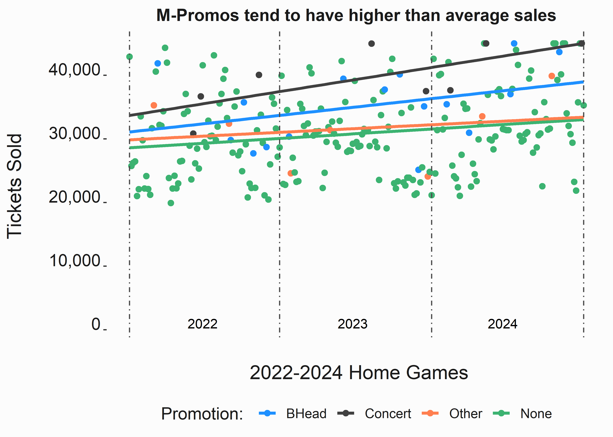
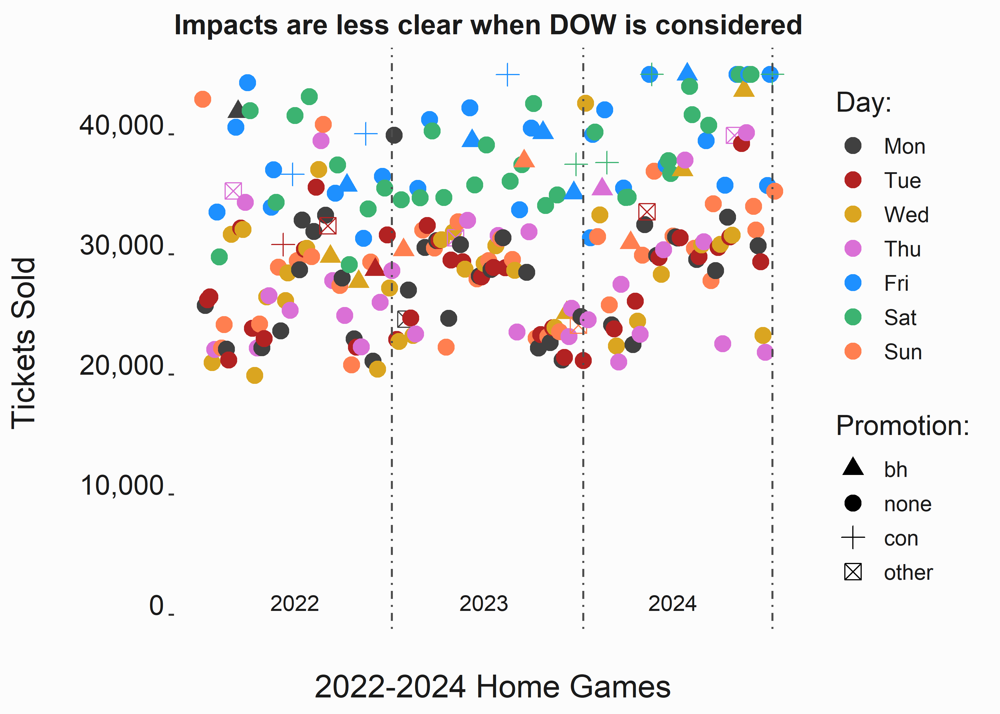
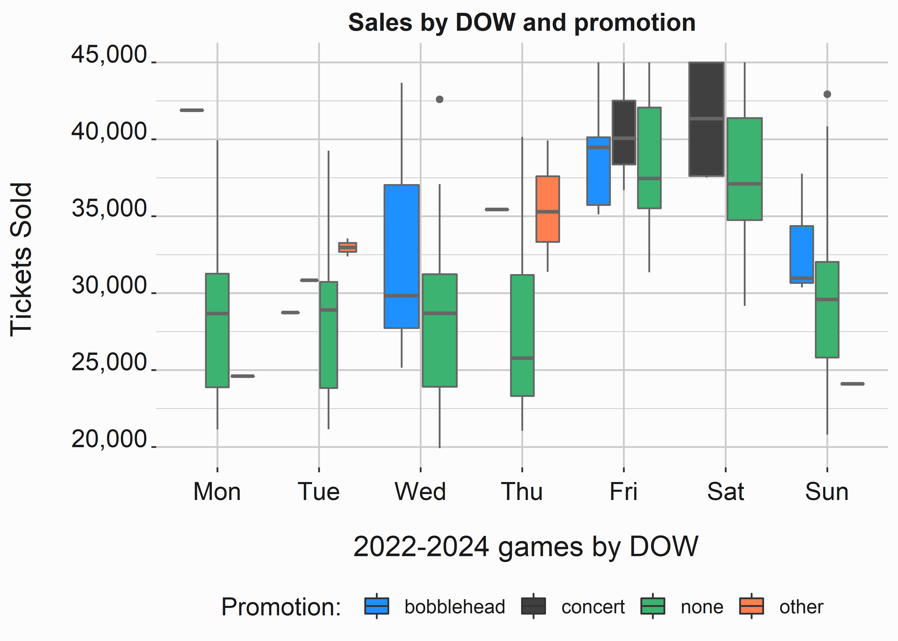
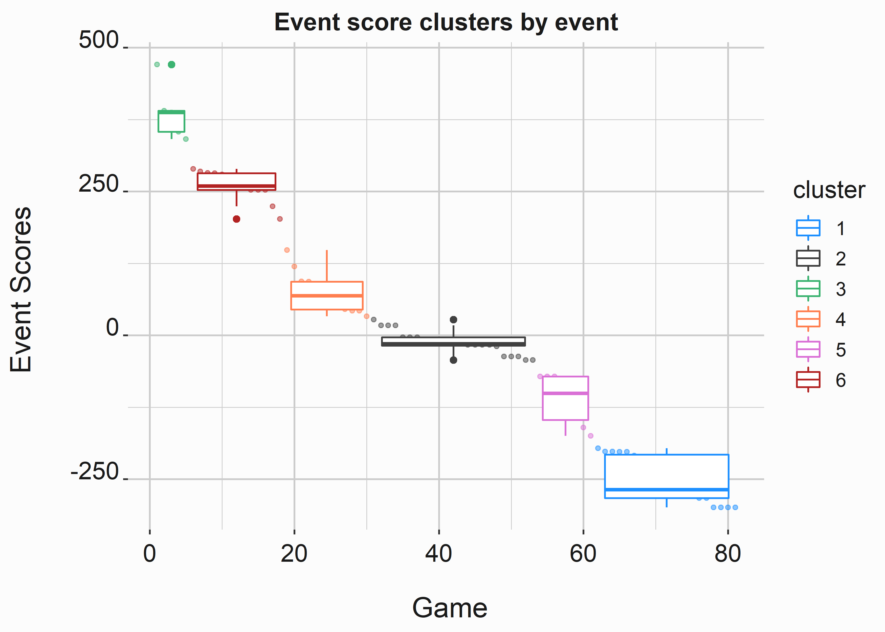
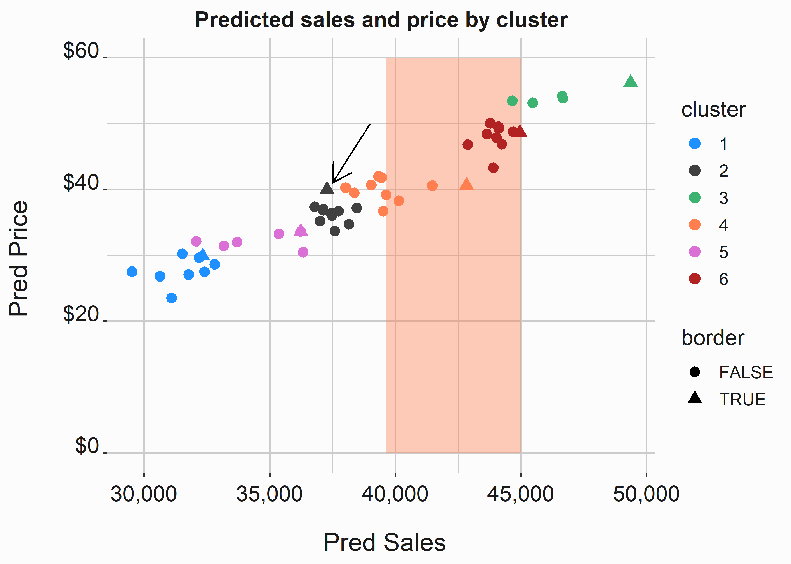

# Marketing promotions {#chapter8}


It can be difficult to measure the efficacy of promotions. If we take a wider view of promotions and consider all advertising as some form of promotion it becomes even more difficult. Some clubs have began to eliminate many forms of promotion if they are unable to measure the outcomes. While this makes sense on some level, I don't go that far. Major Sport brands are unique in some ways because the brands tend to carry themselves when the team is performing well. However, you can't always be good. How do you reconcile these issues from the standpoint of promotions? This chapter will give a specific example of measuring the impact of a promotion and cover some of the nuance of this subject in the context of a club.

Why do teams have promotions? Like all marketing techniques, promotions exist to increase sales. In sports, they are typically _a response to less anticipated demand than capacity_. However, this concept can be paradoxical. Promotions perform the best when the team is performing the best. If you were to take a multi-year point-of-view on marketing you would likely make different decisions than if you only look at it from a fiscal-year standpoint. There are also brand considerations.

Additionally, there are competing philosophies on the use of promotions. There are only so many levers that a franchise can pull to increase the likelihood of someone purchasing a ticketing product and the biggest one is price. It is also important to note that they typically have a cost ^[Often promotions are tied to a sponsorship deal] so justifying a return on the investment is typically considered (assuming your goal isn't solely on maximizing revenue). 

Typical sales promotions are aimed at value: getting more product for less money. However, you see a myriad of promotions in sports:

- Giveaways such as bobbleheads and hats
- Post-game concerts
- Buy one ticket, get one free
- Loyalty programs for season ticket holders
- Flash sales and other dynamic pricing promotions

Additionally, promotions may also have negative impacts on your brand integrity. Constantly reverting to price promotions can damage your brand [@Keller2003]. 

> "The objective of value pricing is to uncover the right blend of product quality, product cost, and product prices that fully satisfies the needs and wants of consumers and the profit targets of the firm". 

Furthermore, many channels are notoriously difficult to evaluate. Advertisement and promotion could occur in any number of places:

- OOH (out of home) refers to billboards, etc.
- Radio
- Television
- SEM (Search engine)
- Online agencies (Double-Click)
- Social Media
- Earned media such as television coverage 
- Podcasts
- Foundation activities and other charitable ventures

Social platforms have become an increasingly important part of advertisement. However, the platforms are walled gardens with their own algorithms for demonstrating ROAS. They don't have an incentive to tell you that something isn't working. SEM is an even bigger problem and can be confounding. If I know when you type "Game Hen Tickets" into goggle it seems like it would be pretty easy to serve you an ad that can potentially be tracked to a sale. SEM is more of a beach-head for secondary market sellers. The secondary markets such as Stubhub tends to worry more about transactions. Since they operate across the spectrum of tickets, they are impossible to outspend. 

Media evaluation is handled in specific ways. A.I. based methods using neural networks to measure exposure have become popular over the past several years. Media equivalency is tough and typically propped up by some arbitrary figure. We'll discuss evaluating advertising later in this chapter. 

How do you know if any of your other marketing activity is worthwhile? In many cases you don't. Baselining sales can be difficult because all of these activities are naturally baked-into your sales. Some effects, such as what we see with salary in figure \@ref(fig:salarytwoaa) are clearly outside of a marketer's influence. 

The following graph was produced from public data on ticket sales and average salary for MLB teams. The points are colored based on the population of the region. 

<div class="figure">

<p class="caption">(\#fig:salarytwoaa)Relationship between ticket sales and salary</p>
</div>

There is clearly some level of correlation between payroll and tickets sold. However, it isn't clear that the size of the market has any impact on salary or sales. Although it does appear that small markets tend to cluster near the bottom of salary and large markets cluster near the top. We could use a clustering algorithm on this data to see if that is true, but this is only for illustration. It also begs a question.

> If you are able to make reasonable estimates as to ticket sales using macro factors such as payroll and wins, what impact do your marketing efforts actually have?

This is a sticky point, but it is valid. You will never find a president or owner that liquidates their marketing department. Indeed they do a lot more than push tickets. The most important factor for many clubs is likely the investment in the team. This is more true for baseball because of the number of games. You are more exposed to perturbations in performance when you have more events. This is where the NFL has a major advantage. 

There is also a lot of complexity in specific market conditions. There are a number of questions that we can ask ourselves when focusing on ticket sales.

- How many single game tickets were sold to individuals not in our database?
- Do we recycle the same fans for promotions?
- Are average ticket sales higher during a major promotion?
- Is _turnstile_ higher during major promotions... How are F&B sales impacted?
- Can we identify a causal link between _sales/turnstile/revenue_ during major promotions?
- Do major promotions promote the purchase of less expensive tickets reducing yield?

If there is reasonably good evidence that major promotions do increase ticket sales, are the increased ticket sales an efficient use of marketing dollars? Additionally, which type of major promotion is the most efficient? We'll walk through an example of how to evaluate major promotions and then talk about measuring other forms of media exposure. This chapter may seem a little repetitive. We are going to conduct an analysis of season data, but in a slightly different way. Promotions are likely to have small samples and that puts us in a non-parametric world. This is a scary place where your go-to tools may not work as they should. 


## Measuring the impact of promotions

Measuring the impact of promotions can be difficult. This analysis builds on analyses that we have already completed. We'll begin with the now familiar season_data data set. This is a great spot to begin in order to evaluate promotions.


```r
#-----------------------------------------------------------------
# Season data structure
#-----------------------------------------------------------------
data <- FOSBAAS::season_data

data_struct <- 
  data.frame(
  variable = names(data),
  class    = sapply(data, typeof),
  values   = sapply(data, function(x) paste0(head(x)[1:2],  
                                      collapse = ", ")),
            row.names = NULL
  )
```


Table: (\#tab:promotiondata1)Dataset for evaluating promotions

|variable         |class    |values                |
|:----------------|:--------|:---------------------|
|gameNumber       |double   |1, 2                  |
|team             |character|SF, SF                |
|date             |double   |2022-03-27, 2022-03-28|
|dayOfWeek        |character|Sun, Mon              |
|month            |character|Mar, Mar              |
|weekEnd          |logical  |FALSE, FALSE          |
|schoolInOut      |logical  |FALSE, FALSE          |
|daysSinceLastGame|double   |50, 1                 |
|openingDay       |logical  |TRUE, FALSE           |
|promotion        |character|none, none            |
|ticketSales      |double   |42928, 25759          |
|season           |double   |2022, 2022            |

This data will allow us to look at the two most typical promotions that a baseball team might conduct. Bobbleheads and Concerts are ubiquitous across sports. It would lead you to believe that they are effective ticket drivers. However there are many considerations.


```r
#-----------------------------------------------------------------
# Promotions by season
#-----------------------------------------------------------------
data$count <- seq(1:nrow(data))

x_label  <- ('\n 2022-2024 Home Games')
y_label  <- ('Tickets Sold \n')
title   <- ("M-Promos tend to have higher than average sales")
ticket_sales <- 
  ggplot(data, 
         aes(x = count,y = ticketSales, 
             color = factor(promotion)),
             group = promotion)                                  +
  ggtitle(title)                                                 +
  xlab(x_label)                                                  +                         
  ylab(y_label)                                                  +                           
  scale_y_continuous(labels = scales::comma)                     +
  geom_point(aes(y=ticketSales,x=count), size=2)                 +
  geom_smooth(data=subset(
    data,promotion == 'bobblehead' | promotion == 'concert' | 
    promotion == 'other' | promotion == 'none'),
    method='lm',formula=y~x,se=FALSE,fullrange=TRUE,size=1.2)    +
  geom_vline(xintercept = 1, lty=4, color='grey30')              +
  geom_vline(xintercept = 81, lty=4, color='grey30')             +
  geom_vline(xintercept = 162, lty=4, color='grey30')            +
  geom_vline(xintercept = 243, lty=4, color='grey30')            +
  scale_color_manual(
    breaks = c('bobblehead','concert','other','none'),
    values=palette, name='Promotion: ',
    labels=c("BHead","Concert","Other",'None'))                  +    
  annotate("text", x = 40,  y = 1000, 
           label = "2022", color='black')                        +
  annotate("text", x = 120, y = 1000, 
           label = "2023", color='black')                        +
  annotate("text", x = 200, y = 1000, 
           label = "2024", color='black')                        +
  graphics_theme_1                                               + 
  theme(
    axis.text.x      = element_blank(),
    legend.position  = "bottom",
    panel.grid.major = element_blank(),  
    panel.grid.minor = element_blank(), 
    axis.ticks.x=element_blank()
  )

```


<div class="figure">

<p class="caption">(\#fig:promotiongraphaabb)Ticket sales by season</p>
</div>

Let's take a little closer look at this data. There are very wide differences between many games. We saw in chapter \@ref(chapter6) that a few variables can be used to predict sales. This is the type of graphic that can be misleading. If you simply took averages of sales it would appear that promotions increase ticket sales. However, our product isn't consistent. The wide variation in sales contains seasonality, trends, and other endogenous factors that all influence turnout. 


```r
#-----------------------------------------------------------------
# Promotions by day of the week
#-----------------------------------------------------------------
x_label  <- ('\n Promotion')
y_label  <- ('Day of Week\n')
title    <- 
  ('Average Sales (10,000s) by promotion and day of week \n')

promos <- 
  data                                         %>% 
  group_by(dayOfWeek,promotion,season)         %>%
  summarise(avgTickets = median(ticketSales))

tile_sales <- 
  ggplot(promos, aes(y=dayOfWeek,x=promotion))                   +
  facet_grid(.~season)                                           +
  geom_tile(aes(fill = avgTickets))                              + 
  geom_text(aes(label = round((avgTickets/10000), 2)),
                color='grey10')                                  +
  scale_fill_gradient(low = "white", high = "dodgerblue", 
                      space = "Lab",
                      na.value = "grey10", guide = "colourbar")  +
  ggtitle(title)                                                 +
  xlab(x_label)                                                  +                       
  ylab(y_label)                                                  + 
  scale_y_discrete(limits=c('Mon','Tue','Wed','Thu',
                            'Fri','Sat','Sun'))                  + 
  scale_x_discrete(limits = c('bobblehead','concert',
                              'none','other'),
                   labels=c('bh','concert','none','other'))      +
  graphics_theme_1 + theme(
    legend.position  = "bottom",
    axis.text.x      = element_text(angle = 0, size = 10, 
                                    vjust = 0, color = "grey10"),
    legend.title     = element_text(size = 10, face = "plain", 
                                    color = "grey10"), 
    legend.text      = element_text(size = 7, color = "grey10")
    )
```


This code chunk produces the tile plot in figure \@ref(fig:promotiongraphb). We can see that concerts almost always occur on the weekend. The same is true for Bobbleheads. How can we control for this to determine if they are having the impact on sales that we would like? We'll take a look at this data in a few different ways for clarity. It is often useful to experiment with graphics. The same data may tell different stories. 


<div class="figure" style="text-align: center">

<p class="caption">(\#fig:promotiongraphb)Ticket sales by season and day of week</p>
</div>

Let's take a brief aside and talk about color interpolation. There are several ways to interpolate colors in R. In addition, the virids library [@R-viridis] is an interesting color package that produces very vivid results if used in the correct context. Give them a try.  


```r
#-----------------------------------------------------------------
# Color interpolation
#-----------------------------------------------------------------
library(viridis)
scale_fill_viridis(direction = 1, option = "B",trans="log2") 
scale_fill_distiller(palette = 'Greens',direction = 1)
```


There does appear to be some difference between the days of the week. Let's look at them in a slightly different way.


```r
#-----------------------------------------------------------------
# Promotions by season and day of week
#-----------------------------------------------------------------
data$count <- seq(1:nrow(data))

x_label  <- ('\n 2022-2024 Home Games')
y_label  <- ('Tickets Sold \n ')
title    <- ("Impacts are less clear when DOW is considered")

dow_sales <- 
  ggplot(data, aes(x = count,y = ticketSales, 
                   color = factor(dayOfWeek),
                   shape = factor(promotion),
                   group =factor(dayOfWeek)))                +
  ggtitle(title)                                             +
  xlab(x_label)                                              +                            
  ylab(y_label)                                              +
  scale_x_continuous( breaks = 1:242)                        +
  scale_y_continuous(labels  = scales::comma)                +
  geom_point(aes(y=data$ticketSales,x=data$count), size=3.5) +
  geom_vline(xintercept = 81,  lty = 4,  color ='grey30')    +
  geom_vline(xintercept = 162, lty = 4, color ='grey30')     +
  geom_vline(xintercept = 242, lty = 4, color ='grey30')     +
  scale_color_manual(breaks = c("Mon", "Tue",'Wed','Thu',
                                'Fri','Sat','Sun'),
                     values = palette,
                     name   ='Day: ',
                     labels = c("Mon", "Tue",'Wed','Thu',
                              'Fri','Sat','Sun'))            +   
  scale_shape_manual(
    breaks = c('bobblehead','none','concert','other'),
    name='Promotion: ',
    values = c(17,19,3,7),
    labels=c("bh",'none','con','other'))                     +   
  annotate("text", x = 40,  y = 1000, 
           label = "2022", color='grey10')                   +
  annotate("text", x = 120, y = 1000, 
           label = "2023", color='grey10')                   +
  annotate("text", x = 200, y = 1000, 
           label = "2024", color='grey10')                   +
  graphics_theme_1                                           +   
  theme(
    axis.text.x      = element_blank(),
    legend.position  = "right",
    panel.grid.major = element_blank(),  
    panel.grid.minor = element_blank(), 
    axis.ticks.x     = element_blank())

```

We see a predictable pattern here that we could have assumed by the previous plot. Our analysis is confounded by many factors and we can't take sales at face value. 

<div class="figure">

<p class="caption">(\#fig:promotiongraph3)Ticket sales by season</p>
</div>


```r
#-----------------------------------------------------------------
# Box plot, sales by day of week
#-----------------------------------------------------------------
x_label  <- ('\n 2022-2024 games by DOW')
y_label  <- ('Tickets Sold \n ')
title    <- ("Sales by DOW and promotion")

dow_sales_box <- 
  ggplot(data, aes(x     = dayOfWeek, 
                   fill  = factor(promotion), 
                   color = factor(promotion)))               +
  ggtitle(title)                                             +
  xlab(x_label)                                              +                               
  ylab(y_label)                                              +
  scale_y_continuous(labels = scales::comma)                 +
  scale_x_discrete(limits=c("Mon", "Tue",'Wed','Thu',
                            'Fri','Sat','Sun'))              + 
  geom_boxplot(aes(y=ticketSales))                           +
  scale_color_manual(
    breaks = c('bobblehead','concert','none','other'),
    values=c('grey40','grey40','grey40','grey40'), 
    name='Concert: ',
    labels=c('bobblehead','concert','none','other'),
    guide = 'none')                                          +    
  scale_fill_manual(
    breaks = c('bobblehead','concert','none','other'),
    values=c(palette), 
    name='Promotion: ',
    labels=c('bobblehead','concert','none','other'))         +
  graphics_theme_1                                           +   
  theme(legend.position  = "bottom")

```

This plot does a good job of discriminating between promotions. It appears that concerts, bobbleheads, and other promotions do generate more sales on average when the day of week is taken into account. Could some other factor such as the opponent be having an impact here? 

<div class="figure">

<p class="caption">(\#fig:promotiongraph4)Ticket sales by season</p>
</div>

### Regressing on our data

As we have seen, regression takes some rigor to do correctly. It works best when you have a lot of data, which is a luxury that we don't tend to have in many cases. We'll go though another example, but we are going to look at our analysis in a slightly different way. We'll also use a different framework this time. Why? Why not? There are lots of ways to do the same thing in R and you will like certain ways better. 

We'll use the tidymodels [@R-tidymodels] package for this exercise ^[https://www.tidymodels.org/].Tidymodels (like MLR3) It will make the preprocsssing and evaluation much simpler. We'll begin by installing our libraries and doing a little processing on the data.


```r
#-----------------------------------------------------------------
# preprocessing our data
#-----------------------------------------------------------------
library(tidymodels)
library(readr)      
library(broom.mixed) 
library(dotwhisker)  
library(skimr)
library(dplyr)

data <- FOSBAAS::season_data
data <- data[,c("gameNumber","team","month","weekEnd",
                "daysSinceLastGame","promotion","ticketSales")]
```

Again, We are going to build a linear regression model. We also know that we are interested in how much influence promotions have on ticket sales. We'll make one change to this data set with the function _f_change_order()_ to make our results easier to interpret when we complete this exercise.


```r
#-----------------------------------------------------------------
# Alter promotions 
#-----------------------------------------------------------------
f_change_order <- function(x){
  if(x == "none"){"anone"}
  else{x}
}
data$promotion <- sapply(data$promotion,function(x) 
                         f_change_order(x))
```

We'll use the rsample library [@R-rsample] to build our training and test set. There are so many ways to partition data and we have used a different one every time. Find one that you like. We'll split the data with twenty-five percent going to our holdout sample. Be aware that if you try to use your model to predict sales and a value in the new data the model won't work. This can be frustrating. Just making you aware. It will happen. 


```r
#-----------------------------------------------------------------
# Splitting our data set
#-----------------------------------------------------------------
set.seed(755)
data_split <- initial_split(data, prop = .75)
train_data <- rsample::training(data_split)
test_data  <- rsample::testing(data_split)
```

Tidymodels leverages tidy principles and builds _recipes_ up in layers. I find this to be easier to work with than other frameworks. Pipes are just easier to read and to understand. However, programmers might find the procedural nature of them irritating. 


```r
#-----------------------------------------------------------------
# Build a recipe
#-----------------------------------------------------------------
sales_rec <-  recipe(ticketSales ~ ., data = train_data)
```

Piping in steps like dummy coding the variables is easy in this system. It makes preprocessing the data a mechanical exercise. 


```r
#-----------------------------------------------------------------
# Add functions to the recipe
#-----------------------------------------------------------------
sales_rec <- recipe(ticketSales ~ ., data = train_data) %>% 
             update_role(gameNumber, new_role = "ID")   %>%
             step_dummy(all_nominal(), -all_outcomes()) %>%
             step_zv(all_predictors())
```

You can check your recipe with a couple of commands. 


```r
#-----------------------------------------------------------------
# Check the recipe 
#-----------------------------------------------------------------

data_test <- sales_rec                 %>% 
             prep()                    %>% 
             bake(new_data = test_data)

head(data_test)[c(4:9)]
#> # A tibble: 6 × 6
#>   ticketSales team_ATL team_BAL team_BOS team_CHC team_CIN
#>         <dbl>    <dbl>    <dbl>    <dbl>    <dbl>    <dbl>
#> 1       25759        0        0        0        0        0
#> 2       26464        0        1        0        0        0
#> 3       29787        0        1        0        0        0
#> 4       35277        0        0        0        1        0
#> 5       40594        0        0        0        1        0
#> 6       32073        0        0        0        1        0
```


We will select linear regression as the model to deploy.


```r
#-----------------------------------------------------------------
# Define a model
#-----------------------------------------------------------------
lm_model <- linear_reg()           %>% 
            set_engine('lm')       %>% 
            set_mode('regression')
```


Tidymodels uses the concept of workflows to process the regression steps. 


```r
#-----------------------------------------------------------------
# build a workflow
#-----------------------------------------------------------------
sales_wflow <- workflow()           %>% 
               add_model(lm_model)  %>% 
               add_recipe(sales_rec)
```


```r
#-----------------------------------------------------------------
# build a workflow
#-----------------------------------------------------------------
set.seed(755)
folds        <- vfold_cv(train_data, v = 10)
sales_fit_rs <- sales_wflow          %>% 
                fit_resamples(folds)

cv_metrics <- collect_metrics(sales_fit_rs)
```


Finally, we'll apply the workflow and fit the model to the training data set. 


```r
#-----------------------------------------------------------------
# Run the model and extract the results
#-----------------------------------------------------------------

sales_fit <- sales_wflow            %>% 
             fit(data = train_data)

results   <- sales_fit             %>% 
             extract_fit_parsnip() %>% 
             tidy()
```

You can also extract the model 


```r
#-----------------------------------------------------------------
# build a workflow
#-----------------------------------------------------------------
model         <- extract_fit_engine(sales_fit)
model_metrics <- glance(model)
```


We know that we have sample size issues with this data. Can we trust these coefficients? 

We can use the coefficients in this model to help us explain the impact that specific promotions have relative to other variables. A bobblehead is worth about 4,062 ticket sales. 

However this isn't the entire story. Concerts, bobbleheads, and other promotions have different costs. For a concert, costs could be very high. You have a lot to consider:

- Talent fees
- Production fees
- Replacing damaged turf
- Lighting

This is far from an exclusive list, but the electric bill at a stadium may shock you. A promotion such as a bobblehead has a much more discrete cost. You have a per unit fee and incur the costs associated with storing and dispensing the item. This makes the calculus fairly simple if you are only considering the dimension of ticket sales. Concerts may increase other ancillary purchases such as food and beverage. Additionally, the excess tickets sold for a bobblehead may be the least expensive seats in the stadium. Which one will net the most revenue?


## How to place promotions on a schedule

We covered a top down approach to forecasting in chapter \@ref(chapter6). How do you know which dates to select for a particular promotion. The calculus typically revolves around two considerations:

- Maximizing ticket impact
- Maximizing revenue impact 

How do you know if you are making these takeoffs? Certain scenarios may make the correct decision unclear. Let's look at our example from chapter \@ref(chapter6). Now that we have confirmed that bobbleheads and concerts increase ticket sales, let's add another bobblehead. Where should we add this promotion? The event scores that we produced for the _season_2025_ data set may give us some clues. There are also many qualitative considerations that we will discuss. 

Let's start by visualizing our data. Where do the boundaries exist between event scores? We clustered this data in section and will use these clusters to identify candidates for a promotion. 


```r
#-----------------------------------------------------------------
# Clustered events
#-----------------------------------------------------------------
season_2025 <- read.csv('files/season_2025.csv')

season_2025$cluster <- factor(season_2025$cluster)
x_label  <- ('\n Game')
y_label  <- ('Event Scores \n')
title   <- ('Event score clusters by event')
es_box <- 
  ggplot2::ggplot(data = season_2025, 
                  aes(x = order,
                      y = eventScore,
                      color = cluster))             +
  geom_point(size = 1,alpha = .5)                   +
  geom_boxplot()                                    +
  scale_color_manual(values = palette)              +
  scale_y_continuous(label = scales::comma)         +
  xlab(x_label)                                     + 
  ylab(y_label)                                     + 
  ggtitle(title)                                    +
  graphics_theme_1
```


<div class="figure">

<p class="caption">(\#fig:promotiondatabox)Event attractivness range by cluster</p>
</div>


If our goal is to maximize ticket sales we shouldn't plan one of these promotions on games where there is a possibility that the game sells out. If a sellout is within the confidence interval for a sellout it should be disqualified from consideration. Let's take a look at some candidate dates. We'll assume that we want to maximize sales. We decided to go this route because we believe the ancillary revenue associated with concessions and retail will make up for the ticket premium we are forgoing. However, we are also looking for games that have more potential in terms higher prices. Let's start by identifying the borders of our clusters. An easy way to do this is to use the _duplicated_ function. We'll reverse the output so that it makes more sense for our header.


```r
#-----------------------------------------------------------------
# Identify game breaks
#-----------------------------------------------------------------

season_2025$border <- 
  ifelse(duplicated(season_2025$cluster) == TRUE,FALSE,TRUE)
```

Let's take a look at a scatter plot of predicted prices vs. predicted ticket sales. We know that there is some interaction between sales and prices. We also have an idea about how much a promotion such as a bobblehead may impact sales. We'll use the upper bound of the confidence interval to give us an idea of games that might not be the best candidates for the bobblehead. If we select one of the games in the band there is a possibility that we miss out on the opportunity to sell more tickets because you exceed capacity. That said, if we want to maximize revenue one of these games might be more attractive because the price premium overwhelms the capacity constraint. 

We could get a lot more fancy here with our confidence interval and estimates, but this analysis doesn't warrant it. Simple is often good. 


```r
#-----------------------------------------------------------------
# Identify candidate games
#-----------------------------------------------------------------
season_2025$cluster <- factor(season_2025$cluster)
x_label  <- ('\n Pred Sales')
y_label  <- ('Pred Price \n')
title   <- ('Predicted sales and price by cluster')
es_scatter <- 
  ggplot2::ggplot(data      = season_2025, 
                  aes(x     = predTickets,
                      y     = predPrices,
                      color = cluster,
                      shape = border))                      +
  annotate("rect", xmin = 45000 - confint(model)[36,2], 
                   xmax = 45000, 
                   ymin = 0,  ymax = 60,
                   alpha = .4, fill = 'coral')              +
  geom_point(size = 3,alpha = 1)                            +
  geom_segment(aes(x = 39000, y = 50, 
                   xend = 37500, yend = 41),
                   arrow = arrow(length = unit(0.5, "cm")),
                   color = 'black')                         +
  scale_color_manual(values = palette)                      +
  scale_x_continuous(label = scales::comma)                 +
  scale_y_continuous(label = scales::dollar)                +
  xlab(x_label)                                             + 
  ylab(y_label)                                             + 
  ggtitle(title)                                            +
  graphics_theme_1
```

<div class="figure">

<p class="caption">(\#fig:promotiondatascatter)Predicted sales and prices by cluster</p>
</div>

We can see which games might make be best candidates. Let's look at the border games for clusters 2 and 5. Let's take a look at our candidate game to see if it is appropriate for adding a promotion. 


```r
#-----------------------------------------------------------------
# Get Confidence Intervals
#-----------------------------------------------------------------
candidate <- subset(season_2025, 
                    season_2025$border == T & cluster == 2)
```


Table: (\#tab:promotioncandidate)Promotion candidate

|   |team|date      |dayOfWeek|month|predTickets|
|:--|:---|:---------|:--------|:----|:----------|
|59 |BAL |2025-05-13|Tue      |May  |33705.15   |


This game is in late summer and already commands a high price. There isn't another major promotion on this night and there is plenty of headroom on sales. This looks like a great night to add a promotion. However, there are other considerations. 

Promotions often have sponsors and they may have a preference for when their specific promotion takes place. You also need to consider the promotional item. A bobblehead may need six months of lead time. This analysis needs to take place well in advance so that it can be produced and properly messaged. Additionally, the theme of the item may not be appropriate for other promotions that are happening. You also need to consider what is happening in the region. DO you have competition at another venue or event on that night?  

## Evaluating external and internal marketing assets

This is not a marketing textbook, but for the sake of covering the major analytics categories for a sports team I had to cover marketing. We have also covered a number of subjects that are directly related to marketing such as segmentation and pricing. We are discussing something different here. Although measuring media assets is a big business, the phrase "It's Turtles all the way down" comes to mind. When you get to the bottom, some arbitrary figure is likely being used to gauge the value of signage or a social media post. This is also where we can briefly talk about internal marketing assets. A pro sports team might sell some tickets, media, and merchandise, but it is also a marketing platform. We'll discus them both in this section. 

Honestly, I find this sort of _analytics_ slightly boring. You aren't really dealing with concrete truths. A marketing asset is worth what someone is willing to pay for it. Ultimately, the worth tends to be gauged in one of two ways; How many people can be exposed and what is the quality of that exposure. The more eyes that are on your platform, the better. If you are also good at putting advertisements in front of the most relevant audiences, you become Google.  

Advertising is big business and trying to prove how much it is worth to a pro sports team is analogous to astrology in my eyes. Digital giants have their own methods of attribution. I have always looked at these methods with some skepticism. If my business is selling you advertising what incentive do I have to tell you it doesn't work?  

Overall, these assets are usually evaluated on some form of exposure equivalency. This impressions based formula would look something like this:

\begin{equation}
\ {Value} = {Exposure} * {Quality} * {Costs}
\end{equation}

The arbitrary cost I am talking about references some value associated with outreach. How much does it cost to reach a potential customer. I don't mean to sound cynical, but this number is difficult to estimate. 

### External marketing assets

Marketing assets are incredibly varied. The internet is essentially a marketing platform. Additionally, messaging varies throughout the year. For instance, Brand messaging may predominate during the off-season. During the season, ticket sales messaging will be the predominate category.  

I lump digital marketing into two categories. Platform digital and local digital.

1. _Platform digital_ marketing involves the tech giants. They each have sophisticated methods to reach customers and potential customers. Advertising through social media is still new in the scheme of advertising. Increasingly, more money is being spent in these areas. It tends to be easier to attribute sales to your spend using these mediums because it is easy to track customers during the process. However, that is becoming more difficult. You can classify the advertising through these platforms as _display_, _video_, _Social_, or _Audio_. The major players in this arena include:

- Google Display Network
- Facebook
- Instagram
- Twitter
- Amazon
- Youtube
- TicTok
- Spotify

Each of these platforms have their own attribution methodologies. These methodologies can also vary. If you really want to make an effort to attribute sales through these channels you have to combine their capabilities with old-school tricks. For instance, a special offer may only be advertised through one of these channels. How could you attribute sales that happen through an outlet such as facebook? There are three main methods that are leveraged:

- First touch/Last touch: If a fan purchases tickets, what is the first or last platform they visited? We'll attribute the entire purchase to this platform. 
- Weighted models: These models would attribute some portion of the sale to each of the advertising touchpoints. Weighted models may also decay over time. For instance, if it has been fourteen days since the touchpoint we no longer attribute the sale to a portion of the marketing engine. 
- Algorithmic models: These models are custom built and might use regression or some other tool to more accurately weight touchpoints.

This means that the analytics involved here actually looks more like a flow chart diagram than a math equation. However, this isn't always true. In sports we typically deal with many relatively small transactions that happen on a predictable cadence. This isn't the ideal scenario for using algorithmic methods. There is an expression that I think of here "Good is the enemy of great." I wouldn't over think on this subject.    

2. _Local digital_ marketing refers to leveraging display through local mechanisms. This would include the city or regional newspaper websites. Fandom will tend to decrease the further an individual lives from the local market. These channels will typically have good readership in your local market. 

3. _Search engine marketing_ is a separate category from display and I believe it has some issues in the context of sports. We discussed them briefly earlier. With efforts being made to flatten secondary markets, this form of marketing may be less important for clubs in the future. If someone is typing "game hen tickets" into a search engine then we know they wanted tickets. Do we care where they buy them? Sometimes. However, this is a loosing strategy. You have to depend on the individual clicking an ad for attribution and you can't beat the secondary market makers in terms of spend. 

4. _Television_ advertising still has an important place in the marketing budget. However, traditional broadcasts have declined for years. In fact, the TV and cable industries are in crisis. Younger consumers are altering their consumption habits at alarming rates. I believe this channel will continue to wane in importance. 

5. _Radio_. Buying and selling radio spots also has a multitude of considerations. How is this measured? Third party researchers pay people to allow them to track consumption habits and then extrapolate. Additionally, terrestrial radio broadcasts have decreased in popularity due to subscription services. 

6. _Outdoor Advertising_. Out of home advertising is also varied. Highway signage is probably the biggest category in outdoor advertising. There are many local players, but this arena is also dominated by a few very large players. Prices also vary considerably. Overall, this form of advertisement is relatively inexpensive, widely available, and can be purchased in precise increments.  

7. _Print_. Classic print advertising would include taking out advertisements in newspapers or magazines. This channel has dramatically decreased in importance over the years.  

Many of these channels are difficult or impossible to actually measure. In our business, building formal experiments around how effective print ads isn't going to be a top priority. How do you build a strategy around your marketing mix? Looking at the sales cadence is probably the best place to start. You have to start with what you know. We know when sales typically happen on a game by game basis. Understanding the customer journey should be a critical part of your marketing strategy. This will inform your strategy more than anything. You can also dramatically decrease spend in channels that aren't readily measurable.

There is also a paradox in sports related to marketing. When the team is good it will make it appear that your marketing is playing a part in the success. This high-on-high strategy really works when you use price as a lever. How effective is marketing when a team isn't good. If you spend the same amount in the same places you would expect some level of baseline success. I don't know if this can actually be validated. From a strategic standpoint, what does this mean? It means you should be skeptical and ruthlessly test and experiment. 

### Internal marketing assets

Internal assets are very similar to external assets. However, there is an added wrinkle. An association with a pro sports team creates added brand equity. This doesn't happen when you advertise through facebook. Additionally, there is some tangential association with the other brands advertising with the team. This makes evaluating the value of a piece of signage or a social media post that was delivered by the team much more difficult. 

How would you calculate the value of a piece of signage in the outfield of our ballpark in Nashville? This process would involve a few steps. You would likely need to engage a third party to get information on television and radio. There are a few large media research companies that specialize in this sort of research. The basic process works like this:

1. Calculate the amount of exposure. How many people see the sign through each channel?
2. Evaluate the quality of that exposure. How often is the asset visible.
3. Calculate a unit value for the audience through each channel
4. Build a coefficient into the calculation that takes into account brand association

What sorts of internal assets are we discussing? A sports team has a large toolbox in terms advertising assets. This includes:

- In venue signage
- Television and radio broadcasts
- Category rights for co-branding
- Social media posts
- Community outreach and foundations
- Uniform patches or logos
- Venue naming rights

Each of these assets varies. For instance, signage is a wide category with the best inventory being located behind homeplate, in the outfield, and around the marquee. The costs associated with these assets will vary considerably. Additionally, the value of these assets could be influenced by in-market reference prices and competition.  

The best place to begin here is by analyzing the rate card. How much inventory is being used and how much isn't being utilized. Are there imbalances? Are there opportunities to create new inventory such as on the foul poles? Many of your sponsorship deals will be on staggered multi-year terms. Exclusivities are also common and restrict access to certain categories. 

Objectively justifying a sponsorship can be difficult. From a buyer perspective, it may not be easy to reconcile opportunities. While building a decision matrix of options is relatively simple, taking brand considerations into account is not. 

## Key concepts and chapter summary

Promotions are a response to having less demand than supply and can be very difficult to evaluate. We covered a few high-level topics:

- Evaluating promotion efficacy
- building a model using the TidyModels framework
- Putting promotions on a schedule
- Valuing internal and external marketing products

We learned that some promotions have an impact and some appear not to have an impact. This can vary by market, but some promotions simply work better. Marginal costs associated with a promotion should always be considered. There are also more qualitative considerations such when the last promotion took place, lead time, and sponsorship considerations.

The tidyModels framework is an easy way to take care of the mechanics of model construction. It handles a wide variety of machine learning tasks and is a flexible method to try multiple techniques.

Placing promotions on a schedule is related to pricing. There are obviously complex interactions between price and demand. Sports is a little unique in that the product has multiple qualitative considerations such as win-loss record, playoff chances, seasonality, promotional items.

Evaluation the return on marketing spend is difficult. Many assets defy valuation. In terms of internal assets, pricing them can be challenging, but typically has three considerations. Viewership, engagement quality, and brand association.  


