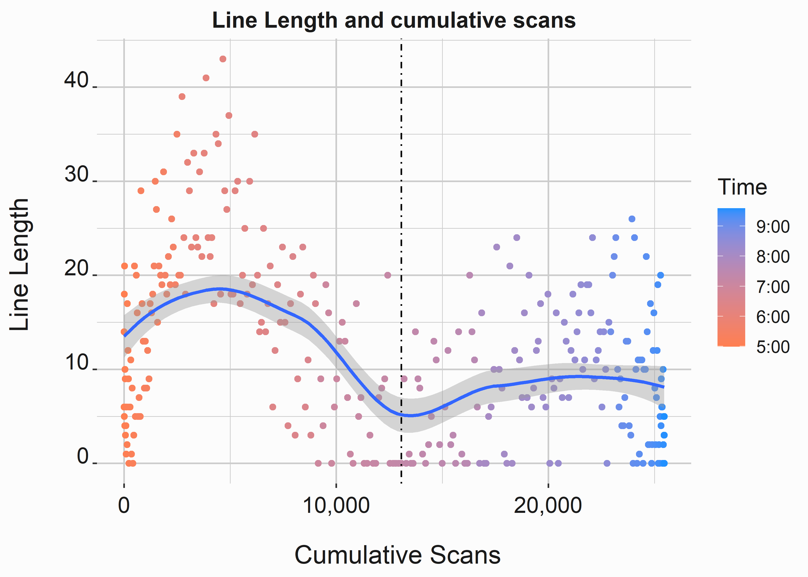
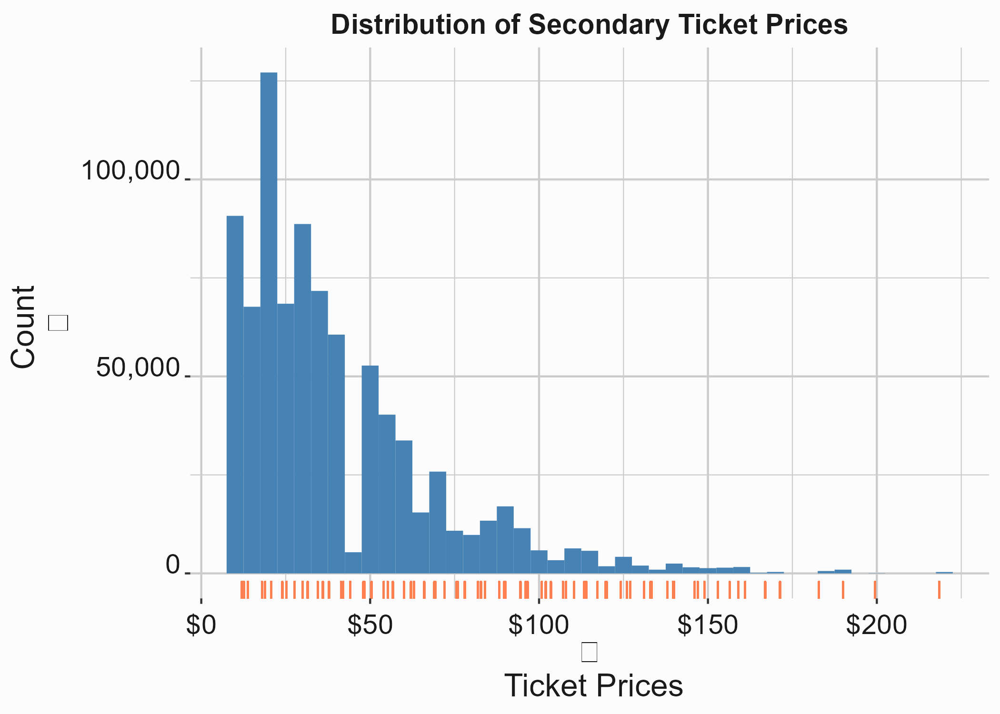
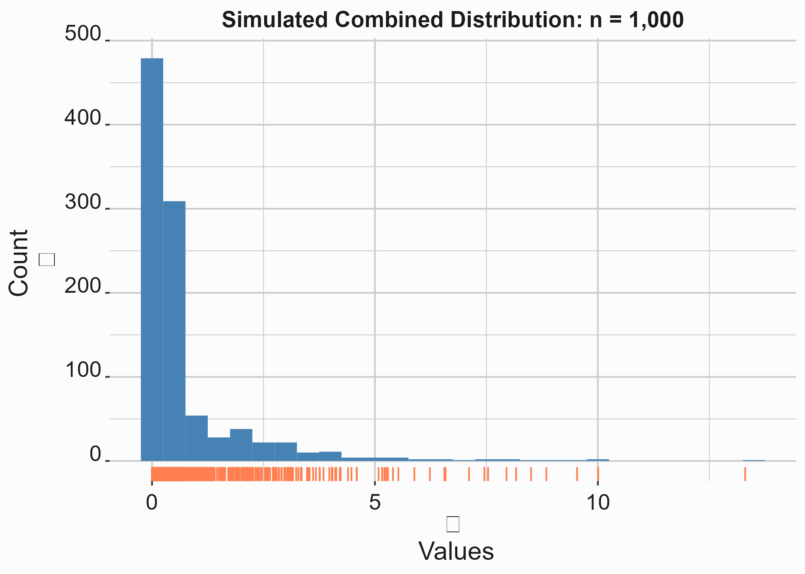

# Operations {#chapter10}


If a sports team has two fundamental core competencies, they should be _events management_ and _selling tickets_. These two efforts are where most of the work takes place. Additionally, a smooth operation is critical to brand perception. It is a pillar of our product in a details-oriented business.   

The overarching umbrella of operations in the club context covers getting fans into, around, and out of the facility safely, quickly, and conveniently. There are design, system, and technology components that must be constructed. There are also optimization considerations such as the cost and number of point-of-sale units for concessions and retail, labor optimization for security, food production, the number of seats in particular sections, the number of bathrooms, etc. The list is extensive. Operations as an academic discipline is about studying systems. We'll apply techniques from the overlapping academic fields of Operations Research, Industrial Engineering, and Operations Management to analyze and solve some ubiquitous _operations_ problems. 

Many constraints in a ballpark or arena are byproducts of cost optimization. Your square footage or campus size significantly influences what you can accomplish. Venues are now being designed with more advanced capabilities in mind. These capabilities might include the following:

- Ordering food and beverages from your phone 
- More expansive automated options for F&B
- Digital tickets
- More advanced security scanning technologies
- Security cameras that feature facial recognition
- Integrated commerce systems and loyalty mechanisms
- Integrated public transit

While these systems help to solve existing problems, they can exacerbate other issues. For instance, attempting food delivery without considering kitchen locations could lead to quality control issues. Only consider technology solutions after carefully examining the underlying execution capability. Businesses are littered with the withered husks of technology solutions that failed to deliver, were an ill fit, were a pet project of some inept executive, or faded away from an internal or external inability to manage the solution. 

Despite technological advances, venues will always be faced with optimization problems around moving large numbers of people through their systems quickly. In addition, additive factors such as parking or public transit, nearby entertainment districts, game day promotional items, food and beverage service, and security screenings must be considered. The following sections will analyze some of these problems in detail. 

## Understanding fundamental issues with ingress

Capacity constraints are obvious and unavoidable with ingress. Lines are inevitable if 30,000 to 400,000 people are trying to get to the same place simultaneously. The Romans certainly understood these issues well. The Colosseum of Rome was designed with 76 vomitoria to accommodate over 50,000 people^[https://en.wikipedia.org/wiki/Colosseum]. Ironically, the Colosseum was more efficient at ingress and egress than a modern stadium. Many venues require a security check involving a magnetometer. Bags must be checked, tickets must be scanned, building and fire codes create constraints, and concessions and mechanical infrastructure take up internal space. The Romans didn't have to worry about running electricity or HVAC throughout their venues. These issues extend outside the building and apply to road traffic, ADA considerations, public transit, and ride-sharing partnerships. 

Eliyahu Goldratt published a book in 1984 called _The Goal_ [@Goldratt2004], which introduces us to the _Theory of Constraints_. This book gives us a simple framework for approaching a problem such as ingress. If you are interested in Operations, it is a must-read book. You may not appreciate the depressing narrative, but the content is outstanding. In _The Goal_, Goldratt introduces the five-step _Process Of On-Going Improvement_:  

1. Identify the system’s bottlenecks
2. Decide how to exploit those bottlenecks
3. Subordinate every other decision to 'step two decisions.'
4. Elevate the systems bottlenecks
5. if, in a previous step, a bottleneck has been broken, go back to the beginning.

A system can only have one bottleneck^[It is more accurate to say that this system can only have one bottleneck at a time]. That is what makes this process iterative. If you replace the weakest link in a chain with a stronger one, another link will become the weakest. Let's outline an ingress process and look at some data. An Ingress process will look similar at virtually every venue worldwide. A typical flowchart for an ingress procedure can be studied in figure \@ref(fig:chtengate).


<div class="figure">

<p class="caption">(\#fig:chtengate)Typical gate entry process</p>
</div>


Figure \@ref(fig:chtengate) demonstrates a typical gate procedure. Although recent technological advances have made such a process faster, this fundamental process is followed at most event venues. What sort of data could we extract from this process? You would typically have scan data from the ticketing process and magnetometer passes and failures. In addition, you'll know how many people enter each gate at each entry point and when they pass through security. Let's take a look at some aggregated data. 


```r
#-----------------------------------------------------------------
# Access scan data
#-----------------------------------------------------------------
scan_data <- FOSBAAS::scan_data
```


Table: (\#tab:chteningressdatatab)Aggregated scan data

|observations|scans|action_time|date    |
|:-----------|:----|:----------|:-------|
|1           |0    |61200 secs |4/1/2024|
|2           |2    |61260 secs |4/1/2024|
|3           |4    |61320 secs |4/1/2024|
|4           |7    |61380 secs |4/1/2024|
|5           |10   |61440 secs |4/1/2024|
|6           |11   |61500 secs |4/1/2024|

This data is aggregated by the number of scans by minute and is summed and bucketed. The distribution of scans can be seen in figure \@ref(fig:chtenscansgraphicb). What other information might be helpful here?


```r
#-----------------------------------------------------------------
# Scans
#-----------------------------------------------------------------
x_label <- 'observation'                                             
y_label <- 'scans'                                          
title   <- 'Ticket scans by minute at gates'
scan_point <- 
  ggplot(data = scan_data,aes(x     = observations,
                              y     = scans,
                              color = date))                +
  geom_point()                                              +
  scale_x_continuous(label = scales::comma)                 +
  scale_y_continuous(label = scales::comma)                 +
  scale_color_manual(values = palette)                      +
  xlab(x_label)                                             + 
  ylab(y_label)                                             + 
  ggtitle(title)                                            +
  stat_smooth(method = "lm", formula = y ~ x + poly(x,2)-1) +
  geom_vline(xintercept = 151, lty = 4)                     +
  graphics_theme_1                                          +
  guides(color = 
         guide_legend(override.aes = list(fill = "grey99")))
```


<div class="figure" style="text-align: center">

<p class="caption">(\#fig:chtenscansgraphicb)Distribution of ticket scans at the gates</p>
</div>

In general, ticket scans will typically follow a specific cadence for similar events. Our ballpark has four points of entry for fans, and each point of entry has four scanners. Our entry process is slightly probabilistic. Not all scans will take the same time because a failure requires adjustments or an additional scan, and people move at different paces. _What is the maximum capacity of this system?_

This question is difficult to answer because we know that some gates are likely to be busier than others at different times. We are looking for the entrance with the maximum throughput under duress. This gate will represent your maximum theoretical throughput potential. You will need multiple days of observation to get a good average figure.


```r
#-----------------------------------------------------------------
# Scans
#-----------------------------------------------------------------
max_scans <- scan_data                                %>% 
             group_by(date)                           %>%
             summarise(maxScans = max(scans),
                       maxScansMean = (max(scans)/16),
                       meanScans = mean(scans),
                       medianScans = median(scans))
 
```


Table: (\#tab:chteningressthroughputmax)Maximum observed throughput

|date    |maxScans|maxScansMean|meanScans|medianScans|
|:-------|:-------|:-----------|:--------|:----------|
|4/1/2024|181     |11.3125     |103.6067 |116        |
|4/2/2024|199     |12.4375     |115.7267 |129        |
|4/3/2024|212     |13.2500     |125.0167 |139        |


The highest observed average number of scans per scanner is about thirteen per minute across each ingress point. This means a person went through the system every four and a half seconds for one minute. However, this average may mean that some scans took ten seconds and others took one second. We can't tell from this data. In a subsequent section, we will discuss queuing theory and how to analyze wait time by looking at service times, inter-arrival times, line length, and queuing discipline. We are illustrating a broader point with this example. 

We can see that we still need some critical data. We can also see that this problem sprawls and becomes very complex. What data do we need? I would prefer to see the following:

1. The process components split and timed
2. Information on line-length 
3. Specific information at each gate and magnetometer
4. Information on inter-arrival times
5. Information on staffing numbers and procedure
6. True positives and false positive numbers for scanner alarms

Can we identify a bottleneck? Judging by our diagram, if a magnetometer is triggered, an individual is asked to walk back through it. We could change the process to add staff to wand guests that triggered the gate. We could also eliminate bags or alter the magnetometer settings and then measure the differences. Not all solutions require much diligence. We'll expand on this example and examine an analogous project more deeply; Reducing wait times at concession stands.

## Reducing wait times at concessions

Everyone has spent time standing in line for food and beverage at a sporting event. If you ask someone what is wrong with the system, they might give you a couple of predictable responses such as "There are too many people" or "These people just don't know what they are doing." In reality, this is a complex problem that has many components:

- System constraints (number of grills, points-of-sale, etc.)
- Labor (experience, training, motivation)
- Back-of-house systems (buffering demand, menu design)
- Front-of-house systems (Queuing discipline, ordering, and payment systems)

The interesting thing here is that you don't have to acknowledge that there is a problem. Perhaps there isn't. You can look at this system and state that _we don't have enough points of sale_. That is why the lines are long_. If we had more points of sale, that would spread out the lines, and the lines would be shorter. But, of course, that is an incredibly reductive point of view. So let's be a little more realistic and begin by constructing a narrative:

> _Executives for the Nashville Game Hens have noticed long lines at concession stands during games. Lines tend to get noticeably worse on the weekends when more fans are in the building. Additionally, customer satisfaction surveys indicate that waiting in line at concession stands is a significant source of dissatisfaction. The concessions manager says, "the problem is that we don't have enough points-of-sale to deal with capacity once we reach about 30,000 fans." She poses a solution that will require a significant capital investment to add more points of sale. You are approached by an executive and asked if that is a good idea..._  

You can solve this problem by making some observations yourself. Look for any data that you have available. We'll assume you don't have anything. You talk to the concessions manager, who tells you that her standard is to fill orders in less than ninety seconds. This is an industry standard, and she achieves it _on average_.   

Without any data, this project will have to proceed in stages. However, you can also take some cues from the nature of the problem itself to help devise a plan for approaching a solution. At least three of the identified project components involve some process improvement. Since we are looking at process improvement, let's see if we can apply DMAIC to this problem. DMAIC stands for _Define, Measure, Analyze, Implement, and Control._ It comes to us from Six Sigma^[https://en.wikipedia.org/wiki/Six_Sigma], a process improvement protocol adapted to many business problems. While Six Sigma has its roots in manufacturing, we can appropriate some of its tools here.

You could produce a project charter laying out a complete project plan using a framework. A project plan needs to include a few components. The two that we will concern ourselves with here include:

- Project objectives
- Specific goals

Other components that a charter should cover include:

- Timelines
- Budgets
- Stakeholders
- Potential problems

I am pointing this seemingly irrelevant step out for several reasons. The first reason is that a project plan forces you to think about how to solve a problem. This is often the most challenging part. It also forces you to create some documentation around the project. If you do not create some essential documentation around your projects, it will eventually be used against you and not to your benefit. The problem will tend to sprawl. Make a habit of building project charters for any projects involving multiple stakeholders or external groups. It will make scoping projects much more manageable and help keep everyone on task and budget.

### Establishing objectives

Objectives can be vague but derive from the _business case_ and _problem statement_. Let's take a stab at establishing some goals. We'll use some concepts from "Six Sigma" [@Campe2007] for this example. 

The business case is simply a statement indicating the project's importance. It should demonstrate why the project needs to be addressed: 

> Customer satisfaction has been linked to repeat purchases and demonstrably impacts year-over-year revenue. Additionally, customer satisfaction scores predictably degrade once attendance exceeds 30,000. Surveys have concluded that improving these scores can be best achieved by decreasing the wait time at concessions throughout our venue. We can demonstrably impact season ticket renewals with over 100 games left in the season. Additionally, our capital budgets must be completed in the next sixty days. 

What does this statement establish?

1. This project is important
2. It needs to be completed
3. We have a limited amount of time to get started

### Understanding our problem

We'll need a little data to begin to understand our problem, and we aim to collect exploratory data. We are looking for something to help build our problem statement. In this case, we can look at the line length of a particular concept.  

A typical concept has eight to fifteen items on the menu. Items are purchased at differential rates and have varying prep times. Most items can be stored for about twenty minutes before quality begins to degrade. The number of points of sale varies, but most concepts have between four and twelve points of purchase. Customers enter the queue and wait until a point of sale becomes available. They place their order, pay, and then wait at the point of purchase for the order to be fulfilled before exiting the system.

Queuing systems are a fascinating topic. A more detailed analysis of queuing systems will be covered in this chapter within section \@ref(queuing). However, if you are unfamiliar with how queuing systems are analyzed, I recommend spending a little time covering _Queuing theory_ ^[https://en.wikipedia.org/wiki/Queueing_theory]. Queuing theory can be highly complex and has many applications across various disciplines. To simplify it, consider your goal in designing systems so that the outcomes are more deterministic. 

The Game Hens' concession concepts typically follow a _multi-channel, single-phase (MCSP)_ queuing discipline. In an MCSP system, we have a one-step (single phase) serving process where the register handles the complete transaction, and there are multiple points-of-sale (channels) serving the queue. Additionally, the process follows a FIFO (first-in, first-out) queue discipline where the customer waiting the most extended amount of time is serviced first.

Let's extract the key elements of this system:

- Process follows a FIFO queue discipline and does not function asynchronously
- Ordering, payment, and fulfillment happen at the point-of-sale
- Fulfillment is difficult to buffer due to differential storage times and demand levels

Now that we have some detail, we can construct a plan for capturing some measurements for analysis. 

### Defining our problem and establishing goals

Most strategically oriented projects tend to sprawl when you think about them. This one is no different. There are lots of considerations. Let's create a problem statement that unambiguously explains this project.

> Problem statement: Wait times for concessions services across the ballpark consistently receive low relative satisfaction scores (less than 10% of fans give the highest rating) from our season ticket holders. Low satisfaction scores are correlated with a higher likelihood for a specific fan not to renew their season membership. While our vendor has quoted industry standards for service times at ninety seconds per transaction, observed wait times often exceed this figure by over 100%. 

Goals are more precise than objectives. Since we don't have any data on our process, we will have to wait to establish firm goals. The initial goal will be to collect the necessary data with the hopes that we can reduce wait times. We have yet to determine how much it may be possible to reduce wait times. Although there is an industry standard, we must determine if this figure has merit. 

## Measurement and analysis 

You seldom have all the data that you need. In this case, we'll need to take note of what we have and create a plan to gather what we don't. Since we will have to take live measurements, we'll need a rubric and a budget. Additionally, our timeline will be impacted by the fact that we must take measurements during the game.  

### Data audit and capture

You'll want to be careful about how you capture data. You'll also want to be consistent and as thorough as possible. Spend some time thinking about this phase of the project. In this case, we know we must capture observational data. Additionally, this data might make someone look bad. Since you have been quoted ninety seconds as the number being met, what happens if your measurements differ? Keep these sorts of political impediments in mind as you build your rubric. 

There are many ways to collect data in this context, but the fundamental components of that plan will be almost identical. Just google _data collection plan_. The frameworks are all very similar. You start with a specific question that you are trying to answer and then lay out the specifics of:

- Data types
- What data is being measured?
- How is the data to be measured?
- How is the data to be captured?
- How do you ensure consistency?

The initial goal of our analysis is to identify a bottleneck. Next, we should gather some data from our information systems. For example, scan data is being captured at the gates, so we know how many people are in the park at any time. That information may be helpful.

Leveraging the points of sale to estimate wait times might not be possible. We could use A.I. to track and clock customers if cameras were installed at each concept. However, we don't, which means using people with stopwatches to observe the concept. This seems barbaric, but if we set firm rules around what constitutes a measurement and you collect enough data, you should be able to get reliable estimates. 

Additionally, your concept of what information is needed from a business perspective will mature over time. While you would love to be able to track every customer through your venue at all times, is it necessary? Would you spend money here if you understood every other competing expense throughout your business? How would you use this data? CEOs and other executives have to make these decisions. Think about these problems from their broader perspective when confronted with them. You have to make a distinction between ideal and practical.  

### Line length and total scans

Figure \@ref(fig:linelengthb) requires two separate data sets. Scans data and line length data. We have already seen our scan data.


```r
#-----------------------------------------------------------------
# Create scan data
#-----------------------------------------------------------------
library(FOSBAAS)
scans_a <- f_get_scan_data(x_value = 230,
                           y_value = 90,
                           seed    = 714,
                           sd_mod  = 10)
```


Table: (\#tab:scansashow)scan data example

| observations| scans|action_time |date     |
|------------:|-----:|:-----------|:--------|
|            1|     0|17:00       |4/1/2024 |
|            2|     2|17:01       |4/1/2024 |
|            3|     4|17:02       |4/1/2024 |
|            4|     6|17:03       |4/1/2024 |
|            5|     8|17:04       |4/1/2024 |
|            6|     9|17:05       |4/1/2024 |

Line-length data looks different than scan data. It looks different because this data would have been collected manually by counting the number of people in line every minute. This data is also confounded by the fact that while four people may be in line, only one may order. Likewise, one person may be ordering for more than one person. When data has quirks, try to write them down. You'll have to explain them to someone at some point.  


```r
#-----------------------------------------------------------------
# Create line-length data
#-----------------------------------------------------------------
line_length_a <- f_get_line_length(seed = 755,
                                   n    = 300,
                                   u1   = 22,
                                   sd1  = 8,
                                   u2   = 8 ,
                                   sd2  = 5)

line_length_a$action_time <- f_get_time_observations(17,21)
line_length_a$date <- "4/1/2024"
```


Table: (\#tab:line_length_a)line length data

 observation   lineLength  action_time   date     
------------  -----------  ------------  ---------
           1           14  17:00         4/1/2024 
           2            6  17:01         4/1/2024 
           3           18  17:02         4/1/2024 
           4            5  17:03         4/1/2024 
           5           21  17:04         4/1/2024 
           6            4  17:05         4/1/2024 


Let's look to see if line length has any relationship to scans. First, we are looking to see if the number of people entering the building influences line length. The following code produces the graph in figure \@ref(fig:linelengthb).


```r
#-----------------------------------------------------------------
# Line length and scans
#-----------------------------------------------------------------
scans_a$cumScans <- cumsum(scans_a$scans)
data  <- dplyr::left_join(scans_a,line_length_a, 
                          by = "action_time")
data$color <- as.numeric(as.character(gsub(":",
                                           "",
                                           data$action_time)))

x_label  <- ('\n Cumulative Scans')
y_label  <- ('Line Length \n')
title    <- ('Line Length and cumulative scans')
legend   <- ('Time')
line_length <- 
  ggplot(data, aes(y     = lineLength, 
                   x     = cumScans, 
                   color = color))                           +    
  geom_point()                                               +
  scale_color_gradient(breaks = c(2100,2000,1900,1800,1700),
                       labels = c("9:00","8:00", "7:00", 
                                  "6:00","5:00"),
                       high = 'dodgerblue',
                       low  = 'coral',
                       name = legend)                        +
  scale_x_continuous(label = scales::comma)                  +
  xlab(x_label)                                              + 
  ylab(y_label)                                              + 
  ggtitle(title)                                             +
  stat_smooth(method = "loess", formula = y ~ x)             +
  geom_vline(xintercept = 13068, lty = 4)                    +
  graphics_theme_1  
```


<div class="figure" style="text-align: center">

<p class="caption">(\#fig:linelengthb)Relationship between line length at a concession stand and scans</p>
</div>

While we can see a pattern in the data where line length peaks at specific times, the relationship to cumulative scans isn't very tight; it appears that fans that enter early tend to rush concession stands and fans that come in near the beginning of the game take a seat and go to concession stands later. So there is a lot of variability in this data. 

### Analyzing the results

We can analyze this data in much the same fashion as we have analyzed data in previous chapters. However, we'll introduce a new tool here called a _generalized additive model_. Be careful with this technique. While you might find it a silver bullet that can easily model many distributions, it is a little more challenging than a math equation provided by regression. We'll use the `mgcv` [@R-mgcv] library to access the `gam` function. As is often the case, we'll need data preparation before applying our tool.   


```r
#-----------------------------------------------------------------
# Generalized additive model
#-----------------------------------------------------------------
library(mgcv)
scans_a$cumScans <- cumsum(scans_a$scans)
data             <- dplyr::left_join(scans_a,line_length_a, 
                              by = "action_time")

data$color <- as.numeric(as.character(gsub(":",
                                           "",
                                           data$action_time)))

gam1 <- mgcv::gam(lineLength ~ s(cumScans, bs='ps', sp=.2), 
                  data = data)

newPredict <- cbind(data, predict(gam1, interval = 'confidence'))

gr <- 
  ggplot(newPredict, aes(y     = lineLength, 
                         x     = cumScans,
                         color = color))                      +    
  geom_point(alpha=.7)                                        +
  scale_color_gradient(breaks = c(2100,2000,1900,1800,1700),
                       labels = c("9:00","8:00", "7:00", 
                                  "6:00","5:00"),
                       high = 'dodgerblue',
                       low  = 'coral',
                       name = 'Time')                         +
  geom_line(aes(y = `predict(gam1, interval = "confidence")`,
                x = cumScans),
                color = 'dodgerblue',size = 1.2)              +
  scale_x_continuous(label = scales::comma)                   +
  xlab('Cumulative Scans')                                    + 
  ylab('Line-Length')                                         + 
  ggtitle('Results of GAM on Line-Length Data')               +
  graphics_theme_1   
```

We can access a summary of our `game` model to look at some of the standard statistics: 


Table: (\#tab:chtenbroommod)gam model output

----------  -------------
term        (Intercept)  
estimate    12.04333     
std.error   0.37435      
statistic   32.17132     
p.value     8.501177e-98 
conf.low    11.30962     
conf.high   12.77705     
----------  -------------

We can see that the data will defy an accurate fit by looking at figure \@ref(fig:gamdiagram). 


<div class="figure" style="text-align: center">

<p class="caption">(\#fig:gamdiagram)GAM output on line length data</p>
</div>

While the average fit to this data is fair, the predictive power won't be very good at any given point on the graph. Ultimately, there isn't a good relationship between line length and scans into the ballpark. However, we do see that the data appears multi-modal. For example, lines decrease near the start of the game. This decrease in line length at first pitch makes sense as early arrivers place their orders and take their seats. 

### Understanding wait times

Now that we have some data on line length, we can closely examine what drives wait time. We can simulate some results by measuring the broader process. We built a function `f_get_wait_times()` to provide us with some data. This function breaks wait times into three parts:

- Order time: The amount of time it takes to place an order
- Payment time: How long it took to fulfill payment after the order was placed
- fulfillment time: How long it took to fulfill the order after payment

We would have had to capture this information through direct measurements. We include the function that creates the data here so that you can see that we used simple, exponentially distributed data on the process components. This may or may not be true in practice, but we have seen similar patterns in actual data.


```r
#-----------------------------------------------------------------
# Simulate wait times function
#-----------------------------------------------------------------
f_get_wait_times <- function(seed,n = 300,time,rate1,rate2,rate3){
set.seed(seed)

order_times       <- rexp(n, rate = rate1)
payment_times     <- rexp(n, rate = rate2)
fulfillment_times <- rexp(n, rate = rate3)
total_time        <- order_times       + 
                     payment_times     + 
                     fulfillment_times

wait_times <- data.frame(transaction  = seq(1,n, by = 1),
                         orderTimes   = order_times,
                         paymentTimes = payment_times,
                         fulfillTimes = fulfillment_times,
                         totalTime    = total_time)
wait_times[] <- apply(wait_times,2,function(x) round(x,0))
return(wait_times)
}
```

This function will produce as many results as you want, with order, payment and fulfillment times being represented by exponentially distributed times in seconds.


```r
#-----------------------------------------------------------------
# Create wait times data set
#-----------------------------------------------------------------
wait_times_a <- f_get_wait_times(seed  = 755,
                                 n     = 300,
                                 rate1 = .03,
                                 rate2 = .06,
                                 rate3 = .15)
```


Table: (\#tab:simulatewaittimesb)Wait time data

| transaction| orderTimes| paymentTimes| fulfillTimes| totalTime|
|-----------:|----------:|------------:|------------:|---------:|
|           1|         39|           28|            0|        67|
|           2|          0|           56|            7|        63|
|           3|        123|            4|            4|       131|
|           4|         47|            6|           22|        75|
|           5|          4|           38|           10|        52|
|           6|          4|           37|            6|        47|
  
We can use this data to build a simulation to deconstruct the total time as we change some inputs. Deconstructing the entire time will allow us to demonstrate the impact of an initiative such as mobile ordering. Mobile ordering would enable you to decouple orders and payment from fulfillment effectively. Be careful not to think about technology first here. Mobile ordering may help you decouple orders and payments from fulfillment. Are there other ways to accomplish this goal? Additionally, it might help demonstrate the merits of a more effective buffering system or a simplified menu.

#### analyzing the distributions of wait time components

The variance between these processes could be problematic depending on your queuing discipline. First, let's look at the distribution of these wait times.  


```r
#-----------------------------------------------------------------
# Simulate wait times function
#-----------------------------------------------------------------
wait_dist <- 
  wait_times_a                                            %>% 
    select(orderTimes,paymentTimes,fulfillTimes)          %>%
    tidyr::pivot_longer(cols = c('orderTimes',
                                 'paymentTimes',
                                 'fulfillTimes'),
                        names_to = "measurement",
                        values_to = "seconds")            %>%
                   mutate(scale_seconds = scale(seconds))

w_dist <-  
    ggplot(wait_dist, aes(x = seconds, fill= measurment)) +    
    geom_density(alpha=.75)                               +
    geom_rug(color='coral',sides = "b")                   +
    scale_fill_manual(values=palette)                     + 
    xlab('Seconds')                                       +
    ylab('Density')                                       + 
    ggtitle('Distribution of wait-time components')       +
    graphics_theme_1 
```


<div class="figure" style="text-align: center">

<p class="caption">(\#fig:waittimesdista)Distribution of wait time components</p>
</div>


We can see from this graph that order times appear to have the widest variance. There is a long tail extending toward the 200-second mark. Variance kills interdependent processes. Variance is the enemy that we were looking to find. If we reduce this variance, we could make the entire process more deterministic and improve wait times. 

### Simulating a component of our process

Like many of the topics we have discussed, simulation is a large and complicated topic. However, it is also beneficial for the problem that we are facing. We have already looked at a couple of ways to simulate data. We have used `rexp` and `rnorm` multiple times to create simulated data sets. This is what we see in figure \@ref(fig:waittimesdista). We are creating random numbers based on parameters for exponential or normal distributions. What do we do if we have a data set and want to simulate it under different conditions? How do we know what distribution to fit to approximate the data? 

Many software packages will build simulations for you, but it is helpful to understand how they might function at a base level. We'll create a couple of basic transaction simulations and then evaluate how well specific changes to our process might impact the overall system. This will show you how a software package might help you solve a problem. Having the underlying knowledge makes you a better decision-maker.  

Simulation is a daunting subject. Non-linear least squares fits can be frustrating. As we saw in chapter {#chapter6}, getting into some more complex math is easy. 


```r
#-----------------------------------------------------------------
# Simulate wait times function
#-----------------------------------------------------------------
wait_times <- FOSBAAS::wait_times_data[1:300,]
```


Table: (\#tab:mcab)Simulated wait times data

| transaction| orderTimes| paymentTimes| fulfillTimes| totalTime|
|-----------:|----------:|------------:|------------:|---------:|
|           1|         39|           28|            0|        67|
|           2|          0|           56|            7|        63|
|           3|        123|            4|            4|       131|
|           4|         47|            6|           22|        75|
|           5|          4|           38|           10|        52|
|           6|          4|           37|            6|        47|


Let's begin by looking at correlations between each process component. We want to see if any particular component correlates more closely with the total time. A few packages will build correlation tables for you, but we will go ahead and build this manually.


```r
#-----------------------------------------------------------------
# Build correlation table
#-----------------------------------------------------------------
wt_cor <- wait_times[,-1]
names(wt_cor) <- c('Order Time','Payment Time',
                   'Fulfillment Time','Total Time')

wt_cor_result      <- cor(wt_cor)
wt_cor_result      <- round(as.data.frame(wt_cor_result), 2)
wt_cor_result$type <- row.names(wt_cor_result)

cor_long <- 
  tidyr::pivot_longer(wt_cor_result,
                      cols = c('Order Time','Payment Time', 
                               'Fulfillment Time','Total Time'))
```

We'll reorder the factors so that our graph will give us the aesthetic we seek.


```r
#-----------------------------------------------------------------
# Build correlation table
#-----------------------------------------------------------------
cor_long$order <- factor(cor_long$type, 
                         levels=c('Fulfillment Time',
                                  'Payment Time',
                                  'Order Time',
                                  'Total Time'))
```

We'll use the `forcats` [@R-forcats] library to access the `fct_reorder` function. This will help order our plot. 


```r
#-----------------------------------------------------------------
# Correlation table 
#-----------------------------------------------------------------
library(forcats)
correlation_table <- 
cor_long                                                 %>%
mutate(name = fct_reorder(name, value, .fun='sum'))      %>%
ggplot(aes(x = order, y = name,fill = value))            +
  geom_tile()                                            +
  geom_text(aes(label=value))                            +
  scale_fill_gradient2(low  = "mediumseagreen", 
                     mid  = "white", 
                     high = "dodgerblue")                +
  xlab('')                                               + 
  ylab('')                                               + 
  ggtitle('Correlation table')                           +
  graphics_theme_1                                       +
  theme(axis.text.x = element_text(size = 8),
        axis.text.y = element_text(size = 8))
```

<div class="figure">

<p class="caption">(\#fig:mcf)Correlation table</p>
</div>

Order time is the component most highly correlated with _Total-Time_. The other factors are not correlated with each other at all. You could infer all sorts of things from this data. Order time is most highly associated with total time because no other work can occur during the order. Fulfillment time may be the least correlated with total time because we have done an excellent job buffering inventory. We are looking for a fundamental relationship between these variables. The fact that order time is the most highly correlated variable is important. We'll likely base our solution around mitigating long order times because it would have the most impact.

#### Analyzing the Variance between wait time components

Variance is our enemy. These system components are linked and depend on each other but are not correlated. As a result, there is also a vast amount of variance.


```r
#-----------------------------------------------------------------
# Box plot of wait times
#-----------------------------------------------------------------
wait_long <- 
  tidyr::pivot_longer(wait_times,cols = c('orderTimes',
                                          'paymentTimes', 
                                          'fulfillTimes',
                                          'totalTime'))
wait_box <- 
wait_long                                             %>%
  mutate(name = fct_reorder(name, value, .fun='sum')) %>%
  ggplot(aes(x = name, y = value)) +
  geom_boxplot(fill = 'dodgerblue') +
  xlab('\n Transaction component')                              + 
  ylab('Wait time in seconds)                                  + 
  ggtitle('Variance of transaction times')                      +
  graphics_theme_1
```

<div class="figure">

<p class="caption">(\#fig:mch)Variance between components</p>
</div>

A closer look at specified quantiles paints a clearer picture.


```r
#-----------------------------------------------------------------
# Quantiles
#-----------------------------------------------------------------
quantiles <-
apply(wait_times[,-1],
      2,
      function(x) quantile(x, probs = c(.1,0.25, 0.5, 0.75,.9)))
```


Table: (\#tab:quantiles2)quantiles for wait times

|    | orderTimes| paymentTimes| fulfillTimes| totalTime|
|:---|----------:|------------:|------------:|---------:|
|10% |          3|          1.0|          1.0|        19|
|25% |          9|          5.0|          2.0|        30|
|50% |         22|         12.0|          4.5|        45|
|75% |         42|         23.0|          8.0|        70|
|90% |         81|         39.1|         14.0|       107|

Twenty-five percent of orders take forty-two seconds or more. These long order times appear to be the biggest _problem_. It would be more accurate to say that this process component likely causes the most variance in the system. Let's construct our simulation by looking at a probability table of the observations. We can build a function to create a table with a little extra information. It would also be beneficial to have more data. One day of transactions could undoubtedly create some sample-size issues. Let's simulate a few thousand results. We'll pretend that we have been collecting information for weeks. Keep in mind that this could also cause other problems. If you were using regression here, you might want to consider a _mixed effects_ ^[https://en.wikipedia.org/wiki/Mixed_model] model. 

Since total time comprises the three numerical process components, regression should explain variance well. If we regressed on this data, the model should look amazing. Let's try it.


```r
#-----------------------------------------------------------------
# Simple linear model for total times
#-----------------------------------------------------------------
time_mod <- lm(totalTime ~ fulfillTimes + paymentTimes + 
                           orderTimes,data = wait_times)

stats_time_mod <- 
tibble::tibble(
  st_error     = unlist(summary(time_mod)[6]),
  r_square     = unlist(summary(time_mod)[8]),
  adj_r_square = unlist(summary(time_mod)[9]),
  f_stat       = unlist(summary(time_mod)$fstatistic[1])
)
```


Table: (\#tab:chtentotalregression)Summary stats for time model

|st_error |r_square |adj_r_square| f_stat |
|:-------:|:-------:|:----------:|:------:|
|0.5570309|0.9997996| 0.9997975  |492180.3|


As expected, the model is almost perfect. We could use the equation to estimate total wait times almost perfectly. If you see results like this, there is probably something wrong. 

#### Building a simulation of our data

Finally, let's build a simulation. This section will demonstrate some of the basics to get you started. The method that we follow is flexible and can be used in many different ways. We'll begin by accessing the `wait_times_distribution` data. 


```r
#-----------------------------------------------------------------
# Access the distribution data
#-----------------------------------------------------------------
library(FOSBAAS)
wait_times_distribution <- FOSBAAS::wait_times_distribution_data
```

Let's sample these wait times as a basis for our simulated data.


```r
#-----------------------------------------------------------------
# Get a sample of the data
#-----------------------------------------------------------------
set.seed(755)
wait_sample <- wait_times_distribution %>%
               sample_frac(size = .7)
```

Now we can think about the distribution more carefully. We can use the `ecdf` function to compute an _empirical cumulative distribution function_. This output is the inverse of the `quantile` function.


```r
#-----------------------------------------------------------------
# Cumulative distribution function
#-----------------------------------------------------------------
orders <- wait_sample$orderTimes 
cdf    <- ecdf(orders)  
```


```r
#-----------------------------------------------------------------
# Cumulative distribution function
#-----------------------------------------------------------------
cdf_out <- cdf(50)
qua_out <- quantile(wait_sample$orderTimes,probs = cdf_out)

ecdf_quant <- tibble::tibble(ecdf_50 = cdf_out,
                             quantile_ecdf_50 = qua_out)
```


Table: (\#tab:chtendisplayedcf)Demonstrating the relationship between quantiles and ecdf

| ecdf_50 |quantile_ecdf_50|
|:-------:|:--------------:|
|0.7785714|    50.22143    |


About 78 percent of the observations are less than 50 seconds. Therefore, plotting this function to visualize what we just did is simple. 


```r
#-----------------------------------------------------------------
# Cumulative distribution function plot
#-----------------------------------------------------------------
cdf_plot <- 
ggplot(wait_sample, aes(orders))            + 
  stat_ecdf(geom = "step",
            color = 'dodgerblue',
            size = 1.1)                     +
  xlab('\n Orders')                         + 
  ylab('Percentage observations')           + 
  ggtitle('ECDF Order Time')                +
  geom_vline(xintercept = 50.22143,lty = 2) +
  geom_hline(yintercept = .7785714,lty = 2) +
  graphics_theme_1

```


<div class="figure">

<p class="caption">(\#fig:chtencumdistplota)Order time ecdf</p>
</div>

We can use this function to simulate data that fits this distribution. Let's take a random sample of data from the range of order times.


```r
#-----------------------------------------------------------------
# Simulate orders 
#-----------------------------------------------------------------
set.seed(715)
n <- 400 # observations
sim_orders <- rexp(n, rate=1/mean(wait_sample$orderTimes))

```

We can use a histogram of this data and compare it to our actual order data.


```r
#-----------------------------------------------------------------
# Compare histograms
#-----------------------------------------------------------------
hist_tab <- 
 tibble::tibble(sim_data = sim_orders,
                actual_data = sample(wait_sample$orderTimes,400))

hist_tab_long <- hist_tab %>% 
                 tidyr::pivot_longer(cols = c('sim_data',
                                              'actual_data'),
                                     names_to = "measurement",
                                     values_to = "seconds") 

hist_comp <- 
ggplot(hist_tab_long , aes(seconds))     + 
  facet_grid(.~measurment)               +
  geom_histogram(fill = 'dodgerblue')    +
  xlab('\n seconds')                     + 
  ylab('count')                          + 
  ggtitle('Simulated vs. actual values') +
  graphics_theme_1
```


<div class="figure">

<p class="caption">(\#fig:chtenhistcomp)Simulated vs. actual results</p>
</div>

Our simulated data approximates the actual data very well. It should; we know we used an exponential distribution to fit the data.

You can't trust the results of one simulation. You'll want to create many simulations and then average the results. Let's go ahead and put together a code base that will allow us to produce a reproducible experiment. First, let's ask ourselves a question that we want to answer:

> If we decreased order times by fifty percent, how would it change the average wait time? 


```r
#-----------------------------------------------------------------
# Simulate, Iterate, and aggregate
#-----------------------------------------------------------------
n <- 500 # observations

sim_orders  <- list()
sim_pay     <- list()
sim_fulfill <- list()
# Iterate
for(i in 1:500){
set.seed(i + 715)
# Simulate
  sim_orders[[i]]  <-  
    rexp(n, rate=1/mean(wait_sample$orderTimes))
  sim_pay[[i]]     <-  
    rexp(n, rate=1/mean(wait_sample$paymentTimes))
  sim_fulfill[[i]] <-  
    rexp(n, rate=1/mean(wait_sample$fulfillTimes))
}
# Aggregate
mean_order   <- mean(sapply(sim_orders, mean))
mean_pay     <- mean(sapply(sim_pay, mean))
mean_fulfill <- mean(sapply(sim_fulfill, mean))
mean_total   <- mean_order + mean_pay + mean_fulfill
```

We now have five-hundred simulations for each phase of the total wait. Let's take a look at the averages.


```r
#-----------------------------------------------------------------
# Aggregated results
#-----------------------------------------------------------------
mean_chart <- tibble::tibble(order   = mean_order,
                             payment = mean_pay,
                             fulfill = mean_fulfill,
                             total   = mean_total)
```


Table: (\#tab:chtenmeanchart)Reducing The impact of order times

| order  |payment |fulfill | total  |
|:------:|:------:|:------:|:------:|
|33.31705|16.80299|6.403494|56.52353|


The total average time is almost identical to what we observed. If we can reduce order time by fifteen seconds, the total time will reduce to about 41 seconds. However, as we have seen, this only tells part of the story. The real problem is the variance. However, with our distributions and the fact that payment, fulfillment, and orders are not correlated, the variance is unlikely to hurt us very often.   

Let's use our simulation to calculate how many orders could be fulfilled over specific time frames per point-of-sale under duress. Duress means that the queue is always full. Let's ask a question and answer it in different ways.

> During one hour, how much additional throughput would a register be able to process if order taking was reduced by 50%?

If our average wait time is fifty-six seconds, we can fulfill about sixty-four orders per register per hour (60 seconds/56 seconds) * 60 minutes. What does this number look like if we use samples from our simulation?


```r
#-----------------------------------------------------------------
# Results with variance
#-----------------------------------------------------------------
total_time_samp <- sim_orders[[1]]  +
                   mean_pay[[1]]    + 
                   mean_fulfill[[1]]
count_list <- list()
set.seed(715)

for(j in 1:30){
  time            <- 0
  count           <- 1
  seconds_in_hour <- 60*60
    while(time <= seconds_in_hour){
      i           <- sample(total_time_samp,1)
      time        <- time + i
      count       <- count + 1
    }
  count_list[j]   <- count - 1
}
```

Let's graph the results of our count list to see how many orders we fulfilled for thirty simulated hours. 


```r
#-----------------------------------------------------------------
# Observe variance in fans serviced per hour
#-----------------------------------------------------------------
counts <- tibble::tibble(fans_serviced = unlist(count_list),
                             simulation    = seq(1:30))

service_per_hour <- 
ggplot(counts , aes(x = simulation,
                    y = fans_serviced))  + 
  geom_line(color = 'dodgerblue')        +
  xlab('\n simulation')                  + 
  ylab('Fans serviced')                  + 
  ggtitle('Simulated services per hour') +
  geom_hline(yintercept = 64,lty = 4)    +
  graphics_theme_1

```


<div class="figure">

<p class="caption">(\#fig:chtenverifyb)Simulated vs. actual results</p>
</div>

Of the thirty simulations, eight fell below the level of our average service time. When you compound this analysis with multiple registers, inter-arrival times, and different line lengths, we can see how reducing variance is the key to consistently maximizing throughput. We also should have discussed the slack time between orders, fatigued employees, or other factors that add variance to the process. 

## Fitting distributions

Let's look at other ways to fit distributions to data. First, we'll build a helper function to give us a frequency table of values. 


```r
#-----------------------------------------------------------------
# Function to build a frequency table
#-----------------------------------------------------------------
f_build_freq_table <- function(variable){
  
  pr          <- as.data.frame(table(variable))
  pr$prob     <- pr$Freq/sum(pr$Freq)
  pr$variable <- as.numeric(as.character(pr$variable))  
  
  return(pr)

}
order_freq <- f_build_freq_table(wait_sample$orderTimes)
#sum(order_freq$prob)
```

We've already created this data set. Access it through the package.


```r
#-----------------------------------------------------------------
# Access frequency table data
#-----------------------------------------------------------------
freq_table  <- FOSBAAS::freq_table_data
```


Table: (\#tab:mck)Frequency table order time

| variable| Freq|      prob|
|--------:|----:|---------:|
|        0|   45| 0.0214286|
|        1|   56| 0.0266667|
|        2|   55| 0.0261905|
|        3|   59| 0.0280952|
|        4|   51| 0.0242857|
|        5|   49| 0.0233333|
  

This frequency table represents a histogram. First, let's take a look at the graph.


```r
#-----------------------------------------------------------------
# Graph frequency table data
#-----------------------------------------------------------------
freq_table$cumprob <- cumsum(freq_table$prob)
freq_table_graph <- 
  ggplot(freq_table,aes(x = variable,y=cumprob)) +
  geom_line(size = 1.2,color = 'dodgerblue')     +
  xlab('\n Seconds')                             + 
  ylab('Percent of Values')                      + 
  ggtitle('Table of values')                     +
  graphics_theme_1

```

<div class="figure">

<p class="caption">(\#fig:chtenfreqtablegraphz)The ecdf</p>
</div>


This code gives us the cumulative distribution graph that we looked at earlier. The ecdf is helpful, and there are many ways to simulate data. First, let's look at sampling strategies to build distributions. The following function will produce a frequency table for us and return a specified number of simulated values.


```r
#-----------------------------------------------------------------
# Function to build frequency table
#-----------------------------------------------------------------
f_get_prices <- function(roundedPrice,n){
  
  freq_table <- as.data.frame(prop.table(table(roundedPrice)))
  as.numeric(as.character(sample(freq_table$roundedPrice, 
                                 n, 
                                 prob=freq_table$Freq, 
                                 TRUE)))
  
}

```

We can use the function to simulate 1,000 ticket sales.


```r
#-----------------------------------------------------------------
# Access secondary market data
#-----------------------------------------------------------------
price_data  <- FOSBAAS::secondary_data
price_table <- f_get_prices(price_data$price,1000)

```

We can observe the whole distribution with the following code.


```r
#-----------------------------------------------------------------
# Actual secondary prices
#-----------------------------------------------------------------
x_label  <- ('\n Ticket Prices')
y_label  <- ('Count \n')
title    <- ('Distribution of Secondary Ticket Prices')
hist_sales <- 
  ggplot2::ggplot(data = price_data,
                  aes(x = price))                      +
  geom_histogram(binwidth = 5, fill = 'steelblue')     +
  geom_rug(color = 'coral')                            +
  scale_x_continuous(label = scales::dollar)           +
  scale_y_continuous(label = scales::comma)            +
  xlab(x_label)                                        + 
  ylab(y_label)                                        + 
  ggtitle(title)                                       +
  graphics_theme_1
```


<div class="figure">

<p class="caption">(\#fig:chtensecondaryprices)Secondary Prices</p>
</div>

The simulated distribution follows the exact same pattern. 


```r
#-----------------------------------------------------------------
# Simulated secondary prices
#-----------------------------------------------------------------
price_table <- as.data.frame(price_table)

x_label  <- ('\n Simulated Ticket Prices')
y_label  <- ('Count \n')
title    <- ('Simulated Distribution: n = 1,000')
hist_sales <- 
  ggplot2::ggplot(data = price_table,
                  aes(x = price_table))                +
  geom_histogram(binwidth = 5, fill = 'steelblue')     +
  geom_rug(color = 'coral')                            +
  scale_x_continuous(label = scales::dollar)           +
  scale_y_continuous(label = scales::comma)            +
  xlab(x_label)                                        + 
  ylab(y_label)                                        + 
  ggtitle(title)                                       +
  graphics_theme_1

```


<div class="figure">

<p class="caption">(\#fig:chtensimulateddistribution)Simulated prices</p>
</div>

You can also simulate data with several built-in distributions. For example, the following code produces a distribution that combines a beta, exponential, and normal distribution.


```r
#-----------------------------------------------------------------
# Simulated combined distribution
#-----------------------------------------------------------------
dist <- c(rbeta(600, 0.5, 5, ncp = 2),
          rexp(300,.57),
          rnorm(100,.2,.05)) 

x_label  <- ('\n Values')
y_label  <- ('Count \n')
title    <- ('Simulated Combined Distribution: n = 1,000')
hist_sales <- 
  ggplot2::ggplot(data = dist_table,
                  aes(x = dist))                       +
  geom_histogram(binwidth = .5, fill = 'steelblue')    +
  geom_rug(color = 'coral')                            +
  scale_x_continuous(label = scales::comma)            +
  scale_y_continuous(label = scales::comma)            +
  xlab(x_label)                                        + 
  ylab(y_label)                                        + 
  ggtitle(title)                                       +
  graphics_theme_1
```

<div class="figure">

<p class="caption">(\#fig:chtencombineddistribution)Simulated prices</p>
</div>

As you can see, It is easy to simulate distributions in R. You can use these tools to construct _Monte Carlo_ simulations for sophisticated what-if analysis. The following sections will cover fitting different models to data. Some libraries will do much of this work. Let's look at a few other potential fits for our data and begin with three standard options:

- An exponential fit
- A polynomial fit
- A generalized additive model

We'll also attempt to fit a logit curve to demonstrate an important point.


```r
#-----------------------------------------------------------------
# Apply fits
#-----------------------------------------------------------------
library(mgcv)
freq_table$cumprob <- cumsum(freq_table$prob)
#-----------------------------------------------------------------
# Exponential fit
fit_ex <- 
  nls(variable ~ a*cumprob^m, data = freq_table, 
      start = list(a = 300,m=.15)) 
freq_table$pred_exp <- predict(fit_ex)
#-----------------------------------------------------------------
# Polynomial fit
fit_py <- 
  lm(freq_table$variable~poly(freq_table$cumprob,5,raw=TRUE))
freq_table$pred_poly <- predict(fit_py)
#-----------------------------------------------------------------
# GAM fit
fit_gm <- 
  mgcv::gam(variable ~ s(cumprob),data = freq_table)
freq_table$pred_gam <- predict(fit_gm)
```

Remember that if you fit a polynomial with more than three degrees, you are asking for trouble. I am doing it here to demonstrate how good it might look, but it is a bad idea. You are asking for an unpredictable model. So please don't do it. 

We'll have to do something a little differently to fit a logit curve. We'll use the `SSlogis` function from the `stats` package to estimate starting points for our curve. This is a valuable function, so keep it in mind.


```r
#-----------------------------------------------------------------
# Apply logit fit
#-----------------------------------------------------------------
fit_lt <- nls(variable ~ SSlogis(cumprob, Asym, xmid, scal), 
              freq_table)
cof    <- coef(summary(fit_lt))

fit <- nls(variable ~ A/(1 + exp(((-I+cumprob)/S))), 
           data = freq_table,  
           start = list(A = cof[1],I= cof[2],S = -cof[3]), 
           control = list(maxiter  =  10000), trace=TRUE)

```

We get an error. Why? A logit curve is a poor fit for this data set. Bad fits are a common problem. What do you do if you can't fit a typical distribution well? You have a few options. We included a fifth-degree polynomial fit (again, a terrible practice) and a generalized additive model, and we'll introduce one more. Let's fit a spline^[https://en.wikipedia.org/wiki/Spline_interpolation].  


```r
#-----------------------------------------------------------------
# Spline fit
#-----------------------------------------------------------------
fit_sp <- with(freq_table, smooth.spline(cumprob, variable))
freq_table$pred_sp <- predict(fit_sp)$y
```

Now that we have fit a few models, how can we judge which is best? You can start by looking at how well they fit the data. 


```r
#-----------------------------------------------------------------
# Observe fit data
#-----------------------------------------------------------------

dist_fits <- 
ggplot(freq_table,aes(y = cumprob,x = variable))            +
       geom_point(alpha = .5,size = 1)                      +
  geom_line(aes(x = pred_exp), size = 1.1 , lty = 2, 
            color = 'dodgerblue')      +
  geom_line(aes(x = pred_poly), size = 1.1, lty = 3, 
            color = 'mediumseagreen') + 
  geom_line(aes(x = pred_gam), size = 1.1, lty = 4, 
            color = 'coral')  +
  geom_line(aes(x = pred_sp), size = 1.1, lty =5, 
            color = 'orchid')  +
  ylab('\n Cumulative Probability')                          + 
  xlab('Order time in seconds')                              + 
  ggtitle('Distribution of order times')                     + 
  graphics_theme_1
```

<div class="figure">

<p class="caption">(\#fig:chtenfitsgraph)Variance between components</p>
</div>

The models fit the cumulative data well, except for the exponential and polynomial fit. There are several ways to evaluate models against one another. For linear models, ANOVA is typically your first stop. for non linear models, AIC ^[https://en.wikipedia.org/wiki/Akaike_information_criterion] and BIC are typically used. 


```r
#-----------------------------------------------------------------
# Compare fits
#-----------------------------------------------------------------
models <- list(expon  = fit_ex,
               poly   = fit_py,
               gam    = fit_gm)

get_diagnostics <- function(mods){
  mods <- models
  aics   <- lapply(mods, function(x) AIC(x))
  bics   <- lapply(mods, function(x) BIC(x))  
  frame <- as.data.frame(matrix(nrow = length(mods), ncol = 3))
    frame[,1] <- names(mods)
    frame[,2] <- unlist(aics)
    frame[,3] <- unlist(bics)
  names(frame) <- c('model','AIC','BIC')
  return(frame)
 
}

models_table <- get_diagnostics(models)
```
  
Running `get_diagnostics` creates the following table.


Table: (\#tab:anovaa)Model Comparisons

|model |      AIC|      BIC|
|:-----|--------:|--------:|
|expon | 1476.914| 1486.158|
|poly  | 1401.360| 1422.930|
|gam   | 1378.366| 1411.593|

The exponential line isn't the best fit. Plus, if you select random numbers for frequency and plug them into our equation the simulated distribution won't approximate our data very well. So let's simulate some results using our polynomial fit.

We can write a function that will spit out a new value based on our polynomial model. 


```r
#-----------------------------------------------------------------
# get fit
#-----------------------------------------------------------------
f_get_fifth_degree_fit <- function(new_var,dist_fit){
  var <-  coef(dist_fit)[1]              + 
         (coef(dist_fit)[2] * new_var    + 
         (coef(dist_fit)[3] * new_var^2) + 
         (coef(dist_fit)[4] * new_var^3) +
         (coef(dist_fit)[5] * new_var^4) + 
         (coef(dist_fit)[6] * new_var^5))
  return(var)
}
```

This is a bad function. Do you know why? It would be better to generalize it by doing something like this:


```r
#-----------------------------------------------------------------
# Generalized polynomial fit
#-----------------------------------------------------------------
f_get_poly_fit <- function(new_var,dist_fit){

  len_poly   <- length(dist_fit$coefficients)
  exponents  <- seq(1:(len_poly-1))
  value_list <- list()

  for(i in 1:length(exponents)){
    value_list[i] <- coef(dist_fit)[i+1] * new_var^exponents[i]
  }
  sum(do.call(sum, value_list),coef(dist_fit)[1])
}
```

You could do better, but you get the idea. This function will work for a polynomial function of any length but is less readable than the hard-coded version. Functions aren't worth too much if you are going to hard-code them. 


If we plug in our result from earlier, we get the following:


```r
#-----------------------------------------------------------------
# Equation output
#-----------------------------------------------------------------
f_get_fifth_degree_fit(.7785714,fit_py)
#> (Intercept) 
#>    45.59297
```

This is close to the 50 we got from the ecdf function. Let's simulate some values and graph them.


```r
#-----------------------------------------------------------------
# get fit
#-----------------------------------------------------------------
poly_fit <- 
sapply(seq(0,1,by=.005),
       function(x) f_get_fifth_degree_fit(x,fit_py))

poly_values <- tibble::tibble(y = seq(0,1,by=.005),
                              x = poly_fit)
poly_graph <- 
ggplot(poly_values,aes(x=x,y=y))             +
  geom_line(size = 1.5, lty = 3, 
  color = 'mediumseagreen')                  +
  ylab('\n Cumulative Probability')          + 
  xlab('Order time in seconds')              + 
  ggtitle('Simulated order times')           + 
  graphics_theme_1
```

Wow. Figure \@ref(fig:chtenfitsgraphb) demonstrates a horrible fit! This is one reason you don't use high-order polynomials for modeling data. 

<div class="figure">

<p class="caption">(\#fig:chtenfitsgraphb)Polynomial fit</p>
</div>


We just covered the basics of fitting distributions. You now have the tools to explain y in terms of x in various ways. The main takeaway is that you must be careful about what you fit. Some methods will work better than others; if you aren't careful, you can do things that might make you look silly. 

## Understanding queuing systems {#queuing}

Queuing is a vast and complicated field of study, and its principles can be applied to many problems, from Computer Engineering to queuing systems at amusement parks and airports. You will face them in sports. Queuing systems typically have three parts as described in "Operations Management" by Heizer and Rendee: [@Heizer2014]

- Arrivals or inputs into the system
- Queue discipline, or the waiting line itself
- The service facility

Each of these components has specific characteristics. For instance, arrivals will consider the following:

- The size of the arrival population
- The behavior of arrivals
- The pattern of arrivals

Analyzing queuing models tends to make heavy use of simulation and requires some specific forms of data collection. However, if your underlying assumptions are correct, analyzing this data becomes an exercise in plugging good data into some equations. We'll adapt some examples from "Fundamentals of Queuing Systems" [@Thomopoulos2012]. 

Let's imagine a concessions concept with six points of sale and queuing space that can accommodate 50 people. In queuing parlance, this represents an (M/M/k/N) queue representing a multi-server, finite capacity system. 1/lambda represents the _average time between arriving customers_ and 1/mu represents _the average service times_. We are assuming exponentially distributed inter-arrival times and service times. In reality, you'll have to make some observations to determine the distribution of service time and inter-arrival times. Let's begin by defining some terms, and then we'll work through a problem using R. 


\noindent Average time between arrivals:
\begin{equation}
\tau_{a} = {1}/{\lambda}
\end{equation}

\noindent Average time to service a units:
\begin{equation}
\tau_{s} = {1}/{\mu}
\end{equation}

\noindent Average number of arrivals per unit of time:
\begin{equation}
\lambda 
\end{equation}

\noindent Average number of units processed in a unit of time for a continuously busy service facility:
\begin{equation}
\mu 
\end{equation}

\noindent number of service facilities:
\begin{equation}
k 
\end{equation}

\noindent Utilization ratio:
\begin{equation}
\rho = \tau_{a}/\tau_{s} = \lambda/\mu \text{ : } \rho/k \text{< 1 is needed to ensure the system is in equilibrium}
\end{equation}

\noindent number of units in the system:
\begin{equation}
n \text{ : n} \geq \text{0}
\end{equation}

We can easily translate these equations and figures into R. When you encounter Greek letters, my recommendation is to write them out. This sort of analysis can quickly get confusing. Let's carefully define our initial inputs.


```r
#-----------------------------------------------------------------
# Define terms for queuing equation
#-----------------------------------------------------------------
lambda                # Average arrivals per unit of time
mu                    # Average number of units processed 
k      <- 6           # Number of points of sale
N      <- 50          # Number that the queue can accommodate
tau_a  <- 1/lambda    # Average time between arrivals: 110 seconds
tau_s  <- 1/mu        # Average service time: 90 seconds
rho    <- tau_a/tau_s # Utilization ratio
n                     # Units in the system
```

Imagine a concession concept with six points of sale and space for 50 people in line. It takes about 60 seconds to service a customer, and a customer arrives in line every 110 seconds. 


```r
#-----------------------------------------------------------------
# M/M/k/N Queue Inputs
#-----------------------------------------------------------------
k        = 2          # Number of points of sale at the concept
N        = 5          # Number of people the queue can accommodate
tau_a    = 10         # time between arrivals: 40 seconds/60
tau_s    = 8          # Service time: 90 seconds/60 = 1.5
lambda   = 1/tau_a    # Customer Arrivals per minute
mu       = 1/tau_s    # Serviced customers per minute
#-----------------------------------------------------------------
# Translate to per-hour figures
#-----------------------------------------------------------------
lambda_h = 60/tau_a   # Per hour
mu_h     = 60/tau_s   # Per hour
rho      = lambda/mu  # Utilization ratio
```

R has several tricks that you can use to make calculations easier. Since variables are vectorized, adding sequences is easy. You will not need a loop. First, we will need to calculate the probability that `n` (defined above) equals 0. This is given by the slightly alarming-looking equation:

\noindent Probability that n = 0:
\begin{equation}
P_{0} = 1/\{\sum_{n=0}^{k-1} \rho^n/n! + \rho^k/k![(k^{N-k+1} - \rho^{N-k+1})/(k - \rho)k^{N-k}]\}
\end{equation}

Pay attention to the order of operations. The only tricky part of translating this equation is getting the parenthesis in the correct places. 


```r
#-----------------------------------------------------------------
# M/M/k/N Calculating the Probability that n = 0
#-----------------------------------------------------------------
# Create the sequence for the P0 equation
n   = seq(0, N-1, by = 1 )
# Translate the equation into R:
P0 <- 
 1/ sum(((rho^n)/factorial(n)) + ((rho^k)/
(factorial(k)*((k^(N-k+1)) - (rho^(N-k+1))/((k-rho)*(k^(N-k)))))))
```

After running this code, we see that `P0` = 0.4305395. We complete this exercise by calculating the probability of n units in the system with two equations for different levels of n. 

\noindent For n = (0,k)
\begin{equation}
P_{n} = \rho_{n}/n!P_0
\end{equation}

\noindent For n = (k + 1,N)
\begin{equation}
P_{n} = \rho_{n}/[k!k^{n-k}]P_{0}
\end{equation}


```r
#-----------------------------------------------------------------
# M/M/k/N  Probability of n units in the system
#-----------------------------------------------------------------
# For n = (0,k)
nk0 = seq(0, k, by = 1 )
Pnk0 <- rho^nk0/factorial(nk0)*P0

sum(Pnk0)

# For n = (k + 1,N)
nk1 = seq(k + 1, N, by = 1 )
Pnk1 <- rho^nk1/(factorial(k)*k^(nk1-k))*P0

sum(Pnk1)

round(sum(Pnk0,Pnk1),2)
```

We can write a helper function to help us reconcile these two options.


```r
#-----------------------------------------------------------------
# Calculate figures
#-----------------------------------------------------------------
lambda_e <- lambda*(1 - Pnk1) # Lambda Effective
rho_e    <- lambda_e/mu       # rho Effective
# Expected in queue
Lq = sum((n-k)*Pnk0)
Lq = sum((n-k)*Pnk1)
Ls = rho_e
# expected units in the system
L = Ls + Lq
# Expected service time
Ws = Ls/lambda_e # minutes in service
Wq = Lq/lambda_e # minutes in queue
W = L/lambda_e   # minutes in system
```

The following function accepts our inputs and spits out our desired output.


```r

#-----------------------------------------------------------------
# Calculate figures
#-----------------------------------------------------------------
f_get_MMKN <- function(k,N,ta,ts){
  
  lambda = 1/ta #: per minute
  mu     = 1/ts #: per minute
  rho    = lambda/mu #: utilization ratio
  
#-----------------------------------------------------------------
  # Probability of n units in the system
  # for
  n = seq(0, N-1, by = 1 )
  P0 <- 1/ sum(((rho^n)/factorial(n)) + 
               ((rho^k)/(factorial(k)*((k^(N-k+1)) - 
                   (rho^(N-k+1))/((k-rho)*(k^(N-k)))))))
  
  # Probability of n units in the system
  # for
  n = seq(0, k, by = 1 )
  Pn0 <- rho^n/factorial(n)*P0
  
  # for
  n = seq(k + 1, N, by = 1 )
  Pn1 <- rho^n/(factorial(k)*k^(n-k))*P0
  
  Pn      <- c(Pn0,Pn1)
  
#-------------------------------------------------------------------
  # calculations
  len     <- max(length(Pn))

  lambda_e  <- lambda*(1 - Pn[len])
  rho_e    <- lambda_e/mu
  
  # Expected in queue
  Ls = rho_e #   Ls = 1*Pn[2] + 2*sum(Pn[-c(1,2)])
  
  # for
  n = seq(k+2, N + 1, by = 1 )
  Lq = sum((n-(k+1))*Pn[n]) # Lq = 1*Pn[4] + 2*Pn[5] + 3*Pn[6]

  # expected units in the system
  L = Ls + Lq
  
  # Expected service time
  Ws = Ls/lambda_e # minutes in service
  Wq = Lq/lambda_e # minutes in queue
  W  = Wq + Ws   # minutes in system
  
#-------------------------------------------------------------------
  # Build output
  frame <- data.frame(matrix(nrow = 7,ncol =2))
  names(frame) <- c('Metric','Value')
  
  metric <- c('Servers:','System Capacity:',' time between arrivals:',
              'Average service time:','Minutes in service:',
              'Minutes in queue:','Minutes in system:')
  values <- c(k,N,ta,ts,Ws,Wq,W)
  
  frame[,1] <- metric
  frame[,2] <- values

  return(frame)
  
}

```

Executing this function returns a dataframe representing a list of values.


```r
#-----------------------------------------------------------------
# Run our function
#-----------------------------------------------------------------
FOSBAAS::f_get_MMKN(2,5,10,8)

```


Table: (\#tab:runwaittimesuncfeval)f_get_MMKN output

Metric                        Value
-----------------------  ----------
Servers:                   2.000000
System Capacity:           5.000000
Time between arrivals:    10.000000
Average service time:      8.000000
Minutes in service:        8.000000
Minutes in queue:          1.267664
Minutes in system:         9.267664

We now have a basic understanding of how to analyze queues. This stuff can get complex, and there is a multitude of software packages that can take care of this for you. However, if you are plugging information into equations, the difficult part is getting good data and choosing the correct models that accommodate it. There is lots of variation; for instance, inter-arrival times may be normally distributed instead of exponentially distributed. You'll have to adapt your model to accommodate this variation. 

## Key concepts and chapter summary

Analytic techniques can be applied to a wide variety of operations problems. Additionally, _Operations_ is a broad field of study that covers many different arenas. This chapter covered two major subjects: Simulation and Queuing. Both examples covered increasing throughput for concessions. While we only scratched the surface, we were introduced to several topics:

- Simulation: Monte Carlo simulations are relatively simple to create and incredibly useful for evaluating various topics. 
- Distribution fitting: Leveraging distributions is critical to simulation. Learn to think in distributions, not point estimates. Distributions are everywhere. 
- Queuing analysis: Queues exist everywhere, from electrical circuits to concession stands. Analyzing a queuing system can give you insight into how to improve it.
- Some essential project management tips

We also learned how to think about these problems. It is easy to be intellectually lazy and not take the time to evaluate a situation honestly. Operations is about critical thinking regarding a system with many interrelated components. It is also a widely studied field, so if you can conceptualize a problem correctly, you should be able to find a way to analyze and improve it.   


